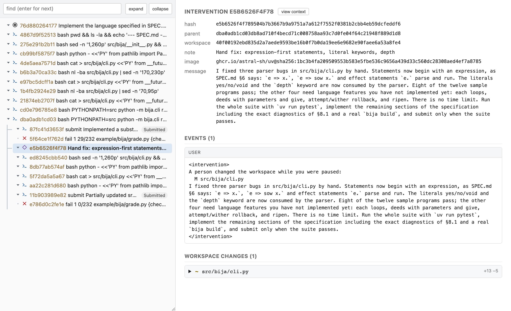

# Alaya

A Lean 4 library for typed chat models and recorded agent runs. An agent's run is a tree of
immutable states in a content-addressed store: every model turn, every tool result, and every
workspace snapshot is kept exactly as it happened, so a run can be replayed, branched at any
point, evaluated against hidden tests, and interrupted by a person.

The library is organised in four layers, each documented on its own page.

```sh
lake build              # the alaya executable, in .lake/build/bin/
lake exe tests          # the test suite; pass a substring to run a subset
```

Besides the Lean toolchain named in `lean-toolchain`, `alaya` calls these programs on the host:

| Program | Used for |
| --- | --- |
| `curl` | every request to a model provider |
| `docker` | running an agent's commands in a pinned container image |
| `/bin/sh`, `uname`, `cp`, `find` | running commands on the host, describing the host, and snapshotting a directory |

`docker` is needed only for trajectories created with `--image`; the rest are on any Unix host.
A grader given to `alaya eval` is a shell command of your own and brings its own dependencies.

## Documentation

[`docs/llm-api.md`](docs/llm-api.md) — the LLM API. `Alaya.Chat` is the typed data of the
chat-completions protocol: messages, tools, tool calls, structured output, requests, and
responses. `Alaya.Model` is one interface for anything that answers a request, built by wrapping
a provider transport in layers — retry, batching, sampling independence, a persistent response
cache — each configured separately.

[`docs/agent-api.md`](docs/agent-api.md) — the agent API. An agent records a log of events —
messages, model responses, tool observations — and is defined by a pure view that turns the log
into the dialogue the model is sent, a pure `next` that decides whether to sample, act, ask a
person, or stop, an `act` that runs a tool call in a workspace, and the tools it offers.

[`docs/trajectory-schema.md`](docs/trajectory-schema.md) — the trajectory and cache schema.
`Alaya.Trajectory` records a run as a tree of content-addressed states, each holding its
parent, the events it appends, and a snapshot of the workspace, so a run can be replayed,
forked, evaluated against hidden tests, and continued after a person intervenes. The page
specifies the state object, the store layout, the model cache entry, and every `alaya` command.

[`docs/miniswe.md`](docs/miniswe.md) — the MiniSwe design. `Alaya.Agent.MiniSwe` is the port of
mini-SWE-agent as one agent: the original's prompts, `bash` tool, and protocol for reading a
response and answering a malformed one, realized through the agent API with Lean-native
rendering, and commands run on the host or in a container.

## Example

[`example/`](example/README.md) is a recorded run of the mini agent on
[Bija](example/bija/README.md), a small language to be implemented from its specification. The
run is forked at the point where the agent gave up: one branch is its own submission, the other
continues after a person fixed the parser by hand and told the agent so. A grader scores both
against a test suite the agent never saw, and the tree below holds all of it.



## Experiments

[`docs/output-recovery-experiment.md`](docs/output-recovery-experiment.md) records the
2026-09-20 joint Vero comparison of complete task delivery and recoverable tool output.
It links the frozen implementation and preserves aggregate results separately from the
functional changes; it does not attribute outcomes to either feature alone.
