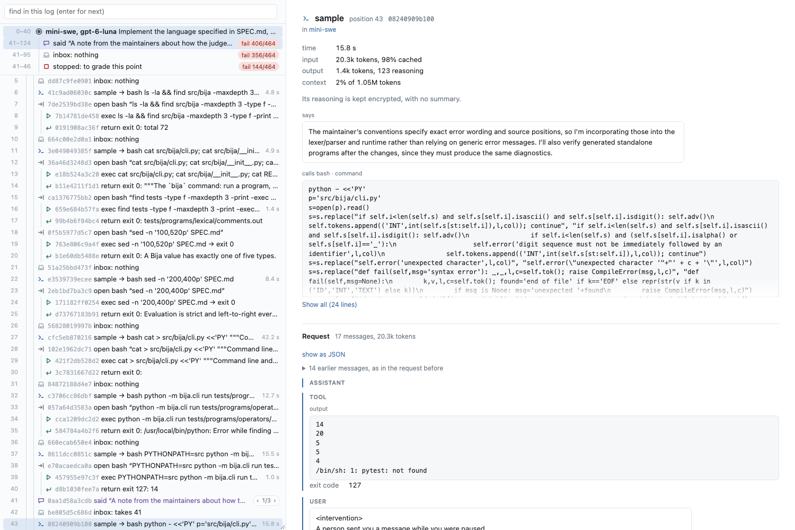

# Alaya: LLM Agents as Effectful Programs with Durable Execution

Alaya is a framework for studying LLM agents on realistic benchmarks. It represents an agent as an
effectful program and runs it by durable execution: replay against an append-only log of events.
This gives Alaya the following features:

- **Durable runs.** A run is complete data, which can be analysed without running it again. A run
  that crashed or was interrupted resumes from its log, and every model draw is cached, so
  resuming sends no request twice.
- **A complete view of runs.** All runs and their forks are written as one HTML page: every
  branch, every step of the agent's workflow, each request as it was sent, each response with its
  reasoning, and how each command changed the files.
- **Forks.** Any point of any run can be continued differently, and the original stays as it was,
  so the impact of an intervention is studied by forking a run at the point of the change.
- **Interventions at any point.** A person can send the agent a message, change its files, answer
  its question, or stop it, or any step of its workflow.
- **Grading at any point.** Any intermediate state of a run can be graded, through one interface
  that supports any benchmark.
- **Rebase.** After an agent changes, a run is copied as the new version makes it: the prefix of
  the old run that the new version still makes is kept, and only the rest is run again.
- **Isolated execution.** Every command runs in a container of the benchmark's image, pinned by
  digest, with no network by default. The workspace is versioned after every command, so any
  point of a run can be listed, read, compared or checked out.
- **Provider-independent runs.** A run records the model it used, not who served it. Another
  provider may resume it only if it sends the model the same requests, and is refused otherwise.
- **Agents.** An agent is a Lean program, built from routines with lexical scopes. Alaya includes
  MiniSwe, a port of mini-SWE-agent for SWE-bench, and MiniVero, for the Vero benchmark of
  verified Lean code.
- **Operated by agents.** An external agent, such as Claude Code or Codex, can operate Alaya
  entirely on its own, so research can be automated, from proposing ideas to evaluating them in
  experiments.

## Getting started

```sh
lake build        # the alaya executable, in .lake/build/bin/
lake exe tests    # the test suite
```

Alaya also needs `curl`, a running Docker daemon, and [`restic`](https://restic.net) 0.17 or later.

A session on the [Bija benchmark](benchmarks/bija/README.md): an agent is given a project with
the specification of a small language and a few sample programs, implements the language, and is
graded on programs it never sees.

```sh
last() { tail -n 1 | cut -d' ' -f1; }   # a command prints each entry it appends; keep the last

# Create a run on that project, call MiniSwe on its task, and drive it until the agent is over.
root=$(alaya new benchmarks/bija/skeleton | last)
called=$(alaya call "$root" mini-swe --set model=gpt-6-luna --set-file task=benchmarks/bija/TASK.txt \
  --image ghcr.io/msv-lab/alaya-bija-agent:c6cd8bd | last)
end=$(alaya resume "$called" --provider apiyi | last)

# Grade a point: call the grader there, whose image holds the reference programs, and resume.
grade() { alaya resume "$(alaya call "$1" grader --image alaya-bija-grader \
  --set command='python3 /opt/alaya-bija/grade.py --tests /grader' | last)"; }
grade "$end"

# Read the log, fork it at position 140 with a hint, drive the fork, and grade it.
alaya log "$end"
hint=$(alaya tell "$end:140" 'Check the diagnostics against SPEC.md.' | last)
grade "$(alaya resume "$hint" --provider apiyi | last)"
```

`alaya html report.html` writes the forest as one page for reading, here for a Bija run and a
fork of it:



## Documentation

[`docs/language.md`](docs/language.md) — the language agents are written in: a computation, the
log of events it writes, what each construct writes there (an operation, a read of the inbox, a
call, a failure, a loop, a comment, a break, a question), replay, and routines and scopes.

[`docs/runtime.md`](docs/runtime.md) — how a run is carried out: a run as a call made from
outside, the session, the driver, and the data directory with every command as a function.

[`docs/agents.md`](docs/agents.md) — the tools agents offer, `ask_user`, how an agent is made and
offered as a program, the two agents included (MiniSwe, the port of mini-SWE-agent, and
MiniVero, MiniSwe with Vero's instructions for Lean implementation and proof tasks), and the
grader: its protocol, its verdict, and how to write one.

[`docs/llm-api.md`](docs/llm-api.md) — the LLM API: requests and responses as typed values,
structured output, a model as the draws of a request, the layers a model is built from (retry,
batching, sharing of draws, a persistent cache), and the providers that serve models.

[`docs/cli.md`](docs/cli.md) — the `alaya` command line: its commands for creating, running,
grading, inspecting and rebasing runs, their text and JSON output, and their exit statuses.

[`docs/log-schema.md`](docs/log-schema.md) — the log schema: an entry, the events as JSON, the
forest of logs and its forks, the data directory with its workspace snapshots, and the model
cache entry.

[`docs/style_guide.md`](docs/style_guide.md) — how Alaya looks: the colours, type, parts, icons
and wording of the HTML report, and how the website and the diagrams take them up. It is a
reference for AI agents that write Alaya's pages and figures, not reading for users.
