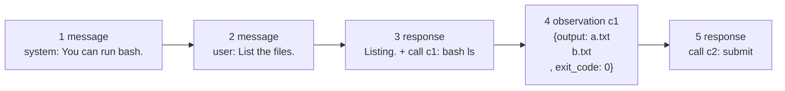
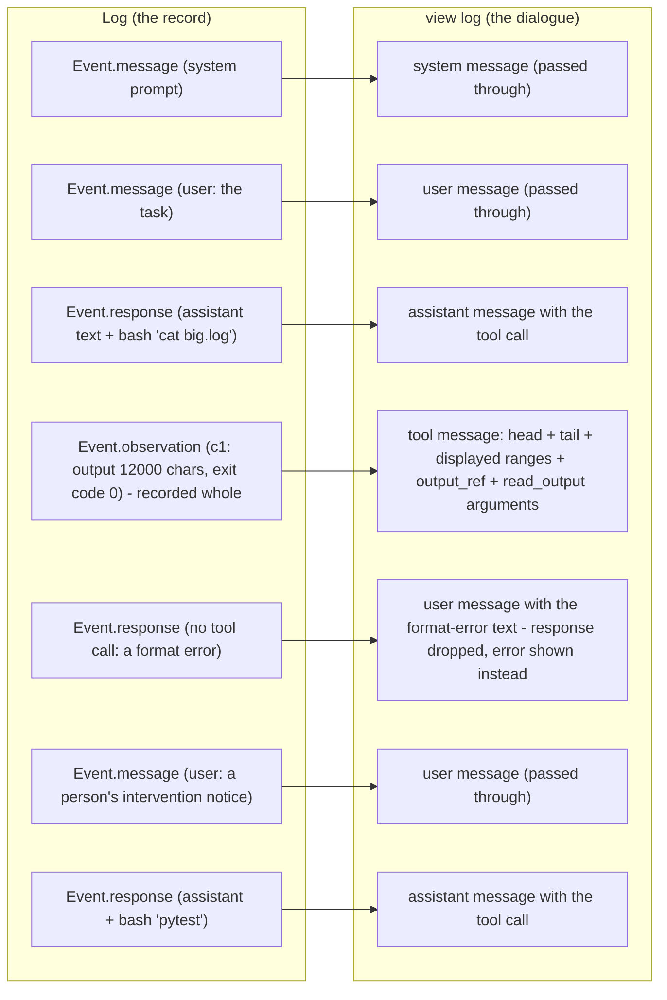
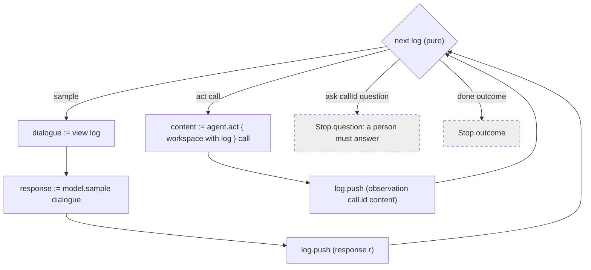

# Agent API

`Alaya.Agent` fixes the minimal assumptions about an agent that trajectory management
(`docs/trajectory-schema.md`) relies on:

- the agent's history is a **log** of events — messages, model responses, tool observations;
- what the model is sent is a pure function of the log, the agent's **view**;
- what happens next — sample, run a tool call, ask a person, stop — is a pure function of
  the log, the agent's **next**;
- the agent acts in a **workspace**, carrying both the directory the trajectory fills from a
  state's snapshot and the current full log; the directory is snapshotted again after each act;
  a tool call is run by the agent's **act**, which returns the observation to record;
- the **tools** offered to the model are fixed for the agent.

An agent is a value of the record `Agent` holding these; `Alaya.Agent.MiniSwe` (`docs/miniswe.md`)
is one.

## 1. The log

The log is the record of a run: everything that was put in front of the model, everything the
model answered, and everything its tools returned, in order and unchanged.

```lean
inductive Event where
  | message (message : Chat.Message)                -- text placed as is: a prompt, a person's note
  | response (response : Chat.Response)             -- the model's turn, exactly as it came back
  | observation (callId : String) (content : Json)  -- a tool call's result, as the agent produced it

abbrev Log := Array Event
```

A **message** is text someone other than the model or a
tool placed in the conversation: the prompts that open a run, a notice from a person. A
**response** is a model turn, as it came back. An
**observation** is what one tool call returned, named by the call's id, in whatever JSON shape the
agent chose to record.

*A short run as a log.*



```lean
let log : Log := #[
  .message (.system "You can run bash."),
  .message (.user "List the files."),
  .response { content? := some "Listing.", toolCalls := #[{ id := "c1", name := "bash", arguments := .mkObj [("command", "ls")] }] },
  .observation "c1" (.mkObj [("output", "a.txt\nb.txt\n"), ("exit_code", 0)]),
  .response { toolCalls := #[{ id := "c2", name := "submit", arguments := .mkObj [("message", "done")] }] }]

log.responses        -- 2
log.calls            -- #[c1, c2]
log.pending          -- #[c2]: the last response's calls with no observation yet
```

`Alaya.Agent.Log` provides the functions that read these facts off a log: `responses` (how many
model turns), `lastResponse?`, `sinceLastResponse` (the events of the current turn), `pending`
(the last response's calls no observation has answered), and `calls` (every tool call made).

## 2. The view

The view is the function that turns the log into the dialogue the model is sent. It applies the
agent's presentation policies: a long tool output is shown truncated; a response with no valid
tool call is shown as an error message rather than as the response. An agent may define other
projections; MiniSwe retains all history and uses recoverable previews, with no history pruning
or conversation summaries.

`view : Log -> Dialogue` is pure and total. Its domain is the whole log, not a
single event, because "elide observations older than N turns" needs position and "stay under a
token budget" needs everything. One rule keeps it pure: anything non-deterministic — a
model-written summary, say — is itself an event in the log, and the view merely places it.

The invariant: **the response at log position k was sampled from `view (log.take k)`**, with
that agent's tool definitions. Given the same agent implementation and configuration, the
view is pure and the persisted log is enough to reconstruct the dialogue. Changing a view or
tool schema changes the request and its cache key; it does not rewrite the recorded log.

*An example: one agent's view of a seven-event log.*



## 3. Directives and actions

What happens next is decided from the log alone: `next : Log -> Directive` is pure and total, so
a resumed run behaves exactly as the run it continues. The four directives are everything a
run consists of:

```lean
inductive Directive where
  | sample                                          -- draw the next response from view log
  | act (call : Chat.ToolCall)                      -- run one tool call
  | ask (callId : String) (question : String)       -- ask a person and wait for the answer
  | done (outcome : Outcome)                        -- the run is over
```

`ask` is how an agent asks a person something. The trajectory records the question and stops;
the person's answer arrives later as the observation of the asking call, and the log continues
as if the tool had returned.

```lean
structure Workspace where
  dir : System.FilePath   -- the state's files, materialized for this act
  log : Log := #[]        -- the full current history, supplied by the driver
```

A `Workspace` contains the directory an agent's tools act in and the current recorded history.
Both `Agent.run` and the trajectory driver refresh `log` before each act, including observations
from earlier calls in the same model response. Direct callers of `act` supply this log themselves
when using tools that depend on history.

`act : Workspace -> Chat.ToolCall -> Result Json` runs one call in the workspace and returns the
observation to record. The shape of the observation is the agent's to define, and its view is
what renders it. An agent that fails to execute a call returns an observation saying so rather
than throwing, so that a run survives a failed command.

MiniSwe's `read_output` uses this log to recover the complete executor text identified by an
`output_ref`; it does not depend on a container file or open a separate store. The original
observation remains unchanged. Page results use `content` rather than executor `output`, so
the view does not truncate a recovery page again. See [output-recovery.md](output-recovery.md)
for offsets, failure behavior, and persistence boundaries.

## 4. The agent record and the reference loop

```lean
structure Agent where
  identity : Lean.Json                   -- who this is and how it is configured, for provenance
  tools : Array Chat.ToolDefinition      -- offered on every sample
  view : View
  next : Log -> Directive
  act : Workspace -> Chat.ToolCall -> Result Lean.Json
```

`Agent.run agent workspace sample log` is the reference loop: follow `next` until it stops, sampling from
`view log` and pushing every event. It returns the final log and a `Stop`: an `outcome`, or a
`question` a person has to answer. A trajectory drives the same steps but persists each **turn**
— one sample and the acts that follow it — as a state, and snapshots after every act. Tests run
an agent through `Agent.run` with a scripted `sample` and no store at all.

*The reference loop `Agent.run`, and how a trajectory drives the same steps.*


