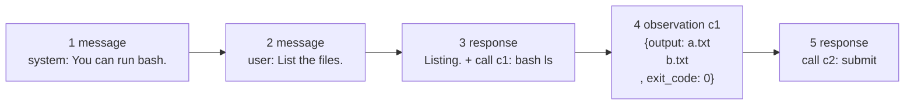
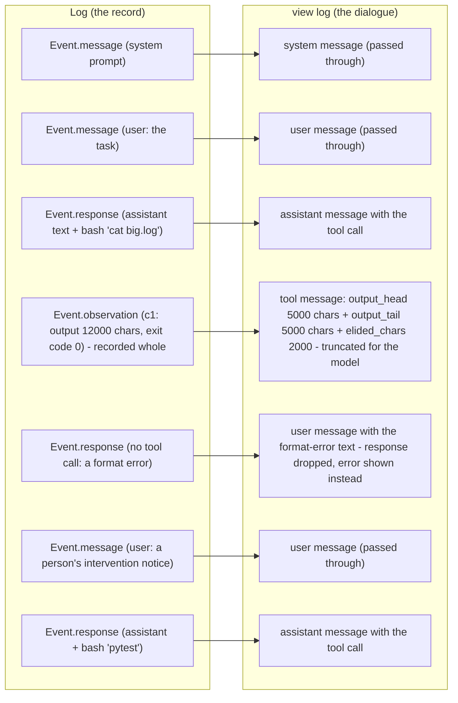
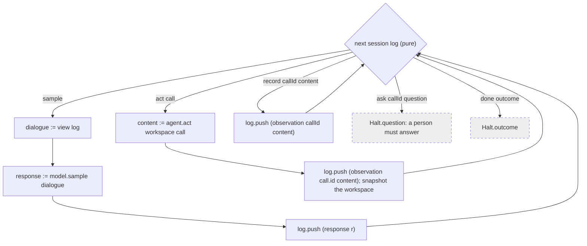

# Agent API

`Alaya.Agent` fixes the minimal assumptions about an agent that trajectory management
(`docs/trajectory-schema.md`) relies on:

- the agent's history is a **log** of events — messages, model responses, tool observations;
- what the model is sent is a pure function of the log, the agent's **view**;
- what happens next — sample, run a tool call, ask a person, stop — is a pure function of
  the log and the **session**, what the driver knows of this invocation (its time), the
  agent's **next**;
- the agent acts in a **workspace**, a directory the trajectory fills from a state's snapshot
  and snapshots again after each act; a tool call is run by the agent's **act**, which returns
  the observation to record — or answered by `next` itself when it needs no workspace;
- the **tools** offered to the model are fixed for the agent.

An agent is a value of the record `Agent` holding these; `Alaya.Agent.MiniSwe` (`docs/miniswe.md`)
is one.

## 1. The log

The log is the record of a run: everything that was put in front of the model, everything the
model answered, and everything its tools returned, in order and unchanged.

```lean
inductive Event where
  | message (message : Chat.Message)                -- text placed as is: a prompt, a person's note
  | response (response : Chat.Response)             -- the model's turn, exactly as it came back
  | observation (callId : String) (content : Json)  -- a tool call's result, as the agent produced it

abbrev Log := Array Event
```

A **message** is text someone other than the model or a
tool placed in the conversation: the prompts that open a run, a notice from a person. A
**response** is a model turn, as it came back. An
**observation** is what one tool call returned, named by the call's id, in whatever JSON shape the
agent chose to record.

*A short run as a log.*


```mermaid
flowchart LR
  E1["1 message<br/>system: You can run bash."]
  E2["2 message<br/>user: List the files."]
  E3["3 response<br/>Listing. + call c1: bash ls"]
  E4["4 observation c1<br/>{output: a.txt\nb.txt\n, exit_code: 0}"]
  E5["5 response<br/>call c2: submit"]
  E1 --> E2 --> E3 --> E4 --> E5
```

```lean
let log : Log := #[
  .message (.system "You can run bash."),
  .message (.user "List the files."),
  .response { content? := some "Listing.", toolCalls := #[{ id := "c1", name := "bash", arguments := .mkObj [("command", "ls")] }] },
  .observation "c1" (.mkObj [("output", "a.txt\nb.txt\n"), ("exit_code", 0)]),
  .response { toolCalls := #[{ id := "c2", name := "submit", arguments := .mkObj [("message", "done")] }] }]

log.responses        -- 2
log.calls            -- #[c1, c2]
log.pending          -- #[c2]: the last response's calls with no observation yet
```

`Alaya.Agent.Log` provides the functions that read these facts off a log: `responses` (how many
model turns), `lastResponse?`, `sinceLastResponse` (the events of the current turn), `pending`
(the last response's calls no observation has answered), and `calls` (every tool call made).

## 2. The view

The view is the function that turns the log into the dialogue the model is sent. It applies the
agent's presentation policies: a long tool output is shown truncated; a response with no valid
tool call is shown as an error message rather than as the response; an old observation may be
left out to save context.

`view : Log -> Dialogue` is pure and total. Its domain is the whole log, not a
single event, because "elide observations older than N turns" needs position and "stay under a
token budget" needs everything. One rule keeps it pure: anything non-deterministic — a
model-written summary, say — is itself an event in the log, and the view merely places it.

The invariant: **the response at log position k was sampled from `view (log.take k)`**. Because
the view is pure and the log is persisted, the request the model saw at any step is recomputable,
and nothing about it needs to be stored.

*An example: one agent's view of a seven-event log.*


```mermaid
flowchart LR
  subgraph LOG["Log (the record)"]
    direction TB
    L1["Event.message (system prompt)"]
    L2["Event.message (user: the task)"]
    L3["Event.response (assistant text + bash 'cat big.log')"]
    L4["Event.observation (c1: output 12000 chars, exit code 0) - recorded whole"]
    L5["Event.response (no tool call: a format error)"]
    L6["Event.message (user: a person's intervention notice)"]
    L7["Event.response (assistant + bash 'pytest')"]
  end

  subgraph VIEW["view log (the dialogue)"]
    direction TB
    V1["system message (passed through)"]
    V2["user message (passed through)"]
    V3["assistant message with the tool call"]
    V4["tool message: output_head 5000 chars + output_tail 5000 chars + elided_chars 2000 - truncated for the model"]
    V5["user message with the format-error text - response dropped, error shown instead"]
    V6["user message (passed through)"]
    V7["assistant message with the tool call"]
  end

  L1 --> V1
  L2 --> V2
  L3 --> V3
  L4 --> V4
  L5 --> V5
  L6 --> V6
  L7 --> V7
```

## 3. Directives and actions

What happens next is decided by `next : Session -> Log -> Directive`, a pure and total
function of the log and the session:

```lean
structure Session where
  elapsedMs : Nat          -- how long the trajectory has run: its recorded steps, and this one so far
  budgetMs? : Option Nat   -- this invocation's time budget; none when given none

inductive Directive where
  | sample                                          -- draw the next response from view log
  | act (call : Chat.ToolCall)                      -- run it in the workspace, snapshot, record the result
  | record (callId : String) (content : Lean.Json)  -- record a result the agent computed itself
  | ask (callId : String) (question : Question)     -- ask a person and wait for a valid answer
  | done (outcome : Outcome)                        -- the run is over
```

The **session** is what the driver knows about this invocation that the log does not: how long
the run has taken, which is on the states (`docs/trajectory-schema.md` §6), and the time budget
the `resume` was given, which is recorded nowhere. An agent that ignores it — MiniSwe — decides
from the log alone, and a resumed run behaves exactly as the run it continues; one that reads
it can pace itself. `view` is not given it: what the model was sent must be rebuilt from the
log alone, and whatever `next` decides from the session that the model sees is recorded as an
event.

`ask` is how an agent asks a person something. The trajectory records the question and stops;
the person's answer arrives later as the observation of the asking call, and the log continues
as if the tool had returned. `Question` contains the question text, its `questionType`
(`yesNo`, `singleChoice`, or `openEnded`), and the candidate `options`. The default is
an open-ended question. The trajectory stores these fields and validates replies against
the recorded form before creating an observation: yes/no accepts only `yes` or `no`;
single choice accepts one in-range, one-based candidate number or `none_of_above`.
The model must not generate the system-provided **None of the above** option;
the answer interface appends it separately from the model's `options`.
Open-ended replies require nonblank text and retain valid text unchanged.
The unavailable object remains distinct from every ordinary answer string.

`record` is how an agent answers a tool call itself: `next` computes the result, from the log
or the session, and the loop records it as the call's observation, with nothing run and no
snapshot taken, so the state keeps its parent's workspace. It is for tools that need no
workspace — a page of an earlier command's output (`docs/miniswe.md` §9), the time left
(`docs/minivero.md`), a value the agent keeps for itself. The view sees an ordinary observation
and decides how, and whether, the model sees it.

```lean
structure Workspace where
  dir : System.FilePath   -- the state's files, materialized for this act
```

A `Workspace` is the directory an agent's tools act in.

`act : Executor -> Workspace -> Chat.ToolCall -> Result Json` runs one call in the workspace,
through the run's executor, and returns the observation to record. The executor is an argument
because it is chosen after the agent is built: by the run, from `executorConfig`. The shape of the observation is the agent's to define, and its view is
what renders it. An agent that fails to execute a call returns an observation saying so rather
than throwing, so that a run survives a failed command.

## 4. The agent record and the loop

```lean
structure Agent where
  config : Lean.Json                     -- its complete configuration: what a root records
  initialLog : String -> Uname -> Log    -- the opening log of a run for a task, on a machine
  executorConfig : Executor.Config       -- how its commands run: timeout and environment
  tools : Array Chat.ToolDefinition      -- offered on every sample
  view : View
  next : Session -> Log -> Directive
  act : Executor -> Workspace -> Chat.ToolCall -> Result Lean.Json
```

The tools themselves live in `Alaya.Agent.Tools`, each defined on its own — schema, argument
reading, and what answers a call — with no knowledge of any agent; an agent composes them.
`Alaya.Agent.Catalog` is how the command line gets an agent: each agent it can name (`mini-swe`,
`mini-vero`) has its defaults in code and reads a configuration into an `Agent`, and the root
records its complete `config`, from which every later command builds the same agent again
(`docs/cli.md` §5).

There is one loop that carries out directives, the trajectory's (`Trajectory.resume`,
`docs/trajectory-schema.md` §2): follow `next` until it stops, sampling from `view log` and
pushing every event, and persist each **turn** — one sample and the acts that follow it — as a
state, with a snapshot of the workspace after every act. A turn ends in a `Halt`: `continue`, an
`outcome`, or a `question` a person has to answer. `outOfTime` and `outOfTurns` are the
continuation's own limits, checked between turns and never inside one, since a turn stopped
between its tool calls would leave calls unanswered. Tests drive an agent through the same loop,
with a scripted model and directory snapshots in place of restic.

*The loop, as `Trajectory.resume` carries out a turn.*


```mermaid
flowchart TD
  NEXT{"next session log (pure)"}

  NEXT -->|sample| S1["dialogue := view log"]
  S1 --> S2["response := model.sample dialogue"]
  S2 --> S3["log.push (response r)"]
  S3 --> NEXT

  NEXT -->|"act call"| A1["content := agent.act workspace call"]
  A1 --> A2["log.push (observation call.id content); snapshot the workspace"]
  A2 --> NEXT

  NEXT -->|"record callId content"| O1["log.push (observation callId content)"]
  O1 --> NEXT

  NEXT -->|"ask callId question"| SU["Halt.question: a person must answer"]
  NEXT -->|"done outcome"| DO["Halt.outcome"]

  classDef terminal fill:#eee,stroke-dasharray: 5 5
  class SU,DO terminal
```
