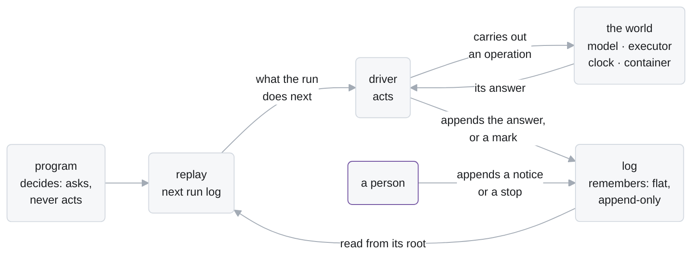
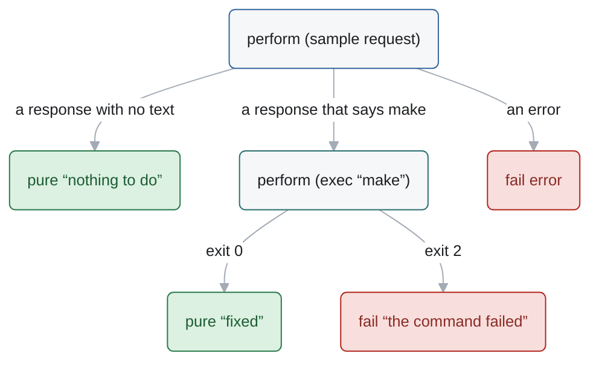
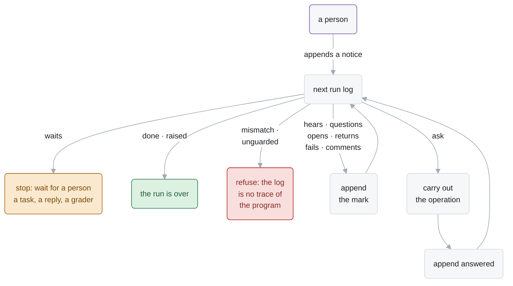
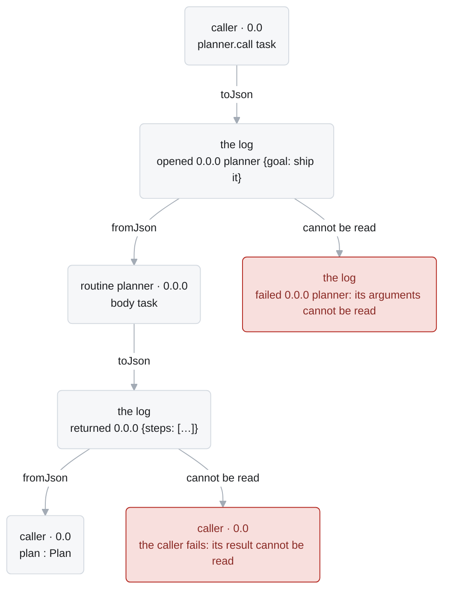
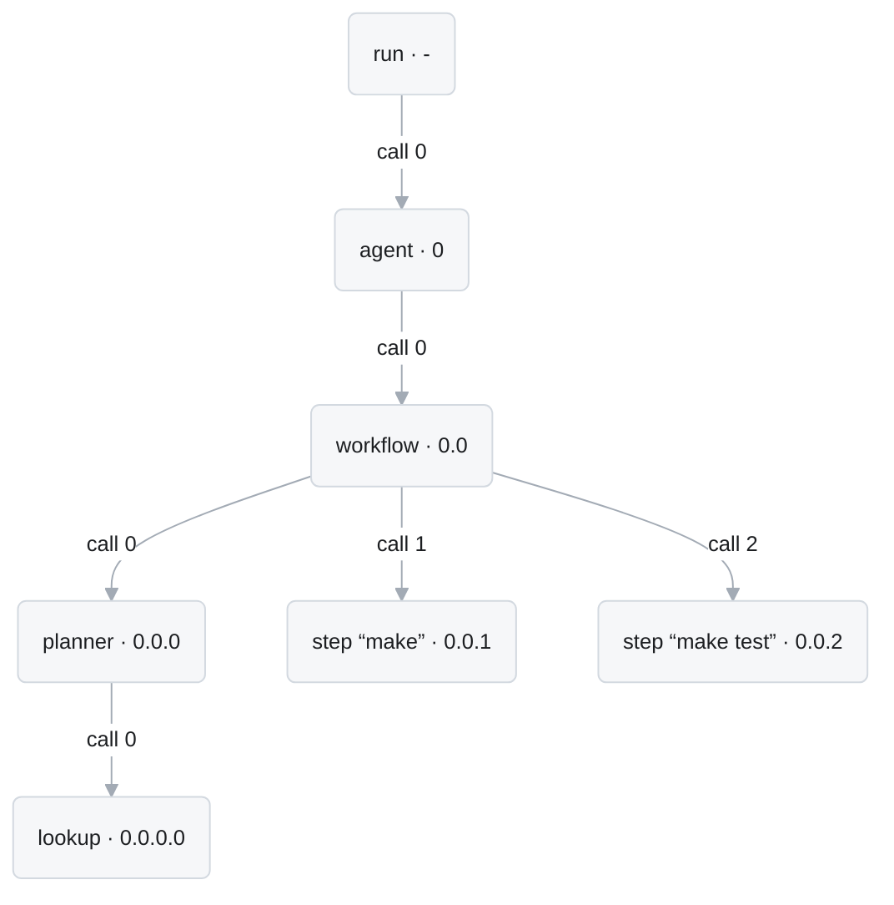
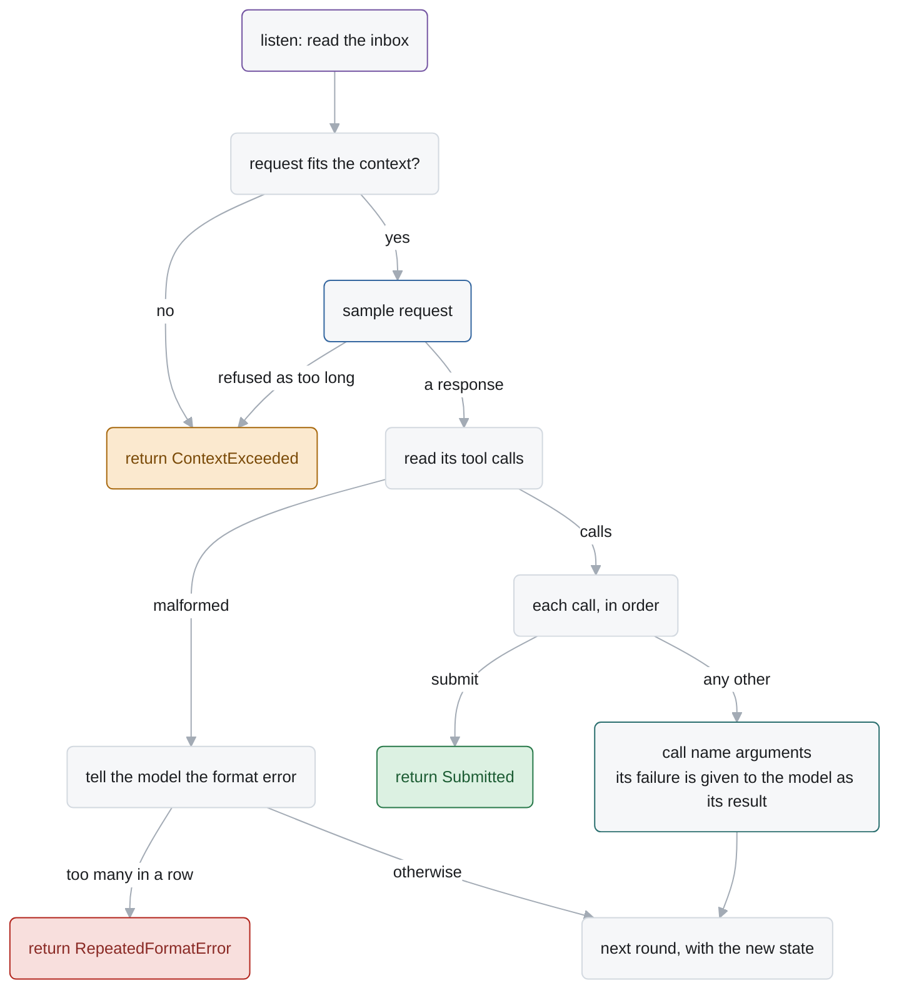

# Agent API

Alaya represents an agent as an effectful program in free-monad form and runs it by durable
execution: replay against an append-only log of events. The logs form a forest, so any point of
a run, with its workspace, can be forked and resampled.

In Alaya's own terms there are three parts. The **program** is a value that says what to ask the
world for next, and carries out nothing. The **log** is the flat, append-only list of what
happened in a run. The **driver** reads the log with the program to find what the program asks
next, carries that out, and appends the answer.


```mermaid
%%{init: {"theme": "base", "themeVariables": {"fontFamily": "BlinkMacSystemFont, Segoe UI, Helvetica, Arial", "fontSize": "13px", "primaryColor": "#f6f7f9", "primaryTextColor": "#1c1e21", "primaryBorderColor": "#d3d9e0", "lineColor": "#a3abb5", "textColor": "#6f7985", "edgeLabelBackground": "#ffffff", "clusterBkg": "#fafbfc", "clusterBorder": "#e3e6ea"}}}%%
flowchart LR
  classDef notice stroke:#7556a3

  program("program<br/>decides: asks,<br/>never acts")
  log("log<br/>remembers: flat,<br/>append-only")
  replay("replay<br/>next run log")
  driver("driver<br/>acts")
  world("the world<br/>model · executor<br/>clock · container")
  person("a person"):::notice

  program --> replay
  log -- "read from its root" --> replay
  replay -- "what the run<br/>does next" --> driver
  driver -- "carries out<br/>an operation" --> world
  world -- "its answer" --> driver
  driver -- "appends the answer,<br/>or a mark" --> log
  person -- "appends a notice<br/>or a stop" --> log
  linkStyle default stroke-width:1px
```

This page is what an agent is written against, in the order one meets it:

| § | What | Where |
| --- | --- | --- |
| 1 | a **program**: a tree of what it asks for | `Alaya.Program` |
| 2 | the **log** and its **events** | `Alaya.Program` |
| 3 | what each construct of a program writes in the log | `Alaya.Replay`, `Alaya.Agent` |
| 4 | **replay**: from the log back to the program | `Alaya.Replay` |
| 5 | **routines**: how a program is scoped | `Alaya.Program` |
| 6 | **tools**: routines a model can call | `Alaya.Agents.Tools` |
| 7 | `ask_user`: a model asks a person | `Alaya.Agents.Tools` |
| 8 | an **agent**: a program and its routines | `Alaya.Agents.*` |
| 9 | a **run**: the agent, then its grading | `Alaya.Run` |
| 10 | **driving** a run: the driver's own API | `Alaya.Driver` |

How a log is stored is `docs/log-schema.md`, and the command line over all of this is
`docs/cli.md`.

## 1. A program

```lean
inductive Program (σ : Signature) : Type → Type 1     -- Alaya.Program
abbrev Agent : Signature                               -- Alaya.Agent: sample, exec, time, external
```

A program of Alaya has the type `Program Agent α`: it asks for operations of the signature
`Agent`, and ends with an `α`. It is a tree. A leaf is a value or a failure. Any other node is
one thing the program asks for, with the rest of the program under it, one subtree for each
answer it can get. Such a tree is the free monad on its signature: an interactive program as a
value, which something outside it executes (Hancock and Setzer 2000; Kiselyov and Ishii 2015).

```lean
def fix : Program Agent String := do
  let response ← sample request
  match response.content? with
  | none => return "nothing to do"
  | some command =>
    let ran ← exec command
    if ran.output.exitCode? == some 0 then return "fixed" else throw "the command failed"
```

*The program `fix` as a tree: an operation is a node, and each answer leads to the rest of the
program.*


```mermaid
%%{init: {"theme": "base", "themeVariables": {"fontFamily": "BlinkMacSystemFont, Segoe UI, Helvetica, Arial", "fontSize": "13px", "primaryColor": "#f6f7f9", "primaryTextColor": "#1c1e21", "primaryBorderColor": "#d3d9e0", "lineColor": "#a3abb5", "textColor": "#6f7985", "edgeLabelBackground": "#ffffff", "clusterBkg": "#fafbfc", "clusterBorder": "#e3e6ea"}}}%%
flowchart TD
  classDef sample stroke:#3567a0
  classDef exec stroke:#2b6f6f
  classDef ok fill:#dcf1e2,stroke:#2a7a4b,color:#1c5c33
  classDef bad fill:#f8dfdd,stroke:#b3261e,color:#8a2a25

  asked("perform (sample request)"):::sample
  asked -- "a response with no text" --> nothing("pure “nothing to do”"):::ok
  asked -- "a response that says make" --> ran("perform (exec “make”)"):::exec
  asked -- "an error" --> errored("fail error"):::bad
  ran -- "exit 0" --> fixed("pure “fixed”"):::ok
  ran -- "exit 2" --> broken("fail “the command failed”"):::bad
  linkStyle default stroke-width:1px
```

A program is written in `do` notation, from eight things:

| Written | Asks for | Goes on with |
| --- | --- | --- |
| `return a` | nothing: it ends with `a` | |
| `throw error` | nothing: it gives up | |
| `sample`, `exec`, `time`, `external` | an operation of the world | its answer |
| `inbox`, `await` | the notices that arrived from outside | those it takes |
| `ask question` | a person's answer to a question | the reply |
| `call name arguments` | a routine, by its name | the routine's result |
| `iter step state` | a loop from `state` | the result of its last round |
| `comment text` | a line in the log, for a reader | nothing |

`try … catch` catches a failure, and `retry n program` tries a program again while it fails.
Since a program only asks, running it has no effect: the same program is run again and again
against a longer and longer log (§4).

## 2. The log

```lean
inductive Event (σ : Signature) where
  | arrived   (notice : Notice)                              -- from outside
  | heard     (frame : Frame) (notices : Array Nat)          -- a read of the inbox
  | asked     (frame : Frame) (question : Question)          -- a question for a person
  | answered  (frame : Frame) (key : σ.Key) (answer : Except String σ.Stored)
  | opened    (frame : Frame) (call : RoutineCall)           -- a call begins
  | returned  (frame : Frame) (value : Json)                 -- … and ends with its value
  | failed    (frame : Frame) (error : String)               -- … or with its failure
  | stopped   (reason : String)                              -- from outside: the agent ends
  | commented (frame? : Option Frame) (text : String)        -- for a reader only

abbrev Log (σ : Signature) := Array (Event σ)
```

A log is an array of events, and an event's **position** is its index. There are three kinds of
event:

| Kind | Events | Appended |
| --- | --- | --- |
| from outside | `arrived`, `stopped`, a person's `commented` | by a person, at any time; it has no frame |
| answer | `answered` | by the driver, after it carried out an operation |
| mark | `heard`, `asked`, `opened`, `returned`, `failed`, a program's `commented` | by the driver, where the program did something that needs no world |

A mark tells the program nothing it does not know. It is in the log so that the log can be read
without the program: who read which notice, where each call began and how it ended.

A **notice** is what arrives from outside:

```lean
inductive Notice where
  | said     (message : String)                       -- a person: the task, or a message later on
  | changed  (workspace : Snapshot) (summary : String)   -- the workspace, changed from outside
  | replied  (to : Frame) (reply : Reply)             -- an answer to the question asked in frame `to`
  | assigned (grader : Json)                          -- the grader of the run
```

A **frame** says which call an event happened in. It is the path of calls from the run, each
call by its ordinal among its caller's calls: `#[]` is the run itself, `#[0]` the agent, `#[0, 2]`
the agent's third call. It is written `0.2`, and `-` where there is none.

*The log of the four-line agent below. A row is a position, a frame and an event; at its end is
the event's constructor. On the left is what the program did there, and in the middle who
answered.*


```lean
def agent : Program Agent Json := do
  let _ ← await fun _ notice => notice matches .said _     -- 3: wait for the task
  let response ← sample (request …)                         -- 4
  let ran ← exec "make"                                     -- 5
  return "fixed"                                            -- 6
```

Every log begins the same way. Position 0 is the **root**, `arrived (changed …)`: the workspace
the run starts from. Position 1 is the opening of the agent's call, and its arguments are the
run's configuration (§9).

## 3. What each construct writes

`return` and the sequencing of `do` write nothing. Each other construct writes one event when
the driver reaches it. This section takes them one at a time.

### 3.1 Operations

```lean
sample   : Chat.Request → Program Agent Chat.Response
exec     : String → Executor.Config → Program Agent Execution      -- the config defaults to {}
time     : Program Agent Timing
external : String → String → Option Snapshot → Nat → Program Agent External
```

1. The program reaches an operation. It stops there: it has asked.
2. The driver carries the operation out.
3. The driver appends `answered frame key answer`: the frame that asked, the operation's key,
   and what the world gave.
4. The program goes on with the answer. On every later replay the answer is read from the log:
   an operation whose answer is logged is never carried out again.


| Operation | Carried out by | Answer |
| --- | --- | --- |
| `sample request` | the run's model | `Chat.Response` |
| `exec command config` | the executor: `command` in the run's container, on the workspace, with `config`'s timeout and environment | `Execution`: the output, the version of the workspace it left, and with `config.outputs` the file that holds the whole output |
| `time` | the driver: the run's time summed along its log | `Timing`: the time spent, and the budget of this invocation |
| `external command image input? timeout` | a fresh container of `image` with no network, on a checkout of the workspace, `input?` at `/grader` | `External`: how it ended, its stdout and stderr, and the checkout as it left it |

The log keeps an operation by its **key**: all of it, except that a sample is kept by the digest
of its request, so the log does not hold the conversation again with every response. A response
is a **draw** of its request, which the model cache keeps: a run that crashed takes the draw the
cache kept, and running a point again takes a new one.

A command that exits with an error, or runs out of time, is still an answer: its status is in
the output. Only an answer the world could not give is a failure (§3.4).

**The workspace is in the log.** A command runs on the version of the workspace the log has
reached, and its answer names the version it left. A person's change is a notice that names a
version too. So `workspace? log` is the last version a command or a change left, and any point
of a run can be checked out, compared, or gone on from. `external` is the exception: it runs on
a checkout, and the run's workspace stays where it is.


### 3.2 Notices: `inbox` and `await`

```lean
inbox : Program σ (List Notice)                                   -- take what has arrived
await : (Frame → Notice → Bool) → Program σ (List Notice)         -- wait for the notices it is for
```

1. A person appends a notice: `arrived notice`. No one has read it yet.
2. `inbox` takes every notice not yet read that is addressed to no one: what a person said or
   changed. The driver marks the read, `heard frame positions`, with the positions of what it
   took, which may be none.
3. `await accepts` takes the unread notices that `accepts frame notice` holds for. When none has
   arrived, the read is not made: the run **waits**, and the driver stops. Once one arrives, the
   read is made and marked like any other.
4. A `replied` and an `assigned` notice are **addressed**: to the call that asked, and to the
   run. Only an `await` for them takes them; a plain `inbox` leaves them.


A notice is read once, by one read, and the mark says by which. The root is no notice for the
agent: no read takes it.

### 3.3 Calls

```lean
call : (name : String) → (arguments : Json) → Program σ Json
```

1. The program calls a routine by its name. The driver marks the call,
   `opened child ⟨name, arguments⟩`. The **child frame** is the caller's frame and the ordinal
   of the call among the caller's calls: `0.0`, then `0.1`.
2. The routine the run has under that name runs in the child frame. What it asks for is asked
   from there, and its own calls open frames under it.
3. The routine ends, and the driver marks how: `returned child value`, or `failed child error`.
4. The caller goes on with the value. A failure is the caller's too, unless it catches it.


A call holds a name and no body, so it is data, and the log holds it whole. A routine is entered
in no other way, so every scope of a log is a call: a frame with its sub-frames is one stretch
of the log, from its opening to its end, notices apart. Nested scopes kept flat, between matched
brackets, are scoped operations (Wu, Schrijvers and Hinze 2014; Piróg et al. 2018). A call of a
name the run has no routine under fails in its own frame, with `no routine named …`.

### 3.4 Failures

- `throw error` gives up, up to the nearest `try … catch` in the same frame, or to the end of
  the frame.
- An operation whose answer is an error fails where it was performed. The one such answer today
  is a model's refusal of a request as too long for its context. Any other trouble with the
  world — a provider that cannot be reached, a container that cannot be started, a full disk —
  is no answer: the driver stops, nothing is logged, and the next `alaya run` asks again.
- A failure that reaches the end of its frame is marked, `failed frame error`, and becomes the
  failure of the call.
- `try … catch` leaves no mark. Nothing is rolled back: what a failed routine did stays in the
  log.


`retry n program` tries `program` again while it fails, `n` times more; every try is in the log.

### 3.5 Loops

```lean
iter : (S → Program σ (S ⊕ α)) → S → Program σ α
```

1. `iter step state` runs `step state`: one **round**.
2. A round that gives `.inl state'` is followed by a round from `state'`; one that gives
   `.inr result` ends the loop with `result`.
3. The loop writes nothing of its own. The log holds the events of its rounds, one after
   another.


The state of a loop is data — a conversation, a counter — where the rest of a program is a
function. So a round's request is computed from the state, and limits that count turns or
measure the context read it too.

Every round must read an event: an operation, a read of the inbox, or a call. A loop that goes
round without one is `unguarded`, a broken run. This is what makes replay of a finite log end.
A loop as a constructor whose every round performs is from Hancock and Setzer (2000); `iter`
itself is the loop of interaction trees (Xia et al. 2020).

### 3.6 Comments

```lean
comment : String → Program σ Unit
```

A comment is a line for whoever reads the log, for debugging an agent. The driver writes it
where the program is, `commented (some frame) text`, and `alaya log` and the report show it as
`# text`.

Nothing depends on a comment. Replay passes over a comment in the log wherever it stands, and
over a comment of the program that the log does not hold. So comments can be added to an agent,
reworded or removed, and every existing log is still a log of that agent. A comment does not
guard a loop. A person's comment (`alaya comment`) has no frame.

### 3.7 Stops

A stop is no construct of a program. It comes from outside, `stopped reason`, appended by
`alaya stop`, or by `alaya grade` at a point where the agent still runs.

1. Every frame of the agent ends there, whatever the nesting, with no marks.
2. Nothing in the agent can catch it.
3. The run goes on with what follows the agent (§9), which is given the error `stopped`.


### 3.8 Questions: `ask`

```lean
ask : Question → Program σ Reply

structure Question where text : String ; form : Question.Form     -- yesNo | singleChoice options | openEnded
inductive Reply where | yes | no | choice (number : Nat) | noneOfAbove | text (text : String) | unavailable
```

1. The program reaches `ask question`. A question that cannot be asked — a blank one, or a
   choice with fewer than two distinct candidates — fails there.
2. The driver marks it, `asked frame question`. So the question is in the log, whoever asks it.
3. The run waits for a reply to that frame that fits the question, and the driver stops.
4. A person replies: `arrived (replied frame reply)`. A reply where no question waits, or one
   that does not fit, is refused before it is appended.
5. The read is marked like any other, and the program goes on with the reply.

There are three kinds of question and six kinds of reply, and no others:

| Kind of question | A reply that fits |
| --- | --- |
| `yes_no` | `yes`, `no` |
| `single_choice` | `choice n`, with `n` from 1; `noneOfAbove`: no candidate is right |
| `open_ended` | `text`, not blank, kept verbatim |
| any | `unavailable`: the person cannot answer |

Any program may ask: a tool a model calls (§7), or a step of a workflow that wants a person's
word before it goes on.

```lean
def deploy : Routine Agent String Bool := routine "deploy" fun target => do
  let reply ← ask { text := s!"Deploy to {target}?", form := .yesNo }
  if reply != .yes then return false
  return (← exec s!"make deploy TARGET={target}").output.exitCode? == some 0
```

```lean
questionOf? : Next Agent → Option (Frame × Question)        -- the question a run waits on
replyTo     : Next Agent → Reply → Except String (Event Agent)   -- the reply as an event, or why not
```

The figure of §7 shows a question in a log.

## 4. Replay: from the log back to the program

```lean
next : Run σ → Log σ → Next σ          -- what a run does after a log
```

The driver keeps nothing of a program between two events. It calls `next`, which **replays** the
program against the log from its root. Running a program again from the start with its
recorded answers, in place of saving where it had got to, is how durable workflows survive a
crash (Koppel, Scherer and Solar-Lezama 2018; Burckhardt et al. 2021):

- an `answered` event is given to the program as the answer of the operation it asks for there;
- a mark is checked against the mark the program makes there;
- an `arrived` notice is set aside until a read takes it.

Where the log ends, the program has reached something the log does not hold. That is what the
run does next, and the driver does it:


```mermaid
%%{init: {"theme": "base", "themeVariables": {"fontFamily": "BlinkMacSystemFont, Segoe UI, Helvetica, Arial", "fontSize": "13px", "primaryColor": "#f6f7f9", "primaryTextColor": "#1c1e21", "primaryBorderColor": "#d3d9e0", "lineColor": "#a3abb5", "textColor": "#6f7985", "edgeLabelBackground": "#ffffff", "clusterBkg": "#fafbfc", "clusterBorder": "#e3e6ea"}}}%%
flowchart TD
  classDef notice stroke:#7556a3
  classDef ok fill:#dcf1e2,stroke:#2a7a4b,color:#1c5c33
  classDef bad fill:#f8dfdd,stroke:#b3261e,color:#8a2a25
  classDef wait fill:#fbe9cf,stroke:#a8690f,color:#7a4a08

  person("a person"):::notice -- "appends a notice" --> next("next run log")
  next -- "waits" --> waits("stop: wait for a person<br/>a task, a reply, a grader"):::wait
  next -- "done · raised" --> over("the run is over"):::ok
  next -- "mismatch ·<br/>unguarded" --> refuse("refuse: the log<br/>is no trace of<br/>the program"):::bad
  next -- "hears · questions<br/>opens · returns<br/>fails · comments" --> mark("append<br/>the mark")
  mark --> next
  next -- "ask" --> act("carry out<br/>the operation") --> answered("append answered")
  answered --> next
  linkStyle default stroke-width:1px
```

| `Next` | What the log says |
| --- | --- |
| `ask call` | it ends where the program asks for an operation |
| `hears`, `questions`, `opens`, `returns`, `fails`, `comments` | it ends where the program makes a mark |
| `waits frame question?` | it ends where a read waits, and nothing the read is for has arrived; with the question, when it waits for a reply |
| `done value`, `raised error` | it is complete: the run is over |
| `mismatch position` | its event at `position` is not what the program does |
| `unguarded frame` | the program went round a loop without reading an event |

Three rules make a program one that can be replayed:

- **It is a function of its answers.** What it asks next is computed from what came back
  before: earlier answers, notices, and the run's configuration, all of which are in the log. It
  reads no clock and no file of its own.
- **Every round of a loop reads an event** (§3.5).
- **What comes from outside comes through the inbox** (§3.2).

A log is matched by position, so a program changed after a log was written reads that log only
up to its first changed operation; after it the log is a `mismatch`, which the driver refuses
to go on from. Comments are the exception (§3.6).

## 5. Routines

A **routine** is a program from its arguments to its result, both JSON, under a name. It is the
one way to scope a part of an agent: a tool, a step of a workflow, a sub-agent and the agent
itself are routines, and each runs in a frame of its own (§3.3).

```lean
abbrev Routines σ := String → Option (Json → Program σ Json)     -- the routines of a run, by name

structure Routine σ α β where
  name  : String
  entry : String × (Json → Program σ Json)        -- what the run's table lists
  call  : α → Program σ β                         -- the call, typed

routine : String → (α → Program σ β) → Routine σ α β             -- α and β to and from JSON
```

1. **Declare it** with `routine name body`. The body takes a typed argument and gives a typed
   result.
2. **List it**: its `entry` goes in the table of the run (§9).
3. **Call it** with `r.call argument`, from any program of the run. A routine a model names is
   called by that name: `call name arguments` (§6).

The argument and the result cross the call as JSON, because that is how the log holds them: the
argument on the opening, the result on the end. Each side reads what it is given, and fails in
its own frame when it cannot.


```mermaid
%%{init: {"theme": "base", "themeVariables": {"fontFamily": "BlinkMacSystemFont, Segoe UI, Helvetica, Arial", "fontSize": "13px", "primaryColor": "#f6f7f9", "primaryTextColor": "#1c1e21", "primaryBorderColor": "#d3d9e0", "lineColor": "#a3abb5", "textColor": "#6f7985", "edgeLabelBackground": "#ffffff", "clusterBkg": "#fafbfc", "clusterBorder": "#e3e6ea"}}}%%
flowchart TD
  classDef bad fill:#f8dfdd,stroke:#b3261e,color:#8a2a25

  asks("caller · 0.0<br/>planner.call task")
  opened("the log<br/>opened 0.0.0 planner {goal: ship it}")
  body("routine planner · 0.0.0<br/>body task")
  returned("the log<br/>returned 0.0.0 {steps: […]}")
  plan("caller · 0.0<br/>plan : Plan")
  failed("the log<br/>failed 0.0.0 planner: its arguments cannot be read"):::bad
  unread("caller · 0.0<br/>the caller fails: its result cannot be read"):::bad

  asks -- "toJson" --> opened
  opened -- "fromJson" --> body
  opened -- "cannot be read" --> failed
  body -- "toJson" --> returned
  returned -- "fromJson" --> plan
  returned -- "cannot be read" --> unread
  linkStyle default stroke-width:1px
```

An agent of several parts is routines calling routines:

```lean
structure Task where goal : String  deriving ToJson, FromJson
structure Plan where steps : Array String  deriving ToJson, FromJson

/-- A sub-agent: a conversation of its own, with the tool it offers its model. -/
def planner : Routine Agent Task Plan := routine "planner" fun task => do
  let answer ← iter (fun messages => do
    let response ← sample { messages, tools := #[lookupDefinition] }
    if response.toolCalls.isEmpty then return .inr (response.content?.getD "")
    let mut messages := messages.push response.message
    for asked in response.toolCalls do                  -- the model's call is a call of a routine
      let result ← try call asked.name asked.arguments catch error => pure (.str s!"error: {error}")
      messages := messages.push (.tool asked.id result)
    return .inl messages) #[.system "You plan.", .user task.goal]
  return { steps := (answer.splitOn "\n").toArray }

/-- A step of the workflow: one command, and its exit status. -/
def step : Routine Agent String Nat := routine "step" fun command => do
  return (← exec command).output.exitCode?.map (·.toNat) |>.getD 1

/-- The workflow: a plan from the planner, then each of its steps. -/
def workflow : Routine Agent Task String := routine "workflow" fun task => do
  let plan ← planner.call task
  let mut failed := 0
  for command in plan.steps do
    if (← step.call command) != 0 then failed := failed + 1
  return s!"{plan.steps.size} steps, {failed} failed"

/-- The agent: it waits for its task, and runs the workflow on it. -/
def agent : Program Agent Json := do
  let notices ← await fun _ notice => notice matches .said _
  let goal := match notices with | .said goal :: _ => goal | _ => ""
  return toJson (← workflow.call { goal })

def routines := #[lookup.entry, planner.entry, step.entry, workflow.entry]
```

*The frames of a run of it: the tree of its calls.*


```mermaid
%%{init: {"theme": "base", "themeVariables": {"fontFamily": "BlinkMacSystemFont, Segoe UI, Helvetica, Arial", "fontSize": "13px", "primaryColor": "#f6f7f9", "primaryTextColor": "#1c1e21", "primaryBorderColor": "#d3d9e0", "lineColor": "#a3abb5", "textColor": "#6f7985", "edgeLabelBackground": "#ffffff", "clusterBkg": "#fafbfc", "clusterBorder": "#e3e6ea"}}}%%
flowchart TD
  run("run · -") -- "call 0" --> agent("agent · 0") -- "call 0" --> workflow("workflow · 0.0")
  workflow -- "call 0" --> planner("planner · 0.0.0")
  workflow -- "call 1" --> make("step “make” · 0.0.1")
  workflow -- "call 2" --> test("step “make test” · 0.0.2")
  planner -- "call 0" --> lookup("lookup · 0.0.0.0")
  linkStyle default stroke-width:1px
```

*Its log (`Test/Routines.lean`): the same tree, flat. Each frame is one stretch of rows, from
its opening to its return.*


A routine names no model: a sample is a request, answered by the run's model. Not every helper
is a routine. A function that builds a program, such as a loop's round, runs in its caller's
frame and leaves no bracket; make a routine where the log should show one.

## 6. Tools

A **tool** is a routine with what a model needs to call it:

```lean
structure Tool where
  definition   : Chat.ToolDefinition              -- its name, description and schema, for a model
  alone        : Bool := false                    -- must be the only call of its turn
  instruction? : Option String := none            -- appended to the prompt
  check        : Json → Except String Unit        -- what is wrong with a call's arguments
  run          : Json → Program Agent Json        -- the program that answers a call

Tool.entry : Tool → String × (Json → Program Agent Json)          -- for the run's table
```

A model's tool call becomes a call of a routine in four steps:

1. The agent samples a request that offers the tools' `definition`s.
2. The response names tools and gives arguments. The agent checks each call with the tool's
   `check`; a call that is wrong is answered with a format error and is not made.
3. The agent calls each tool by the name the model gave: `call asked.name asked.arguments`. The
   tool runs in a frame of its own.
4. The agent puts each result in the next request, as a tool message. A tool that failed gives
   its error as its result.


| Tool | Arguments | Its program | Result |
| --- | --- | --- | --- |
| `bash` | `command` | `exec command`, with the agent's executor settings | `output`, `exit_code`, `error`, `file` |
| `time_budget` | none | `time` | `seconds_left`, or that the run has no limit |
| `ask_user` | `question_type`, `question`, `options` | `ask` the question (§7) | the reply |
| `submit` | `message` | never called: the agent that offers it ends with the message | |

`Agents.Tools.all` lists the tools an agent's configuration can name. A tool knows nothing of
the agent that offers it. The agent decides which tools its model is offered, how a malformed
call is worded, and how a result is shown: `bash` gives the whole output, and MiniSwe cuts what
its model sees of it.

## 7. `ask_user`: a model asks a person

`ask_user` is a model's way to `ask` (§3.8). What a question is, which replies fit it, and how
a person gives one belong to the core. The tool adds what a model needs, and nothing else:

| | The core: a question | The tool: `ask_user` |
| --- | --- | --- |
| owns | the three kinds, the replies that fit each, the wait, the checks on a reply | its name, its schema, its instruction, the rule that it is called alone |
| decides | whether a reply answers a question | which kinds of question the model may ask |
| translates | nothing | a call's arguments into a question, and a reply into what the model is shown |

1. **The kinds are chosen in advance.** The agent's `question_types` names the kinds of
   question the model may ask. There is no default: offering `ask_user` without it is an error.

   ```sh
   --set 'agent.tools=["bash","submit","ask_user"]' --set 'agent.question_types=["yes_no","single_choice"]'
   ```

2. **The model is offered exactly those.** The tool's schema, description and instruction name
   only the kinds allowed, and `options` is there only when a choice is among them.
3. **The model asks.** It calls `ask_user`, alone in its turn:

   ```json
   {"question_type": "single_choice",
    "question": "Should the function keep duplicate elements? The prose does not say.",
    "options": ["Keep them, in order.", "Drop them."]}
   ```

4. **The call is checked.** A kind that is not allowed, a blank question, options on a question
   that is no choice, or a candidate that says "none of the above" is a format error, and
   nothing is asked.
5. **The tool asks.** Its program reads the question from the arguments and performs `ask`: the
   question is marked in the log, and the run waits (§3.8).
6. **A person replies**, with `alaya reply` (`docs/cli.md`) or the browser page in the
   repository `msv-lab/vero-hci`.
7. **The model is told.** The call returns the reply as the tool encodes it:

   | Reply | The call returns |
   | --- | --- |
   | `yes`, `no` | `"yes"`, `"no"` |
   | `choice n` | the number `n` |
   | `noneOfAbove` | `"none_of_above"` |
   | `text` | the text |
   | `unavailable` | `{"status": "unavailable"}` |


The reply is taken by the frame that asked and by no other read: the agent's own `inbox` leaves
it.

## 8. An agent

An agent is the program of the routine `agent`, with the routines it calls. The usual shape is
a wait for the task, then a loop over a conversation:

```lean
def converse (config : Config) (opening : String → Array Chat.Message) : Program Agent Json := do
  let notices ← await fun _ notice => notice matches .said _     -- wait for the task
  let task := match notices with | .said task :: _ => task | _ => ""
  iter (round config) { items := (opening task).map .told }      -- go round until it ends
```

*One round of MiniSwe's loop (`Agents.MiniSwe.round`, `docs/miniswe.md`).*


```mermaid
%%{init: {"theme": "base", "themeVariables": {"fontFamily": "BlinkMacSystemFont, Segoe UI, Helvetica, Arial", "fontSize": "13px", "primaryColor": "#f6f7f9", "primaryTextColor": "#1c1e21", "primaryBorderColor": "#d3d9e0", "lineColor": "#a3abb5", "textColor": "#6f7985", "edgeLabelBackground": "#ffffff", "clusterBkg": "#fafbfc", "clusterBorder": "#e3e6ea"}}}%%
flowchart TD
  classDef sample stroke:#3567a0
  classDef exec stroke:#2b6f6f
  classDef notice stroke:#7556a3
  classDef ok fill:#dcf1e2,stroke:#2a7a4b,color:#1c5c33
  classDef bad fill:#f8dfdd,stroke:#b3261e,color:#8a2a25
  classDef wait fill:#fbe9cf,stroke:#a8690f,color:#7a4a08

  listen("listen: read the inbox"):::notice --> fits("request fits the context?")
  fits -- "no" --> context("return ContextExceeded"):::wait
  fits -- "yes" --> sample("sample request"):::sample
  sample -- "refused as too long" --> context
  sample -- "a response" --> parsed("read its tool calls")
  parsed -- "malformed" --> format("tell the model the format error")
  format -- "too many in a row" --> repeated("return RepeatedFormatError"):::bad
  format -- "otherwise" --> again("next round, with the new state")
  parsed -- "calls" --> each("each call, in order")
  each -- "submit" --> submitted("return Submitted"):::ok
  each -- "any other" --> tool("call name arguments<br/>its failure is given to the model as its result"):::exec
  tool --> again
  linkStyle default stroke-width:1px
```

The state of the loop is the conversation as data: what the model was told, each turn with the
results of its calls, each malformed response. The request of a round is a function of it. The
agent ends by returning its outcome, a status and a submission, which is the value of its
frame.

The command line builds an agent from its configuration (`Agents.Catalog`):

```lean
structure Built where
  config   : Json                                           -- the complete configuration
  routines : Array (String × (Json → Program Agent Json))   -- the routines it calls: its tools
  program  : Models.Spec → Uname → Program Agent Json       -- for a run of a model on a machine

structure Definition where
  name : String
  make : Json → Except String Built
```

## 9. A run

A run is the agent, called with the run's configuration, and then what follows it:

```lean
structure Run (σ : Signature) where
  routines : Routines σ                             -- every routine a call can enter
  call     : RoutineCall                            -- the agent's call, in frame 0
  after    : Except String Json → Program σ Json    -- what follows the agent, in the run's frame

Run.ofAgent : Json → Program Agent Json → Array (String × (Json → Program Agent Json)) →
  Except String (Run Agent)                          -- a run of any program, with its routines

structure RunConfig where
  agent : Json                       -- the agent's complete configuration
  model : Json                       -- the model's complete spec
  environment : Environment          -- the pinned image, the workdir, the system and architecture

RunConfig.run : RunConfig → Models.Spec → Except String (Run Agent)
configOf      : Log Agent → Result RunConfig         -- read off the opening of the agent's call
agentEnd?     : Log Agent → Option AgentEnd          -- returned, failed or stopped, once it has
assignment    : Grader → Event Agent                 -- the notice that assigns a grader
```

1. **The root.** A person provides the workspace: `arrived (changed …)`, at position 0.
2. **The agent opens.** `opened 0 ⟨"agent", config⟩`, at position 1. The arguments are the
   `RunConfig`, so every later command builds the same run from the log alone (`configOf`).
3. **The agent runs**, in frame `0`, until it returns, fails, or is stopped.
4. **The run waits for a grader.** What follows the agent is `grading`, in the run's own frame.
   It is an `await` for an `assigned` notice, so the driver stops.
5. **A person assigns a grader**: `alaya grade` appends `arrived (assigned grader)`.
6. **The grader runs**: an `external` operation, on a checkout of the workspace.
7. **The run returns its verdict**: `returned - verdict`, the result of the run.


`Run.ofAgent` builds the table of routines, and refuses two routines of one name and a routine
named `agent`. The grader is no routine, so nothing an agent calls reaches it. A grader is
assigned only once the agent is over, and only where the log has none; a point is graded again
on a fork (`docs/log-schema.md`).

Programs live in `Type 1`, since the rest of a program is a function. So a `Run` is built by
pure functions and passed to the driver; it is never returned through `IO`.

## 10. Driving a run

The driver is the one part that touches the world. A program that uses Alaya as a library
drives a run with two functions:

```lean
drive  : Runtime → Run Agent → (tip : Hash) → Limits → OnEntry → Result (Hash × Stop)
append : Store → Run Agent → (tip : Hash) → Event Agent → Result (Hash × Entry)

structure Runtime where          -- what a run is driven with
  store ; workspaces ; workDir ; outputsDir ; scratch ; executor ; workdir
  model? : Option Model          -- none when no provider was named
  graderUser? : Option String

structure Limits where           -- what one invocation allows; nothing of it is recorded
  samples? : Option Nat          -- responses this invocation may sample
  budgetMs? : Option Nat         -- the run's time, summed along its log, after which nothing starts

inductive Stop where             -- why the driver stopped
  | over (agent : AgentEnd) (verdict? : Option Json)     -- the agent is over; graded, with the verdict
  | waits (frame : Frame) (question? : Option Question)  -- a read waits for a person
  | paused (reason : String)                             -- a limit was reached
```

A point of a run is an **entry**: one event and the entry before it, named by a hash
(`docs/log-schema.md`). The log of an entry is the path to it from its root.

`drive` goes on from the entry `tip`:

1. It reads the log that ends at `tip`, and replays it.
2. It asks what the run does next, and does it (the diagram of §4): it carries out an
   operation and appends the answer, or appends a mark. Each event is a new entry after the
   last, and `OnEntry` is called with it.
3. It stops when the agent is over and no grader is assigned, when the run is graded, when a
   read waits for a person, or at a limit. It gives the last entry, and why it stopped.

`append` is how something from outside enters a log: a notice, or a stop, after `tip`. It
replays the log first, and refuses what the log cannot take:

| Event | Taken only |
| --- | --- |
| a stop, a message, a change | while the agent runs |
| a reply | where its question waits (`replyTo`, §3.8) |
| a grader | once the agent is over, and where none is assigned yet |

Appending at an entry that already goes on is a fork: the entry has two continuations, and
each is a log.

- **Draws.** A sample from an entry that has `n` sampled continuations takes draw `n` of its
  request. So the first sample from an entry takes draw 0, which is the response the cache
  kept if the run crashed after its model answered; and driving a point again takes a new draw.
- **Time.** Each entry records how long its event took, and a run's time is the sum along its
  log. A response counts for the time its draw took, also when the cache gives it.
- **Limits** are checked before an operation of the agent and before a read of its inbox, so a
  paused run stops where a message a person appends is heard at once. A limit writes nothing,
  and holds the agent only: a grader runs to its end.
- **Failures.** A failure that is no answer (§3.4) stops `drive` with an error, and nothing is
  logged for the operation; the next `drive` asks for it again. So a command happens at least
  once: what it does beyond the workspace may happen twice.

## References

- S. Burckhardt et al. Durable Functions: semantics for stateful serverless. OOPSLA 2021.
- P. Hancock, A. Setzer. Interactive programs in dependent type theory. CSL 2000.
- O. Kiselyov, H. Ishii. Freer monads, more extensible effects. Haskell 2015.
- J. Koppel, G. Scherer, A. Solar-Lezama. Capturing the future by replaying the past. ICFP 2018.
- M. Piróg, T. Schrijvers, N. Wu, M. Jaskelioff. Syntax and semantics for operations with
  scopes. LICS 2018.
- N. Wu, T. Schrijvers, R. Hinze. Effect handlers in scope. Haskell 2014.
- L. Xia et al. Interaction trees: representing recursive and impure programs in Coq. POPL 2020.
