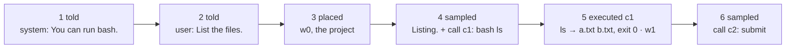
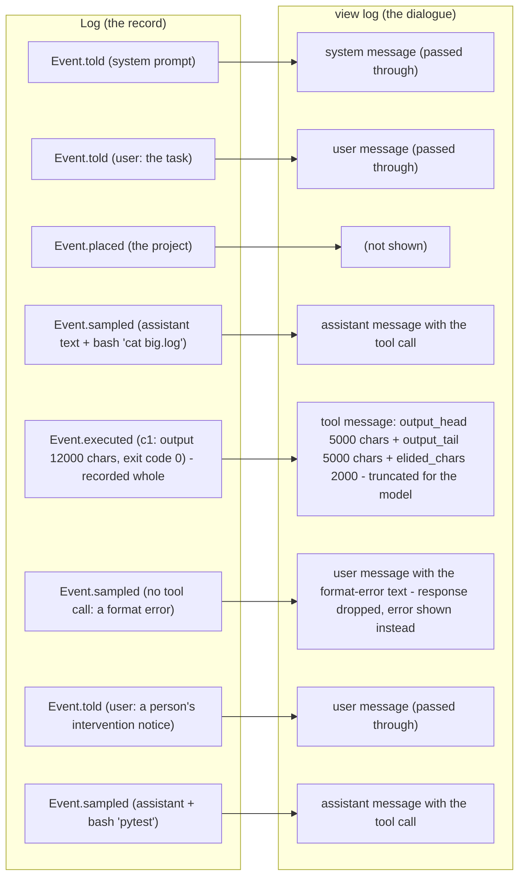
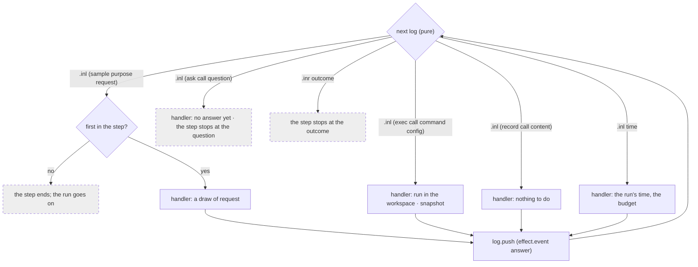

# Agent API

`Alaya.Agent` fixes the minimal assumptions about an agent that trajectory management
(`docs/trajectory-schema.md`) relies on. How the agent, the trajectory and the driver fit
together, with every data structure they share, is `docs/architecture.md`.

- the agent's history is a **log** of events: what the world placed in it unasked — messages,
  workspaces — and the world's answer to each thing the agent asked for — model responses,
  command outputs, timings of the run, a person's replies;
- what the agent asks for next is a pure function of the log alone, the agent's **next**, and
  it is an **effect** or the run's **outcome**. An effect is a description of one — sample this
  request, run this command in the workspace, time the run, ask a person — never the effect
  carried out;
- each effect has a type of **answer**, and the driver's handler gives it one: the driver
  records the answer as one event, with what identifies the effect, so the log says what the
  agent asked for as well as what came back.

An agent therefore carries out no effect: there is nothing in it to call but pure
functions, and everything impure is done by the one loop that handles its effects, the
driver's (`Driver.resume`), and recorded there. An agent is a value of the record `Agent`;
`Alaya.Agent.MiniSwe` (`docs/miniswe.md`) is one.

What follows from this:

- **Every decision can be recomputed.** The effect at log position k is `next (log.take k)`,
  and the event at k says what it answered. Nothing an agent decides depends on what the log
  does not hold — not the wall clock, not the invocation that resumed it.
- **Samples can be replayed.** A sample is a draw of a request, which the model cache keys, so a
  fork is a new draw of the same request and a replay is the same draw again.
- **The workspace is in the log.** Every command's answer names the snapshot of the workspace
  after it, so where the files are at any point is read off the log, and any state of a run can
  be checked out, compared, or continued from.

## 1. The log

The log is the record of a run: everything that was put in front of the agent, everything it
asked for, and every answer, in order and unchanged. It is flat and append-only — each state of
a trajectory appends a slice of it, and a position never changes on a branch — and its events
say what they refer to: an answer names the call it answers, and a response what it was for.

```lean
structure CallRef where
  response : Nat   -- the log position of the response that made the call
  index : Nat      -- which of its calls

inductive Event where
  | told (message : Chat.Message)               -- the agent was told: a prompt, a person's note, placed as is
  | placed (snapshot : Snapshot)                -- a workspace placed by the world: the project, a person's edit
  | sampled (request : Hash) (purpose : Purpose) (response : Chat.Response)
                                                -- answers sample: the request's digest, what it was for, the turn
  | executed (call : CallRef) (command : String) (config : Executor.Config)
      (output : Output) (snapshot : Snapshot)  -- answers exec: which call, what ran, how, what it printed, the snapshot it left
  | recorded (call : CallRef) (content : Json)     -- answers record, or ask: a call's result without the workspace
  | timed (runTimeMs : Nat) (budgetMs? : Option Nat)  -- answers time: how long the run has taken, and the invocation's time budget

abbrev Log := Array Event
```

`Snapshot` is `Hash` under the name that says what it identifies: a snapshot of a workspace
(`Alaya.Workspaces`), where `request : Hash` is a digest of something else. `Event.isAnswer` says which sort an event is: an answer to an effect, or what the world placed
unasked. An answer names its call by **position**, not by recency and not by its id. A sample taken between
a call and its answer — a summary, a check — therefore cannot hide the call, and a provider that
reuses an id for a later call cannot make one answer count for both. A reference holds nothing
the log already says: the call's id, like its name and arguments, is read off the log
(`Index.call?`, `Index.callId?`). A response's **purpose** says what was sampled:

```lean
inductive Purpose where
  | turn                    -- a model turn, whose tool calls the agent runs
  | other (name : String)   -- any other sample, by the agent's name for it: a summary, a check
```

Each event is named for what happened. A **told** event is text someone other than the model
or a tool placed in the conversation: the prompts that open a run, a notice from a person. A **placed** event is a snapshot the world placed:
the project of a root, a directory a person edited. A **sampled** event is a model's answer as it
came back, with the digest of the request it answered (`Model.requestDigest`), which says what
was asked without storing it, and its purpose. An **executed** event is a command's run: the
call it answers, the script, its timeout and
environment, the `Output`, and the snapshot it left. After a `placed` or an `executed`, the workspace is at the event's `snapshot`. A **recorded** event is a tool call's result
that no command produced: one the agent computed itself, or a person's answer to a question. A **timed** event is a reading of
how long the run has taken, and of the time budget of the invocation that read it.

*A short run as a log.*


```mermaid
flowchart LR
  E1["1 told<br/>system: You can run bash."]
  E2["2 told<br/>user: List the files."]
  E0["3 placed<br/>w0, the project"]
  E3["4 sampled<br/>Listing. + call c1: bash ls"]
  E4["5 executed c1<br/>ls → a.txt b.txt, exit 0 · w1"]
  E5["6 sampled<br/>call c2: submit"]
  E1 --> E2 --> E0 --> E3 --> E4 --> E5
```

```lean
let log : Log := #[
  .told (.system "You can run bash."),
  .told (.user "List the files."),
  .placed w0,
  .sampled d1 .turn { content? := some "Listing.", toolCalls := #[{ id := "c1", name := "bash", arguments := .mkObj [("command", "ls")] }] },
  .executed { response := 3, index := 0 } "ls" {} { output := "a.txt\nb.txt\n", exitCode? := some 0 } w1,
  .sampled d2 .turn { toolCalls := #[{ id := "c2", name := "submit", arguments := .mkObj [("message", "done")] }] }]
```

### The index

The structure of a log — its turns, each call joined to what answered it, where the workspace
is — is read off it, not stored beside it: `Log.index` reads a log in one pass into an `Index`,
which agents and readers query instead of each scanning the log its own way. Being a function
of the log, it cannot disagree with it.

```lean
structure Call where
  ref : CallRef
  call : Chat.ToolCall
  answer? : Option Nat       -- the position of the event that answered it

structure Turn where
  position : Nat             -- the response's
  response : Chat.Response
  calls : Array Call

structure Index where
  turns : Array Turn         -- the responses for Purpose.turn, oldest first
  responses : Nat            -- how many responses, of any purpose: the model calls made
  turnOf : Array Nat         -- for each event, the turn it is part of, from 1; 0 before the first
  workspace? : Option Snapshot   -- the last snapshot placed or left by a command
  workspaces : Array Snapshot    -- every snapshot named
  calls : Array Chat.ToolCall  -- every tool call made, of turns and of a person's assistant messages

let index := log.index
index.turns.size       -- 2
index.pending          -- #[c2]: the latest turn's calls nothing has answered yet
index.call? ref        -- a call, with its answer's position, by its reference
index.callId? ref      -- its id, as the model gave it: some "c1"
index.workspace?       -- some w1: where the log is
index.workspaces       -- #[w0, w1]
```

`Alaya.Agent.Log` keeps the few facts most agents want as functions of the log, each read off
the index: `responses` (the model calls made), `pending`, `calls`, `workspace?` and
`workspaces`. `Log.checkAnswers` says what is wrong with a log's answers, if anything: each
names a call made before it that nothing has answered. The trajectory
checks it whenever a state is written (`docs/architecture.md` §5.1), so a log that is read is
one whose index means what it says.

## 2. Effects

What happens next is decided by `next : Log -> Effect ⊕ Outcome`, a pure and total function of
the log: an effect to carry out, or the outcome the run ends with.

```lean
inductive Effect where
  | sample (purpose : Purpose) (request : Chat.Request)      -- draw a response to this request, for this
  | exec (call : CallRef) (command : String) (config : Executor.Config)
                                                             -- run the script for the call in the workspace, so
  | record (call : CallRef) (content : Lean.Json)            -- record a result the agent computed itself
  | time                                                     -- time the run: how long it has taken, and its budget
  | ask (call : CallRef) (question : Question)               -- ask a person and wait for a valid answer

structure Outcome where
  status : String                                            -- "Submitted", "LimitsExceeded", …
  submission : String := ""
  reason? : Option String := none                            -- why, in words: a provider's refusal
```

The sum is the type itself, with no name of its own: `.inl effect` asks for an effect and
`.inr outcome` ends the run. Each effect has a type of answer, and one event records it:

```lean
def Effect.Answer : Effect -> Type
  | .sample .. => Chat.Response
  | .exec ..   => Output × Snapshot      -- the output, and the snapshot after
  | .record .. => Unit
  | .time      => Nat × Option Nat       -- the run's time in ms, and its budget
  | .ask ..    => Lean.Json              -- a person's reply

Effect.event   : (effect : Effect) -> effect.Answer -> Event          -- how an answer is recorded
Effect.answer? : (effect : Effect) -> Event -> Option effect.Answer   -- whether an event answers the effect, and with what
```

These two functions are the only place the pairing of effects and events is written. `event`
records what identifies the effect beside its answer: a `sampled` records the purpose and the
request's digest; an `executed`, the call, script and configuration; a
`recorded`, the call (and, for `record`, the content); a `timed`, the run's time and the
budget. `answer?` reads the pairing back: a response for the same purpose whose digest is the
request's, a run of the same script, the same way, for the same call, a result recorded
for the same call, a reading.

**`sample`** carries the whole request: the messages and the tools, and its purpose. The agent
builds it, so nothing about what the model is sent is fixed by the loop — a turn of the main
dialogue, a summary of it, a check of a draft, each with its own messages and tools. Its answer
is a `sampled` with that purpose, so the index takes only the agent's turns as turns, and a
summary sampled between a call and its answer leaves the call pending. The invariant: **the response at log position k was sampled from the request of
`next (log.take k)`**, which the recorded digest lets anyone check.

**`exec`** runs a command in the workspace, where the log is (`log.workspace?`: the latest
snapshot it names), and says how it runs: its timeout, its environment, and whether it sees the
branch's earlier outputs (§3). The loop runs the script in the run's container through the
run's executor, snapshots the directory, and records `executed` with the snapshot after, as the
answer to the call the command was run for. A command that fails to run is an `Output` that
says so, not an error, so a run survives a failed command.

A run has one workspace, and it only moves forward: a command cannot name another snapshot. A
model expects files to change only when it changes them, so an agent that put its commands on
an earlier snapshot would show the model results that contradict what it did. What is changed
from outside is said: a person's `commit` places a new workspace together with a notice of what
changed (`docs/trajectory-schema.md` §3). Trying another way from an earlier point is a fork
of the trajectory, not a move within one log.

**`record`** is how an agent answers a tool call itself: `next` computes the result from the
log, and the loop records it as the call's result (`recorded`), with nothing run and no snapshot taken.
It is for tools that need no workspace — the time left (`docs/minivero.md`), a value the agent
keeps for itself.

**`time`** is how an agent learns how long its run has taken: the loop records the run's time —
its recorded steps from the root, and the current one so far — and the time budget the `resume`
was given, as a `timed` event. It is the run that is timed, not the day: the event holds no
wall-clock time, so it means the same after a resume as before. Time is an input, so it is in
the log: a decision taken from it is recomputable, and a `resume` with another budget changes
nothing that was already decided. MiniVero's `time_budget` tool times the run, then records the
seconds left from that timing.

**`ask`** is how an agent asks a person something. The trajectory records the question and stops;
the person's answer arrives later as the result recorded for the asking call, and the log continues
as if the tool had returned. A question is its text and the form of answer it asks for, and an
answer is a reply of that form:

```lean
structure Question where
  text : String
  form : Question.Form := .openEnded     -- yesNo | openEnded | singleChoice (options)

inductive Reply where
  | yes | no                             -- to a yes/no question
  | choice (number : Nat)                -- a candidate of a choice, numbered from 1
  | noneOfAbove                          -- none of a choice's candidates: an answer
  | text (text : String)                 -- to an open question, verbatim
  | unavailable                          -- the person cannot answer; fits any form

Question.validate   : Question -> Except String Unit         -- what is wrong with a question, where it is made
Question.accepts    : Question -> Reply -> Bool               -- whether a reply fits the form
Question.parseReply : Question -> String -> Except String Reply   -- the reply a person's text gives
Reply.toJson        : Reply -> Json                           -- how it is recorded, and shown to the model
Question.readReply? : Question -> Json -> Option Reply        -- a recorded value, read as the form says
```

A question is checked once, where it is made: it says something, and a choice has at least two
candidates, each saying something, no two alike, and none of them **None of the above**, which
every choice has already. The answer of `ask` is a `Reply` (`Effect.Answer`), so a recorded
result that the question's form does not accept answers nothing, and a reply state holding one
is not written. A reply is recorded as the simplest value that says it — `"yes"`, the
candidate's number, `"none_of_above"`, the person's text, or `{"status": "unavailable"}` — and
the form says which reply a recorded value is.

## 3. The agent record

```lean
structure Agent where
  config : Lean.Json                     -- its complete configuration: what a root records
  initialLog : String -> Uname -> Log    -- the opening log of a run for a task, on a machine
  next : Log -> Effect ⊕ Outcome
```

That is all an agent is. What the model is sent, which tools it is offered, what runs and how —
its timeout, its environment — are in the effects `next` gives, so nothing about them is
fixed outside the agent, and all of it is recorded. The opening log is the agent's too, frozen
into the root.

**What a reader is shown.** Only what the invariant gives: the request a response was sampled
from, `next` of the log before it (`Agent.requestAt?`), checked against the digest the response
records — so a reader shows the request exactly, or, when this build of the agent no longer
makes it, nothing. `alaya show --request` and the HTML report show, for a state that sampled, the
request its step was sent, and its size as the provider counted it; a state that sampled nothing
has no request. `Agent.request?` is `next`'s request, when it samples. `limitContext` measures
the request it is about to send (`contextTokens`), from the latest turn's recorded `usage` and an
estimate of what was added since.

**A view is the agent's own.** An agent builds its requests however it likes; MiniSwe builds
its model turns from a **view**, a pure and total function from the log to the dialogue, whose
domain is the whole log, not a single event, because "elide observations older than N turns"
needs position and "stay under a token budget" needs everything. It applies the agent's
presentation policies: a long tool output is shown truncated; a response with no valid tool call
is shown as an error message rather than as the response; an old observation may be left out to
save context.

*An example: MiniSwe's view of an eight-event log.*


```mermaid
flowchart LR
  subgraph LOG["Log (the record)"]
    direction TB
    L1["Event.told (system prompt)"]
    L2["Event.told (user: the task)"]
    L0["Event.placed (the project)"]
    L3["Event.sampled (assistant text + bash 'cat big.log')"]
    L4["Event.executed (c1: output 12000 chars, exit code 0) - recorded whole"]
    L5["Event.sampled (no tool call: a format error)"]
    L6["Event.told (user: a person's intervention notice)"]
    L7["Event.sampled (assistant + bash 'pytest')"]
  end

  subgraph VIEW["view log (the dialogue)"]
    direction TB
    V1["system message (passed through)"]
    V2["user message (passed through)"]
    V0["(not shown)"]
    V3["assistant message with the tool call"]
    V4["tool message: output_head 5000 chars + output_tail 5000 chars + elided_chars 2000 - truncated for the model"]
    V5["user message with the format-error text - response dropped, error shown instead"]
    V6["user message (passed through)"]
    V7["assistant message with the tool call"]
  end

  L1 --> V1
  L2 --> V2
  L0 --> V0
  L3 --> V3
  L4 --> V4
  L5 --> V5
  L6 --> V6
  L7 --> V7
```

**Outputs are files, for a command that asks.** A command whose configuration says `outputs`
sees the whole output of every earlier command of its branch, read-only at `/alaya/outputs`,
named by its position in the log and, when it answers a call, the call's id
(`Agent.outputFile`); one that does not sees an empty directory. The trajectory writes the files from the `executed` events before each command,
for any agent, and the setting is recorded with the command like its timeout. A view that cuts
or omits an output can name its file, and the agent reads it with a command (`docs/miniswe.md`
§9–10).

**Tools.** `Alaya.Agent.Tools` defines each tool as a `Tool` value, with no knowledge of any
agent:

```lean
structure Tool where
  definition : Chat.ToolDefinition          -- its schema for the model
  alone : Bool := false                     -- must be the only call of its turn
  instruction? : Option String := none      -- appended to the prompt
  read : Chat.ToolCall -> Except String (CallRef -> Log -> Effect ⊕ Outcome)
```

`read` gives what is wrong with a call's arguments, or how the call is answered: what to ask
for next, for the call's reference, from the log at the point it is the next call to answer.

| Tool | A call is answered by |
| --- | --- |
| `bash` | `.inl (.exec call command {})` |
| `submit` | `.inr { status := "Submitted", submission }` |
| `ask_user` | `.inl (.ask call question)` |
| `time_budget` | `.inl .time`, then, once the log's last event is the timing, `.inl (.record call secondsLeft)` |

A tool that needs an answer before it can answer its call asks for it and reads it off the log
the next time, as `time_budget` does: a tool is decided from the log alone, like the agent. An
agent holds a list of tools and owns the rest: how a response is parsed, how a malformed call
is worded, its own prompt text, which a tool only ever appends to (`docs/miniswe.md` §1).

`Alaya.Agent.Catalog` is how the command line gets an agent: each agent it can name (`mini-swe`,
`mini-vero`) has its defaults in code and reads a configuration into an `Agent` for the run's
model spec, whose sizes it may keep within. The root records both, the complete `config` and
the spec, from which every later command builds the same agent again (`docs/cli.md` §5).

## 4. Combinators

An agent is data and pure functions, so an agent can be made from another. One function makes
them all: `interpose` rewrites what `next` gives, given the log it was decided from.

```lean
def Agent.interpose (agent : Agent) (rewrite : Log -> Effect ⊕ Outcome -> Effect ⊕ Outcome) : Agent :=
  { agent with next := fun log => rewrite log (agent.next log) }

agent.limitResponses 50       -- .inr LimitsExceeded instead of a 51st sample
agent.limitContext (some n)   -- .inr ContextExceeded instead of a sample once the request holds n tokens
agent.runCommandsWith config  -- every exec runs as config says
```

`limitResponses` and `limitContext` rewrite only a `sample`, into an outcome; they compose in any
order, the outermost applied last. `runCommandsWith config` sets how every command the agent
asks for runs — its timeout and environment — whatever the tool that asked said: how commands
run is the agent's policy, not a tool's. MiniSwe is its control flow
with `((base.runCommandsWith executor).limitContext limit).limitResponses stepLimit`, so the step
limit is checked before the context, as mini checks them.

## 5. The loop

There is one loop that follows an agent, the driver's (`Driver.resume`, `Alaya.Driver`,
`docs/trajectory-schema.md` §2): ask `next`, have the **handler** answer the effect, push the
answer's event, and persist each **step** as a state. The handler is the driver's own: it
carries out one effect and gives its answer, typed by the effect (`Effect.Answer`), or nothing
when the answer comes later from outside the run, as a person's does to `ask`. It is the only
code that samples the model, runs commands, or reads the clock; the loop records
`effect.event answer` and asks again.

```lean
structure Limits where             -- what one invocation allows; neither is recorded
  budgetMs? : Option Nat := none   -- the run's time, summed from the root, after which no step starts
  steps? : Option Nat := none      -- the steps this invocation may take

inductive Stop where               -- why a resume stopped
  | outcome (outcome : Outcome) | question (question : Question) | outOfTime | outOfSteps

resume : Runtime -> Hash -> Limits -> (onStep : Hash -> Result Unit) -> Result (Hash × Stop)
```

A step samples at most once, and only
as the first thing it does: it ends before a second sample, so every sampled child of a state is
a draw of the same request. A step either goes on or stops the run, at an outcome or at a
question a person has to answer, and records which (`docs/architecture.md` §5.1). `resume` takes
steps until one stops the run or the invocation reaches a limit; its limits are checked
between steps and never inside one, since a step stopped between its tool calls would leave
calls unanswered. A step is the tree's unit; a model turn is the log's, and one model turn can
be answered over several states (`docs/architecture.md` §5.3). Tests drive an agent through the same loop, with a scripted model
and directory snapshots in place of restic.

*The loop, as `Driver.resume` carries out a step.*


```mermaid
flowchart TD
  NEXT{"next log (pure)"}

  NEXT -->|".inl (sample purpose request)"| S0{"first in the step?"}
  S0 -->|no| END["the step ends; the run goes on"]
  S0 -->|yes| S2["handler: a draw of request"]
  S2 --> PUSH

  NEXT -->|".inl (exec call command config)"| A1["handler: run in the workspace · snapshot"]
  A1 --> PUSH

  NEXT -->|".inl (record call content)"| O1["handler: nothing to do"]
  O1 --> PUSH

  NEXT -->|".inl time"| C1["handler: the run's time, the budget"]
  C1 --> PUSH

  PUSH["log.push (effect.event answer)"] --> NEXT

  NEXT -->|".inl (ask call question)"| SU["handler: no answer yet · the step stops at the question"]
  NEXT -->|".inr outcome"| DO["the step stops at the outcome"]

  classDef terminal fill:#eee,stroke-dasharray: 5 5
  class SU,DO,END terminal
```
