# Agent API

Agent runs must survive crashes and remain available for analysis, so Alaya separates deciding
from acting, in three parts. The **computation** is a value that says what to ask the world for
next. The **log** is the flat, append-only list of what happened in a
run. The **driver** replays the computation against the log to find what it asks next, carries that
out, and appends the answer.

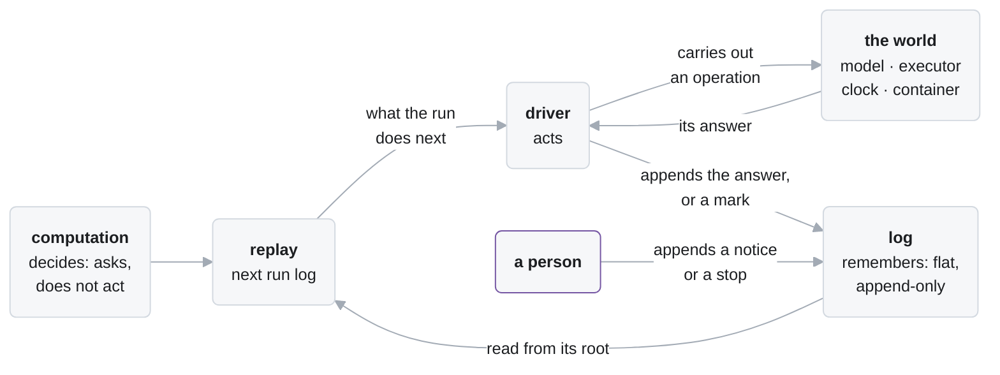
```mermaid
%%{init: {"theme": "base", "themeVariables": {"fontFamily": "BlinkMacSystemFont, Segoe UI, Helvetica, Arial", "fontSize": "13px", "primaryColor": "#f6f7f9", "primaryTextColor": "#1c1e21", "primaryBorderColor": "#d3d9e0", "lineColor": "#a3abb5", "textColor": "#6f7985", "edgeLabelBackground": "#ffffff", "clusterBkg": "#fafbfc", "clusterBorder": "#e3e6ea"}}}%%
flowchart LR
  classDef notice stroke:#7556a3

  computation("<b>computation</b><br/>decides: asks,<br/>does not act")
  log("<b>log</b><br/>remembers: flat,<br/>append-only")
  replay("<b>replay</b><br/>next run log")
  driver("<b>driver</b><br/>acts")
  world("<b>the world</b><br/>model · executor<br/>clock · container")
  person("<b>a person</b>"):::notice

  computation --> replay
  log -- "read from its root" --> replay
  replay -- "what the run<br/>does next" --> driver
  driver -- "carries out<br/>an operation" --> world
  world -- "its answer" --> driver
  driver -- "appends the answer,<br/>or a mark" --> log
  person -- "appends a notice<br/>or a stop" --> log
  linkStyle default stroke-width:1px
```

| § | What | Where |
| --- | --- | --- |
| 1 | a **computation**: a tree of what it asks for | `Alaya.Computation` |
| 2 | the **log** and its **events** | `Alaya.Computation` |
| 3 | what each construct of a computation writes in the log | `Alaya.Replay`, `Alaya.Agent` |
| 4 | **replay**: from the log back to the computation | `Alaya.Replay` |
| 5 | **routines** and **scopes**: how a computation is structured | `Alaya.Computation` |
| 6 | **tools**: routines a model can call | `Alaya.Agents.Tools` |
| 7 | `ask_user`: a model asks a person | `Alaya.Agents.Tools` |
| 8 | an **agent**: a program and its routines | `Alaya.Agents.*` |
| 9 | a **run**: a workspace, and the programs called on it | `Alaya.Run` |
| 10 | **driving** a run: the driver's own API | `Alaya.Driver` |

`docs/log-schema.md` specifies how a log is stored; `docs/cli.md` is the command line.

## 1. A computation

```lean
inductive Computation (σ : Signature) : Type → Type 1 where              -- Alaya.Computation
  | pure    : α → Computation σ α                                          -- a leaf: a value
  | fail    : String → Computation σ α                                     -- a leaf: a failure
  | perform : (op : σ.Op) → (Except String (σ.Answer op) → Computation σ α) →
              Computation σ α
  -- the other constructors (inbox, ask, call, iter, comment) are omitted here; see §3

abbrev Agent : Signature            -- Alaya.Agent: its operations are sample, exec, time
```

A computation of Alaya has the type `Computation Agent α`: it asks for operations of the signature
`Agent`, and ends with an `α`. It is represented as a tree whose leaves are values or failures,
and whose inner nodes are requests, with a subtree for each possible answer. This representation
is known as the free monad (Hancock and Setzer 2000; Kiselyov and Ishii 2015).

```lean
def fix : Computation Agent String := do
  let response ← sample model request
  match response.content? with
  | none => return "nothing to do"
  | some command =>
    let ran ← exec command
    if ran.output.exitCode? == some 0 then
      return "fixed"
    else
      throw "the command failed"
```

*The computation `fix` as a tree: an operation is a node, and each answer leads to the rest of the
computation.*

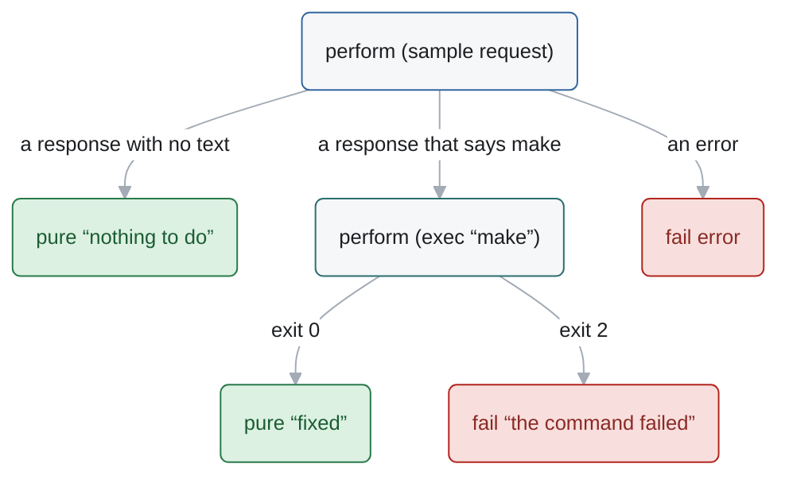
```mermaid
%%{init: {"theme": "base", "themeVariables": {"fontFamily": "BlinkMacSystemFont, Segoe UI, Helvetica, Arial", "fontSize": "13px", "primaryColor": "#f6f7f9", "primaryTextColor": "#1c1e21", "primaryBorderColor": "#d3d9e0", "lineColor": "#a3abb5", "textColor": "#6f7985", "edgeLabelBackground": "#ffffff", "clusterBkg": "#fafbfc", "clusterBorder": "#e3e6ea"}}}%%
flowchart TD
  classDef sample stroke:#3567a0
  classDef exec stroke:#2b6f6f
  classDef ok fill:#dcf1e2,stroke:#2a7a4b,color:#1c5c33
  classDef bad fill:#f8dfdd,stroke:#b3261e,color:#8a2a25

  asked("perform (sample request)"):::sample
  asked -- "a response with no text" --> nothing("pure “nothing to do”"):::ok
  asked -- "a response that says make" --> ran("perform (exec “make”)"):::exec
  asked -- "an error" --> errored("fail error"):::bad
  ran -- "exit 0" --> fixed("pure “fixed”"):::ok
  ran -- "exit 2" --> broken("fail “the command failed”"):::bad
  linkStyle default stroke-width:1px
```

A computation is written in `do` notation, from eight constructs:

| Written | Asks for | Goes on with |
| --- | --- | --- |
| `return a` | nothing: it ends with `a` | |
| `throw error` | nothing: it gives up | |
| `sample`, `exec`, `time` | an operation of the world | its answer |
| `inbox`, `await` | the notices that arrived from outside | those it takes |
| `ask question` | a person's answer to a question | the reply |
| `call name arguments` | a routine, by its name | the routine's result |
| `iter step state` | a loop from `state` | the result of its last round |
| `comment text` | a line in the log, for a reader | nothing |

`try … catch` catches a failure, and `retry n c` tries a computation `c` again while it fails.

## 2. The log

```lean
inductive Event (σ : Signature) where
  | arrived   (notice : Notice)                              -- from outside
  | heard     (frame : Frame) (notices : Array Nat)          -- a read of the inbox
  | asked     (frame : Frame) (question : Question)          -- a question for a person
  | answered  (frame : Frame) (key : σ.Key) (answer : Except String σ.Stored)
  | opened    (frame : Frame) (call : RoutineCall)           -- a call begins
  | returned  (frame : Frame) (value : Json)                 -- … and ends with its value
  | failed    (frame : Frame) (error : String)               -- … or with its failure
  | stopped   (reason : String)                              -- from outside: the agent ends
  | commented (text : String)                                -- for a reader only

abbrev Log (σ : Signature) := Array (Event σ)
```

A log is an array of events, and an event's **position** is its index. There are four kinds of
event:

| Kind | Events | Appended |
| --- | --- | --- |
| from outside | `arrived`, `stopped` | by a person, at any time; it has no frame |
| answer | `answered` | by the driver, after it carried out an operation |
| mark | `heard`, `asked`, `opened`, `returned`, `failed` | by the driver, where the computation did something that needs no world |
| comment | `commented` | by the driver, for the computation, or by a person; it has no frame |

Marks make the log readable without the computation: who read which notice, where each call began
and how it ended.

A **notice** is what arrives from outside:

```lean
inductive Notice where
  | said     (message : String)                       -- a person's message
  | changed  (workspace : Snapshot) (summary : String)   -- the workspace, changed from outside
  | replied  (to : Frame) (reply : Reply)             -- an answer to the question asked in frame `to`
  | called   (call : RoutineCall)                     -- a program the run is to call
```

A **frame** says which call of a routine (`call name arguments`, §3.3) an event happened in. It
lists, from the outermost call inward, each call by the routine's name and by how many calls of
that name its caller made before it. `#[]` is the run itself, `mini-swe` the agent it calls, and
`mini-swe/bash#2` the agent's third call of `bash`. It is written so, and `-` where there is none.

A frame keeps its identity when a program changes around it: a call of one routine does not
move the calls of another. An agent that comes to call `subagent` first still has its first
`bash` in `mini-swe/bash`.

*The log of the agent below.*

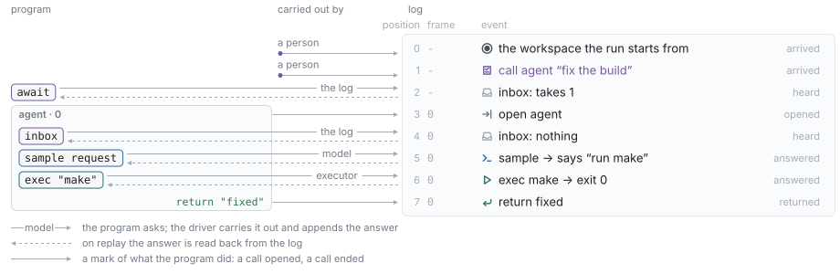

```lean
def agent (task : String) : Computation Agent Json := do
  let _ ← inbox                                             -- 4: read what a person said
  let response ← sample model (request task …)              -- 5
  let ran ← exec "make"                                     -- 6
  return "fixed"                                            -- 7
```

Every log begins the same way. Position 0 is the **root**, `arrived (changed …)`: the
**workspace**, the filesystem directory the agent works in, as the run starts. Position 1 is a
person's call of the agent, a notice; position 2 the run's read of it, and position 3 the
opening of the agent's call (§9).

## 3. What each construct writes

As the driver runs a computation, it appends to the log what happened at each construct it reaches:
the answer the world gave to an operation, or a mark of what the computation did there.

### 3.1 Operations

```lean
sample   : Models.Spec → Chat.Request → Computation Agent Chat.Response
exec     : String → Executor.Config → Computation Agent Execution  -- the config defaults to {}
time     : Computation Agent Timing
```

1. The computation reaches an operation. It stops there: it has asked.
2. The driver carries the operation out.
3. The driver appends `answered frame key answer`: the frame that asked, the operation's key,
   and what the world gave.
4. The computation goes on with the answer. On every later replay the answer is read from the log:
   an operation whose answer is logged is not carried out again.

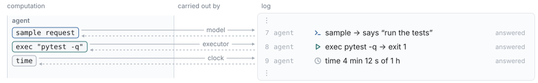

| Operation | Carried out by | Answer |
| --- | --- | --- |
| `sample model request` | the model it names, by its spec | `Chat.Response` |
| `exec command config` | the executor: `command` in the container of the call it is made in, on the workspace, with `config`'s timeout and environment, and its stderr merged into its stdout unless `config.merge` is off | `Execution`: the output, the version of the workspace it left, and with `config.outputs` the file that holds the whole output |
| `time` | the driver: the run's time summed along its log | `Timing`: the time spent, and the budget of this invocation |

A command that exits with an error, or runs out of time, is still an answer: its status is in
the output. Only an answer the world could not give is a failure (§3.4).

The log records every version of the workspace, by the name of its snapshot. A command runs on
the version of the workspace the log has reached, and its answer names the version it left. A
person's change is a notice that names a version too. So the workspace at any point of a run is
the last version a command or a change left before it, and that point can be checked out,
compared, or continued.

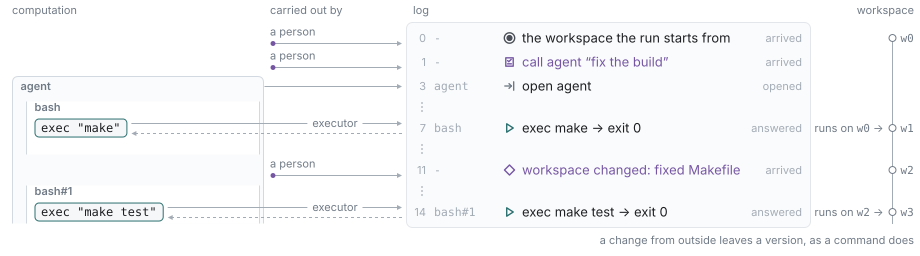

### 3.2 Notices: `inbox` and `await`

`inbox` and `await` receive notices from outside: `inbox` takes whatever has arrived, possibly
nothing, and `await` waits until the notices it is for arrive.

```lean
inbox : Computation σ (List Notice)                                   -- take what has arrived
await : (Frame → Notice → Bool) → Computation σ (List Notice)     -- wait for the notices it is for
```

1. A person appends a notice: `arrived notice`. No one has read it yet.
2. `inbox` takes every notice not yet read that is addressed to no one: what a person said or
   changed. The driver marks the read, `heard frame positions`, with the positions of what it
   took, which may be none.
3. `await accepts` takes the unread notices that `accepts frame notice` holds for. When none has
   arrived, the read is not made: the run **waits**, and the driver stops. Once one arrives, the
   read is made and marked like any other.
4. A `replied` and a `called` notice are **addressed**: to the call that asked, and to the
   run. Only an `await` for them takes them; a plain `inbox` leaves them.

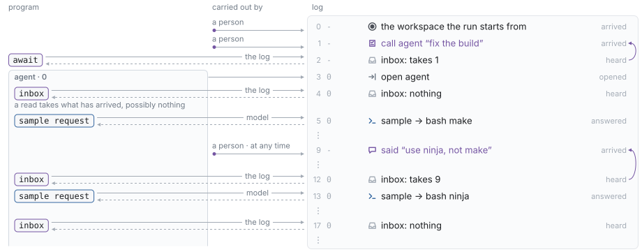

A notice is read once, by one read, and the mark says by which. The root is not a notice for
the agent: no read takes it.

### 3.3 Calls

`call` runs a routine, a named computation (§5), in a frame of its own, and gives back its result.

```lean
call : (name : String) → (arguments : Json) → Computation σ Json
```

1. The computation calls a routine by its name. The driver marks the call,
   `opened child ⟨name, arguments⟩`. The **child frame** is the caller's frame and a step for
   the call: the routine's name, and how many calls of it the caller made before, as in
   `mini-swe/bash`, then `mini-swe/bash#1`.
2. The routine the caller's scope has under that name (§5) runs in the child frame: its
   operations are performed there, and its own calls open frames nested in it.
3. The routine ends, and the driver marks how: `returned child value`, or `failed child error`.
4. The caller goes on with the value. A failure is the caller's too, unless it catches it.

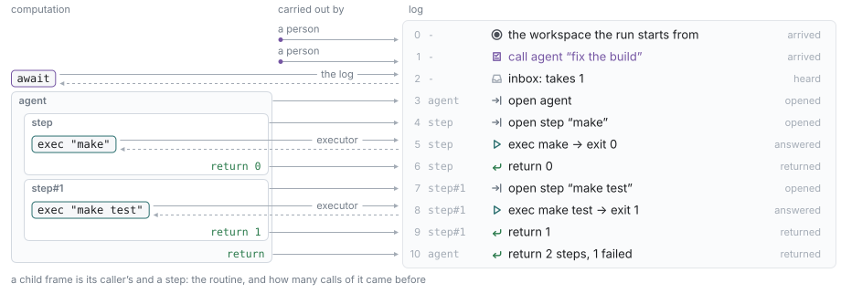

Because a call names its routine instead of holding its body, the log records it in full. Every
routine is entered through a call, so a call and the calls nested in it occupy one contiguous
stretch of the log, between its opening and its end, apart from notices that arrive meanwhile.
This flat encoding of nested scopes follows scoped operations (Wu, Schrijvers and Hinze 2014;
Piróg et al. 2018). A call of a name with no routine fails in its new frame, with
`no routine named …`.

### 3.4 Failures

- `throw error` gives up, up to the nearest `try … catch` in the same frame, or to the end of
  the frame.
- An operation whose answer is an error fails where it was performed. Currently, the only such
  answer is a model's refusal of a request as too long for its context. Any other trouble with
  the world — a provider that cannot be reached, a container that cannot be started, a full disk
  — is not an answer: the driver stops, nothing is logged, and the next `alaya resume` asks again.
- A failure that reaches the end of its frame is marked, `failed frame error`, and becomes the
  failure of the call.
- `try … catch` leaves no mark. Nothing is rolled back: what a failed routine did stays in the
  log.

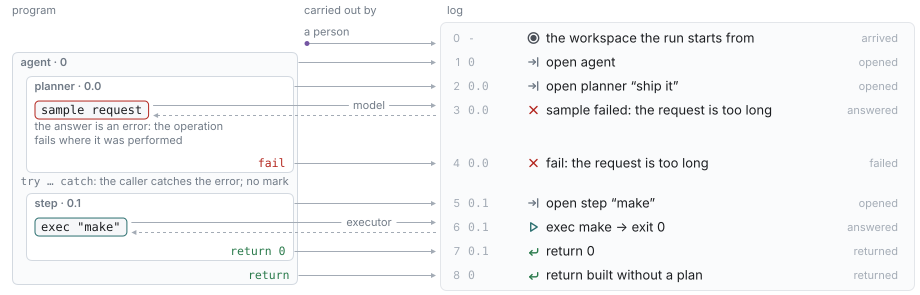

`retry n c` tries `c` again while it fails, `n` times more; every try is in the log.

### 3.5 Loops

```lean
iter : (S → Computation σ (S ⊕ α)) → S → Computation σ α
```

1. `iter step state` runs `step state`: one **round**.
2. A round that gives `.inl state'` is followed by a round from `state'`; one that gives
   `.inr result` ends the loop with `result`.
3. The loop writes nothing of its own. The log holds the events of its rounds, one after
   another.

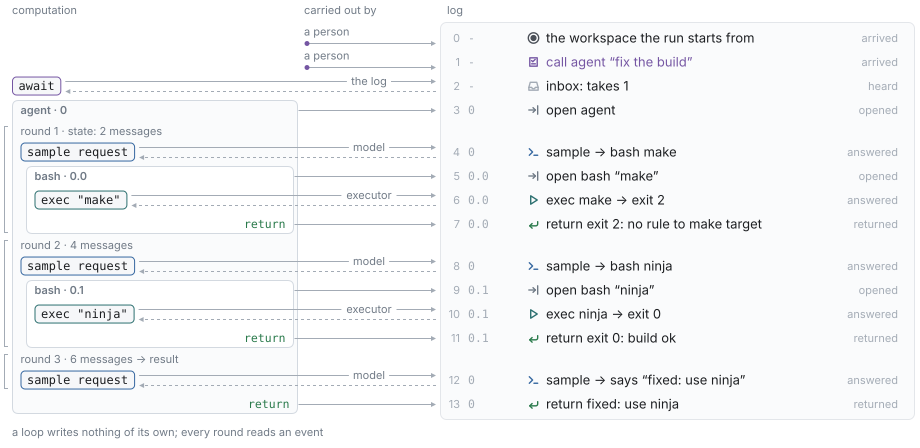

A loop carries its state as an ordinary value, such as the conversation so far or a turn
counter, from which each round computes its request and checks limits on turns or context size.

Every round must read an event: an operation, a read of the inbox, or a call. A loop that goes
round without one is `unguarded`, a broken run. This is what makes replay of a finite log end.
A loop as a constructor whose every round performs is from Hancock and Setzer (2000); `iter`
itself is the loop of interaction trees (Xia et al. 2020).

### 3.6 Comments

```lean
comment : String → Computation σ Unit
```

A comment is a line for whoever reads the log, `commented text`, shown as `# text` by `alaya log`
and the report. A computation writes one with `comment`, and a person with `alaya comment`; the two
are the same event.

Replay passes over every comment: those in the log, and those the computation makes. A comment of
the computation matters only at the end of the log, where the driver writes it before the next event
it appends. So comments can be added to an agent, reworded or removed, and every existing log is
still a log of that agent. `alaya rebase` writes an agent's new comments into a copy of an
existing log. A comment does not guard a loop.

### 3.7 Stops

A stop is not a construct of a computation. It comes from outside, `stopped reason`, appended by
`alaya stop` where a call runs.

1. Every frame of the call ends there, whatever the nesting, with no marks.
2. Nothing in the call can catch it.
3. The run goes on to wait for its next call (§9).

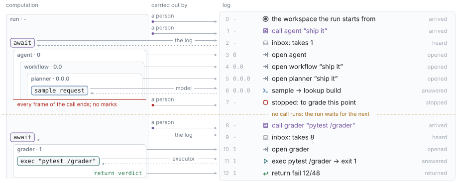

### 3.8 Questions: `ask`

```lean
ask : Question → Computation σ Reply

structure Question where
  text : String
  form : Question.Form := .openEnded

inductive Question.Form where
  | yesNo
  | openEnded
  | singleChoice (options : Array String)     -- exactly one of the candidates, or none of them

inductive Reply where
  | yes
  | no
  | choice (number : Nat)                     -- the candidate chosen, numbered from 1
  | noneOfAbove
  | text (text : String)                      -- an answer in the person's own words
  | unavailable                               -- the person cannot answer
```

1. The computation reaches `ask question`. A question that cannot be asked — a blank one, or a
   choice with fewer than two distinct candidates — fails there.
2. The driver marks it, `asked frame question`. So the question is in the log, whoever asks it.
3. The run waits for a reply to that frame that fits the question, and the driver stops.
4. A person replies: `arrived (replied frame reply)`. A reply where no question waits, or one
   that does not fit, is refused before it is appended.
5. The read is marked like any other, and the computation goes on with the reply.

There are three kinds of question and six kinds of reply:

| Kind of question | A reply that fits |
| --- | --- |
| `yes_no` | `yes`, `no` |
| `single_choice` | `choice n`, with `n` from 1; `noneOfAbove`: no candidate is right |
| `open_ended` | `text`, not blank, kept verbatim |
| any | `unavailable`: the person cannot answer |

Any computation may ask: a tool a model calls (§7), or a step of a workflow that wants a person's
word before it goes on.

```lean
def deploy : Routine.Typed Agent String Bool := routine "deploy" fun target => do
  let reply ← ask { text := s!"Deploy to {target}?", form := .yesNo }
  if reply != .yes then return false
  return (← exec s!"make deploy TARGET={target}").output.exitCode? == some 0
```

```lean
questionOf? : Next Agent → Option (Frame × Question)        -- the question a run waits on
replyTo     : Next Agent → Reply → Except String (Event Agent)   -- the reply as an event, or why not
```

## 4. Replay: from the log back to the computation

```lean
next : Routine σ → Log σ → Next σ      -- what a run of the routine does after a log
```

The driver keeps nothing of a computation between two events. It calls `next`, which
**replays** the run's routine against the log from its root. Running a computation again from
the start with its recorded answers, in place of saving where it had got to, is how durable
workflows survive a crash (Koppel, Scherer and Solar-Lezama 2018; Burckhardt et al. 2021):

- an `answered` event is given to the computation as the answer of the operation it asks for there;
- a mark is checked against the mark the computation makes there;
- an `arrived` notice is set aside until a read takes it.

At the end of the log, replay reaches a construct the log does not yet record. `next` returns
it, and the driver acts on it as follows:

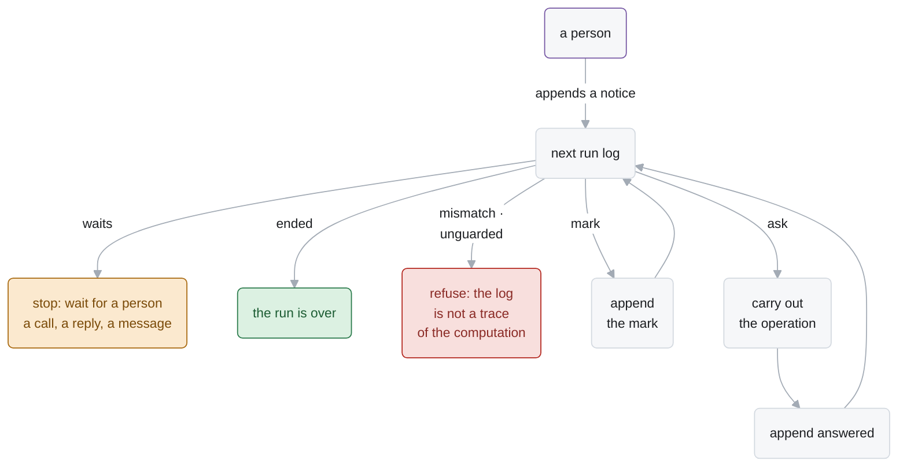
```mermaid
%%{init: {"theme": "base", "themeVariables": {"fontFamily": "BlinkMacSystemFont, Segoe UI, Helvetica, Arial", "fontSize": "13px", "primaryColor": "#f6f7f9", "primaryTextColor": "#1c1e21", "primaryBorderColor": "#d3d9e0", "lineColor": "#a3abb5", "textColor": "#6f7985", "edgeLabelBackground": "#ffffff", "clusterBkg": "#fafbfc", "clusterBorder": "#e3e6ea"}}}%%
flowchart TD
  classDef notice stroke:#7556a3
  classDef ok fill:#dcf1e2,stroke:#2a7a4b,color:#1c5c33
  classDef bad fill:#f8dfdd,stroke:#b3261e,color:#8a2a25
  classDef wait fill:#fbe9cf,stroke:#a8690f,color:#7a4a08

  person("a person"):::notice -- "appends a notice" --> next("next run log")
  next -- "waits" --> waits("stop: wait for a person<br/>a call, a reply, a message"):::wait
  next -- "ended" --> over("the run is over"):::ok
  next -- "mismatch ·<br/>unguarded" --> refuse("refuse: the log<br/>is not a trace<br/>of the computation"):::bad
  next -- "mark" --> mark("append<br/>the mark")
  mark --> next
  next -- "ask" --> act("carry out<br/>the operation") --> answered("append answered")
  answered --> next
  linkStyle default stroke-width:1px
```

| `Next` | What the log says |
| --- | --- |
| `ask request` | it ends where the computation asks for an operation, which the world answers |
| `mark event` | it ends where the computation makes a mark: `heard`, `asked`, `opened`, `returned` or `failed`, which is appended as it is |
| `waits frame question?` | it ends where a read waits, and nothing the read is for has arrived; with the question, when it waits for a reply |
| `ended result` | it is complete: the run is over, with its value or its failure |
| `mismatch position` | its event at `position` is not what the computation does |
| `unguarded frame` | the computation went round a loop without reading an event |

Three rules make a computation one that can be replayed:

- **It is a function of its answers.** What it asks next is computed from what came back
  before: earlier answers, notices, and the run's configuration, all of which are in the log. It
  reads no clock and no file of its own.
- **Every round of a loop reads an event** (§3.5).
- **What comes from outside comes through the inbox** (§3.2).

A log is matched by position, so a computation changed after a log was written reads that log only
up to its first changed operation; after it the log is a `mismatch`, which the driver refuses
to go on from. Comments are the exception (§3.6). `alaya rebase` copies the prefix that holds
into a data directory of its own, as the changed computation makes it (`docs/cli.md`).

## 5. Routines and scopes

A **routine** is a computation from its arguments to its result, both JSON, under a name, with
a scope: the routines it can call. It is the one way to structure an agent: a tool, a step
of a workflow, a sub-agent and the agent itself are routines, and each runs in a frame of its
own (§3.3). A **scope** is a set of routines, by name. The run itself is a routine, whose
computation runs in frame `#[]`, entered by no call (§9).

```lean
structure Routine σ where
  name  : String
  body  : Json → Computation σ Json            -- from the arguments to the result
  scope : Scope σ                              -- the routines it can call

structure Scope σ where
  find : String → Option (Routine σ)

Scope.of  : Array (Routine σ) → Scope σ                    -- these routines
Scope.fix : (Scope σ → Array (Routine σ)) → Scope σ        -- routines that see each other

structure Routine.Typed σ α β where            -- a routine as Lean code calls it
  name : String
  body : Json → Computation σ Json
  call : α → Computation σ β                   -- the call, typed

routine : String → (α → Computation σ β) → Routine.Typed σ α β   -- α and β to and from JSON
Routine.Typed.within : Routine.Typed σ α β → Scope σ → Routine σ
```

1. **Declare it** with `routine name body`. The body takes a typed argument and gives a typed
   result.
2. **Give it its scope** with `within`. Routines defined together take theirs from `Scope.fix`.
3. **Call it** with `r.call argument`, from a routine of that scope. A routine a model names is
   called by that name: `call name arguments` (§6).

**How a call finds its routine.** Every frame runs the body of one routine: the run's own frame
runs the run's routine, and every other frame runs the routine whose call opened it. When a body
performs `call name arguments`, the name is looked up in the scope of the routine whose body
that is. The routine found runs in a new frame. The calls its body makes are looked up in the
found routine's own scope, not in the caller's.

So the routines a call can reach depend only on the routine the call is written in. They do not
depend on who called that routine, or from where. This is lexical scoping: a routine carries
its scope as a closure carries its environment. In Alaya's own run:

| Routine | Its scope: the routines it can call |
| --- | --- |
| `session`, the run's routine | `mini-swe`, `mini-vero`, `grader`: the catalog |
| `mini-swe` | `bash`, `ask_user`, `time_budget`, and `mini-swe` itself |
| `bash`, `ask_user`, `time_budget` | none |
| `grader` | `grader` itself, which it never calls |

A call of `bash` made by `mini-swe` finds `bash` in `mini-swe`'s scope. The same call made by the
run finds nothing, since the catalog has no `bash`, and fails with `no routine named bash`. A
call of `grader` made by `mini-swe` fails the same way, so an agent cannot reach the grader.

A scope is fixed when its routines are defined, so it holds no per-call data. What varies from
call to call, such as an agent's configuration or a command's timeout, is in the call's
arguments, and so is in the log.

**Building a scope.** `Scope.of routines` is a scope of routines that already have their own
scopes; the catalog is built this way. Routines that call each other need more. Each must have,
as its own scope, the scope that contains all of them, and that scope exists only once they do.
`Scope.fix make` resolves the circle, as `letrec` does. `make` receives the scope being built and
returns the routines, each given that scope; the result contains them all. This is how
`mini-swe`'s scope contains `mini-swe` itself, so that `subagent` can call it, and how the steps
of a workflow call one another.

The argument and the result cross the call as JSON, because that is how the log holds them: the
argument on the opening, the result on the end. Each side reads what it is given, and fails in
its own frame when it cannot.

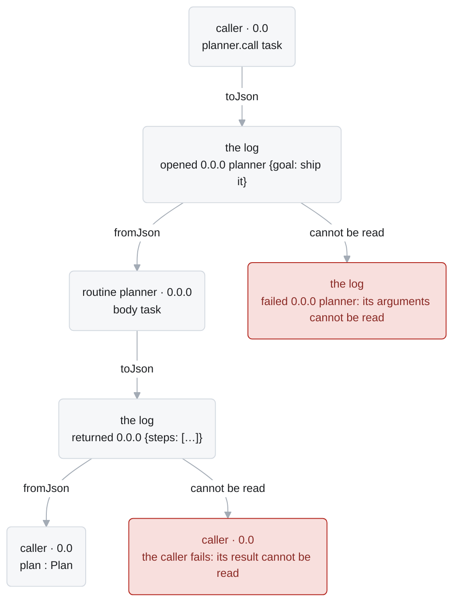
```mermaid
%%{init: {"theme": "base", "themeVariables": {"fontFamily": "BlinkMacSystemFont, Segoe UI, Helvetica, Arial", "fontSize": "13px", "primaryColor": "#f6f7f9", "primaryTextColor": "#1c1e21", "primaryBorderColor": "#d3d9e0", "lineColor": "#a3abb5", "textColor": "#6f7985", "edgeLabelBackground": "#ffffff", "clusterBkg": "#fafbfc", "clusterBorder": "#e3e6ea"}}}%%
flowchart TD
  classDef bad fill:#f8dfdd,stroke:#b3261e,color:#8a2a25

  asks("caller · 0.0<br/>planner.call task")
  opened("the log<br/>opened 0.0.0 planner {goal: ship it}")
  body("routine planner · 0.0.0<br/>body task")
  returned("the log<br/>returned 0.0.0 {steps: […]}")
  plan("caller · 0.0<br/>plan : Plan")
  failed("the log<br/>failed 0.0.0 planner: its arguments cannot be read"):::bad
  unread("caller · 0.0<br/>the caller fails: its result cannot be read"):::bad

  asks -- "toJson" --> opened
  opened -- "fromJson" --> body
  opened -- "cannot be read" --> failed
  body -- "toJson" --> returned
  returned -- "fromJson" --> plan
  returned -- "cannot be read" --> unread
  linkStyle default stroke-width:1px
```

An agent of several parts is routines calling routines:

```lean
structure Task where
  goal : String
  deriving ToJson, FromJson

structure Plan where
  steps : Array String
  deriving ToJson, FromJson

/-- The model the planner samples. -/
def model : Models.Spec := …

/-- One round of the planner's conversation: a sample, then the tools the model called. -/
def planRound (messages : Array Chat.Message) :
    Computation Agent (Array Chat.Message ⊕ String) := do
  let response ← sample model { messages, tools := #[lookupDefinition] }
  if response.toolCalls.isEmpty then
    return .inr (response.content?.getD "")
  let mut messages := messages.push response.message
  for asked in response.toolCalls do
    -- the model's tool call is a call of a routine
    let result ←
      try call asked.name asked.arguments
      catch error => pure (.str s!"error: {error}")
    messages := messages.push (.tool asked.id result)
  return .inl messages

/-- A sub-agent: a conversation of its own, with the tool it offers its model. -/
def planner : Routine.Typed Agent Task Plan := routine "planner" fun task => do
  let opening := #[.system "You plan.", .user task.goal]
  let answer ← iter planRound opening
  return { steps := (answer.splitOn "\n").toArray }

/-- A step of the workflow: one command, and its exit status. -/
def step : Routine.Typed Agent String Nat := routine "step" fun command => do
  let ran ← exec command
  return (ran.output.exitCode?.map (·.toNat)).getD 1

/-- The workflow: a plan from the planner, then each of its steps. -/
def workflow : Routine.Typed Agent Task String := routine "workflow" fun task => do
  let plan ← planner.call task
  let mut failed := 0
  for command in plan.steps do
    if (← step.call command) != 0 then
      failed := failed + 1
  return s!"{plan.steps.size} steps, {failed} failed"

/-- The agent: it waits for its task, and runs the workflow on it. -/
def agent : Computation Agent Json := do
  let notices ← await fun _ notice => notice matches .said _
  let goal := match notices with
    | .said goal :: _ => goal
    | _ => ""
  return toJson (← workflow.call { goal })

def scope := Scope.fix fun scope =>
  #[lookup.within scope, planner.within scope, step.within scope, workflow.within scope]
```

*The calls made when this agent runs, as a tree of frames.*

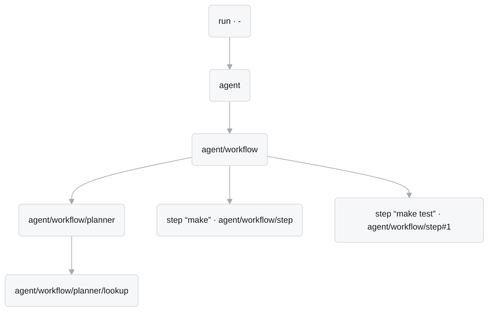
```mermaid
%%{init: {"theme": "base", "themeVariables": {"fontFamily": "BlinkMacSystemFont, Segoe UI, Helvetica, Arial", "fontSize": "13px", "primaryColor": "#f6f7f9", "primaryTextColor": "#1c1e21", "primaryBorderColor": "#d3d9e0", "lineColor": "#a3abb5", "textColor": "#6f7985", "edgeLabelBackground": "#ffffff", "clusterBkg": "#fafbfc", "clusterBorder": "#e3e6ea"}}}%%
flowchart TD
  run("run · -") --> agent("agent") --> workflow("agent/workflow")
  workflow --> planner("agent/workflow/planner")
  workflow --> make("step “make” · agent/workflow/step")
  workflow --> test("step “make test” · agent/workflow/step#1")
  planner --> lookup("agent/workflow/planner/lookup")
  linkStyle default stroke-width:1px
```

*Its log (`Test/Routines.lean`): the same tree, flat. Each frame is one stretch of rows, from
its opening to its return.*

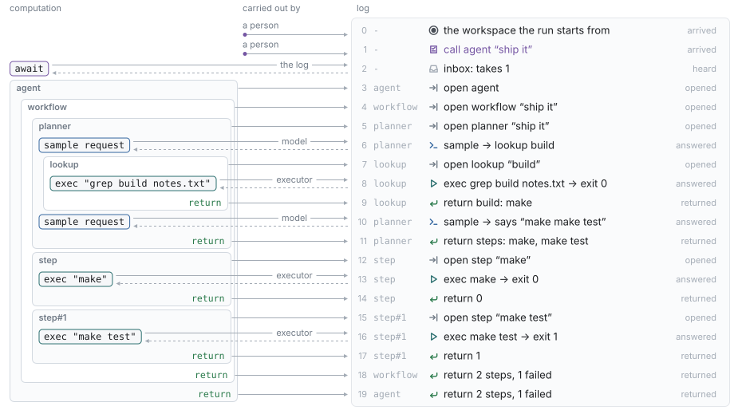

Every sample names its model; an agent takes it from its configuration. A helper that is not a
routine, such as `planRound`, runs in its caller's frame and leaves no call in the log.

## 6. Tools

A **tool** is what a model needs to call it, and the routine call its arguments make:

```lean
structure Tool where
  definition   : Chat.ToolDefinition              -- its name, description and schema, for a model
  alone        : Bool := false                    -- must be the only call of its turn
  instruction? : Option String := none            -- appended to the prompt
  check        : Json → Except String Unit        -- what is wrong with a call's arguments
  call         : Json → RoutineCall               -- the call the model's arguments make

Tools.routines : Array (Routine Agent)            -- bash, ask_user, time_budget
```

A tool is parameterized by what the agent's configuration says of it, as `ask_user` is by the
kinds of question: `bash` by how a command runs, which its call adds to the model's arguments;
`subagent` by the agent itself, its name and its configuration, which its call names with the
model's task. The routines are fixed, so all of it is in the call's arguments, in the log.

A model's tool call becomes a call of a routine in four steps:

1. The agent samples a request that offers the tools' `definition`s.
2. The response names tools and gives arguments. The agent checks each call with the tool's
   `check`; a call that is wrong is answered with a format error and is not made.
3. The agent makes each tool's call of the model's arguments, `tool.call asked.arguments`. The
   routine runs in a frame of its own.
4. The agent puts each result in the next request, as a tool message. A tool that failed gives
   its error as its result.

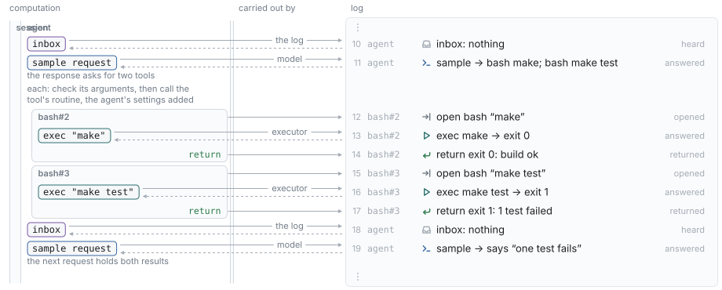

| Tool | Arguments | Its call | Result |
| --- | --- | --- | --- |
| `bash` | `command` | `bash`: `exec command`, with the executor settings the agent adds | `output`, `exit_code`, `error`, `file` |
| `time_budget` | none | `time_budget`: `time` | `seconds_left`, or that the run has no limit |
| `ask_user` | `question_type`, `question`, `options` | `ask_user`: `ask` the question (§7) | the reply |
| `submit` | `message` | none: the agent that offers it ends with the message | |
| `subagent` | `task` | the agent itself, `mini-swe` or `mini-vero`, with its configuration and the model's task | the sub-agent's outcome |

`Agents.Tools.all` lists the tools an agent's configuration can name. A tool is independent of
the agent that offers it: the agent chooses which tools to offer, how to report a malformed
call, and how to show a result to its model.

## 7. `ask_user`: a model asks a person

`ask_user` lets a model ask a person a question, through `ask` (§3.8). Questions and replies are
defined by the core; the tool only adapts them to a model:

| | The core: a question | The tool: `ask_user` |
| --- | --- | --- |
| owns | the three kinds, the replies that fit each, the wait, the checks on a reply | its name, its schema, its instruction, the rule that it is called alone |
| decides | whether a reply answers a question | which kinds of question the model may ask |
| translates | nothing | a call's arguments into a question, and a reply into what the model is shown |

1. **The kinds are chosen in advance.** The agent's `question_types` names the kinds of
   question the model may ask. There is no default: offering `ask_user` without it is an error.

   ```sh
   --set 'tools=["bash","submit","ask_user"]' --set 'question_types=["yes_no","single_choice"]'
   ```

2. **The model is offered exactly those.** The tool's schema, description and instruction name
   only the kinds allowed, and `options` is there only when a choice is among them.
3. **The model asks.** It calls `ask_user`, alone in its turn:

   ```json
   {"question_type": "single_choice",
    "question": "Should the function keep duplicate elements? The prose does not say.",
    "options": ["Keep them, in order.", "Drop them."]}
   ```

4. **The call is checked.** A kind that is not allowed, a blank question, options on a question
   that is not a choice, or a candidate that says "none of the above" is a format error, and
   nothing is asked.
5. **The tool asks.** Its routine reads the question from the arguments and performs `ask`: the
   question is marked in the log, and the run waits (§3.8).
6. **A person replies**, with `alaya reply` (`docs/cli.md`).
7. **The model is told.** The call returns the reply as the tool encodes it:

   | Reply | The call returns |
   | --- | --- |
   | `yes`, `no` | `"yes"`, `"no"` |
   | `choice n` | the number `n` |
   | `noneOfAbove` | `"none_of_above"` |
   | `text` | the text |
   | `unavailable` | `{"status": "unavailable"}` |

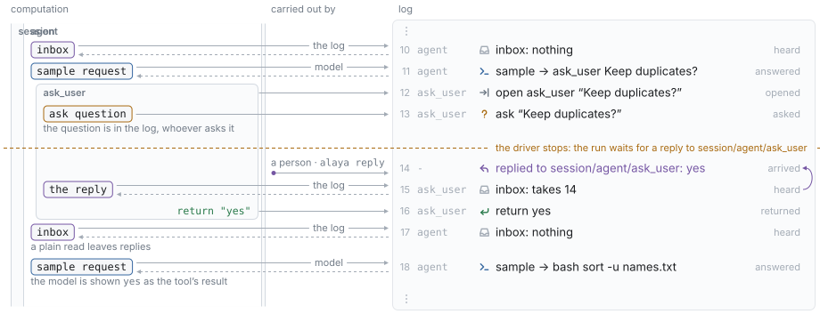

The reply is taken by the frame that asked and by no other read: the agent's own `inbox` leaves
it.

## 8. An agent

An agent is a program a run calls: a routine of the catalog, whose scope is its tools and
itself. It is given its task with its configuration, and its usual shape is a loop over a
conversation that opens with it:

```lean
def converse (config : Config) (opening : Array Chat.Message) : Computation Agent Json :=
  iter (round config) { items := opening.map .told }             -- go round until it ends
```

*One round of MiniSwe's loop (`Agents.MiniSwe.round`, `docs/miniswe.md`).*

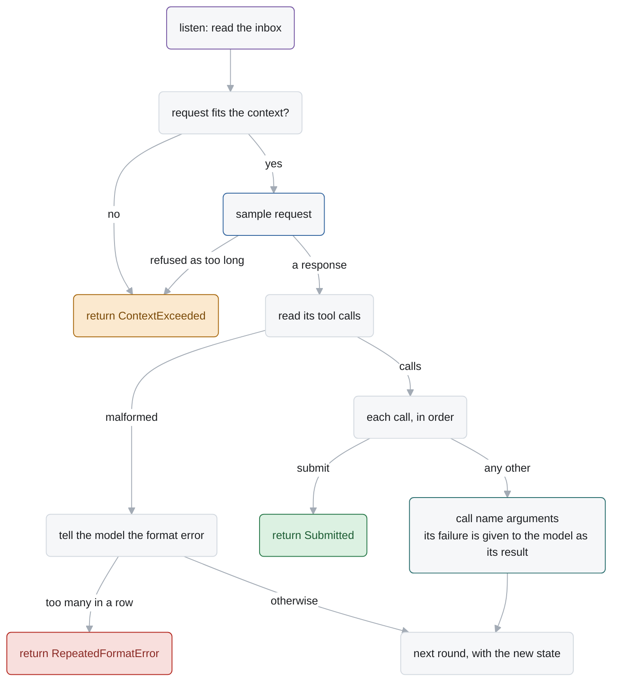
```mermaid
%%{init: {"theme": "base", "themeVariables": {"fontFamily": "BlinkMacSystemFont, Segoe UI, Helvetica, Arial", "fontSize": "13px", "primaryColor": "#f6f7f9", "primaryTextColor": "#1c1e21", "primaryBorderColor": "#d3d9e0", "lineColor": "#a3abb5", "textColor": "#6f7985", "edgeLabelBackground": "#ffffff", "clusterBkg": "#fafbfc", "clusterBorder": "#e3e6ea"}}}%%
flowchart TD
  classDef sample stroke:#3567a0
  classDef exec stroke:#2b6f6f
  classDef notice stroke:#7556a3
  classDef ok fill:#dcf1e2,stroke:#2a7a4b,color:#1c5c33
  classDef bad fill:#f8dfdd,stroke:#b3261e,color:#8a2a25
  classDef wait fill:#fbe9cf,stroke:#a8690f,color:#7a4a08

  listen("listen: read the inbox"):::notice --> fits("request fits the context?")
  fits -- "no" --> context("return ContextExceeded"):::wait
  fits -- "yes" --> sample("sample request"):::sample
  sample -- "refused as too long" --> context
  sample -- "a response" --> parsed("read its tool calls")
  parsed -- "malformed" --> format("tell the model the format error")
  format -- "too many in a row" --> repeated("return RepeatedFormatError"):::bad
  format -- "otherwise" --> again("next round, with the new state")
  parsed -- "calls" --> each("each call, in order")
  each -- "submit" --> submitted("return Submitted"):::ok
  each -- "any other" --> tool("call name arguments<br/>its failure is given to the model as its result"):::exec
  tool --> again
  linkStyle default stroke-width:1px
```

The state of the loop is the conversation so far: what the model was told, each turn with the
results of its calls, and each malformed response. Each round builds its request from this
state. The agent ends by returning its outcome, a status and a submission, as the value of its
frame.

A **program** is a routine of the catalog (`Agents.Catalog`), which a person calls by name, with
how its configuration is read: the agents, and the grader (`docs/log-schema.md` §4). The command
line reads a configuration before any call is made: to print its defaults, apply `--set`, and
check a call. The program reads only its configuration, from which `make` builds its
computation; an agent reads where it runs with `uname -sm`. Its scope is fixed: its tools, and
itself, which `subagent` calls with its configuration and another task.

```lean
structure Built where
  config      : Json                                         -- the complete configuration
  computation : Except String (Computation Agent Json)       -- or why the configuration makes none

structure Definition where                                   -- a program
  routine : Routine Agent                                    -- what a call of it runs
  make    : Json → Except String Built                       -- how its configuration is read

Definition.of : (name : String) → (Json → Except String Built) →
                (routines : Array (Routine Agent)) → Definition   -- scope: routines and itself
Catalog.check : RoutineCall → Except String Unit             -- whether a call fits its program
```

## 9. A run

A run is a workspace, and the programs a person calls on it, one after another. It is the run
of a routine, `session`, whose computation runs in frame `#[]`, entered by no call, as `main` is.
It is a loop: it waits for a call, calls the program the call names in a frame of its own, and
waits again. Its scope is the catalog.

```lean
session : Routine Agent                             -- wait for a call, make it, wait again

structure ProgramArguments where                    -- what a program is called with
  config       : Json                -- its complete configuration: an agent's model and task
  environment? : Option Environment  -- the pinned image, and the workdir;
                                     --   a person's call names it, a sub-agent's does not

programCall    : String → Json → Environment → RoutineCall      -- a person's call of a program
environmentOf  : Log Agent → Frame → Result Environment        -- where a frame's commands run
lastCall?      : Log Agent → Option (RoutineCall × Option CallEnd)   -- the last call, and how it ended
```

1. **The root.** A person provides the workspace: `arrived (changed …)`, at position 0. The run
   waits for a call.
2. **A person calls a program**: `alaya call` appends `arrived (called ⟨name, {config,
   environment}⟩)`. The name is the program's, as a routine's is; the configuration has none.
3. **The run reads it, and opens the call**: `heard - [1]`, then `opened 0 ⟨name, arguments⟩`, so
   every later command builds the same program from the log alone.
4. **The call runs**, in frame `mini-swe`, until it returns, fails, or is stopped. Its calls name
   routines in the program's scope, and its commands run in a container of its own image.
5. **The run waits for the next call.** A grader is called the same way, in frame `grader`, and its
   value is its verdict.

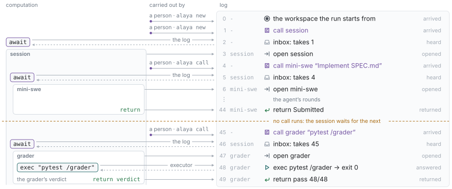

## 10. Driving a run

The driver is the one part that touches the world. Lean code that uses Alaya as a library drives
a run with two functions:

```lean
drive  : Runtime → Routine Agent → (tip : Hash) → Limits → OnEntry → Result (Hash × Stop)
append : Store → Routine Agent → (tip : Hash) → Event Agent → Result (Hash × Entry)

structure Runtime where          -- what a run is driven with
  store ; workspaces ; workDir ; outputsDir
  executor : Environment → Result Executor   -- a container of a call's image, for its commands
  model : Models.Spec → Result Model         -- a call's model; fails when no provider was named

structure Limits where           -- what one invocation allows; nothing of it is recorded
  samples? : Option Nat          -- responses this invocation may sample
  budgetMs? : Option Nat         -- the run's time, summed along its log, after which nothing starts

inductive Stop where             -- why the driver stopped
  | idle                                                 -- no call runs: the run waits for one
  | waits (frame : Frame) (question? : Option Question)  -- a call's read waits for a person
  | paused (reason : String)                             -- a limit was reached
```

A point of a run is an **entry**: one event and the entry before it, named by a hash
(`docs/log-schema.md`). The log of an entry is the path to it from its root.

`drive` goes on from the entry `tip`:

1. It reads the log that ends at `tip`, and replays it.
2. It asks what the run does next, and does it (the diagram of §4): it carries out an
   operation and appends the answer, or appends a mark, after the comments the computation made
   since its last event. Each event is a new entry after the last, and `OnEntry` is called with
   it.
3. It stops when no call runs, when a call's read waits for a person, or at a limit. It gives
   the last entry, and why it stopped.

`append` is how something from outside enters a log: a notice, or a stop, after `tip`. It
replays the log first, and refuses what the log cannot take:

| Event | Taken only |
| --- | --- |
| a stop, a message, a change | while a call runs |
| a reply | where its question waits (`replyTo`, §3.8) |
| a call | where no call runs and none is asked for yet, of a routine the run's scope has |

Appending at an entry that already goes on is a fork: the entry has two continuations, and
each is a log.

- **Draws.** A sample from an entry that has `n` sampled continuations takes draw `n` of its
  request. So the first sample from an entry takes draw 0, which is the response the cache
  kept if the run crashed after its model answered; and driving a point again takes a new draw.
- **Time.** Each entry records how long its event took, and a run's time is the sum along its
  log. A response counts for the time its draw took, also when the cache gives it.
- **Limits** are checked before an operation of a call and before a read of its inbox, so a
  paused run stops where a message a person appends is heard at once. A limit writes nothing,
  and holds every call, a grader's too.
- **Failures.** A failure that is not an answer (§3.4) stops `drive` with an error, and nothing is
  logged for the operation; the next `drive` asks for it again. So a command happens at least
  once: what it does beyond the workspace may happen twice.

## References

- S. Burckhardt et al. Durable Functions: semantics for stateful serverless. OOPSLA 2021.
- P. Hancock, A. Setzer. Interactive programs in dependent type theory. CSL 2000.
- O. Kiselyov, H. Ishii. Freer monads, more extensible effects. Haskell 2015.
- J. Koppel, G. Scherer, A. Solar-Lezama. Capturing the future by replaying the past. ICFP 2018.
- M. Piróg, T. Schrijvers, N. Wu, M. Jaskelioff. Syntax and semantics for operations with
  scopes. LICS 2018.
- N. Wu, T. Schrijvers, R. Hinze. Effect handlers in scope. Haskell 2014.
- L. Xia et al. Interaction trees: representing recursive and impure programs in Coq. POPL 2020.
