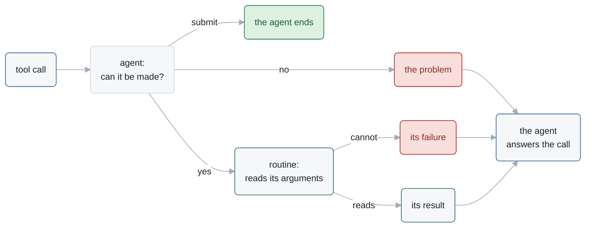
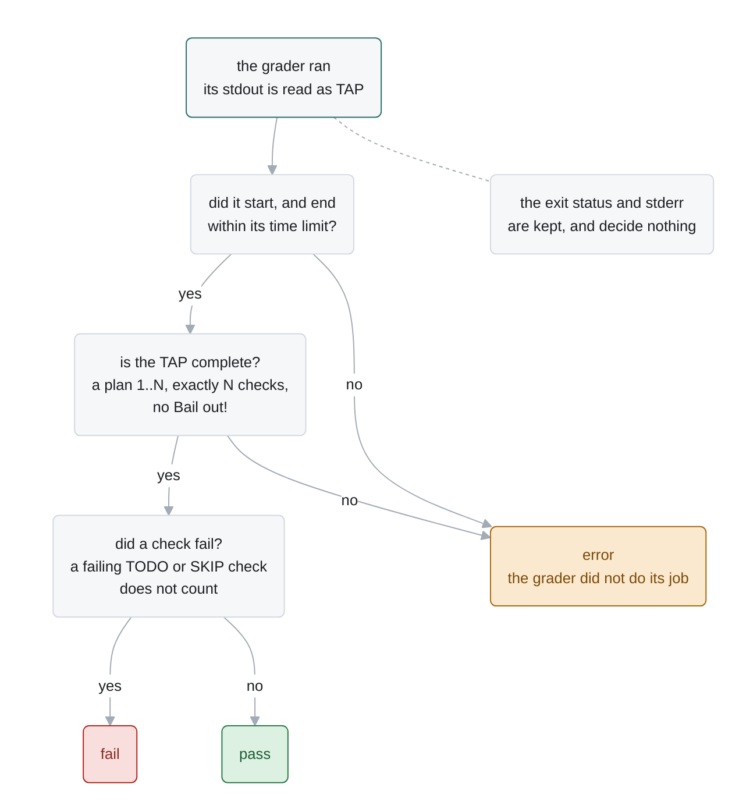
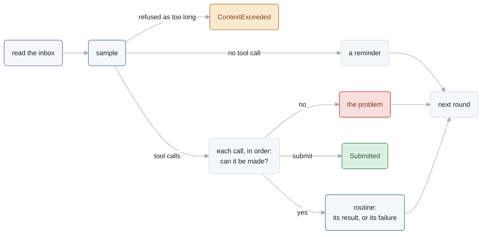
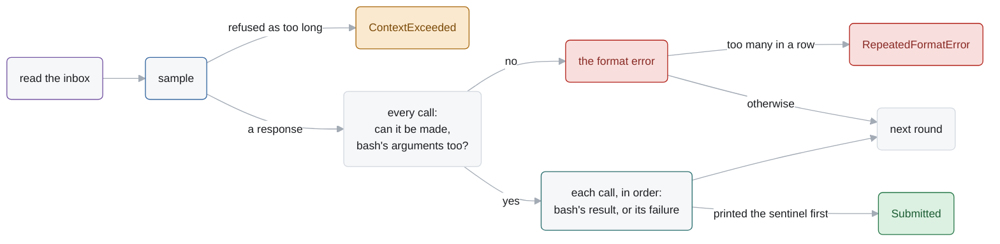

# Agents

An agent is a routine of the language (`docs/language.md`) that works on a task with a model:
it talks to the model in a loop, and the model acts through tools, each a routine of its own.
This page is the tools agents offer, `ask_user`, which lets a model ask a person, the grader,
which grades any point of a run, and the three agents Alaya includes: Basic, a model with `bash`
and `submit`; MiniVero, Basic with Vero's instructions and more tools; and MiniSwe, a faithful
port of mini-SWE-agent.

| § | What | Where |
| --- | --- | --- |
| 1 | **tools**: routines a model can call | `Alaya.Agents.Tools` |
| 2 | `ask_user`: a model asks a person | `Alaya.Agents.Tools` |
| 3 | the **grader**: its protocol, its verdict, and how to write one | `Alaya.Agents.Grader` |
| 4 | **Basic**: `bash` and `submit` | `Alaya.Agents.Basic` |
| 5 | **MiniVero**: Basic for Vero's tasks | `Alaya.Agents.MiniVero` |
| 6 | **MiniSwe**: mini-SWE-agent | `Alaya.Agents.MiniSwe` |

## 1. Tools

A **tool** is data: what a model needs to call it, and the settings the agent adds to every call.
A call of it calls the routine of its name.

```lean
structure Tool where
  definition   : Chat.ToolDefinition              -- its name, description and schema, for a model
  alone        : Bool := false                    -- must be the only call of its turn
  instruction? : Option String := none            -- appended to the prompt
  settings     : Json := .mkObj []                -- merged over the model's arguments; they win

Tools.make     : Array Tool → Chat.ToolCall → Computation Agent (Except String Json)
Tools.routines : Array (Routine Agent)            -- bash, ask_user, time_budget
Tools.Subagent.routine : Routine Agent            -- given its agent's scope by the agent
```

A tool is made from what the agent's configuration says of it, and that is its settings: `bash`
holds how a command runs, `ask_user` the kinds of question allowed, and `subagent` the agent to
call and its configuration but its task, which the model's fills. The routines are fixed, so all
of it is in the call's arguments, in the log. The `subagent` routine finds the agent by name in
its own scope, so an agent that offers it gives it a scope with itself in it: MiniVero's.

### 1.1 Who checks what

| Who | Checks | On a problem |
| --- | --- | --- |
| the agent | that a call can be made: its arguments are JSON, its tool is offered, it is alone if its tool must be, and its response was not cut off | the call is answered with the problem, and not made |
| the routine | its arguments | it is refused, and the call is answered with why |

A routine's failure reaches the model by its kind (`docs/language.md` §3.4): a refusal as its
reason, a break as "A person stopped this call: …", and a defect not at all, as it fails the agent.
The agent makes a call with `Tools.make`, the tool's settings over the model's arguments, and
shows the result its own way. `submit` calls no routine: the agent reads its message and ends.
MiniSwe also checks each `bash` call's arguments before it makes any, as mini does (§6.3).




| Tool | Arguments | Its call | Result |
| --- | --- | --- | --- |
| `bash` | `command`, a string | `bash`: `exec command`; settings: `executor`, how commands run | `output`, `exit_code`, `error`, `file` |
| `time_budget` | none | `time_budget`: `time` | `seconds_left`, or that the run has no limit |
| `ask_user` | `question_type`, `question`, `options`: a question that can be asked, of a kind the agent allows (§2) | `ask_user`: `ask` the question; settings: `question_types`, the kinds allowed | the reply |
| `submit` | `message`, a string; any other submits nothing | none: the agent that offers it ends with the message; called alone | |
| `subagent` | `task`, a string that is not blank, which the sub-agent checks | `subagent`: calls the agent, `mini-vero`; settings: `agent` and its `configuration` but its task | the sub-agent's outcome: `status`, `submission`, `reason` |

A tool is independent of the agent that offers it. The agent chooses which tools to offer, how
to report a malformed call, and how to show a result to its model. Basic offers `bash`,
`submit` and, when asked to, `ask_user`; MiniVero offers them all (§5); and MiniSwe offers `bash`
alone.

## 2. `ask_user`: a model asks a person

`ask_user` lets a model ask a person a question, through `ask` (`docs/language.md` §3.8). Questions and replies are
defined by the core; the tool only adapts them to a model:

| | The core: a question | The tool: `ask_user` |
| --- | --- | --- |
| owns | the three kinds, the replies that fit each, the wait, the checks on a reply | its name, its schema, its instruction, the rule that it is called alone |
| decides | whether a reply answers a question | which kinds of question the model may ask |
| translates | nothing | a call's arguments into a question, and a reply into what the model is shown |

1. **The kinds are chosen in advance.** The `question_types` of Basic and MiniVero names the
   kinds of question the model may ask. Either offers `ask_user` only when the list is not
   empty, and MiniSwe never does.

   ```sh
   --set 'question_types=["yes_no","single_choice"]'
   ```

2. **The model is offered exactly those.** The tool's schema, description and instruction name
   only the kinds allowed, and `options` is there only when a choice is among them.
3. **The model asks.** It calls `ask_user`, alone in its turn:

   ```json
   {"question_type": "single_choice",
    "question": "Should the function keep duplicate elements? The prose does not say.",
    "options": ["Keep them, in order.", "Drop them."]}
   ```

4. **The routine reads the question** from the call, with the kinds the agent allows (§1.1). A
   kind that is not allowed, a blank question, options on a question that is not a choice, or an
   option that says "none of the above" fails its frame, saying why, and nothing is asked.
5. **The tool asks.** Its routine performs `ask`: the
   question is marked in the log, and the run waits (`docs/language.md` §3.8).
6. **A person replies**, with `alaya reply` (`docs/cli.md`).
7. **The model is told.** The call returns the reply as the tool encodes it, and the model is
   shown a text as it is, and anything else as JSON:

   | Reply | The call returns |
   | --- | --- |
   | `yes`, `no` | `"yes"`, `"no"` |
   | `choice n` | the number `n` |
   | `noneOfAbove` | `"none_of_above"` |
   | `text` | the text |
   | `unavailable` | `{"status": "unavailable"}` |


The reply is taken by the frame that asked and by no other read: the agent's own `inbox` leaves
it.

## 3. The grader

A **grader** is a program a person calls on a log like an agent: `grader`, of the catalog. It
runs one command, in a container of its own image, and returns the **verdict** read off what
the command prints. Any point of any run is graded, by any grader, at any time.

What a call of the grader holds as its configuration:

```json
{"command": "sh /grader/grade.sh", "timeout_seconds": 900}
```

| Field | Holds |
| --- | --- |
| `command` | a shell command, run with `/bin/sh -c` |
| `timeout_seconds` | how long it may take: 900 unless given, 0 for no limit |

### 3.1 The protocol

1. **A point is chosen.** Where a call still runs there, `alaya stop` ends it first, on a fork if
   the log goes on.
2. **The grader is called.** `alaya call ENTRY grader --image IMAGE --set command=CMD`
   appends the call, its image pinned to a digest. So a log says exactly what graded it.
3. **The command runs** in a new container of the grader's image, on the workspace the log has
   reached, at the call's workdir, with no network unless `resume --network` gives one, and its
   time limit. Its trusted files — hidden tests, a reference — are in its image.
4. **It reports in TAP** on stdout, kept apart from its stderr: a plan `1..N`, then an `ok` or
   `not ok` line for each check.
5. **Alaya reads the verdict** off the TAP, and the call returns it as its value.
6. **The workspace is kept** as the grader left it, reports included: `alaya ls` and `alaya cat`
   read it at the entry of the command's answer. The agent is over, so nothing reads it but a
   person.


### 3.2 The verdict

Only the TAP decides. The exit status and stderr are recorded, and decide nothing: "the checks
ran and some failed" and "the grader crashed" can exit alike, and only an incomplete TAP tells
them apart.



| Status | When |
| --- | --- |
| `pass` | the plan is there, as many checks arrived as it announced, and none failed |
| `fail` | the TAP is complete, and a check failed; a failing `TODO` or `SKIP` check does not count, a failing subtest does |
| `error` | anything else: no plan, fewer or more checks than planned, a `Bail out!`, a grader that ran out of time or could not start |

The value the grader's call returns:

```json
{"status": "fail", "passed": 2, "total": 3, "reason": "failed: errors",
 "checks": [{"ok": true, "name": "parses", "directive": ""}, …], "exit_code": 1}
```

`checks` has one item for each top-level check. What the command printed, stdout and stderr,
is in the answer of its `exec` before it.

### 3.3 Writing a grader

- **Print [TAP](https://testanything.org/tap-version-14-specification.html) on stdout, and
  nothing else there.** Logs go to stderr, or into `#` comment lines.
- **Say what an exit code means.** A plain test command needs a few lines of wrapper, in which
  the grader's author, who knows the tool, turns its exit codes into TAP:

  ```sh
  echo 1..1
  pytest -q; code=$?
  case $code in
    0) echo "ok 1 - tests" ;;
    1) echo "not ok 1 - tests" ;;
    *) echo "Bail out! pytest exited $code" ;;
  esac
  ```

- **Keep what the agent must not see out of the workspace.** Hidden tests, reference outputs and
  tools the agent should not have go in the grader's image, best built on the agent's image.
  The call pins the image by digest, so the log names the very files that graded it.
- **Change the workspace freely.** The agent is over: build in it, write reports in it.

### 3.4 Grading again

Grading a point again, with the same grader or a corrected one, is a fork from the entry before
the first grader was called, and `alaya tree` shows both verdicts; or a second call after the
first's end, in the same log. A grader that reads only the workspace gives one verdict for each
version of it, so the points worth grading are the entries that leave a new version: the
answers of commands, and changes from outside.

## 4. Basic

`Alaya.Agents.Basic` is the basic agent: a model with `bash` and `submit`, and `ask_user` when its
configuration names kinds of question, as simple as an agent can be and still robust. Its command output follows [pi](https://github.com/earendil-works/pi):
the end of an output, a note that names a file with all of it, and how the command ended. It is
the base of MiniVero (§5).

### 4.1 Options

Set at `call` with `--set FIELD=VALUE`; `alaya config --program basic` prints the defaults.
A field left out is its default, and a misspelt one is an error.

| Field | Default | Meaning |
| --- | --- | --- |
| `model` | none | the model it samples: its spec (`docs/llm-api.md`), a name alone being that model's defaults; required |
| `task` | none | the task, verbatim; required. `--set-file task=FILE` reads it from a file |
| `executor.timeout_seconds` | 300 | the time a command may take |
| `executor.env` | none | environment overrides for every command |
| `question_types` | `[]` | the kinds of question `ask_user` lets the model ask: any of `yes_no`, `single_choice`, `open_ended`; none offers no `ask_user` (§2) |

### 4.2 The loop

Each round reads what a person said, samples a response, and answers every tool call in it.



**Every tool call is answered.** A call cannot be made, and its answer is the problem, when:

| The call | Its answer |
| --- | --- |
| has arguments that are not JSON | "Error parsing tool call arguments: …" |
| names a tool that is not offered | "Unknown tool '…'." |
| comes with others in a response that calls `submit` | "submit must be called alone: no call of this response was made." |
| is in a response cut off at the output token limit | that its arguments may be cut off, and to call again |

A call that is made is answered with its routine's result, or with why it failed, as when it
cannot read its arguments (§1.1). Whatever the model sends, the run goes on.

**A response with no tool call** is kept when it says something, and answered with a reminder to
call a tool. A response cut off before any call is told so, and asked to be brief.

There is no limit on malformed responses. How long a run may go is the driver's to bound:
`alaya resume --samples N` and `--time-budget` (`docs/cli.md`).

### 4.3 What the model is sent

**The opening** is a short system message, then the task. The system message says that the agent
acts only through tools, calls `submit` alone when the task is done, and calls a tool in every
response. It also says that each command runs in a new shell at the repository's root, that a long
output is cut to its end with a note naming a file, and which machine the commands run on: the
system and the architecture, as `uname -sm` reads them in the call's container.

**The view** is every turn, in order:

- A person's message or change to the workspace is told as an `<intervention>`.
- A turn is the model's message, and a tool message answering each call.

### 4.4 Commands and their output

A command runs through `/bin/sh` in the run's container, at its workdir, with stderr merged into
stdout and no standard input. A command that fails or runs out of time still gets an answer.

The model is shown the output as text, as pi shows it. When it is longer than 2 000 lines or
50 KB, the model sees its last lines, as many as fit, and a note:

```
[Showing lines 1001-3000 of 3000. Full output: /alaya/outputs/3f9a1c2b7d4e.txt]
```

A last line too long to show whole is shown as its end. The file holds the whole output, and the
model can read any part of it with `bash`. It is named by a hash of the output, so the same output
has the same name in every run.

When a command did not end well, how it ended follows the output: `Command exited with code 2`,
or what went wrong, such as a timeout. An empty output of a command that ended well is shown as
`(no output)`. The log keeps the whole output either way.

### 4.5 How it ends

The agent returns `{status, submission}`:

| Status | When |
| --- | --- |
| `Submitted` | the model called `submit`; its message is the submission |
| `ContextExceeded` | the provider refused a request as too long; `reason` holds the provider's words |

Nothing else ends it.

## 5. MiniVero

`Alaya.Agents.MiniVero` is Alaya's agent for the Lean implementation and proof tasks of the Vero
benchmark. It is Basic (§4): its tools, `ask_user` among them when `question_types` names kinds
of question; its answers to every call; and its command output. It goes round a loop of its own,
with Vero's instructions, and with every extension on:

- **`time_budget`** tells the model how much of the run's time is left (§5.5).
- **`subagent`** hands a task to another MiniVero, with the same configuration.
- **Masking**: the outputs of turns older than the last 20 are left out of the view (§5.6).
- **A context limit**: a request that would not fit the model's context ends the agent first.

### 5.1 Options

`alaya config --program mini-vero` prints them all.

| Field | Default | Meaning |
| --- | --- | --- |
| `model`, `task`, `executor`, `question_types` | | as Basic's (§4.1) |
| `mode` | `proof` | Vero's evaluation mode for the run: `proof` or `codeproof` |
| `context_reserve` | 8000 | tokens kept free for the next response |

A codeproof run calls `mini-vero --set mode=codeproof`.

**A full context ends the agent.** When the model's `context_tokens` is known, the agent ends
with `ContextExceeded` before a request that would not fit: one whose size reaches the context
less `context_reserve`, or less the model's `output_tokens` when that is smaller. The size is
taken from the last response's reported usage, plus four characters a token for what was added
since.

### 5.2 What the model is sent

A system message that names the agent and says Vero's grader decides correctness, then one task
message, in this order:

1. Vero's opening framing: the sandbox is the working directory, and the grader reads it after
   the agent stops.
2. The instance, its `task`, given to `call` as `--set-file task=MINIVERO_TASK.md`: the file of §5.3.
3. Vero's rule sections: `Marker grammar`, `Oracle commands`, `Grading` for the run's mode,
   `Done condition`, `Checkpointing`, `Anti-cheating`, and the two facts under `Scoring`.
4. This agent's mechanics: repository-relative paths, no shell state between calls, one
   `submit` call; and the image's system and architecture.
5. Each offered tool's instruction.

The rule sections are Vero's text byte for byte. Each is a file in `Alaya/Agents/MiniVero/`,
cut from Vero's instruction templates (`templates/instruction/` at sunblaze-ucb/vero
`0a7325d`) where the templates branch, so each can be compared with its source by `diff`. Lake
does not track these files: after editing one, touch `Alaya/Agents/MiniVero.lean` and rebuild.
A test fails when the compiled text and the files differ.

### 5.3 The instance: `MINIVERO_TASK.md`

`benchmarks/vero/render.py` generates it from Vero's trusted benchmark and from the sandbox
that was actually rendered. It holds only what the prompt cannot know in advance:

- **Benchmark scale**: the root project, packages, modules, API functions, specifications, mode.
- **Project layout**: the frozen files, and every editable file with the marker shapes it holds.
- **The mode's task**: Vero's sentences that state the artifact and the grader, for `proof`, or
  for `codeproof`'s Parts A, B and C.
- **Reference**: the original upstream source, only when it is shipped with the sandbox.

Feedback from an earlier attempt is not part of the task: append it with `alaya tell` before
the next `resume`.

### 5.4 Differences from Vero's own instructions

- **No prescribed way of working.** Vero's `Persistence`, `Workflow` and `Proof strategy`
  sections tell the agent how to work: keep iterating until the budget is spent, follow a fixed
  order of steps, and decompose proofs over lists into helper lemmas. MiniVero leaves them out
  and sends only the rules the grader enforces, so the strategy is the model's own. Vero's
  `Previous iteration feedback` is left out too: feedback is a message appended with
  `alaya tell` (§5.3).
- **File lists are the sandbox's own.** Vero's base template, shared by both modes, lists
  `Impl/*.lean` as editable even in `proof`, where its mode template says it is frozen. The
  instance lists the files as they are in the run's mode: `Impl/*.lean` is frozen in `proof` and
  editable in `codeproof`.
- **`Checkpointing` is adapted**, the one section not Vero's to the byte. Vero's is for a chunk
  of a known number of minutes, and says to check the time with `date`. Here the budget is
  given per invocation, after the prompt is sent, and the run may be paused and driven on
  later. So the section says the run has a time budget that the `time_budget` tool reports,
  names that tool where Vero says `date`, and says "run" where Vero says "chunk". The advice is
  Vero's: keep the build green, one slot at a time, never leave a slot half-written, wind down
  before the end.
- **The mode comes from the call's configuration**, never from the task file.

### 5.5 Pacing: `time_budget`

`alaya resume ENTRY --time-budget SECONDS` pauses the run once it has taken that long, and a
later `resume` goes on from its last entry. With `time_budget` among its tools, the agent is told
to pace itself by it.

- The tool takes no arguments and gives `{"seconds_left": N}`: the budget less the run's time
  along its log. So it is right after a pause, when the clock since the start is not.
- Without a budget it gives `{"seconds_left": null, "note": "this run has no time limit"}`.
- The budget is checked before each thing the agent does and never cuts one short, so a run
  can overrun it by one command or one response.

### 5.6 Old outputs

A command's output is shown as Basic shows it (§4.4). Over a long run, old outputs fill the
context. The outputs of turns older than the last 20 are replaced by a note that names their
file, followed by how the command ended when it did not end well:

```
[output omitted; full output: /alaya/outputs/8b21e0c47a19.txt]
```

The boundary moves 10 turns at a time, so between its moves the conversation only grows at its
end, and the provider's prompt cache stays valid.

### 5.7 Running

The image build, render, prepare, run and grading commands are in
[the Vero integration](../benchmarks/vero/README.md). In outline:

```sh
alaya new source
alaya call ROOT mini-vero --set-file task=MINIVERO_TASK.md --set model=MODEL --image ghcr.io/msv-lab/alaya-vero-agent:0a7325d
alaya resume CALLED --provider PROVIDER
alaya call LAST grader --image vero-grader-TASK \
  --set command='python /opt/alaya-vero/grade.py --mode proof --benchmark /grader'
alaya resume GRADER
alaya cat GRADED:N .grade/report.md         # N: the position of the grader's command's answer
```

The grader is Vero's own, in an image of the task's: the Vero grader image with the trusted
benchmark added at `/grader` (§3). Vero remains the source of the
benchmark definitions and the grading rules.

## 6. MiniSwe

`Alaya.Agents.MiniSwe` is a faithful port of
[mini-SWE-agent](https://github.com/SWE-agent/mini-swe-agent)'s default tool-calling agent. It
keeps what defines that agent: its prompts, its one `bash` tool, its sentinel that ends a run,
its observations, its format errors, and its loop, whose context keeps every turn. Where Basic
answers each malformed call, MiniSwe answers a malformed response as mini does: as a whole, with
a format error, ending after too many in a row.

### 6.1 Options

Set at `call` with `--set FIELD=VALUE`; `alaya config --program mini-swe` prints the defaults.
A field left out is its default, and a misspelt one is an error.

| Field | Default | Meaning |
| --- | --- | --- |
| `model` | none | the model it samples: its spec (`docs/llm-api.md`), a name alone being that model's defaults; required |
| `task` | none | the task, verbatim; required. `--set-file task=FILE` reads it from a file |
| `max_consecutive_format_errors` | 3 | malformed responses in a row before `RepeatedFormatError`; 0 is no limit |
| `executor.timeout_seconds` | 30 | the time a command may take |
| `executor.env` | mini's | environment overrides for every command: `PAGER=cat` and the like |

### 6.2 The loop

Mini's `DefaultAgent.run`: each round reads what a person said, samples a response, answers a
malformed one with the format error, and otherwise makes each of its tool calls in order.

```lean
def round (config : Config) (model : Models.Spec) :          -- the messages, the errors in a row
    Dialogue × Nat → Computation Agent (Dialogue × Nat ⊕ Json)  -- the next state, or how it ended

iter (round config model) (opening, 0)                       -- go round until it ends
```

*One round (`MiniSwe.round`). Mini checks every call before it makes any, so a malformed
response runs nothing.*



The state of the loop is mini's linear context: the messages so far, each appended once and
kept, with a format error in place of each malformed response. Each request is all of them. The
agent ends by returning its outcome, a status and a submission, as the value of its frame (§6.4).

### 6.3 What the model is sent

**The opening** is mini's two messages, rendered from its `mini.yaml`: the system message, and
the task with a line naming the machine. The line holds the system and the architecture, as
`uname -sm` reads them in the call's container.

**The tool** is mini's `bash`, with its description and schema. No other tool is offered.

**The view** is every turn, in order:

- A person's message or change to the workspace is told as an `<intervention>`.
- A turn is the model's message and a tool message for each call.
- A malformed response is not shown. In its place the model sees a user message with the
  format error, so it does not try to continue its own broken output. This is mini's protocol.

**An observation** is mini's `observation_template`:

```json
{
  "returncode": 0,
  "output": "hello\n"
}
```

An output of 10 000 characters or more is shown as `output_head` and `output_tail`, its first
and last 5 000, with `elided_chars` and a `warning`. A command that did not end on its own has
`returncode` -1 and an `exception_info`. The log keeps the whole output.

**A format error** is the whole turn's answer when its first problem is one of these:

| The response | Format error |
| --- | --- |
| has no tool call | "No tool calls found in the response…" |
| has a call whose arguments are not JSON | "Error parsing tool call arguments: …" |
| calls a tool that is not `bash` | "Unknown tool '…'." |
| has a `bash` call with no `command` | what is wrong with it |

The message is mini's `format_error_template`, which wraps the problem in mini's guidance on
calling the tool. When the provider cut the response off (`finish_reason` is `length`, or
`tool_calls` with no call), it says so and asks for a shorter response instead.

### 6.4 How it ends

The agent returns `{status, submission}`:

| Status | When |
| --- | --- |
| `Submitted` | a command printed `COMPLETE_TASK_AND_SUBMIT_FINAL_OUTPUT` as its first line; the rest of its output is the submission. Calls after it in the same response do not run |
| `RepeatedFormatError` | `max_consecutive_format_errors` malformed responses in a row |
| `ContextExceeded` | the provider refused a request as too long; `reason` holds the provider's words |

A tool that fails does not end the agent: the model is shown the error as the call's result.

### 6.5 Commands

A command runs as Basic's does (§4.4); the model sees it as mini's observation (§6.3).

### 6.6 Differences from mini-SWE-agent

- **The machine line is the image's system and architecture**, such as `Linux x86_64`. Mini
  gives the whole `uname`; in a container its kernel release and version are the host's, so
  they would put the machine a run was created on into the prompt.
- **A format error names one problem**, where mini concatenates every problem found. A
  `command` that is not a string is a format error, where Python would run a list.
- **A malformed `bash` call is named in the routine's words** (§1.1): "The bash tool takes its
  command as a string." where mini says "Missing 'command' argument in bash tool call."
- **Error texts are plain**, not Python's exception messages, and invalid UTF-8 in output is
  replaced byte by byte.
- **The environment is a snapshot of the workspace**, not a persistent machine: what a command
  installs outside the workspace lasts only until a later `resume` starts a new container.
- **A refused request ends the agent** with `ContextExceeded`, where mini raises its exception.
- **No cost accounting or step limit**: mini's `cost_limit` and `step_limit` are not enforced,
  and the agent never ends with `LimitsExceeded`. `alaya resume --samples N` pauses a run after `N`
  responses instead, and a later `resume` goes on from there (`docs/cli.md`).
- **A person can speak to it**: what a person says reaches the model at the start of its next
  round, and so does a change to the workspace, through the message `alaya commit` appends
  after it.
