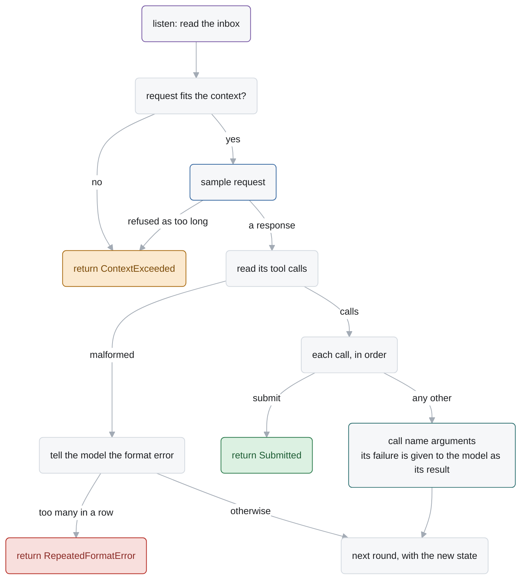
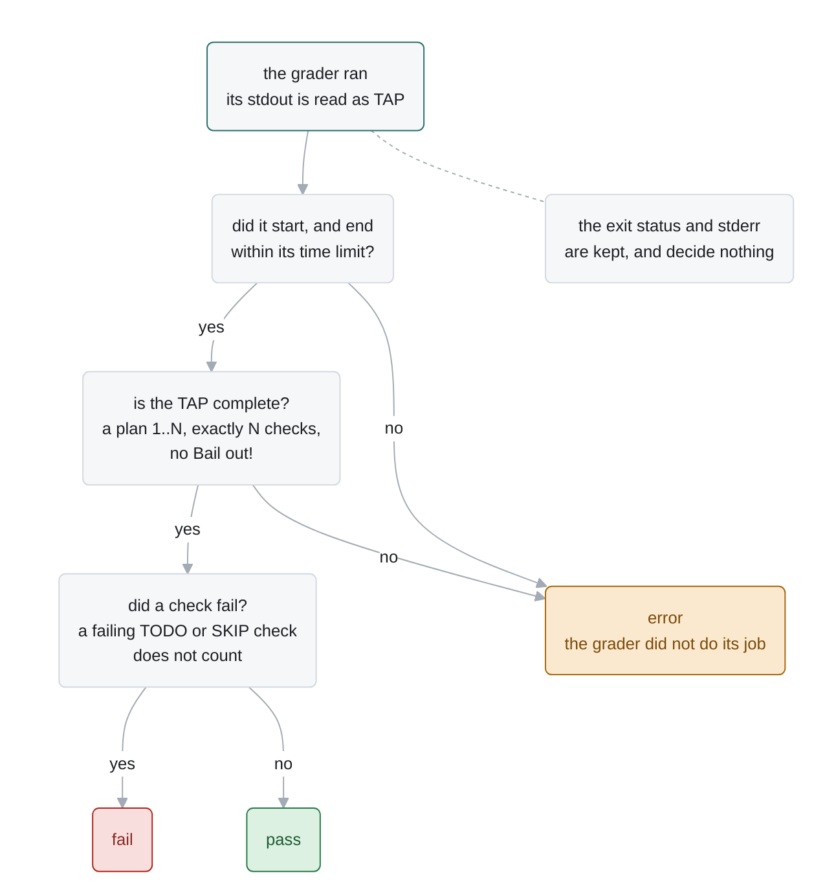

# Agents

An agent is a routine of the language (`docs/language.md`) that works on a task with a model:
it talks to the model in a loop, and the model acts through tools, each a routine of its own.
This page is the tools agents offer, `ask_user`, which lets a model ask a person, how an agent is
made and offered as a program, and the two agents Alaya includes: MiniSwe, a port of
mini-SWE-agent, and MiniVero, MiniSwe with Vero's instructions; and the grader, which grades any
point of a run.

| § | What | Where |
| --- | --- | --- |
| 1 | **tools**: routines a model can call | `Alaya.Agents.Tools` |
| 2 | `ask_user`: a model asks a person | `Alaya.Agents.Tools` |
| 3 | an **agent**: a routine, its scope, and a program of the catalog | `Alaya.Agents.*`, `Alaya.App.Catalog` |
| 4 | **MiniSwe** | `Alaya.Agents.MiniSwe` |
| 5 | **MiniVero** | `Alaya.Agents.MiniVero` |
| 6 | the **grader**: its protocol, its verdict, and how to write one | `Alaya.Agents.Grader` |

## 1. Tools

A **tool** is what a model needs to call it, and the routine call its arguments make:

```lean
structure Tool where
  definition   : Chat.ToolDefinition              -- its name, description and schema, for a model
  alone        : Bool := false                    -- must be the only call of its turn
  instruction? : Option String := none            -- appended to the prompt
  check        : Json → Except String Unit        -- what is wrong with a call's arguments
  call         : Json → RoutineCall               -- the call the model's arguments make

Tools.routines : Array (Routine Agent)            -- bash, ask_user, time_budget
```

A tool is parameterized by what the agent's configuration says of it, as `ask_user` is by the
kinds of question: `bash` by how a command runs, which its call adds to the model's arguments;
`subagent` by the agent itself, its name and its configuration, which its call names with the
model's task. The routines are fixed, so all of it is in the call's arguments, in the log.

A model's tool call becomes a call of a routine in four steps:

1. The agent samples a request that offers the tools' `definition`s.
2. The response names tools and gives arguments. The agent checks each call with the tool's
   `check`; a call that is wrong is answered with a format error and is not made.
3. The agent makes each tool's call of the model's arguments, `tool.call asked.arguments`. The
   routine runs in a frame of its own.
4. The agent puts each result in the next request, as a tool message. A tool that failed gives
   its error as its result.


| Tool | Arguments | Its call | Result |
| --- | --- | --- | --- |
| `bash` | `command` | `bash`: `exec command`, with the executor settings the agent adds | `output`, `exit_code`, `error`, `file` |
| `time_budget` | none | `time_budget`: `time` | `seconds_left`, or that the run has no limit |
| `ask_user` | `question_type`, `question`, `options` | `ask_user`: `ask` the question (§2) | the reply |
| `submit` | `message` | none: the agent that offers it ends with the message | |
| `subagent` | `task` | the agent itself, `mini-swe` or `mini-vero`, with its configuration and the model's task | the sub-agent's outcome |

`Agents.Tools.all` lists the tools an agent's configuration can name. A tool is independent of
the agent that offers it: the agent chooses which tools to offer, how to report a malformed
call, and how to show a result to its model.

## 2. `ask_user`: a model asks a person

`ask_user` lets a model ask a person a question, through `ask` (`docs/language.md` §3.8). Questions and replies are
defined by the core; the tool only adapts them to a model:

| | The core: a question | The tool: `ask_user` |
| --- | --- | --- |
| owns | the three kinds, the replies that fit each, the wait, the checks on a reply | its name, its schema, its instruction, the rule that it is called alone |
| decides | whether a reply answers a question | which kinds of question the model may ask |
| translates | nothing | a call's arguments into a question, and a reply into what the model is shown |

1. **The kinds are chosen in advance.** The agent's `question_types` names the kinds of
   question the model may ask. There is no default: offering `ask_user` without it is an error.

   ```sh
   --set 'tools=["bash","submit","ask_user"]' --set 'question_types=["yes_no","single_choice"]'
   ```

2. **The model is offered exactly those.** The tool's schema, description and instruction name
   only the kinds allowed, and `options` is there only when a choice is among them.
3. **The model asks.** It calls `ask_user`, alone in its turn:

   ```json
   {"question_type": "single_choice",
    "question": "Should the function keep duplicate elements? The prose does not say.",
    "options": ["Keep them, in order.", "Drop them."]}
   ```

4. **The call is checked.** A kind that is not allowed, a blank question, options on a question
   that is not a choice, or a candidate that says "none of the above" is a format error, and
   nothing is asked.
5. **The tool asks.** Its routine reads the question from the arguments and performs `ask`: the
   question is marked in the log, and the run waits (`docs/language.md` §3.8).
6. **A person replies**, with `alaya reply` (`docs/cli.md`).
7. **The model is told.** The call returns the reply as the tool encodes it:

   | Reply | The call returns |
   | --- | --- |
   | `yes`, `no` | `"yes"`, `"no"` |
   | `choice n` | the number `n` |
   | `noneOfAbove` | `"none_of_above"` |
   | `text` | the text |
   | `unavailable` | `{"status": "unavailable"}` |


The reply is taken by the frame that asked and by no other read: the agent's own `inbox` leaves
it.

## 3. An agent

An agent is a program a run calls: a routine of the catalog, whose scope is its tools and
itself. It is given its task with its configuration, and its usual shape is a loop over a
conversation that opens with it:

```lean
def converse (config : Config) (opening : Array Chat.Message) : Computation Agent Json :=
  iter (round config) { items := opening.map .told }             -- go round until it ends
```

*One round of MiniSwe's loop (`Agents.MiniSwe.round`, §4).*



The state of the loop is the conversation so far: what the model was told, each turn with the
results of its calls, and each malformed response. Each round builds its request from this
state. The agent ends by returning its outcome, a status and a submission, as the value of its
frame.

An **agent** is a routine its module defines: `MiniSwe.routine`, `MiniVero.routine`, and
`Grader.routine` for the grader. A call's arguments are its configuration, its model and task
among it, as a tool's are its arguments and the agent's settings. One it cannot run on fails in
the call's frame, saying why in the configuration's terms. An agent reads where it runs with
`uname -sm`. Its scope is fixed where it is defined: its tools, and itself, which `subagent`
calls with its configuration and another task.

A **program** is an agent as the catalog (`Alaya.App.Catalog`) lists it, which a person calls by
name: MiniSwe, MiniVero, or the grader (§4–§6). The command line reads a configuration before any
call is made: to print its defaults, apply `--set`, and check a call. A call fits its program when the
program's routine does not fail at once on its configuration, and the command line adds how to
give a field the configuration leaves empty.

```lean
MiniSwe.routine : Routine Agent                              -- likewise MiniVero, Grader

structure Definition where                                   -- a program
  routine  : Routine Agent                                   -- what a call of it runs
  complete : Json → Except String Json                       -- its configuration, every field filled

Catalog.check : RoutineCall → Except String Unit             -- whether a call fits its program
```

## 4. MiniSwe

`Alaya.Agents.MiniSwe` is a port of
[mini-SWE-agent](https://github.com/SWE-agent/mini-swe-agent)'s default tool-calling agent. It
keeps what defines that agent: its prompts, its `bash` tool, its way of reading a response and
answering a malformed one, and its limits. It is an agent (§3): a loop over a conversation that
opens with its task.

### 4.1 Options

Set at `call` with `--set FIELD=VALUE`; `alaya config --program mini-swe` prints the defaults.
A field left out is its default, and a misspelt one is an error.

| Field | Default | Meaning |
| --- | --- | --- |
| `model` | none | the model it samples: its spec (`docs/llm-api.md`), a name alone being that model's defaults; required |
| `task` | none | the task, verbatim; required. `--set-file task=FILE` reads it from a file |
| `max_consecutive_format_errors` | 3 | malformed responses in a row before `RepeatedFormatError`; 0 is no limit |
| `executor.timeout_seconds` | 30 | the time a command may take |
| `executor.env` | mini's | environment overrides for every command: `PAGER=cat` and the like |
| `tools` | `["bash", "submit"]` | the tools offered, in order. `bash` and `submit` are required; `ask_user`, `time_budget` and `subagent` may be added. The list replaces the default one |
| `question_types` | `[]` | the kinds of question `ask_user` lets the model ask: any of `yes_no`, `single_choice`, `open_ended`. Required, and not empty, when `ask_user` is offered |
| `recover_output` | false | name the file that holds the whole of a cut output (§4.4) |
| `context_reserve` | 8000 | tokens kept free for the next response (§4.3) |
| `mask_observations` | null | `{keep_turns, block}`: leave old outputs out of the view (§4.4) |

### 4.2 What the model is sent

**The opening** is mini's two messages, rendered from its `mini.yaml`: the system message, and
the task with a line naming the machine: the system and the architecture, as `uname -sm` reads
them in the call's container. Each offered tool's instruction is appended to the task message.

**The view** is what each later request holds of the conversation:

- A person's message or change to the workspace is told as an `<intervention>`.
- A turn is the model's message and a tool message for each call. A `bash` result is JSON with
  `output`, `exit_code` and `error`. An output of 10 000 characters or more is shown as its
  first and last 5 000, with the count of what was left out; the log keeps all of it.
- A malformed response is not shown. In its place the model sees a user message with the
  format error, so it does not try to continue its own broken output. This is mini's protocol.

**A format error** is the whole turn's answer when its first problem is one of these:

| The response | Format error |
| --- | --- |
| has no tool call | "No tool calls found in the response…" |
| has a call whose arguments are not JSON | "Error parsing tool call arguments: …" |
| calls a tool that is not offered | "Unknown tool '…'." |
| has a call its tool refuses: a `bash` call with no `command`, a malformed question | what is wrong with it |
| calls `ask_user` beside another tool | "ask_user must be called alone." |

The message wraps the problem in mini's guidance on calling the tool. When the provider cut the
response off (`finish_reason` is `length`, or `tool_calls` with no call), it says so and asks for
a shorter response instead.

### 4.3 How it ends

The agent returns `{status, submission}`:

| Status | When |
| --- | --- |
| `Submitted` | the model called `submit`; its message is the submission. Calls after it in the same response do not run |
| `RepeatedFormatError` | `max_consecutive_format_errors` malformed responses in a row |
| `ContextExceeded` | the next request would not fit the model's context, or the provider refused it as too long; then `reason` holds the provider's words |

A tool that fails does not end the agent: the model is shown the error as the call's result.

**A full context ends the agent.** When the model's `context_tokens` is known, the agent ends
with `ContextExceeded` before a request that would not fit: one whose size reaches the context
less `context_reserve`, or less the model's `output_tokens` when that is smaller. The size is
taken from the last response's reported usage, plus four characters a token for what was added
since.

### 4.4 Commands and their output

A command runs through `/bin/sh` in the run's container, at its workdir, with stderr merged into
stdout and no standard input. A command that fails or runs out of time still gets an answer,
which the model sees.

A long output would flood the context, so the model sees only the first and last 5 000
characters of an output of 10 000 or more (§4.2). With `recover_output`, the warning also names a
file that holds the whole output, which the model can read with `bash`:

```
[output truncated; full output: /alaya/outputs/3f9a1c2b7d4e.txt]
```

The file is named by a hash of the output, so the same output has the same name in every run.

Over a long run, old outputs fill the context too. With
`mask_observations: {keep_turns: K, block: B}`, the outputs of turns older than the last `K` are
replaced by a note that names their file:

```json
{"output": "[output omitted; full output: /alaya/outputs/8b21e0c47a19.txt]", "exit_code": 0}
```

The boundary moves `B` turns at a time, so between its moves the conversation only grows at its
end, and the provider's prompt cache stays valid.

### 4.5 Differences from mini-SWE-agent

- **A run ends with the `submit` tool**, not with a sentinel line in a command's output. The
  two prompt sentences and the last line of the format-error message say so.
- **A response must hold a tool call, not a `bash` call.** Mini's three sentences that say
  `bash` say a tool, so that a tool added later is not contradicted.
- **The machine line is the image's system and architecture**, such as `Linux x86_64`. Mini
  gives the whole `uname`; in a container its kernel release and version are the host's, so
  they would put the machine a run was created on into the prompt.
- **Observations are Lean's JSON**: the fields are `output`, `exit_code` and `error`, where
  mini has `returncode` and `exception_info`, and non-ASCII text is not escaped.
- **A format error names one problem**, where mini concatenates every problem found. A
  `command` that is not a string is a format error, where Python would run a list.
- **Error texts are plain**, not Python's exception messages, and invalid UTF-8 in output is
  replaced byte by byte.
- **The environment is a snapshot of the workspace**, not a persistent machine: what a command
  installs outside the workspace lasts only until a later `resume` starts a new container.
- **A full context ends the agent** (§4.3), where mini sends the request.
- **No cost accounting or step limit**: mini's `cost_limit` and `step_limit` are not enforced,
  and the agent never ends with `LimitsExceeded`. `alaya resume --samples N` pauses a run after `N`
  responses instead, and a later `resume` goes on from there (`docs/cli.md`).
- **A person can speak to it**: what a person says reaches the model at the start of its next
  round, and so does a change to the workspace, through the message `alaya commit` appends after it; and with `ask_user` among its tools it can ask, in the kinds of question its
  configuration allows (§2).

## 5. MiniVero

`Alaya.Agents.MiniVero` is Alaya's agent for the Lean implementation and proof tasks of the Vero
benchmark. It is MiniSwe (§4) with Vero's instructions in place of mini's prompts. Its loop, its tools, its reading of responses, its view and its
handling of long outputs and a full context are MiniSwe's, unchanged.

### 5.1 Options

MiniSwe's options, with one more and two other defaults. `alaya config --program mini-vero`
prints them all.

| Field | Default | Meaning |
| --- | --- | --- |
| `mode` | `proof` | Vero's evaluation mode for the run: `proof` or `codeproof` |
| `executor.timeout_seconds` | 600 | MiniSwe's is 30 |
| `executor.env` | none | MiniSwe's is mini's overrides |
| `tools` | `["bash", "submit", "time_budget"]` | MiniSwe's has no `time_budget` |

A codeproof run calls `mini-vero --set mode=codeproof`. To let the agent ask
questions, name every tool and the kinds of question it may ask (§2):

```sh
--set 'tools=["bash","submit","time_budget","ask_user"]' --set 'question_types=["yes_no"]'
```

### 5.2 What the model is sent

A system message that names the agent and says Vero's grader decides correctness, then one task
message, in this order:

1. Vero's opening framing: the sandbox is the working directory, and the grader reads it after
   the agent stops.
2. The instance, its `task`, given to `call` as `--set-file task=MINIVERO_TASK.md`: the file of §5.3.
3. Vero's rule sections: `Marker grammar`, `Oracle commands`, `Grading` for the run's mode,
   `Done condition`, `Checkpointing`, `Anti-cheating`, and the two facts under `Scoring`.
4. This agent's mechanics: repository-relative paths, no shell state between calls, one
   `submit` call; and the image's system and architecture.

The rule sections are Vero's text byte for byte. Each is a file in `Alaya/Agents/MiniVero/`,
cut from Vero's instruction templates (`templates/instruction/` at sunblaze-ucb/vero
`0a7325d`) where the templates branch, so each can be compared with its source by `diff`. Lake
does not track these files: after editing one, touch `Alaya/Agents/MiniVero.lean` and rebuild.
A test fails when the compiled text and the files differ.

### 5.3 The instance: `MINIVERO_TASK.md`

`benchmarks/vero/render.py` generates it from Vero's trusted benchmark and from the sandbox
that was actually rendered. It holds only what the prompt cannot know in advance:

- **Benchmark scale**: the root project, packages, modules, API functions, specifications, mode.
- **Project layout**: the frozen files, and every editable file with the marker shapes it holds.
- **The mode's task**: Vero's sentences that state the artifact and the grader, for `proof`, or
  for `codeproof`'s Parts A, B and C.
- **Reference**: the original upstream source, only when it is shipped with the sandbox.

Feedback from an earlier attempt is not part of the task: append it with `alaya tell` before
the next `resume`.

### 5.4 Differences from Vero's own instructions

- **No prescribed way of working.** Vero's `Persistence`, `Workflow` and `Proof strategy`
  sections tell the agent how to work: keep iterating until the budget is spent, follow a fixed
  order of steps, and decompose proofs over lists into helper lemmas. MiniVero leaves them out
  and sends only the rules the grader enforces, so the strategy is the model's own. Vero's
  `Previous iteration feedback` is left out too: feedback is a message appended with
  `alaya tell` (§5.3).
- **File lists are the sandbox's own.** Vero's base template, shared by both modes, lists
  `Impl/*.lean` as editable even in `proof`, where its mode template says it is frozen. The
  instance lists the files as they are in the run's mode: `Impl/*.lean` is frozen in `proof` and
  editable in `codeproof`.
- **`Checkpointing` is adapted**, the one section not Vero's to the byte. Vero's is for a chunk
  of a known number of minutes, and says to check the time with `date`. Here the budget is
  given per invocation, after the prompt is sent, and the run may be paused and driven on
  later. So the section says the run has a time budget that the `time_budget` tool reports,
  names that tool where Vero says `date`, and says "run" where Vero says "chunk". The advice is
  Vero's: keep the build green, one slot at a time, never leave a slot half-written, wind down
  before the end.
- **The mode comes from the call's configuration**, never from the task file.

### 5.5 Pacing: `time_budget`

`alaya resume ENTRY --time-budget SECONDS` pauses the run once it has taken that long, and a
later `resume` goes on from its last entry. With `time_budget` among its tools, the agent is told
to pace itself by it.

- The tool takes no arguments and gives `{"seconds_left": N}`: the budget less the run's time
  along its log. So it is right after a pause, when the clock since the start is not.
- Without a budget it gives `{"seconds_left": null, "note": "this run has no time limit"}`.
- The budget is checked before each thing the agent does and never cuts one short, so a run
  can overrun it by one command or one response.
- With `time_budget` left out of `tools`, the `Checkpointing` section is left out too.

### 5.6 Running

The image build, render, prepare, run and grading commands are in
[the Vero integration](../benchmarks/vero/README.md). In outline:

```sh
alaya new source
alaya call ROOT mini-vero --set-file task=MINIVERO_TASK.md --set model=MODEL --image ghcr.io/msv-lab/alaya-vero-agent:0a7325d
alaya resume CALLED --provider PROVIDER
alaya call LAST grader --image vero-grader-TASK \
  --set command='python /opt/alaya-vero/grade.py --mode proof --benchmark /grader'
alaya resume GRADER
alaya cat GRADED:N .grade/report.md         # N: the position of the grader's command's answer
```

The grader is Vero's own, in an image of the task's: the Vero grader image with the trusted
benchmark added at `/grader` (§6). Vero remains the source of the
benchmark definitions and the grading rules.

## 6. The grader

A **grader** is a program a person calls on a log like an agent: `grader`, of the catalog. It
runs one command, in a container of its own image, and returns the **verdict** read off what
the command prints. Any point of any run is graded, by any grader, at any time.

What a call of the grader holds as its configuration:

```json
{"command": "sh /grader/grade.sh", "timeout_seconds": 900}
```

| Field | Holds |
| --- | --- |
| `command` | a shell command, run with `/bin/sh -c` |
| `timeout_seconds` | how long it may take: 900 unless given, 0 for no limit |

### 6.1 The protocol

1. **A point is chosen.** Where a call still runs there, `alaya stop` ends it first, on a fork if
   the log goes on.
2. **The grader is called.** `alaya call ENTRY grader --image IMAGE --set command=CMD`
   appends the call, its image pinned to a digest. So a log says exactly what graded it.
3. **The command runs** in a new container of the grader's image, on the workspace the log has
   reached, at the call's workdir, with no network unless `resume --network` gives one, and its
   time limit. Its trusted files — hidden tests, a reference — are in its image.
4. **It reports in TAP** on stdout, kept apart from its stderr: a plan `1..N`, then an `ok` or
   `not ok` line for each check.
5. **Alaya reads the verdict** off the TAP, and the call returns it as its value.
6. **The workspace is kept** as the grader left it, reports included: `alaya ls` and `alaya cat`
   read it at the entry of the command's answer. The agent is over, so nothing reads it but a
   person.


### 6.2 The verdict

Only the TAP decides. The exit status and stderr are recorded, and decide nothing: "the checks
ran and some failed" and "the grader crashed" can exit alike, and only an incomplete TAP tells
them apart.



| Status | When |
| --- | --- |
| `pass` | the plan is there, as many checks arrived as it announced, and none failed |
| `fail` | the TAP is complete, and a check failed; a failing `TODO` or `SKIP` check does not count, a failing subtest does |
| `error` | anything else: no plan, fewer or more checks than planned, a `Bail out!`, a grader that ran out of time or could not start |

The value the grader's call returns:

```json
{"status": "fail", "passed": 2, "total": 3, "reason": "failed: errors",
 "checks": [{"ok": true, "name": "parses", "directive": ""}, …], "exit_code": 1}
```

`checks` has one item for each top-level check. What the command printed, stdout and stderr,
is in the answer of its `exec` before it.

### 6.3 Writing a grader

- **Print [TAP](https://testanything.org/tap-version-14-specification.html) on stdout, and
  nothing else there.** Logs go to stderr, or into `#` comment lines.
- **Say what an exit code means.** A plain test command needs a few lines of wrapper, in which
  the grader's author, who knows the tool, turns its exit codes into TAP:

  ```sh
  echo 1..1
  pytest -q; code=$?
  case $code in
    0) echo "ok 1 - tests" ;;
    1) echo "not ok 1 - tests" ;;
    *) echo "Bail out! pytest exited $code" ;;
  esac
  ```

- **Keep what the agent must not see out of the workspace.** Hidden tests, reference outputs and
  tools the agent should not have go in the grader's image, best built on the agent's image.
  The call pins the image by digest, so the log names the very files that graded it.
- **Change the workspace freely.** The agent is over: build in it, write reports in it.

### 6.4 Grading again

Grading a point again, with the same grader or a corrected one, is a fork from the entry before
the first grader was called, and `alaya tree` shows both verdicts; or a second call after the
first's end, in the same log. A grader that reads only the workspace gives one verdict for each
version of it, so the points worth grading are the entries that leave a new version: the
answers of commands, and changes from outside.
