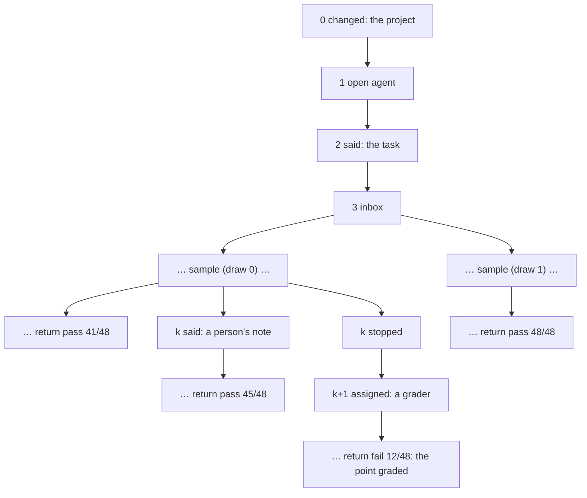

# Architecture: programs, the log, and the driver

Alaya has three parts, and each holds one responsibility:

- **Programs** decide. An agent, and every tool it calls, is a **program**: a tree of the
  operations it asks the world for — sample this request, run this command, read the clock, run
  this grader — each continued with its answer. A program carries out nothing itself.
  (`Alaya.Program`, `Alaya.Agent`, `docs/agent-api.md`)
- **The log** remembers. A run is a flat, append-only list of **events**: what arrived from
  outside, what the world answered, and marks of what the program did. Logs are kept as a
  forest of **entries**, each one event and the entry before it, named by the hash of the two.
  (`Alaya.Store`, `docs/log-schema.md`)
- **The driver** acts. It replays the program against the log to find what it does next, carries
  out the operation it asks for, and appends the answer — or appends the mark it makes — an
  entry at a time. It is the only part that touches the world. (`Alaya.Replay`, `Alaya.Driver`)

A person and a grader add to logs too. A person appends **notices** — the task, a message, a
change to the workspace, a reply to a question — or a **stop**, at any entry; appending where a
log already goes on is a fork. A **grader** is no part of a run's configuration: once its agent
is over, a run waits for a person to **assign** it one, a notice, calls it, and ends with its
verdict. So the verdict is in the log like everything else, and any point of any run is graded,
by any grader, by stopping a fork there and assigning one. `Alaya.Render` and `Alaya.Html` only read.

The design is the sketch in `functional_agents/` (`programs.pdf` lays it out, with the papers it
draws on); `Test/Prototype.lean` runs the sketch's own test against Alaya's interpreter and
checks that it prints the same lines. Alaya's runs differ from the sketch's in one thing, where
the grader comes from: in the sketch a run is created with its graders; here it waits for one
to be assigned, so a grader is chosen when a point is graded, never when a run is created.

| Module | Holds | Effects |
| --- | --- | --- |
| `Alaya.Program` | `Signature`, `Frame`, `ToolCall`, `Notice`, `Program`, `Run`, `Event`, `Log` | none |
| `Alaya.Replay` | the interpreter: `Machine`, `Replayer`, `Next`, `next` | none |
| `Alaya.Agent` | Alaya's signature `Agent`: `Op`, its answers, keys, JSON; `workspace?` | none |
| `Alaya.Agents.*` | tools, MiniSwe, MiniVero, the catalog | none |
| `Alaya.Run` | `RunConfig`, the run it builds, `configOf`, questions and replies | none |
| `Alaya.Store` | `Entry`, `Forest`, the store of entries | reads and writes `DATA/entries` |
| `Alaya.Driver` | `Runtime`, `Limits`, `Stop`, `drive`, `append` | the model, the executor, workspaces, the clock |
| `Alaya.Notices` | `create`, `changed`, `remove` | snapshots a person's directory |
| `Alaya.Walk`, `.Render`, `.Html` | the walk of the forest, text, the report | reads only |

## 1. Vocabulary

| Term | Meaning | Where |
| --- | --- | --- |
| **operation** | what a program asks the world for, with a type of answer | `Op`, `Op.Answer` |
| **program** | a tree of operations, failures, reads of the inbox, calls and loops | `Program` |
| **tool** | a program from a call's arguments to its result, under a name | `Agents.Tool` |
| **call** | a tool, by name, with its arguments; it runs in a frame of its own | `ToolCall` |
| **frame** | the path of calls from the run, each its ordinal among its parent's calls | `Frame` |
| **run** | the tools it has, the agent's call, and what follows the agent | `Run` |
| **notice** | what arrives from outside: `said`, `changed`, `replied`, `assigned` | `Notice` |
| **event** | one thing that happened: a notice, an answer, or a mark | `Event` |
| **log** | the events of a run, in order; flat and append-only | `Log` |
| **entry** | one event and the entry before it, named by the hash of the two | `Entry` |
| **forest** | every entry kept, with its parent and children | `Forest` |
| **branch** | the log from a root to an entry nothing follows | |
| **replay** | reading a log with the program, to continue it where it stopped | `Replayer` |
| **next** | what a run does after a log: ask, mark, wait, end, or find the log broken | `Next` |
| **draw** | one of the responses a model gives one request, numbered from 0 | the model cache |
| **version** | a snapshot of the workspace a command or a person left | `Snapshot` |

## 2. Programs

```lean
structure Signature where
  Op : Type ; Answer : Op → Type              -- the operations, each with its answer
  Key : Type ; key : Op → Key ; sameKey       -- what the log keeps of an operation
  Stored : Type ; store ; read                -- how the log keeps every answer

inductive Program (σ : Signature) : Type → Type 1 where
  | pure    : α → Program σ α
  | fail    : String → Program σ α                                     -- give up
  | perform : (op : σ.Op) → (Except String (σ.Answer op) → Program σ α) → Program σ α
  | inbox   : Option (Frame → Notice → Bool) → (List Notice → Program σ α) → Program σ α
  | call    : ToolCall → (Except String Json → Program σ α) → Program σ α
  | iter    : (S → Program σ (S ⊕ β)) → S → (β → Program σ α) → Program σ α
```

A program is the free monad on its signature with four constructors more. **`fail`** gives up,
up to the call it is in; `try` and `catch` are a function of the whole program (`attempt`) and
leave no mark. **`perform`** asks for an operation, continued with its answer or with the error
when the world could not give one. **`inbox`** reads the notices that arrived: a plain read takes
every one not yet read that is addressed to no one, so not a reply or a grader; a read that **waits** says which notices it is for, is
made only once one has arrived, and takes those. **`call`** names a tool and holds no body: the
interpreter runs the tool the run has under that name, in a child frame, and the call ends with
the tool's value or its failure — a call catches its tool's failure. **`iter`** is a loop whose
state is data: it goes round until a round gives a result, and a round must read an event, which
is what makes replay of a finite log end.

```lean
structure Run (σ : Signature) where
  tools : String → Option (Json → Program σ Json)   -- the tools of the run, by name
  call : ToolCall                                   -- the agent's call, in frame #[0]
  after : Except String Json → Program σ Json       -- what follows the agent
```

A run is the agent, called in frame `#[0]` with the run's configuration, and then what follows
it in the run's own frame `#[]`, given what the agent returned or its error. In Alaya what
follows is the run's grading (`Alaya.grading`): it waits for a grader to be **assigned**, a
notice that names it, calls the grader in `#[1]`, and returns its verdict, which is the result
of the run. A log has one grader; a point is graded again on a fork.

Alaya's signature is `Agent` (`Alaya.Agent`, `docs/agent-api.md` §2): `sample`, `exec`, `time`
and `external`.

## 3. The log

```lean
inductive Event (σ : Signature) where
  | arrived  (notice : Notice)                                    -- from outside, unasked
  | heard    (frame : Frame) (notices : Array Nat)                -- a read: the positions it took
  | answered (frame : Frame) (key : σ.Key) (answer : Except String σ.Stored)
  | opened   (frame : Frame) (tool : ToolCall)                    -- a call opens: the call itself
  | returned (frame : Frame) (value : Json)                       -- … and ends with its value
  | failed   (frame : Frame) (error : String)                     -- … or with its failure
  | stopped  (reason : String)                                    -- from outside: the agent ends
```

A log starts with its **root**, `arrived (changed workspace _)`: the workspace a run starts on.
Its second event is the opening of the agent's call, `opened #[0] ⟨"agent", config⟩`, so the log
holds the run's configuration — the agent, the model, the container — from there
on, and every later command builds the same run from the log alone (`Alaya.configOf`, in
`Alaya/Run.lean`).

*The opening of a run on a scripted model that asks a question, then runs a command.*

```
0  -      changed → 3f2a…: the workspace the run starts from
1  0      open agent: mini-swe, gpt-6-luna
2  -      said "Implement the language in SPEC.md"
3  0      inbox: takes [2]                 the agent's wait for its task
4  0      inbox: nothing                   the round's read
5  0      sample → ask_user Should I …?
6  0.0    open ask_user "Should I …?"
7  -      replied to 0.0: "yes"            a person's reply, checked against the question
8  0.0    inbox: takes [7]
9  0.0    return yes
10 0      inbox: nothing
11 0      sample → bash make
12 0.1    open bash "make"
13 0.1    exec make → exit 0, 9c1e…        the version of the workspace it left
14 0.1    return exit 0: …
```

Notices apart, a frame with its sub-frames is one interval of the log, from its opening to its
end, so the nesting of a run is in the log itself (Wu, Schrijvers and Hinze 2014). Once the
agent's call has ended, or a stop has ended it, the run is over; its log goes on only with a
grader and its call, and is complete when it ends with the return of the run's frame `#[]`, the
verdict.

## 4. Replay

Replay reads a log with the program, from its root: every answer is given back to the program
in order, to continue it where it stopped, and every mark — an opening, an end, a read — is
checked against the one the program makes. What it finds is `Next`:

| `Next` | The log … |
| --- | --- |
| `ask call` | ends where the program asks for an operation |
| `hears`, `opens`, `returns`, `fails` | ends where the program makes a mark |
| `waits frame` | ends where a read waits and nothing it is for has arrived; in `#[]`, where the agent is over and no grader is assigned |
| `done value`, `raised error` | is complete: the run returned its verdict, or its grader's call failed |
| `mismatch position` | holds an event there that is not what the program does |
| `unguarded frame` | the program went round a loop without reading an event |

A log that is no trace of the program is a result of its own, not an outcome of the agent: the
driver refuses to go on from it. Matching is by position, so a program changed after a log was
written reads it only up to its first changed operation.

A **stop** ends every frame of the agent, whatever the nesting, without marks; nothing in the
agent catches it, and what follows the agent runs, given the error `stopped`. A stop where the
agent is over is a mismatch. `agentEnd? log` reads off a log how its agent ended: returned,
failed, or stopped.

The interpreter keeps its continuation between events (`Machine`, `Replayer.feed`): the driver
feeds it an event at a time and never replays from the start, and a reader replays a whole log in
one pass. `next run log` is that machine folded over the log.

## 5. The forest

An entry is `{parent, event, elapsed_ms}`, named by the SHA-256 of `{parent, event}` — the time is
no part of the name. A name therefore stands for a whole log, and logs that share a prefix share
its entries: two continuations of an entry are a fork. Nothing is rewritten; a point of a run is
an entry, and its log is the path to it.



`Forest` is read from one listing of `DATA/entries`, whose file names hold each entry's name and
its parent's (`docs/log-schema.md` §5).

## 6. The driver

```lean
structure Runtime where          -- what a run is driven with
  store ; workspaces ; workDir ; outputsDir ; scratch ; executor ; workdir
  model? : Option Model          -- none when no provider was named
  graderUser? : Option String

structure Limits where           -- what one invocation allows; nothing of it is recorded
  samples? : Option Nat          -- responses this invocation may sample
  budgetMs? : Option Nat         -- the run's time, summed along its log, after which nothing starts

inductive Stop where
  | over (agent : AgentEnd) (verdict? : Option Json)  -- the agent is over; graded, with the verdict
  | waits (frame : Frame) (question? : Option Question) | paused (reason : String)

drive  : Runtime → Run Agent → (tip : Hash) → Limits → OnEntry → Result (Hash × Stop)
append : Store → Run Agent → (tip : Hash) → Event Agent → Result (Hash × Entry)
```

`drive` asks the machine what is next after the log at `tip` and either carries out the
operation — appending the answer — or appends the mark, until the agent is over and the run
waits for a grader, the run is graded, it waits for a person, or it reaches a limit. `append`
checks that the log can take what a person adds: a stop, a message, a change or a reply only
while the agent runs, a grader only once it is over and where none is assigned yet. Each entry records how long it took, so a run's time is the sum
along its log.

| Operation | Carried out by | Answer |
| --- | --- | --- |
| `sample request` | the model: draw `n` of the request, `n` the responses the tip already has as children | `Chat.Response` |
| `exec command config` | the executor, in the work directory restored to the version the log has reached | the output, and the version it left |
| `time` | the driver's clock: the run's time along the log, and this invocation's budget | `Timing` |
| `external command image input timeout` | a fresh container on a checkout of the workspace, `input` at `/grader` | stdout, stderr, the checkout as it left it |

**Draws.** A sample from an entry with no sampled continuation takes draw 0 — so a run that
crashed after its model answered takes the response the cache kept — and one from an entry that
has `n` takes draw `n`: running a point again is a new draw, a fork.

**Failures.** A model's refusal of a request as too long for its context is logged as the
operation's answer, an error in the provider's words, which the program deals with: trying again
would not help, and it says something of the run. MiniSwe catches it and ends with
`ContextExceeded`, as it does before a request it knows would not fit. Any other failure is not
the program's — a provider that cannot be reached after Alaya's retries, a key or a request it
rejects, a response it garbles, a full disk — and stops the driver with nothing logged for the
operation; the next `run` asks for it again. A command happens at least once: what it does
beyond the workspace may happen twice.

**Limits** are checked before an operation of the agent and before a read of its inbox, so a run
paused at one stops where a message a person appends is heard at once. A limit writes nothing,
and holds the agent only: a grader runs to its end.

## 7. How the parts coordinate

| Command | Programs | Log and forest | Driver |
| --- | --- | --- | --- |
| `alaya new` | the run built from its configuration | the root, the agent's opening, the task | — |
| `alaya run` | replayed, then driven | an entry per event | `drive` |
| `alaya tell`, `commit`, `reply`, `stop` | replayed, to check the event fits | one entry | `append` |
| `alaya grade` | replayed, then driven | a stop if the agent runs, the notice that assigns the grader, then an entry per event | `append`, `drive` |
| `alaya log`, `show`, `tree`, `waiting`, `html` | replayed, for what each point asked and what comes next | read | — |

The program never sees how an event arrived: a person's reply and a command's output are both in
its log, and its next decision is replay of that log. The forest never interprets an event. The
driver never decides: it does what replay says and appends what happened.

## 8. Invariants

1. **Names.** An entry's name is the hash of its parent's name and its event; nothing under a
   name changes, and a log only grows.
2. **Traces.** Every log the driver writes is a trace of its run's program: at every prefix,
   `next` is the event the log goes on with. A log that is not is refused, never driven.
3. **Configuration.** A run's configuration is the arguments of its agent's call, the second
   event of its log; nothing else records it.
4. **Brackets.** Every call is opened, and ends with a return or a failure, unless a stop ends
   the agent; frames nest as calls do. The run's own frame returns once, with the verdict of the
   one grader a log has.
5. **Workspace.** The version a log has reached is the last one a command or a change from
   outside left; every command runs there, and every snapshot a remaining entry names is kept.
6. **Draws.** A sample from an entry with `n` sampled continuations is draw `n` of its request.
