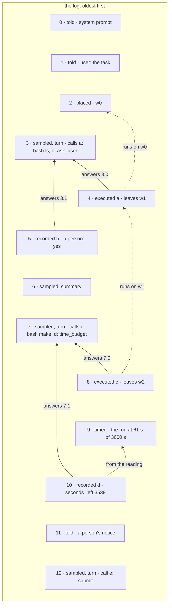
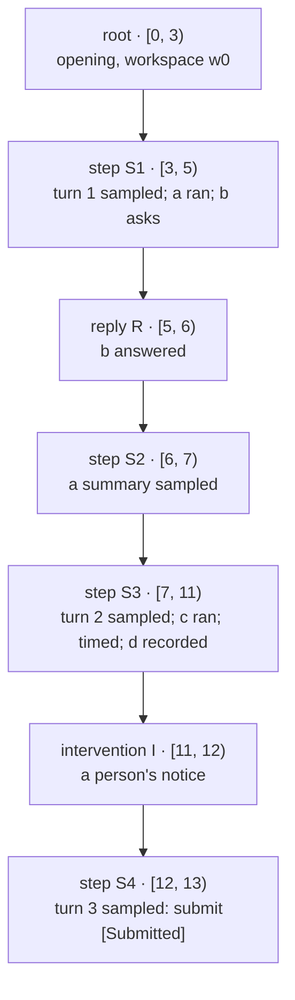
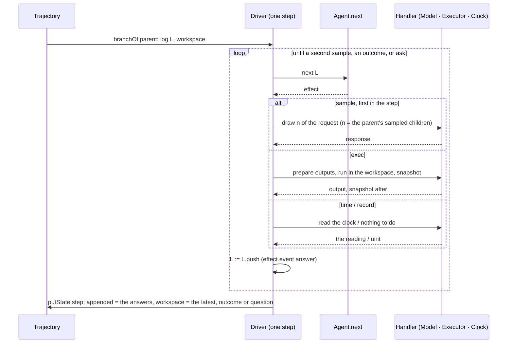

# Architecture: the agent, the trajectory, and the driver

Alaya has three parts, and each holds one responsibility:

- **The agent** decides. It is a pure function from the log of a run to the next thing it asks
  for, an **effect** — a description of what to do, which it never does itself — or to the
  **outcome** the run ends with. (`Alaya.Agent`, `docs/agent-api.md`)
- **The trajectory** remembers. It records a run as a tree of immutable, content-addressed
  **states**, each holding a slice of the log. (`Alaya.Trajectory`, `docs/trajectory-schema.md`)
- **The driver** acts for the agent. Its **handler** answers the agent's effects — samples the
  model, runs commands, reads the clock — and its loop records each answer as an event in a new
  state. It is the only part that carries out what the agent asks. (`Alaya.Driver`)

Two other things add to a trajectory, and neither is the agent's: a **person**, who creates a
root and later edits the workspace, tells the agent something, or answers its question
(`Alaya.Trajectory.Interventions`), and a **grader**, which records a verdict on a state
(`Alaya.Trajectory.Evaluation`). What a person adds enters the agent's log as events from the
world; a verdict never does. `Alaya.Trajectory.Render` and `Alaya.Trajectory.Html` only read.

| Module | Holds | Effects |
| --- | --- | --- |
| `Alaya.Agent`, `Alaya.Agent.*` | events, logs, effects and their answers, the index, `Agent`, tools, combinators, MiniSwe | none |
| `Alaya.Trajectory` | event JSON, `State`, `Kind` and its rules, the store, `Branch`, queries | reads and writes the store |
| `Alaya.Driver` | `Runtime`, `Limits`, `Stop`, `resume`, `buildModel` | the model, the executor, workspaces, the clock |
| `Alaya.Trajectory.Interventions` | `createRoot`, `commit`, `tell`, `reply` | snapshots a person's directory |
| `Alaya.Trajectory.Evaluation` | `evaluate` | runs a grader's container |
| `Alaya.Trajectory.Render`, `.Html` | `show`, `tree`, `diff`, the HTML report | none beyond reading |

This page defines every data structure the three share, how each is built from the others, and
how they coordinate. The other pages go deeper into one part each.

## 1. Vocabulary

| Term | Meaning | Where |
| --- | --- | --- |
| **event** | one thing that happened, recorded verbatim | `Agent.Event` |
| **log** | the events of a run, in order; flat and append-only | `Agent.Log := Array Event` |
| **position** | an event's index in the log; it never changes on a branch | `Nat` |
| **world event** | what the world did unasked: the agent was `told` something, or a workspace was `placed` | |
| **snapshot** | the identifier of a workspace's files at one moment: a `Hash`, named for what it identifies | `Alaya.Snapshot` |
| **answer** | an event that answers one of the agent's effects | |
| **effect** | what the agent asks for: a description, with a type of answer | `Agent.Effect`, `Effect.Answer` |
| **outcome** | why a run stopped, and what it produced | `Agent.Outcome` |
| **handler** | what answers an effect inside the driver: the model, the executor, the clock | |
| **call** | a tool call the model made in a response | `Chat.ToolCall` |
| **call reference** | a call, named by the position of its response and its index there | `Agent.CallRef` |
| **purpose** | what a sample was for: `turn`, a model turn, or `other name`, as the agent names it | `Agent.Purpose` |
| **model turn** | a response for `turn` and its calls, wherever their answers are | `Agent.Turn` |
| **index** | what a log says — its model turns, calls, workspaces — read off it in one pass | `Agent.Index` |
| **state** | a node of the trajectory tree: a parent, a slice of the log, a workspace | `Trajectory.State` |
| **step** | a state the driver writes: answers to the agent's effects, at most one sample, first | `Kind.step` |
| **branch** | the states from a root to a state: that state's log, a slice at a time | `Trajectory.Branch` |
| **draw** | one of the sequence of responses a model gives one request, numbered from 0 | the model cache |

Two words are easy to confuse, and the API keeps them apart. A **model turn** is about the log:
a response the agent sampled to act on, with the calls in it. A **step** is about the tree: a
state the driver wrote. A step starts at most one model turn; a model turn can be answered over
several states (§5).

## 2. The log

### 2.1 Events

```lean
inductive Event where
  | told        (message : Chat.Message)
  | placed      (snapshot : Snapshot)
  | sampled     (request : Hash) (purpose : Purpose) (response : Chat.Response)
  | executed    (call : CallRef) (command : String) (config : Executor.Config)
                (output : Output) (snapshot : Snapshot)
  | recorded    (call : CallRef) (content : Json)
  | timed       (runTimeMs : Nat) (budgetMs? : Option Nat)

abbrev Log := Array Event

Event.isAnswer : Event → Bool    -- an answer to an effect, or what the world placed
```

| Event | Sort | Answers | What it holds |
| --- | --- | --- | --- |
| `told` | world | — | text placed as is: the agent's opening prompts, a person's notice |
| `placed` | world | — | a snapshot the world placed as the workspace: the project, a person's edit |
| `sampled` | answer | `sample` | the model's response, the digest of the request, and its purpose |
| `executed` | answer | `exec` | the call it answers, the script, how it ran, the output, the snapshot it left |
| `recorded` | answer | `record`, `ask` | a call's result that no command produced: the agent's own, or a person's reply |
| `timed` | answer | `time` | how long the run has taken so far, and the invocation's time budget |

### 2.2 References between events

An event refers to earlier events in three ways, and only backwards:

- **A call and its answer.** An `executed` and a `recorded` each name the call they answer by a
  `CallRef`: the position of the response that made the call, and the call's index in it.
  The call's id is not in the reference: it is read off the log, like the call (`Index.callId?`).
  An answer never names its call by recency or by its id, so a sample
  taken in between cannot hide the call, and a provider that reuses an id cannot make one answer
  count for two calls.

  ```lean
  structure CallRef where
    response : Nat     -- the log position of the response that made the call
    index : Nat        -- which of its calls
  ```

- **A workspace and the commands on it.** A `placed` and an `executed` each name a `snapshot`:
  where the workspace is after the event. The latest one named is where the log *is*
  (`Index.workspace?`), and a command always runs
  there: the snapshot before it is the one named last before it. A run's workspace only moves
  forward, so what the model is shown of its files never contradicts what it did to them.
- **A response and everything before it.** A response records the digest of the request it was
  sampled from, and that request is a function of the whole log before it (§4, invariant I1).

*The example run used throughout this page — an agent with `bash`, `ask_user` and
`time_budget` that also compacts its context with a summary — as its log, by position, with
what refers to what.*



Solid arrows are call references; dotted ones are the workspace chain and a value the agent
derived. Every response also depends on all the events before it, through its request (not
drawn).

### 2.3 The index

The structure of a log is read off it, never stored beside it. `Log.index` reads the log once,
oldest first, into an `Index`; being a function of the log, it cannot disagree with it.

```lean
structure Call where
  ref : CallRef
  call : Chat.ToolCall
  answer? : Option Nat           -- the position of the event that answered it

structure Turn where             -- a model turn
  position : Nat                 -- its response's
  response : Chat.Response
  calls : Array Call

structure Index where
  turns : Array Turn             -- the responses for turn, oldest first
  responses : Nat                -- how many responses, of any purpose: the model calls made
  turnOf : Array Nat             -- per position: the model turn it is part of, from 1; 0 before the first
  workspace? : Option Snapshot   -- the latest snapshot named
  workspaces : Array Snapshot    -- every snapshot named
  calls : Array Chat.ToolCall    -- every call made

Log.index : Log → Index
Index.lastTurn? : Option Turn
Index.pending : Array Call       -- the latest model turn's calls nothing has answered
Index.call? : CallRef → Option Call
Index.callId? : CallRef → Option String   -- the call's id, as the model gave it
Log.checkAnswers : Log → (start : Nat) → Except String Unit   -- what is wrong with the answers from start on
```

**Model turns partition the log.** An event belongs to the model turn of the latest `turn`
response at or before it (`turnOf`); events before the first belong to none. A response of
another purpose does not start a model turn: it belongs to the one it was sampled in.

*The example log, partitioned into model turns.*

```
position   0    1    2    3    4    5    6    7    8    9    10   11   12
event      told told plcd smpl exec rec  smpl smpl exec tmd  rec  told smpl
purpose                   turn           summ turn                     turn
turnOf     0    0    0    1    1    1    1    2    2    2    2    2    3
           └── before ──┘ └──── turn 1 ─────┘ └────── turn 2 ──────┘  └ 3 ┘
```

Turn 1 holds its response, the answers to its calls `a` and `b`, and the summary sampled after
them; turn 2 holds its response, the answers to `c` and `d`, and a person's notice; turn 3 is
the submission. `Index.pending` after position 4 is `[b]`; after position 6 it is still `[]`,
since `b` was answered at 5 — and a summary at 6 could not have hidden `b` if it had not been.

## 3. Effects and answers

```lean
inductive Effect where
  | sample (purpose : Purpose) (request : Chat.Request)
  | exec   (call : CallRef) (command : String) (config : Executor.Config)
  | record (call : CallRef) (content : Json)
  | time
  | ask    (call : CallRef) (question : Question)

Effect.Answer   : Effect → Type                                    -- what answers an effect
Effect.event    : (effect : Effect) → effect.Answer → Event        -- how its answer is recorded
Effect.answer?  : (effect : Effect) → Event → Option effect.Answer -- whether an event answers it
Effect.describe : Effect → String
```

| Effect | `Answer` | Handled by | Recorded as | Which identifies it by |
| --- | --- | --- | --- | --- |
| `sample p r` | `Chat.Response` | the model: a draw of `r` | `response d p resp` | the purpose, and `d = requestDigest r` |
| `exec c s cfg` | `Output × Snapshot` | the executor, in the workspace, as `cfg` says | `executed c s cfg out w'` | the call, script and config |
| `record c v` | `Unit` | nobody: the agent computed `v` | `recorded c v` | the call and the value |
| `time` | `Nat × Option Nat` | the driver's clock | `timed ms budget` | — |
| `ask c q` | `Reply` | a person, later, through `alaya reply` | `recorded c answer` | the call, and a reply `q`'s form accepts |

`event` and `answer?` are the only place this pairing is written: the driver records
`effect.event answer`, a reply is the `event` of its question's `ask`, and a reply is checked
against that question with `answer?`.

The end of a run is not an effect. `next` gives `Effect ⊕ Outcome`: `.inl effect`, or
`.inr outcome`, which nothing answers.

`Executor.Config` is part of the command: its `timeoutSeconds`, its `env`, and `outputs`, whether
it sees the whole output of every earlier command of its branch as files under `/alaya/outputs`
(`Agent.outputFile position id?`).

## 4. The agent

```lean
structure Agent where
  config : Json                       -- its complete configuration: what a root records
  initialLog : String → Uname → Log   -- its opening for a task, on a machine
  next : Log → Effect ⊕ Outcome       -- the whole policy
```

That is all an agent is. Everything it does — what the model is sent, which tools it offers,
which commands run and how — is in the effects `next` gives, so all of it is recorded.

**Invariant I1 (what a response answers).** The response at position k was sampled from the
request of `next (log.take k)`, and records that request's digest. Readers rely on nothing else:

```lean
Agent.request?  : Agent → Log → Option Chat.Request          -- next's request, when it samples
Agent.requestAt? : Agent → Log → Nat → Option Chat.Request   -- the request response k answered,
                                                             -- if this agent still makes it
contextTokens : (Log → Effect ⊕ Outcome) → Log → Dialogue → Nat   -- a request's size, from the latest usage
```

**Built from parts.** An agent is data and pure functions, so it is built from smaller ones:

- **Tools** (`Alaya.Agent.Tools`), each a `Tool`: its definition, whether it must be called alone,
  an instruction appended to the prompt, and `read`, which turns a call into what to ask for
  next for it, from the log: the effect that answers the call, or the outcome that ends the
  run. `bash` is `exec`; `submit` is `Submitted`; `ask_user` is `ask`; `time_budget` is `time`,
  then, once the log holds the timing, `record`.
  An agent holds a list of them and owns the rest: parsing, prompts, the view.
- **Combinators**, `Agent → Agent`, each an `interpose`, which rewrites what `next` gives:
  `limitResponses n` and `limitContext n` turn a `sample` into an outcome; `runCommandsWith cfg`
  sets how every `exec` runs.
- **MiniSwe** (`docs/miniswe.md`): a view of the log, a parser over its tools, mini's control
  flow as `next`, wrapped in the three
  combinators. MiniVero is MiniSwe with Vero's prompts.

## 5. The trajectory

### 5.1 States

```lean
structure State where              -- what every state holds
  parent? : Option Hash
  workspace : Snapshot             -- where the run is: the latest snapshot its log names
  kind : Kind
  appended : Log                   -- this state's slice of the log

inductive Kind where               -- what produced a state, with what only that kind holds
  | root (root : Root)
  | step (elapsedMs? : Option Nat)                  -- its wall-clock time
         (stop? : Option (Outcome ⊕ Asked))         -- how it stopped the run, if it did
  | intervention (intervention : Intervention)
  | evaluation (evaluation : Evaluation)
  | reply

structure Root where               -- what a run is created with; no other state repeats it
  agent ; model : Json             -- the complete configurations
  image ; workdir : String         -- the container every command of the run runs in
  task? : Option String            -- for a reader; the agent has it in its opening log

structure Asked where              -- what a step that waits has asked: the `ask` it stopped at
  call : CallRef ; question : Question

structure Intervention where
  message : String                 -- what the person said: a tell's whole, or what a commit says of its change
  changed : Array String           -- what a commit changed, a line a path; empty for a tell

structure Evaluation where
  command ; graderImage ; input? ; status ; checks ; reason ; returncode? ; elapsedMs ; stdout ; stderr
  checkout : Snapshot              -- the files as the grader left them

State.root? ; State.outcome? ; State.question? ; State.elapsedMs?
State.intervention? ; State.evaluation?            -- read off the kind
State.snapshot : Snapshot          -- the files a reader is shown: an evaluation's checkout, else the workspace
runOf : Store → Hash → Result Root -- what the run of a state was created with, from its root
```

A state is a sum by kind: a step cannot hold a verdict, a reply cannot hold an outcome, and a
step ends the run or waits on a question, never both. Nothing is held twice: the image, the
workdir, the agent and the model are the root's, and every other state reads them there
(`runOf`); a provider's refusal is the `reason?` of the outcome it explains; a verdict's files
are the verdict's, so `workspace` means one thing on every state. The stored object is the
same shape, field for field (`docs/trajectory-schema.md` §6).

A state's hash covers its content, so a hash names its whole history; nothing under a hash ever
changes, and a run only grows: continuing from any state adds a child.

**What each kind may hold** — checked by `putState` (`State.validate`), which refuses a state
that breaks it:

| Kind | Written by | `appended` |
| --- | --- | --- |
| `root` | `alaya root` | the agent's opening `told`s, then one `placed`: the project |
| `step` | `resume` | answers only — no `told`, no `placed` — with at most one `sampled`, and only first |
| `intervention` | `alaya commit` / `alaya tell` | `placed` then `told` (a commit), or `told` alone (a tell) |
| `reply` | `alaya reply` | one `recorded`, answering the parent's question |
| `evaluation` | `alaya eval` | nothing: the verdict is a field; always a leaf |

So **world events live only in roots, interventions, and replies**, and **answers live only in
steps and replies.** A step ends before a second sample, at an outcome, at `ask`, or at a provider's
refusal; it can be empty (a stop with nothing to do), start with a sample, or start with other
effects (calls left pending by a reply).

**What a state must agree with in its branch** — checked by `putState` too
(`State.continues`), against the parent and the log before it:

| Rule | Refused |
| --- | --- |
| nothing grows from an evaluation | a step under a verdict |
| a state that waits grows only by a reply, which answers its question; an evaluation is a verdict on any state | a step under a question; a reply to another call, or where nothing is asked |
| each answer names a call made before it that nothing has answered (`Log.checkAnswers`) | an answer to no call; a second answer to a call |
| its `workspace` is the latest snapshot its log names | a workspace the log does not name; an evaluation at its checkout |

### 5.2 Branches

The log at a state is the concatenation of the `appended` of the states from the root to it:
its **branch**.

```lean
structure Branch where states : Array (Hash × State)     -- root → state

branchOf : Store → Hash → Result Branch
Branch.log : Log                   -- the state's log
Branch.tip : Hash × State          -- the state itself
Branch.root : Hash × State
Branch.elapsedMs : Nat
```

**States partition the log.** Every position is in exactly one state's `appended`, in order: a
state's slice begins where the events of the states above it end, which for the branch's own
state is `log.size - appended.size`. Nothing stores these positions; a reader that wants one
adds up the slices before it.

*The example log, partitioned both ways.*

```
position   0    1    2  │ 3    4  │ 5  │ 6  │ 7    8    9    10 │ 11 │ 12
state      root         │ step S1 │ R  │ S2 │ step S3           │ I  │ S4
kind       root         │ step    │rep.│step│ step              │int.│ step
           opening + w0 │ sampled │    │sum.│ sampled           │tell│ sampled
model turn 0    0    0  │ 1    1  │ 1  │ 1  │ 2    2    2    2  │ 2  │ 3
```

*The same run as a tree. Each state's slice is in brackets.*



### 5.3 How the two partitions relate

- **A model turn starts at the start of a step.** A step samples only first, so every `turn`
  response is the first event of the step that sampled it, and that step's `sampled` is true.
- **Not every step starts a model turn.** S2 samples a summary; a step after a reply may sample
  nothing and only stop, or start with a command left pending.
- **A model turn can span states.** Turn 1 starts in S1, whose step ends at the `ask`; its call
  `b` is answered in the reply R; the summary S2 is part of it too. Its calls are joined to their
  answers through call references, whichever state holds them (`Index.call?`).
- **A step never spans model turns.** A second sample ends it, so a step holds the start of at
  most one model turn, plus answers to calls of the latest one.

## 6. The driver (`Alaya.Driver`)

```lean
structure Runtime where            -- what a run runs on
  store : Store ; workspaces : Workspaces ; workDir ; outputsDir ; executor : Executor
  model : Model ; agent : Agent

structure Limits where             -- what one invocation allows; neither is recorded
  budgetMs? : Option Nat           -- the run's time, summed from the root, after which no step starts
  steps? : Option Nat              -- the steps this invocation may take

inductive Stop where               -- why a resume stopped
  | outcome (Outcome) | question (Question) | outOfTime | outOfSteps

resume : Runtime → Hash → Limits → (onStep : Hash → Result Unit) → Result (Hash × Stop)
```

`resume` takes steps from a state until one stops the run or the invocation reaches a limit.
One step asks `next`, has the **handler** answer the effect, records `effect.event answer`, and
asks again, until the agent wants a second sample, gives an outcome, or asks a person; then it
writes the child state. How a step stopped the run is `Option (Outcome ⊕ Asked)`, the same
value its state stores (§5.1): nothing, when the run goes on.

The handler is internal to the driver: it carries out one effect and gives its answer, typed by
the effect, or nothing when the answer comes later from outside the run, as a person's does to
`ask`. It is the one place that touches the world, through three interfaces nothing else calls:

| Behind the handler | Interface | Holds |
| --- | --- | --- |
| `Model` | `sample : Request → Result Stream`; `Stream.nextN` | provider, retry, batching, the persistent cache of draws per request |
| `Executor` | `exec : Config → workDir → argv → display → IO Output` | one container per run |
| `Workspaces` | `snapshot`, `materialize`, `diff`, `readFiles`, `listEntries`, `retainOnly` | the restic repository |

*One step, as the driver carries it out.*



**Draws.** Every sampled child of a state answers the same request — the request of `next` of the
parent's log — so its children with a response are draws 0, 1, 2, … of one sequence, which the
model cache keeps. A new continuation takes draw `n`, where `n` counts the parent's children
that sampled; a fork is a new draw, a replay is the same one.

**Limits.** `--time-budget` and `--steps` are checked between steps, never inside one, since a
step cut between its calls would leave calls unanswered. A limit writes nothing: a later
`resume` goes on from the same state.

## 7. How the parts coordinate

| Operation | Agent | Trajectory | Driver |
| --- | --- | --- | --- |
| `alaya root` | `initialLog task uname` | `createRoot`: a root of the opening and the project's workspace | `uname` from the image |
| `alaya resume` | `next`, once per effect | `branchOf` the start; `putState` each step | `resume`: the handler, the draws, the limits |
| `alaya commit` / `tell` | — | an intervention: world events | — |
| `alaya reply` | — | a reply: the `event` of the question's `ask`, with the person's answer | — |
| `alaya eval` | — | an evaluation leaf | the grader's container |
| `show --request`, `html` | `requestAt?`: I1, checked against the digest | `branchOf`: the log, and where each state's slice begins | — |

The agent never sees how an event arrived: a person's reply and a command's output are both
answers in its log, and its next decision is `next` of that log. The trajectory never interprets
an event beyond its kind's shape rules. The driver never decides: it does what `next` says and
records what happened.

## 8. Invariants

1. **I1 — responses.** The response at position k answers `next (log.take k)`'s request, whose
   digest it records.
2. **Answers.** Every `executed` and every `recorded` names, by
   `CallRef`, a call made earlier; each call is answered at most once: checked when a state is
   written. Every answer in a step is `effect.event answer` for the effect `next` asked for there.
3. **Kinds.** Each state holds only what its kind may, and agrees with the branch it grows
   (§5.1): checked when it is written.
4. **Steps.** A step samples at most once, and only first; so every sampled child of a state is
   a draw of one request.
5. **Partitions.** A branch's states partition its log; a model turn starts at a step's start.
6. **Workspaces.** A state's workspace is the latest snapshot its log names, checked when it is
   written; every snapshot an event names is kept while the state holding it is.
7. **Immutability.** A state's hash covers its parent, its events and its workspace; nothing under
   a hash changes, and a run only grows.
