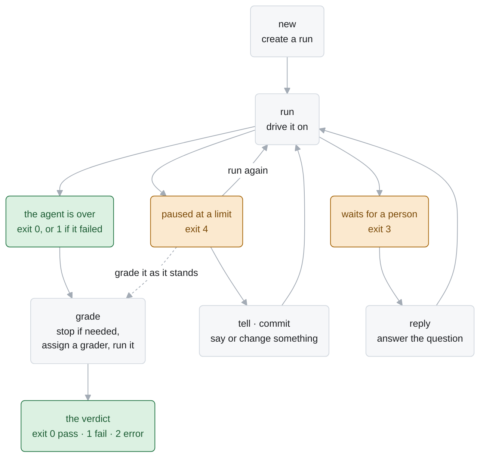
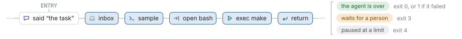
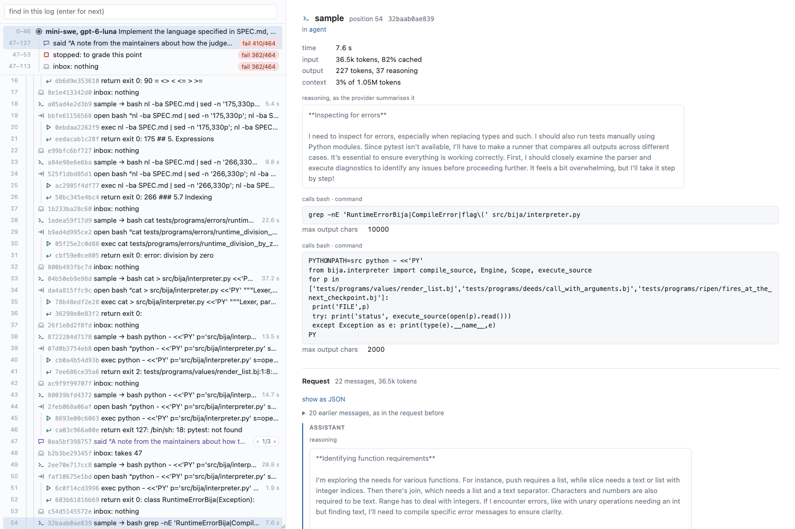

# The `alaya` command line

`alaya` drives runs from a shell, a script, a UI, or an agent such as Claude Code. A run is a
log, a point of a run is an **entry**, and every command takes the entry it acts at: it appends
after it, or reads at it. There are no states, and acting at an entry that already goes on is a
fork. What a log is and how it is kept are `docs/agent-api.md` and `docs/log-schema.md`.



## 1. Commands

```
alaya new [PROJECT] (--task TEXT | --task-file FILE) --agent NAME --model NAME --image IMAGE
          [--workdir PATH] [--set PATH=VALUE …]      create a run
alaya run ENTRY [--provider NAME [--url URL] [--port N]] [--samples N] [--time-budget S]
          [--container-user UID:GID] [--network NAME]   drive a run on
alaya tell ENTRY TEXT                                append a person's message
alaya commit ENTRY DIR [--message TEXT]              append a change to the workspace
alaya reply ENTRY (TEXT | --unavailable)             answer the question the log waits on
alaya stop ENTRY [--reason TEXT]                     stop the agent there
alaya grade ENTRY --grader CMD [--grader-input DIR] [--grader-image IMAGE] [--grader-timeout S]
                                                     grade the run at ENTRY
alaya comment ENTRY TEXT                             append a comment, for a reader
alaya rm ENTRY                                       delete ENTRY and everything after it

alaya tree                                           the forest: runs, stretches of entries, forks
alaya log ENTRY                                      the log that ends at ENTRY, an event a line
alaya show ENTRY [--request]                         one entry in full
alaya waiting                                        every log that waits for a reply
alaya ls ENTRY [PATH]                                list a directory of the workspace at ENTRY
alaya cat ENTRY PATH                                 print a file of the workspace at ENTRY
alaya checkout ENTRY DIR                             write the workspace at ENTRY into DIR
alaya diff A B                                       the workspace changes between two entries
alaya html FILE [--hide DIR]                         write the forest as one page, for reading

alaya config [--agent NAME] [--model NAME] [--set PATH=VALUE …]   what there is, or what new would record
alaya help [COMMAND]                                 what a command takes
```

- **`ENTRY`** is an entry's name, or any prefix of it no other name has, or `PREFIX:N`: the
  entry at position `N` of that entry's log, from 0. `4f2c8b:120` is the log of `4f2c8b` as it
  stood after its event at position 120.
- **`--data DIR`** names the data directory, on every command but `config` and `help`. Without
  it a command reads `ALAYA_DATA`. There is no default, so a command run from the wrong place
  cannot quietly begin a new directory; `new` creates one.
- **`--json`** and **`--help`** are taken by every command.

A session in a script:

```sh
tip=$(alaya new ./project --task-file TASK.txt --agent mini-swe --model gpt-6-luna \
  --image my-task:1 | tail -n 1 | cut -d' ' -f1)
end=$(alaya run "$tip" --provider apiyi | tail -n 1 | cut -d' ' -f1)
alaya grade "$end" --grader 'python3 /grader/grade.py' --grader-input ./hidden
```

## 2. Reading a command line

- The command comes first. Every command declares what it takes (`Alaya.Cli`).
- An option a command does not take is refused, with the nearest one it does take.
- A valued option takes the next token, or its value after `=` (`--task=--literal`), and is
  given once unless it repeats (`--set`).
- After `--` everything is an argument: this is how a text that begins with `-` is given.
- Every problem of a command line is reported at once.
- `alaya help`, `alaya help COMMAND` and `alaya COMMAND --help` print what a command accepts;
  `alaya help --json` describes every command as data.

## 3. Output

A command prints text for a reader, and JSON with `--json`.

A command that appends prints each entry it appends on a line of its own: the entry's full name,
its position, its frame, and its event in a few words.

```
d176eb02…5235  2  -    said "Create hello.txt"
b064afdd…73b   3  0    inbox: takes [2]
1cd9bd3f…4e6   4  0    sample → bash ls -la && cat README.md
310195fb…959   5  0.0  open bash "ls -la && cat README.md"
```

The last line is the entry the log now ends at, which a script takes with
`tail -n 1 | cut -d' ' -f1`. `run` and `grade` say how they stopped on stderr: `done: pass
48/48`, `stopped: fail 12/48`, `waits for a reply: …`, `paused: …`.

With `--json`, a command prints one object a line:

| Command | Object |
| --- | --- |
| a command that appends | each entry: `{entry, parent, position, frame, summary, event, elapsed_ms}` |
| `run`, `grade` | then how it stopped: `{entry, status, …}`. `status` is `done` with `value`, `failed` with `error`, or `stopped` with `reason`, each with `verdict`, `null` until graded; or `waits` with `frame` and `question`; or `paused` with `reason` |
| `config` | a line for each `{agent}`, `{model}` and `{provider}`; with `--agent` or `--model`, the one `{agent, model}` that `new` would record |
| `tree` | every entry: `{entry, parent, position, summary, status}` |
| `log` | every entry of the log: `{entry, position, frame, event, elapsed_ms}`, then `{next}` |
| `show` | `{entry, parent, position, event, elapsed_ms, run_time_ms, run_usage, workspace, calls, next, request}` |
| `waiting` | every waiting log: `{entry, frame, question, question_type, options}` |
| `ls` | `{entry, snapshot, path, entries}`, each `{name, path, kind, size}` |
| `cat` | a preview: `{entry, snapshot, path, kind, content, size}` |
| `checkout` | `{entry, snapshot, directory}` |
| `diff` | `{changes}` |
| `html` | `{file, bytes}` |
| `rm` | `{removed}` |

## 4. Failures and exit status

Statuses 0 to 4 are outcomes. A failure has one of six statuses above them, the same for every
command.

| Status | Means | What to do |
| --- | --- | --- |
| 0 | success; `run`: the agent is over, returned or stopped; `grade`: a pass | |
| 1 | `run`: the agent failed; `grade`: a fail | look at the log |
| 2 | `grade`: an error: the grader did not finish, or printed no complete TAP | look at the grader's answer |
| 3 | `run`: the run waits for a person | `reply` or `tell`, then `run` from the new entry |
| 4 | `run`: a limit paused it | `run` from the entry it printed last |
| 64 | `usage`: the command line does not parse | fix the command line |
| 65 | `input`: it names something not there, in the wrong condition, or malformed | fix the request |
| 69 | `environment`: the machine lacks docker, an image, restic or an API key | fix the machine |
| 74 | `storage`: the data directory could not be read or written | look at the data directory |
| 75 | `transient`: another command is writing the data directory, or the provider is unreachable or throttling after alaya's own retries | try again later |
| 76 | `model`: the provider rejected the request, or answered it wrongly | fix the model's settings, or the key |

- **The five from `input` on are the classes of `Alaya.Error`** (`docs/llm-api.md` §7).
- **A failure prints** `error: MESSAGE` on stderr, or with `--json` one object:
  `{"error": CLASS, "message": …}`, with `status` and `retry_after_ms` for an HTTP failure.
- **A failed `run` keeps every entry it appended.** The operation it was carrying out is asked
  for again by the next `run` from the entry it printed last.
- **One writer at a time.** A command that writes holds the directory's lock from start to
  end, and a second writer is refused at once, with 75 and the holder's pid. Commands that only
  read take no lock, so a run can be watched while it grows. Work in parallel goes to several
  data directories, one for each worker or arm of an experiment.

## 5. Commands that write

Each appends entries after `ENTRY` and prints them (§3). In the figures, a blue entry is one the
command appends.

### `new`

Creates a run: its workspace, the opening of its agent, and its task.

```sh
alaya new ./project --task-file TASK.txt --agent mini-swe --model gpt-6-luna --image my-task:1
```


- **The task** is `--task TEXT` or `--task-file FILE`, one of the two. A file is read as it is
  and must be UTF-8; stdin is `/dev/stdin`.
- **The agent and the model** are named: `--agent mini-swe` or `mini-vero`, and `--model` by
  the model's ID as its creator publishes it. Their defaults are in code, and there are no
  configuration files.
- **`--set PATH=VALUE`** overrides one field, and repeats. `PATH` starts with `agent.` or
  `model.` (`agent.tools=["bash","submit","ask_user"]`, `model.params.reasoning_effort=high`).
  `VALUE` is read as JSON when it parses, and as a string otherwise. An unknown field or a value
  of the wrong type is an input error.
- **The image** is resolved to a digest and recorded: every command of the run runs in it. The
  workspace is mounted at `--workdir`, `/workspace` unless given: an absolute path other than
  `/`, `/grader` and `/alaya/outputs`.
- **Without `PROJECT`**, the image's own workdir is copied out as the workspace the run starts
  from. So task images that hold their project in place, such as SWE-bench's at `/testbed`,
  work as they are.
- **No grader.** A grader is given to `grade`.

### `run`

Replays the log that ends at `ENTRY` and drives it on, until the agent is over, the run waits
for a person, or it reaches a limit.

```sh
alaya run 4f2c8b --provider apiyi --samples 50 --time-budget 3600
```



- **`--provider NAME`** says who serves the run's model, for this invocation alone, and is
  needed only when the run samples. A provider that cannot serve the model as the run recorded
  it is refused before any request (`docs/llm-api.md` §6). `dgx` also takes `--url` and `--port`.
- **`--samples N`** pauses before the agent's `N+1`th response of this invocation, and
  **`--time-budget S`** once the run's time along its log is spent. Neither is recorded. A
  paused run is driven on by a later `run`, and a person may append there first.
- **Containers** run with no network unless `--network NAME` gives one, and as
  `--container-user UID:GID`.
- **A log that is no trace of its run's program** is refused (65): one edited by hand, or
  written by another version of the agent.
- **From an entry where a `grade` was interrupted**, `run` runs the grader that was assigned.

### `tell`

Appends what a person says.

```sh
alaya tell 4f2c8b:140 'The parser is fine; look at the evaluator.'
```


The agent reads it at its next read of its inbox, which MiniSwe makes at the start of every
round. It is refused once the agent is over, where no one would read it.

### `commit`

Appends a change to the workspace: the files of `DIR`, and the list of what changed.

```sh
alaya checkout 4f2c8b ./edited          # the workspace as the log has it
$EDITOR ./edited/src/eval.py
alaya commit 4f2c8b ./edited --message 'Fixed the evaluator.'
```


The notice lists each change — `M path`, `+ path`, `- path` — with the message after the list,
and the agent reads it like a message. A directory with no change is refused.

### `reply`

Answers the question the log waits on (`docs/agent-api.md` §7).

```sh
alaya waiting                              # every question that waits, with its entry
alaya reply -- 4f2c8b 2                    # the second candidate of a choice
alaya reply -- 4f2c8b none_of_above        # no candidate is right: an answer
alaya reply --unavailable -- 4f2c8b        # the person cannot answer: not an answer
alaya run REPLY --provider apiyi           # go on from the entry reply printed
```


| Question | `TEXT` |
| --- | --- |
| `yes_no` | exactly `yes` or `no` |
| `single_choice` | one candidate's number, from 1, or `none_of_above` |
| `open_ended` | any text that is not blank, kept verbatim |
| any | none: `--unavailable` |

- Put the text after `--`, so that an open answer such as `--data` is text.
- A text that is no reply to the question is refused, and the question still waits.
- Two replies to one question are two branches from the waiting entry.
- A reply adds no time to the run: time spent waiting for a person is not the run's.

### `stop`

Ends the agent at an entry.

```sh
alaya stop 4f2c8b --reason 'wrong approach'
```


Every frame of the agent ends there (`docs/agent-api.md` §3.7). `grade` does this itself where
the agent still runs.

### `grade`

Grades the run as it stood at `ENTRY`, and exits with the verdict: 0 a pass, 1 a fail, 2 an
error.

```sh
alaya grade 4f2c8b --grader 'python3 /grader/grade.py' --grader-input ./hidden      # the end of a run
alaya grade 4f2c8b:140 --grader 'python3 /grader/grade.py' --grader-input ./hidden  # an earlier point
alaya grade 4f2c8b --grader 'sh /grader/strict.sh' --grader-input ./hidden          # the end again, by another
```


- **`--grader CMD`** is the grader's command, which prints TAP. **`--grader-input DIR`** is
  its trusted files, mounted read-only at `/grader`. **`--grader-image IMAGE`** is the image it
  runs in, by default the run's. **`--grader-timeout S`** is 900 unless given, 0 for none.
- **No provider is needed**: the agent does not go on. The grader's container never has a
  network.
- **A log has one grader.** Where the log at `ENTRY` has one already, the new one is assigned
  on a fork, and `tree` shows both verdicts.

What a grader is given, and how its output becomes a verdict, is `docs/log-schema.md` §4.

### `comment`

Appends a line for whoever reads the log, shown as `# TEXT`.

```sh
alaya comment 4f2c8b:57 'flaky test, see issue 12'
```


Nothing else reads a comment, so it is taken at any entry of any log, also once a run is over.
On an entry that already goes on, `tree` and the report show it as a note on that entry, not as
a branch.

### `rm`

Deletes an entry and everything after it.

```sh
alaya rm 9a11c0
```


Then it drops the snapshots that only the deleted entries named.

## 6. Commands that read

They take no lock and change nothing.

### `tree`, `log`, `show` and `waiting`

```sh
alaya tree                        # every run, and how each of its logs ends
alaya log 4f2c8b                  # one log, an event a line, and what the run does next
alaya show 4f2c8b:54 --request    # one entry in full, and the request its sample answered
alaya waiting --json              # the questions that wait, for a script or a page
```


- **`tree`** prints each run, then every stretch of entries with no fork as one line: its first
  and last entry, its positions, its last event, and at the end of a log how the run stands:
  `done: pass 48/48`, `stopped: fail 12/48`, `waits for a reply: …`, `next: …`.

  ```
  3f2a9c1b8e7d  root  mini-swe, gpt-6-luna
    06d9ae75ae21..8cb007600701  1-40  sample → bash make test
      07d75e6a71ee..bcef7c505d44  41-212  return pass 41/48  [done: pass 41/48]
      9a11c0de42f7..53be0f1a2c90  41-260  return pass 48/48  [done: pass 48/48]
  ```

- **`log`** prints the lines of §3, with the run's time so far.
- **`show`** prints an entry's event, its time and the run's, the run's tokens so far, and the
  calls open there. `--request` adds the request a sample answered, as replay computes it.
- **`waiting`** lists every log that waits for a reply, with its question.

### `ls`, `cat`, `checkout` and `diff`

```sh
alaya ls 4f2c8b src                  # a directory
alaya cat 4f2c8b src/eval.py         # a file, byte for byte
alaya checkout 4f2c8b ./at-4f2c8b    # the whole workspace, into a directory
alaya diff 4f2c8b:40 4f2c8b          # what changed between two entries
```


- **The workspace at an entry** is the version its log has reached there. At the answer of a
  grader's program it is the checkout as the grader left it, which is how a grader's report is
  read.
- **`ls` and `cat` read the snapshot directly**, without restoring it. A path is relative to
  the workspace's root, with no `..`. A symbolic link is listed, and never followed.
- **`cat --json` previews anything**: a UTF-8 file of up to 1 MiB is `text` with its `content`,
  and anything else says only what it is: `binary`, `too_large`, `symlink`, `directory`, `other`.

### `html`

Writes every log of the forest as one page that only shows: it runs nothing, sends nothing, and
needs nothing beside it.

```sh
alaya html report.html --hide .venv,__pycache__
```



- **On the left**: the branches of each run, then the log of the chosen branch, an entry a row,
  indented by its frame, with a switch wherever branches fork. The box above finds text in it.
- **On the right**: the chosen entry — what it holds, the request a sample answered, the files
  it changed with their diffs, and the run's time and tokens up to there.
- **`--hide DIR`**, repeatable or comma-separated, counts the changes under a directory in
  place of listing them.

### `config` and `help`

```sh
alaya config                                                  # every agent, model and provider
alaya config --agent mini-vero --model gpt-6-luna --set agent.mode=codeproof   # what new would record
alaya help grade                                              # what grade takes
```

`config` takes no `--data` and creates nothing. With `--agent` or `--model` it prints exactly
the configuration `new` would record with the same options.
