# The `alaya` command line

`alaya` drives runs from a shell, a script, a UI, or an agent such as Claude Code. A run is a
log, a point of a run is an **entry**, and every command takes the entry it acts at: it appends
after it, or reads at it. Appending after an entry that already has a next entry creates a fork.
`docs/agent-api.md` defines the log, and `docs/log-schema.md` how it is stored.

```mermaid
%%{init: {"theme": "base", "themeVariables": {"fontFamily": "BlinkMacSystemFont, Segoe UI, Helvetica, Arial", "fontSize": "13px", "primaryColor": "#f6f7f9", "primaryTextColor": "#1c1e21", "primaryBorderColor": "#d3d9e0", "lineColor": "#a3abb5", "textColor": "#6f7985", "edgeLabelBackground": "#ffffff", "clusterBkg": "#fafbfc", "clusterBorder": "#e3e6ea"}}}%%
flowchart TD
  classDef ok fill:#dcf1e2,stroke:#2a7a4b,color:#1c5c33
  classDef wait fill:#fbe9cf,stroke:#a8690f,color:#7a4a08

  new("<b>new</b><br/>create a run")
  call("<b>call</b><br/>an agent, a grader")
  resume("<b>resume</b><br/>drive it on")
  idle("the session waits for a call<br/>exit 0, or 1 if it failed;<br/>a grader: by its verdict"):::ok
  paused("paused at a limit<br/>exit 4"):::wait
  waits("waits for a person<br/>exit 3"):::wait
  stop("<b>stop</b><br/>end the call")
  tell("<b>tell</b> · <b>commit</b><br/>say or change something")
  reply("<b>reply</b><br/>answer the question")

  new --> call
  call --> resume
  resume --> idle
  idle -- "call the next" --> call
  resume --> paused
  paused -- "resume again" --> resume
  paused --> tell
  paused --> stop
  stop --> call
  tell --> resume
  resume --> waits
  waits --> reply
  reply --> resume
  linkStyle default stroke-width:1px
```

## 1. Commands

```
alaya new (PROJECT | --image IMAGE [--workdir PATH])  create a run: its workspace
alaya call ENTRY PROGRAM --image IMAGE [--workdir PATH]
          [--set PATH=VALUE | --set-file PATH=FILE …] call a program, an agent or a grader
alaya resume ENTRY [--provider NAME [--url URL] [--port N]] [--samples N] [--time-budget S]
          [--container-user UID:GID] [--network NAME]   drive a run on
alaya tell ENTRY TEXT                                append a person's message
alaya commit ENTRY DIR [--message TEXT]              append a change to the workspace
alaya reply ENTRY (TEXT | --unavailable)             answer the question the log waits on
alaya stop ENTRY [--frame FRAME] [--reason TEXT]     stop the call running there
alaya comment ENTRY TEXT                             append a comment to the log
alaya rm ENTRY                                       delete ENTRY and everything after it
alaya rebase ENTRY DIR [--set PATH=VALUE …]          copy the log at ENTRY into a new data directory,
                                                     to go on with a revised version of its agent

alaya tree                                           the forest: runs, stretches of entries, forks
alaya log ENTRY                                      the log that ends at ENTRY, an event a line
alaya show ENTRY [--request]                         one entry in full
alaya waiting                                        every log that waits for a reply
alaya ls ENTRY [PATH]                                list a directory of the workspace at ENTRY
alaya cat ENTRY PATH                                 print a file of the workspace at ENTRY
alaya checkout ENTRY DIR                             write the workspace at ENTRY into DIR
alaya diff A B                                       the workspace changes between two entries
alaya html FILE [--hide DIR]                         write the forest as one page, for reading

alaya config [--program NAME] [--set PATH=VALUE …]  what there is, or what call would record
alaya help [COMMAND]                                 what a command takes
```

- **`ENTRY`** is an entry's name, or any prefix of it no other name has, or `PREFIX:N`: the
  entry at position `N` of that entry's log, from 0. `4f2c8b:120` is the log of `4f2c8b` as it
  stood after its event at position 120.
- **`--data DIR`** names the data directory, on every command but `config` and `help`. Without
  it a command reads `ALAYA_DATA`. There is no default, so a command run from the wrong place
  cannot quietly begin a new directory; `new` creates one.
- **`--json`** is taken by every command.
- **`alaya help [COMMAND]`**, or `--help` on any command, prints what a command takes;
  `alaya help --json` describes every command as data.

A session in a script:

```sh
last() { tail -n 1 | cut -d' ' -f1; }
root=$(alaya new ./project | last)
called=$(alaya call "$root" mini-swe --set model=gpt-6-luna --set-file task=TASK.txt --image my-task:1 | last)
end=$(alaya resume "$called" --provider apiyi | last)
graded=$(alaya call "$end" grader --image my-grader:1 --set command='python3 /grader/grade.py' | last)
alaya resume "$graded"                     # exits 0 for a pass, 1 for a fail, 2 for an error
```

## 2. Output

A command prints human-readable text, or JSON with `--json`.

A command that appends prints each entry it appends on a line of its own: the entry's full name,
its position, its frame, and its event in a few words.

```
d176eb02…5235  9   -                       said "Create hello.txt"
b064afdd…73b   10  session/mini-swe        inbox: takes [9]
1cd9bd3f…4e6   11  session/mini-swe        sample → bash ls -la && cat README.md
310195fb…959   12  session/mini-swe/bash   open bash "ls -la && cat README.md"
```

The last line is the entry the log now ends at, which a script takes with
`tail -n 1 | cut -d' ' -f1`. `resume` says how it stopped on stderr: how the last call ended,
`mini-swe: done: Submitted` or `grader: done: pass 48/48`, or `waits for a reply: …`, or
`paused: …`.

With `--json`, a command prints one object a line:

| Command | Object |
| --- | --- |
| a command that appends | each entry: `{entry, parent, position, frame, summary, event, elapsed_ms}` |
| `resume` | then how it stopped: `{entry, status, …}`. Where the session waits for a call, `call` names the last call, and `status` is `done` with `value`, `failed` with `error`, or `stopped` with `reason`; or `idle` before any call. Or `waits` with `frame` and `question`; or `paused` with `reason`; or `ended` with `value` or `error`, once the run's own call is over |
| `config` | a line for each `{program, config}`, `{model}` and `{provider}`; with `--program`, the one `{program, config}` that `call` would record |
| `tree` | every entry: `{entry, parent, position, summary, status}` |
| `log` | every entry of the log: `{entry, position, frame, event, elapsed_ms}`, then `{next}` |
| `show` | `{entry, parent, position, event, elapsed_ms, run_time_ms, run_usage, workspace, calls, next, request}` |
| `waiting` | every waiting log: `{entry, frame, question, question_type, options}` |
| `ls` | `{entry, snapshot, path, entries}`, each `{name, path, kind, size}` |
| `cat` | a preview: `{entry, snapshot, path, kind, content, size}` |
| `checkout` | `{entry, snapshot, directory}` |
| `diff` | `{changes}` |
| `html` | `{file, bytes}` |
| `rm` | `{removed}` |
| `rebase` | each entry it writes, then `{entry, data, held, total, divergence, dropped}` |

## 3. Failures and exit status

Statuses 0 to 4 are outcomes. A failure has one of six statuses above them, the same for every
command.

| Status | Means | What to do |
| --- | --- | --- |
| 0 | success; `resume`: the session waits for a call, and the last one returned or was stopped; a grader's: a pass | |
| 1 | `resume`: the last call failed; a grader's: a fail | look at the log |
| 2 | `resume`: the last call was a grader, and its verdict is an error: it did not finish, or printed no complete TAP | look at the grader's command |
| 3 | `resume`: a call waits for a person | `reply` or `tell`, then `resume` from the new entry |
| 4 | `resume`: a limit paused it | `resume` from the entry it printed last |
| 64 | `usage`: the command line does not parse | fix the command line |
| 65 | `input`: it names something not there, in the wrong condition, or malformed | fix the request |
| 69 | `environment`: the machine lacks docker, an image, restic or an API key | fix the machine |
| 74 | `storage`: the data directory could not be read or written | look at the data directory |
| 75 | `transient`: another command is writing the data directory, or the provider is unreachable or throttling after alaya's own retries | try again later |
| 76 | `model`: the provider rejected the request, or answered it wrongly | fix the model's settings, or the key |

- **The five from `input` on are the classes of `Alaya.Base.Error`** (`docs/llm-api.md` §7).
- **A failure prints** `error: MESSAGE` on stderr, or with `--json` one object:
  `{"error": CLASS, "message": …}`, with `status` and `retry_after_ms` for an HTTP failure.
- **A failed `resume` keeps every entry it appended.** The operation it was carrying out is
  asked for again by the next `resume` from the entry it printed last.
- **One writer at a time.** A command that writes holds the directory's lock from start to
  end, and a second writer is refused at once, with 75 and the holder's pid. Commands that only
  read take no lock, so a run can be watched while it grows. Work in parallel goes to several
  data directories, one for each worker or arm of an experiment.

## 4. Commands that write

Each appends entries after `ENTRY` and prints them (§2). In the figures, a blue entry is one the
command appends.

### `new`

Creates a run: its root, the workspace, and its call, the session, which waits for a program to
be called. It prints the root and the session's call, read and opening.

```sh
alaya new ./project
alaya new --image swebench/sweb.eval.django-11099:latest --workdir /testbed
```

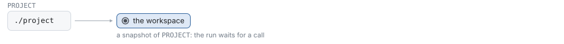

- **The workspace** is `PROJECT`, a directory, or the directory `--workdir` of the image
  `--image`, copied out of it; by default the image's own `WORKDIR`. So task images that hold
  their project in place, such as SWE-bench's at `/testbed`, work as they are.
- **No program.** A run calls its programs after it is created, with `call`, at the last entry
  `new` printed.

### `call`

Calls a program after `ENTRY`, where the session waits for one: an agent, or a grader. `resume`
then drives it.

```sh
alaya call 3f2a9c mini-swe --set model=gpt-6-luna --set-file task=TASK.txt --image my-task:1
alaya call 9a11c0 grader --image my-grader:1 --set command='python3 /grader/grade.py'
```

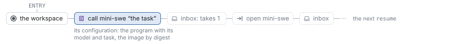

- **`PROGRAM`** is one of the catalog: `mini-swe` and `mini-vero`, the agents
  (`docs/miniswe.md`, `docs/minivero.md`), or `grader` (`docs/log-schema.md` §4). Their defaults
  are in code, and there are no configuration files.
- **`--set PATH=VALUE`** overrides one field of the program's configuration, and repeats
  (`executor.timeout_seconds=60`, `command='make check'`). `VALUE` is read as JSON when it
  parses, and as a string otherwise. An unknown field or a value of the wrong type is an input
  error.
- **`--set-file PATH=FILE`** sets one field to the text of a file, as it is (`task=TASK.md`).
  The file must be UTF-8; stdin is `/dev/stdin`. Settings of both flags apply in the
  order given.
- **Every program is called the same way:** its configuration and its image. An agent's
  model and task are fields of its configuration. `--set model=NAME` names the model by its ID
  as its creator publishes it, with the defaults the catalog lists for it, and a later setting
  changes one of its fields (`model.params.reasoning_effort=high`). `--set task=TEXT` or
  `--set-file task=FILE` gives the task. A grader has neither field.
- **The image** is resolved to a digest and recorded: every command of the call runs in a
  container of it, its own. The workspace is mounted at `--workdir`, `/workspace` unless given:
  an absolute path other than `/` and `/alaya/outputs`.
- **One call at a time.** A call is refused where another runs, or where one is asked for
  already and not yet made; `stop` ends a call that runs.

### `resume`

Replays the log that ends at `ENTRY` and drives it on, until the session waits for a call, a call
waits for a person, or it reaches a limit.

```sh
alaya resume 4f2c8b --provider apiyi --samples 50 --time-budget 3600
```

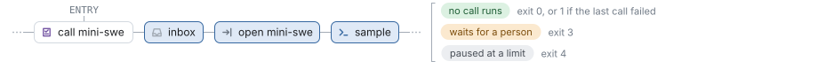

- **`--provider NAME`** says who serves the models of the calls, for this invocation alone, and
  is needed only when a call samples. A provider that cannot serve a model as its call recorded
  it is refused before any request (`docs/llm-api.md` §6). `dgx` also takes `--url` and `--port`.
- **`--samples N`** pauses before the `N+1`th response of this invocation, and
  **`--time-budget S`** once the run's time along its log is spent. Neither is recorded, and
  both hold every call, a grader's too. A paused run is driven on by a later `resume`, and a
  person may append there first.
- **Containers** run with no network unless `--network NAME` gives one, and as
  `--container-user UID:GID`. A user or a network docker does not know, or an image that cannot
  start, stops `resume` with an environment error (69), and nothing is logged.
- **A log that is no trace of its run's program** is refused (65): one edited by hand, or
  written by another version of an agent; `rebase` copies the part that is.
- **The exit status** is how the last call ended: 0 when it returned or was stopped, 1 when it
  failed, and, for a grader, by its verdict: 0 a pass, 1 a fail, 2 an error.

### `tell`

Appends what a person says.

```sh
alaya tell 4f2c8b:140 'The parser is fine; look at the evaluator.'
```

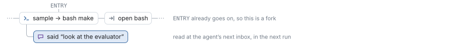

The call running reads it at its next read of its inbox, which MiniSwe makes at the start of
every round. It is refused where no call runs, where no one would read it.

A message is the only notice a call reads unasked: a change of the workspace is read by no one,
and a reply only by the question it answers.

### `commit`

Appends a change to the workspace, the files of `DIR`, and then a message that says what changed.

```sh
alaya checkout 4f2c8b ./edited          # the workspace as the log has it
$EDITOR ./edited/src/eval.py
alaya commit 4f2c8b ./edited --message 'Fixed the evaluator.'
```

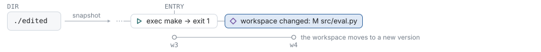

The change lists each path — `M path`, `+ path`, `- path` — and the next command runs on the
new files. No read takes the change itself: by the time a call reads, its list may be out of
date. So `commit` appends a message after it, `I changed the workspace:` with the list and
`--message` under it, which the call reads like any message. A directory with no change is
refused.

### `reply`

Answers the question the log waits on (`docs/agent-api.md` §3.8).

```sh
alaya waiting                              # every question that waits, with its entry
alaya reply -- 4f2c8b 2                    # the second candidate of a choice
alaya reply -- 4f2c8b none_of_above        # no candidate is right: an answer
alaya reply --unavailable -- 4f2c8b        # the person cannot answer: not an answer
alaya resume REPLY --provider apiyi        # go on from the entry reply printed
```

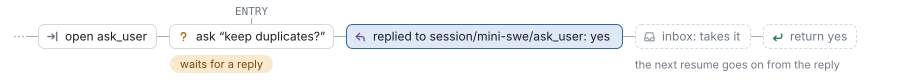

| Question | `TEXT` |
| --- | --- |
| `yes_no` | exactly `yes` or `no` |
| `single_choice` | one candidate's number, from 1, or `none_of_above` |
| `open_ended` | any text that is not blank, kept verbatim |
| any | none: `--unavailable` |

- Put the text after `--`, so that an open answer such as `--data` is text.
- A text that is no reply to the question is refused, and the question still waits.
- Two replies to one question are two branches from the waiting entry.
- A reply adds no time to the run: time spent waiting for a person is not the run's.

### `stop`

Ends the call running at an entry: the program the session runs, or the call open in `--frame`.

```sh
alaya stop 4f2c8b --reason 'wrong approach'
alaya stop 4f2c8b --frame session/mini-swe/mini-swe --reason 'the sub-agent is stuck'
```

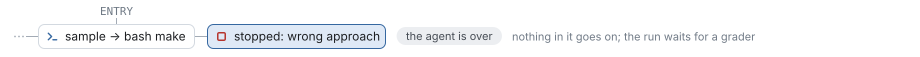

A stop appends `broke FRAME REASON`: the call open in `FRAME` ends there, with every call inside
it (`docs/agent-api.md` §3.7). Its caller is told it failed with the reason: the session waits
for the next call, and an agent whose sub-agent was stopped goes on. A stop is refused where no
call is open in its frame.

### Grading

A grader is a program like an agent: grading a point of a run is calling the grader there.

```sh
alaya stop 4f2c8b:140 --reason 'to grade this point'      # where the agent still runs
alaya call STOPPED grader --image my-grader:1 --set command='python3 /grader/grade.py'
alaya resume CALLED                                       # exits 0 pass, 1 fail, 2 error
```

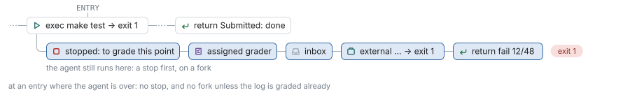

- **The grader's command** prints TAP on stdout; `timeout_seconds` is 900 unless set,
  0 for none. It runs in a container of its own image, on the workspace the log has reached.
- **Its trusted files** — the hidden tests, a reference — are in its image, which the call pins
  by digest, so the verdict is reproducible from the log alone.
- **No provider is needed**: the grader samples no model.
- **Grading a point again** with another grader is a fork from the entry before the first was
  called, or a second call after the first's end.

What a grader runs on, and how its output becomes a verdict, is `docs/log-schema.md` §4.

### `comment`

Appends a line for whoever reads the log, shown as `# TEXT`.

```sh
alaya comment 4f2c8b:57 'flaky test, see issue 12'
```

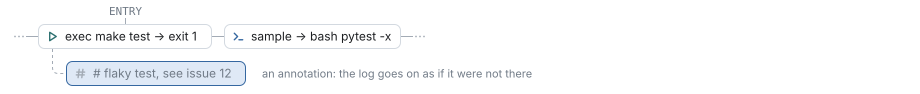

Nothing else reads a comment, so it is taken at any entry of any log, also once a run is over.
On an entry that already goes on, `tree` and the report show it as a note on that entry, not as
a branch.

### `rm`

Deletes an entry and everything after it.

```sh
alaya rm 9a11c0
```

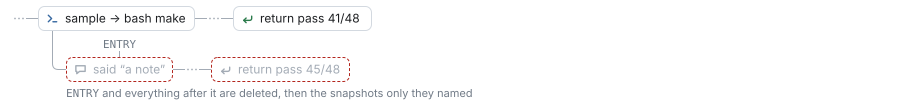

Then it drops the snapshots that only the deleted entries named.

### `rebase`

Continues a log with a revised version of its agent. Two versions take part: the **original
agent**, which wrote the log that ends at `ENTRY`, and the **revised agent**, its current version.
`rebase` copies the log into a new data directory, `DIR`, up to the first event where the two
agents differ, and `resume` goes on from there with the revised agent.

```sh
tip=$(alaya rebase 4f2c8b ../v2 | tail -n 1 | cut -d' ' -f1)
alaya resume "$tip" --data ../v2 --provider apiyi
```

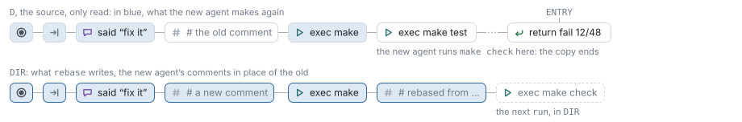

The revised agent cannot go on in the original data directory: every log of a data directory is
written by one agent, and `resume` refuses a log its agent did not write (`docs/agent-api.md` §4).

- **The copy** is the revised agent replayed against the log: an answer it asks for again is
  taken from the log, and a mark it makes is checked against the log's.
- **Comments** of the log are left out. The revised agent's are written before the events they
  precede, as `resume` writes them.
- **Notices and stops after the copy's end** are left out, and listed.
- **`--set PATH=VALUE`** and **`--set-file PATH=FILE`** change the configuration of every call
  they fit, as on `call`; one that fits no call is refused. With another model, a call's copy ends at its first sample.
- **`DIR`** has a restic repository of its own, with copies of the snapshots, and the model cache
  as hard links (`docs/log-schema.md` §6). Its last entry is a comment that names the source.
- **`DIR` must not exist**, and is made whole or not at all. The source is only read.

On stderr, `rebase` says where the copy ends: `141 of 260 events hold; at 141 the log has "exec
make test → exit 2, 3f2a9c1b8e7d", where the revised agent goes on with: run make check`. With
`--json`, its last object has `divergence`, `{position, found, expected}`, or `null` when the
whole log holds.

## 5. Commands that read

They take no lock and change nothing.

### `tree`, `log`, `show` and `waiting`

```sh
alaya tree                        # every run, and how each of its logs ends
alaya log 4f2c8b                  # one log, an event a line, and what the run does next
alaya show 4f2c8b:54 --request    # one entry in full, and the request its sample answered
alaya waiting --json              # the questions that wait, for a script or a page
```

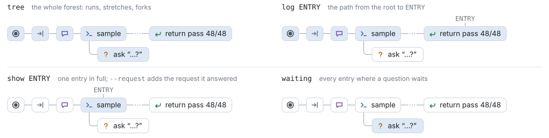

- **`tree`** prints each run, named by its first call, then every stretch of entries with no
  fork as one line: its first and last entry, its positions, its last event, and at the end of a
  log how the run stands: how its last call ended, `done: pass 48/48`, `stopped: to grade`, or
  `waits for a reply: …`, `next: …`.

  ```
  3f2a9c1b8e7d  root  mini-swe, gpt-6-luna
    06d9ae75ae21..8cb007600701  1-40  sample → bash make test
      07d75e6a71ee..bcef7c505d44  41-216  return pass 41/48  [done: pass 41/48]
      9a11c0de42f7..53be0f1a2c90  41-264  return pass 48/48  [done: pass 48/48]
  ```

- **`log`** prints the lines of §2, with the run's time so far.
- **`show`** prints an entry's event, its time and the run's, the run's tokens so far, and the
  calls open there. `--request` adds the request a sample answered, as replay computes it.
- **`waiting`** lists every log that waits for a reply, with its question.

### `ls`, `cat`, `checkout` and `diff`

```sh
alaya ls 4f2c8b src                  # a directory
alaya cat 4f2c8b src/eval.py         # a file, byte for byte
alaya checkout 4f2c8b ./at-4f2c8b    # the whole workspace, into a directory
alaya diff 4f2c8b:40 4f2c8b          # what changed between two entries
```

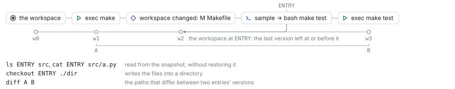

- **The workspace at an entry** is the version its log has reached there. After a grader's
  command it is the workspace as the grader left it, which is how a grader's report is read.
- **`ls` and `cat` read the snapshot directly**, without restoring it. A path is relative to
  the workspace's root, with no `..`. A symbolic link is listed, and never followed.
- **`cat --json` previews anything**: a UTF-8 file of up to 1 MiB is `text` with its `content`,
  and anything else says only what it is: `binary`, `too_large`, `symlink`, `directory`, `other`.

### `html`

Writes every log of the forest as one page that only shows: it runs nothing, sends nothing, and
needs nothing beside it.

```sh
alaya html report.html --hide .venv,__pycache__
```


- **On the left**: the branches of each run, then the log of the chosen branch, an entry a row,
  indented by its frame, with a switch wherever branches fork. The box above finds text in it.
- **On the right**: the chosen entry — what it holds, the request a sample answered, the files
  it changed with their diffs, and the run's time and tokens up to there.
- **`--hide DIR`**, repeatable or comma-separated, counts the changes under a directory in
  place of listing them.

### `config` and `help`

```sh
alaya config                                                  # every program, model and provider
alaya config --program mini-vero --set model=gpt-6-luna --set mode=codeproof   # what call would record
alaya help call                                               # what call takes
```

`config` takes no `--data` and creates nothing. With `--program` it prints exactly the
configuration `call` would record with the same settings.
