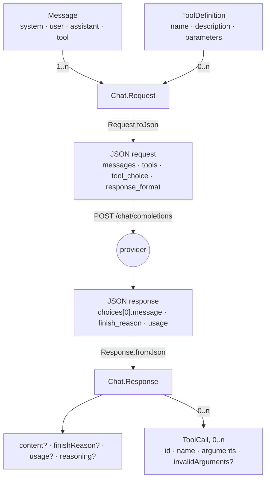
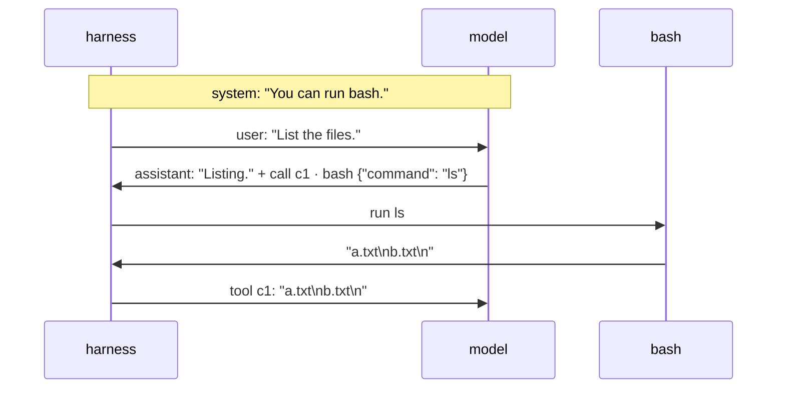
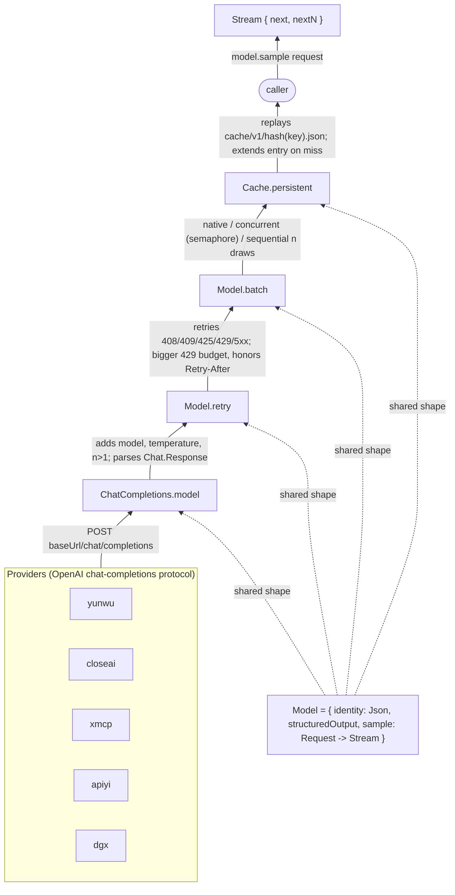
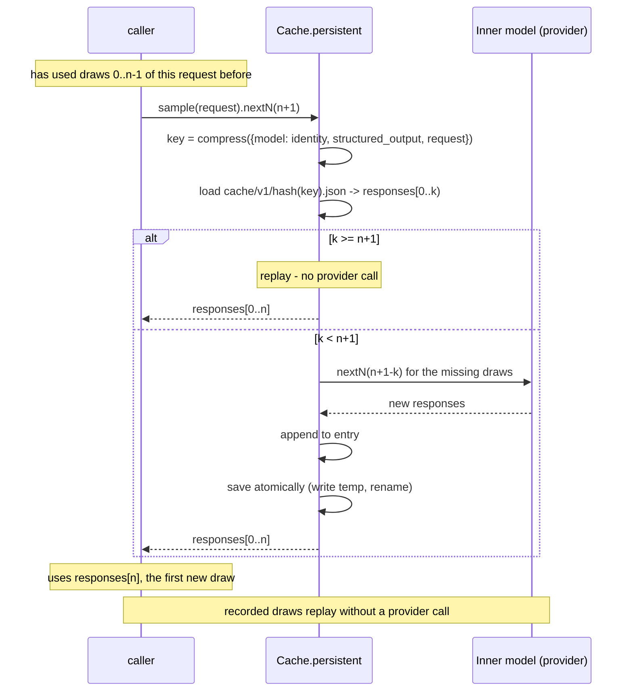

# LLM API

`Alaya.Model` gives every language model the same interface, and layers behaviour on top of it
by wrapping: retry, batching, sampling independence, and a persistent response cache.

## 1. The chat protocol

`Alaya.Chat` is the data of the OpenAI chat-completions protocol. A conversation is a list of
messages with roles; the model answers with a message that may carry tool calls; a tool's result goes back as a message of its own. The rest of the library works with these
typed values; the provider's JSON is produced by `Chat.Request.toJson` and consumed by
`Chat.Response.fromJson`.

*One completion round trip: typed values in Lean, JSON on the wire.*



### Messages

```lean
inductive Message where
  | system (content : String)
  | user (content : String)
  | assistant (content? : Option String := none) (toolCalls : Array ToolCall := #[])
      (reasoning? : Option String := none)
  | tool (callId : String) (content : Lean.Json)
```

A **system** message sets the ground rules for the whole
conversation. A **user** message is what the model is asked: the task at first, and later
anything a person or the harness has to say. An **assistant** message is the model's turn — its
text, the tool calls it decided to make, and the reasoning trace a thinking-mode provider
returns. A **tool** message answers one call, named by its id, with whatever the tool produced.

*The dialogue below, as an exchange.*



```lean
let dialogue : Array Chat.Message := #[
  .system "You can run bash.",
  .user "List the files.",
  .assistant (some "Listing.") #[{ id := "c1", name := "bash", arguments := .mkObj [("command", "ls")] }],
  .tool "c1" (.str "a.txt\nb.txt\n")]
```

### Tools and tool calls

```lean
structure ToolDefinition where
  name : String
  description : String
  parameters : JsonSchema

structure ToolCall where
  id : String
  name : String
  arguments : Lean.Json
  invalidArguments? : Option String := none
```

A tool is declared with a `JsonSchema` for its parameters and offered to the model on every
request. Schemas are always serialized in strict mode — every property required, no unspecified
ones — so a tool's arguments are guaranteed to have exactly the declared keys.

A call's `arguments` come from the provider as a *string* the model wrote, and models do write
strings that are not JSON, most often when a response is cut off by the output-token limit. The
parser does not fail on that: `arguments` is `null` and `invalidArguments?` keeps the raw text.

```lean
def bashTool : Chat.ToolDefinition := {
  name := "bash", description := "Execute a bash command"
  parameters := .object #[("command", .string (description? := some "The bash command to execute"))] }

let request : Chat.Request := { messages := dialogue, tools := #[bashTool] }
```

### Structured output

Normally the model answers in prose. Structured output asks it to answer with a JSON value of a
shape the caller fixes in advance, so the answer can be read by a program instead of parsed out
of text.

The format is defined by a `JsonSchema`: `null`, `boolean`, `integer`,
`number`, and `string`, each with an optional description and an optional list of allowed
values; `array` of one schema; `object` with named properties, all of them required and no
others allowed; and `anyOf` over alternatives (which is also how a nullable property is written,
`anyOf #[schema, .null]`).

How the shape is enforced depends on the provider, and `StructuredOutput` records which way a
given `Model` does it:

- **`native`.** The schema is sent as the request's `response_format`, and the provider
  constrains generation so the reply *is* a value of that shape.
- **`markdownCodeFence`.** For providers without that feature. The schema is appended to the
  last user message as an instruction to reply with matching JSON inside a ` ```json ` fence,
  and the reply is cut out of the fence.

Either way, `Response.structured` parses the content and validates it against the schema, so the
caller sees one behaviour: a `Json` value that is known to have the shape, or an
`Error.structuredOutput` saying where it did not.

```lean
let verdict := JsonSchema.object #[
  ("passed", .boolean),
  ("failing", .array (.string (description? := some "a test id"))),
  ("summary", .string)]

let request : Chat.Request := {
  messages := #[.user "Here is the pytest output. Did the suite pass?\n" ++ pytestOutput]
  responseFormat := .jsonSchema "verdict" verdict }

let response ← (← model.sample request).next
-- response.content? is the model's text, for example:
--   {"passed": false, "failing": ["test_program[errors/compile_bad_escape]"], "summary": "1 of 464 failed"}
-- or, under markdownCodeFence, the same JSON between ```json and ``` in prose

match ← (response.structured verdict).toBaseIO with
| .ok json =>
  -- json is that object, validated: `passed` a Bool, `failing` an array of strings,
  -- `summary` a string, no other keys
  pure json
| .error (.structuredOutput reason) =>
  -- the content was prose, not JSON, or JSON of the wrong shape; `reason` says which and where:
  --   "response content is not valid JSON"
  --   "failing[1]: expected a string"
  --   "missing required property `summary`"
  --   "contains an unspecified property"
  throw <| .structuredOutput reason
| .error other => throw other   -- a transport or protocol failure, as for any sample
```

### Responses

```lean
structure Response where
  content? : Option String := none
  toolCalls : Array ToolCall := #[]
  usage? : Option TokenUsage := none
  finishReason? : Option String := none
  reasoning? : Option String := none
```

`fromJson` reads the first choice. `finishReason?` matters to agents: mini-SWE-agent
distinguishes a response the provider truncated (`length`, or `tool_calls` with no calls) from a
formatting mistake. `usage?` holds whichever token counts the provider reports; every field is
optional because providers differ.

### Requests

```lean
structure Request where
  messages : Array Message
  tools : Array ToolDefinition := #[]
  toolChoice : ToolChoice := .auto
  responseFormat : ResponseFormat := .text
```

`toolChoice` says what the model may do with the tools: `.auto` leaves it free, `.required`
makes it call one, `.function name` makes it call that one, and `.none` forbids calls for this
request. `Request.toJson` is deterministic: keys are emitted in sorted order, so equal requests produce
equal strings, which is what makes the request usable as a cache key (§4). It takes the model's
`StructuredOutput` mode, since that decides whether a schema travels as `response_format` or as
an instruction in the last message.

## 2. The model interface

`Alaya.Model` is the interface for anything that answers a request: a provider, or a provider
with retries, batching, or a cache added around it (§3).

```lean
structure Model where
  identity : Lean.Json                -- what makes a response reproducible: model name, temperature, options
  structuredOutput : Chat.StructuredOutput := .native
  sample : Chat.Request -> Result Model.Stream

structure Model.Stream where
  next : Result Chat.Response          -- the next draw
  -- (a private field holds a layer's own way to draw several at once, when it has one)

def Model.Stream.nextN : Stream -> Nat -> Result (Array Chat.Response)   -- the next n draws
```

**Stream.** Sampling is random: the same request asked twice gives two different answers. So a
request does not have *an* answer; it has a sequence of draws, and `sample` returns that sequence
as a `Stream`. `next` gives the next draw, `nextN` the next several.

**Drawing several.** `nextN n` could simply call `next` n times, and by default it does. But a
model may have a cheaper way: a provider can be asked for n completions in one request, and the
concurrent batcher (§4) sends n requests at the same time. Such a model puts that way into the
stream's private field, and `nextN` uses it when present.

**Identity.** `identity` is a JSON value that says what is answering: the model name, the
temperature, and any other setting of the answering side that the request itself does not carry.

**The cache key.** `Model.cacheKey request` names a draw sequence as a string, so that the cache
(§4) can store and find the draws of a request. It is the identity and the request together,
serialized as one JSON object with sorted keys and no whitespace:

```json
{"model":{"model":"gpt-5.6-luna","temperature":0},
 "request":{"messages":[{"content":"You can run bash.","role":"system"},{"content":"List the files.","role":"user"}],
            "response_format":{"type":"text"},"tool_choice":"auto","tools":[...]},
 "structured_output":"native"}
```


## 3. Layers

A `Model` is built by wrapping. The provider transport is the innermost layer, and each adapter
takes a `Model` and returns one with one more behaviour, so layers compose in any order and are
configured separately. A typical stack is provider → retry → batch → cache.

*The model stack: providers wrapped by retry, batch, and cache adapters, all sharing one interface.*



### Provider transport

`Provider.fromSpec "PROVIDER:NAME"` builds the innermost model for one of five providers; the
name may contain colons, so only the first splits.

| Provider | Default endpoint | Key variable | Endpoint override |
| --- | --- | --- | --- |
| `yunwu` | `https://yunwu.ai/v1` | `YUNWU_API_KEY` | `YUNWU_BASE_URL` |
| `closeai` | `https://api.openai-proxy.org/v1` | `CLOSEAI_API_KEY` | — |
| `xmcp` | `https://llm.xmcp.ltd` | `XMCP_API_KEY` | — |
| `apiyi` | `https://api.apiyi.com/v1` | `APIYI_API_KEY` | `APIYI_BASE_URL` |
| `dgx` | `http://10.42.0.1:8000/v1` | `DGX_API_KEY`, default `EMPTY` | `DGX_BASE_URL`, or `--url`/`--port` |

A missing key is a configuration error, except for `dgx`, where `EMPTY` is the vLLM convention for
a server that needs no credential. `--url` accepts anything from a bare host to a full URL and
fills in `http`, port `8000`, and `/v1`; `--port` wins over a port inside `--url`; passing either
turns off the `DGX_BASE_URL` fallback.

All five are `Provider.ChatCompletions`, the one transport. It serializes the request with
`Request.toJson`, adds `model` and `temperature` (and `n` for several draws), and POSTs it with
`curl` to `<baseUrl>/chat/completions` under a connect timeout of 30 s and a total timeout of 10
minutes. HTTP failures become `Error.http status body retryAfterMs?`, with `Retry-After` parsed
from the headers; curl failures become `Error.transport`. Its identity is the model name and the
temperature, plus the reasoning-echo settings when they are on.

```lean
let model ← Provider.fromSpec "xmcp:ds/deepseek-v4-flash" (temperature := 0.0)
```

**Reasoning echo.** A thinking-mode model such as DeepSeek returns, with each assistant message,
a `reasoning_content`: the trace it thought through before answering. On the next request it
demands that field back on *every* assistant message in the history, and rejects the request if
one lacks it. Two things get in the way. Turns written by another model have no trace at all. And
a trace runs to tens of kilobytes, so sending every trace back made a twenty-turn request exceed
half a megabyte and time out.

With `--echo-reasoning` the transport fills the field in when it serializes the request: the two
most recent assistant messages get their recorded trace, and every older assistant message gets
`""` — an empty trace, which the provider accepts as present. The recorded dialogue is untouched;
only the request differs. Off by default, because other providers reject the unknown field.

### Retry

`Model.retry config` repeats a failed draw when the failure is transient, with capped exponential
backoff and jitter.

| Failure | Retried? |
| --- | --- |
| HTTP 408, 409, 425, 5xx | yes, up to `maxAttempts` (3) |
| HTTP 429 | yes, on a separate larger budget (8), honouring the server's `Retry-After` |
| transport (timeout, dropped connection) | only with `retryUnknownDelivery`: the provider may have processed the request before the line died |
| structured-output mismatch, malformed response | only with `retryStructuredOutput` / `retryMalformedResponse`: another sample may satisfy the schema, but one the model cannot satisfy fails the same way every time |
| configuration, provider, cache, cancelled | never |

```lean
let model ← model.retry { retryUnknownDelivery := true }
```

### Batch

`Model.batch mode` decides how `nextN n` is served when a layer above asks for several draws.

| Mode | Behaviour |
| --- | --- |
| `.native` | pass `n` to the inner model in one call |
| `.sequential` | one draw at a time, ignoring any native implementation below |
| `.concurrent maxInFlight?` | all `n` requests in flight at once on dedicated threads, bounded by a semaphore shared across the model's streams so fan-out cannot rate-limit the provider |

```lean
let model ← model.batch (.concurrent (some 8))
```

### Sampling independence

Two adapters state, in the type, how draws are shared between callers in one process.
`Model.repeatable` memoizes draws per cache key, so two streams over the same request see the
same sequence: the same question asked twice gets the same answers. `Model.independent` shares
one stream per request key, so two callers split one sequence between them and never see the
same draw: fan-out that must not duplicate.

```lean
let shared ← model.independent
```

### Persistent cache

`Cache.persistent config` replays recorded draws from disk and extends the entry on a miss. The
entry for a key lives at `cache/v1/<hash key>.json` (Lean's generic `hash` of the key string) and
holds every draw recorded so far. A stream over a request walks the entry from index 0; `nextN n`
returns cached draws and asks the inner model only for the missing ones, then saves atomically.
In `readOnly` mode a miss is an error, which is how a replay proves it never called a provider.
Concurrent streams in one process serialize extensions of the same entry; a cache directory must
not be written by two processes.

```lean
let model ← Cache.persistent model { directory := ".alaya/cache" }
```

*A cache lookup by draw index: replay on a hit, a provider call for the missing draws on a miss.*



The same identity, the same request, and the same index always yield the same response.

## 4. Errors

Every operation runs in `Result α := EIO Error α`. The classes decide what is retryable and how a
front end reports it.

| Class | Meaning |
| --- | --- |
| `configuration` | a local mistake: missing key, unknown provider, a state that cannot be continued |
| `transport` | the request may or may not have arrived |
| `http status body retryAfterMs?` | the provider answered with a failure |
| `provider` | a provider-specific failure that is none of the above |
| `protocol` | a payload that is not the chat protocol |
| `structuredOutput` | the reply did not satisfy the requested schema |
| `cache` | the response cache could not be read or extended |
| `storage` | the content-addressed store or a snapshot failed |
| `cancelled` | stopped on purpose |
