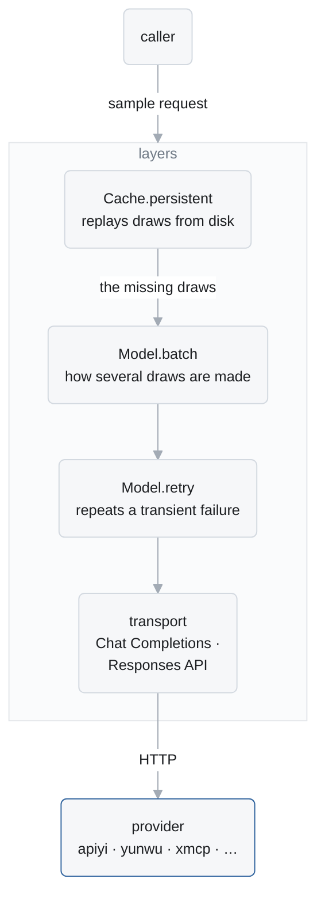
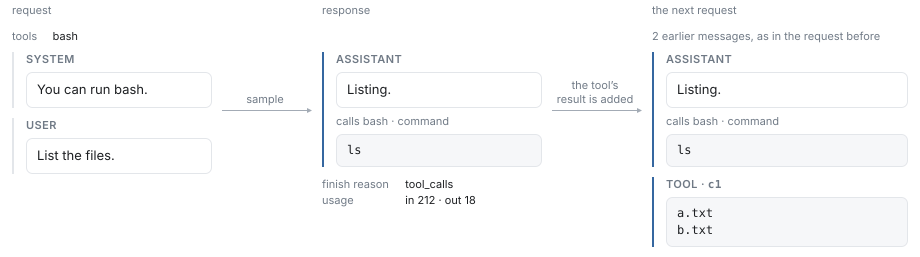
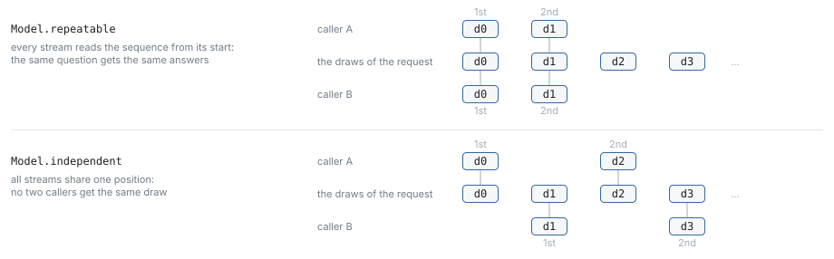
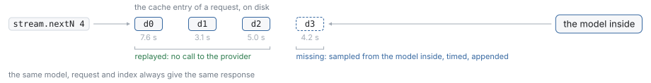
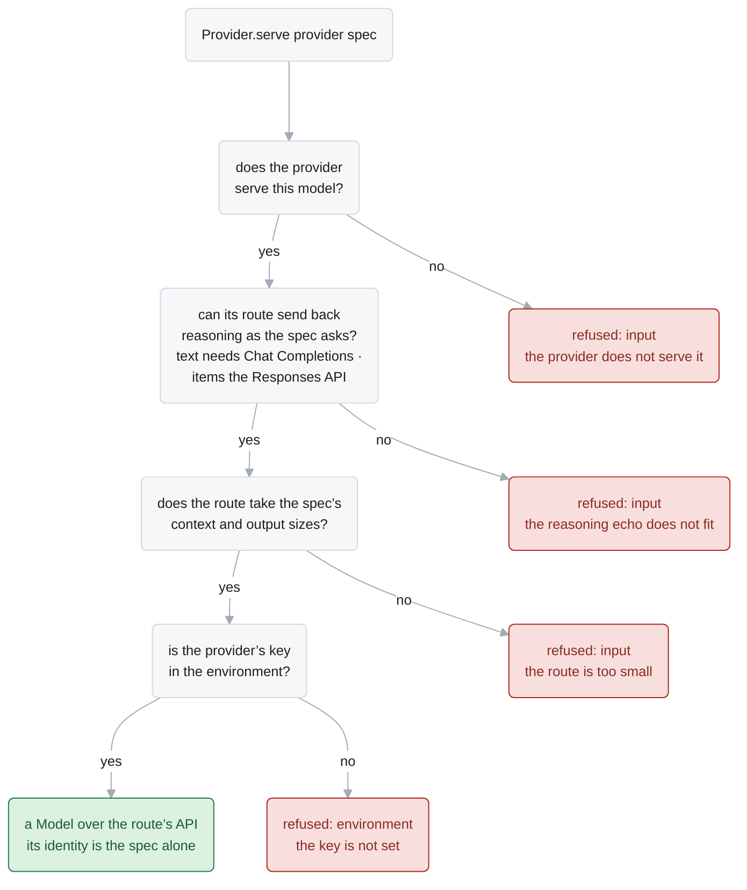

# LLM API

Alaya accesses language models through three types: the **request**, the **response**, and the
**model**, which answers a request with a stream of sampled responses, called draws. Providers fail
transiently and are nondeterministic, so Alaya retries failures, caches every draw for replay,
and controls which samples are independent. Each is a layer: a model built on another, stacked
over the provider.


```mermaid
%%{init: {"theme": "base", "themeVariables": {"fontFamily": "BlinkMacSystemFont, Segoe UI, Helvetica, Arial", "fontSize": "13px", "primaryColor": "#f6f7f9", "primaryTextColor": "#1c1e21", "primaryBorderColor": "#d3d9e0", "lineColor": "#a3abb5", "textColor": "#6f7985", "edgeLabelBackground": "#ffffff", "clusterBkg": "#fafbfc", "clusterBorder": "#e3e6ea"}}}%%
flowchart TD
  classDef sample stroke:#3567a0

  caller("caller")
  subgraph layers["layers"]
    cache("Cache.persistent<br/>replays draws from disk")
    batch("Model.batch<br/>how several draws are made")
    retry("Model.retry<br/>repeats a transient failure")
    transport("transport<br/>Chat Completions ·<br/>Responses API")
  end
  provider("provider<br/>apiyi · yunwu · xmcp · …"):::sample

  caller -- "sample request" --> layers
  cache -- "the missing draws" --> batch
  batch --> retry
  retry --> transport
  transport -- "HTTP" --> provider
  style layers color:#6f7985
  linkStyle default stroke-width:1px
```

| § | What | Where |
| --- | --- | --- |
| 1 | a **request**: messages, tools, and what the answer must be | `Alaya.Chat` |
| 2 | a **response**: text, tool calls, usage, reasoning | `Alaya.Chat` |
| 3 | **structured output**: an answer of a fixed JSON shape | `Alaya.Chat` |
| 4 | a **model**: a request has a sequence of draws | `Alaya.Model` |
| 5 | **layers**: retry, batch, sharing of draws, the persistent cache | `Alaya.Model`, `Alaya.Cache` |
| 6 | **models and providers**: what is asked, and who serves it | `Alaya.Models`, `Alaya.Provider` |
| 7 | **errors** | `Alaya.Error` |

## 1. A request

```lean
structure Request where
  messages : Array Message
  tools : Array ToolDefinition := #[]
  toolChoice : ToolChoice := .auto           -- auto | none | required | function name
  responseFormat : ResponseFormat := .text   -- text | jsonSchema name schema  (§3)

inductive Message where
  | system (content : String)
  | user (content : String)
  | assistant (content? : Option String := none) (toolCalls : Array ToolCall := #[])
      (reasoning? : Option String := none) (reasoningItems : Array Lean.Json := #[])
  | tool (callId : String) (content : Lean.Json)

structure ToolDefinition where
  name : String
  description : String
  parameters : JsonSchema
```

A request is a conversation and the tools the model may call. It is the data of the OpenAI
chat-completions protocol, as typed values.

| Message | Says |
| --- | --- |
| `system` | the ground rules of the conversation |
| `user` | what the model is asked: the task, and later what a person or the agent has to say |
| `assistant` | a turn of the model: its text, its tool calls, its reasoning |
| `tool` | the result of one call, named by the call's id |

In a typical agent, the conversation grows each turn by the model's response, as an
`assistant` message (`response.message`), and a `tool` message for each call it made.



```lean
def bashTool : Chat.ToolDefinition := {
  name := "bash", description := "Execute a bash command"
  parameters := .object #[("command", .string (description? := some "The bash command to execute"))] }

let request : Chat.Request := {
  messages := #[.system "You can run bash.", .user "List the files."]
  tools := #[bashTool] }
```

- **A tool's parameters are a `JsonSchema`** (§3), written with every property required and no
  others allowed. The provider is not asked to enforce it.
- **`toolChoice`** says what the model may do with the tools: `.auto` leaves it free,
  `.required` makes it call one, `.function name` makes it call that one, `.none` forbids calls.

## 2. A response

```lean
structure Response where
  content? : Option String := none
  toolCalls : Array ToolCall := #[]
  finishReason? : Option String := none
  usage? : Option TokenUsage := none          -- input?, output?, total?, cached?, reasoning?
  reasoning? : Option String := none
  reasoningItems : Array Lean.Json := #[]
  elapsedMs? : Option Nat := none

structure ToolCall where
  id : String
  name : String
  arguments : Lean.Json
  invalidArguments? : Option String := none
```

| Field | Holds |
| --- | --- |
| `content?` | the model's text |
| `toolCalls` | the calls it decided to make, in order |
| `finishReason?` | why it stopped: `stop`, `tool_calls`, or `length` when the provider cut it off |
| `usage?` | the token counts the provider reports; each is optional, since providers differ |
| `reasoning?`, `reasoningItems` | its reasoning, as text or as the provider's own items (§6) |
| `elapsedMs?` | how long its draw took, where the cache measured it (§5.4) |

When the model writes a call's arguments as invalid JSON, `arguments` is `null` and
`invalidArguments?` keeps the text.

## 3. Structured output

Structured output asks the model for a JSON value of a shape fixed in advance, so that a program
reads the answer.

```lean
inductive JsonSchema where
  | null | boolean                                     -- each with an optional description
  | integer | number | string                          -- and an optional list of allowed values
  | array (items : JsonSchema)
  | object (properties : Array (String × JsonSchema))  -- all required, no others allowed
  | anyOf (alternatives : Array JsonSchema)            -- a nullable value is anyOf #[schema, .null]
```

1. The request names the shape: `responseFormat := .jsonSchema name schema`.
2. The model's `structuredOutput` mode says how the shape reaches the provider:

   | Mode | The schema is sent | The reply is |
   | --- | --- | --- |
   | `native` | as the request's `response_format` | constrained by the provider to the shape |
   | `markdownCodeFence` | as an instruction at the end of the last user message | JSON inside a ` ```json ` fence, cut out of the text |

3. `response.structured schema` parses the content and checks it against the schema. Either
   way the caller gets a `Json` value known to have the shape, or `Error.structuredOutput`
   saying where it did not.

```lean
let verdict := JsonSchema.object #[
  ("passed", .boolean),
  ("failing", .array (.string (description? := some "a test id")))]

let response ← (← model.sample { messages, responseFormat := .jsonSchema "verdict" verdict }).next
let json ← response.structured verdict
-- {"passed": false, "failing": ["test_program[errors/compile_bad_escape]"]}
-- or an error: "failing[1]: expected a string", "missing required property `passed`"
```

## 4. A model

```lean
structure Model where
  identity : Lean.Json                         -- what is answering
  structuredOutput : Chat.StructuredOutput := .native
  sample : Chat.Request → Result Model.Stream

structure Model.Stream where
  next : Result Chat.Response                  -- the next draw

Model.Stream.nextN : Stream → Nat → Result (Array Chat.Response)    -- the next n draws
Model.cacheKey      : Model → Chat.Request → String
Model.requestDigest : Chat.Request → Hash
```

1. **A request has draws, not an answer.** Sampling is random: the same request asked twice
   gives two responses. So `sample request` gives a `Stream`, the sequence of the request's
   **draws**, and `next` takes the next one.
2. **`nextN n` takes several.** By default it calls `next` `n` times. A layer that has a
   cheaper way, such as a provider asked for `n` completions in one request, supplies its own.
3. **`identity` says what is answering**: the model's spec (§6), excluding the provider. So the
   same model's answers are the same draws, whoever served them.
4. **`cacheKey` names a sequence of draws**: the identity and the request, as one JSON string
   with sorted keys. Two requests with the same key have the same draws.

   ```json
   {"model":{"context_tokens":null,"echo_reasoning":"none","name":"gpt-5.6-luna", …},
    "request":{"messages":[…],"response_format":{"type":"text"},"tool_choice":"auto","tools":[…]},
    "structured_output":"native"}
   ```

   The request is in its Chat Completions form, which has no field for reasoning items (§6).
   When earlier assistant messages carry some, the key holds them in a field of its own, so two
   requests that differ only in them have different draws.

5. **`requestDigest` names a request alone**, whichever model it goes to.

## 5. Layers

A layer takes a `Model` and gives a `Model` with one more behaviour. Layers are configured
separately and stack in any order. The driver builds this stack for a run (`Driver.buildModel`):

```lean
let base  ← Provider.serve provider spec               -- the transport (§6)
let model ← base.retry { retryUnknownDelivery := true }
let model ← model.batch .sequential
Cache.persistent model { directory := cacheDir }
```

### 5.1 Retry

`model.retry config` repeats a draw that failed in a way that may pass, with capped exponential
backoff and jitter.

| Failure | Retried |
| --- | --- |
| HTTP 408, 409, 425, 5xx | up to `maxAttempts` (3) |
| HTTP 429 | on a larger budget of its own (8), waiting as the server's `Retry-After` says |
| transport: a timeout, a dropped connection | only with `retryUnknownDelivery`, since the provider may have answered already |
| a malformed response, an answer of the wrong shape | only with `retryMalformedResponse`, `retryStructuredOutput` |
| anything else | never |

### 5.2 Batch

`model.batch mode` says how `nextN n` is served.

| Mode | `n` draws are made |
| --- | --- |
| `.native` | by the model inside, in one call |
| `.sequential` | one at a time |
| `.concurrent maxInFlight?` | all at once, each on a thread of its own, at most `maxInFlight?` in flight across all streams of the model |

### 5.3 Sharing draws

Two callers that send the same request either want the same answers or must not get them. Two
layers say which, for the callers of one process:

| Layer | Two streams over one request |
| --- | --- |
| `model.repeatable` | each reads the sequence from its start: the same question gets the same answers |
| `model.independent` | share one position: no two callers get the same draw |



Which samples of a workflow must be independent, and how a cache of responses keeps them so, is
the subject of Dai et al. (2026), which this design follows.

### 5.4 The persistent cache

`Cache.persistent model { directory }` keeps every draw on disk, under its request's key.

1. A stream over a request reads the request's entry from draw 0.
2. A draw that is there is given back: no call to the provider.
3. A draw that is missing is sampled from the model inside, timed, appended to the entry, and
   saved atomically.
4. Every response the cache gives carries the time its draw took (`elapsedMs?`), the same on
   the miss and on every later hit.



- With `readOnly`, a missing draw is an error: a way to prove a replay called no provider.
- One process writes a cache directory at a time; within it, streams take turns at an entry.
- The entry's file is specified in `docs/log-schema.md` §6.

## 6. Models and providers

A **model** is what is asked, and a **provider** is who serves it.

```lean
structure Models.Spec where        -- a model: what a run records, and the Model's identity
  name : String                    -- its ID as its creator publishes it: gpt-6-luna
  params : Lean.Json               -- request fields sent as they are: temperature, reasoning_effort
  echoReasoning : Echo             -- none | text | items: how its earlier reasoning is sent back
  contextTokens? outputTokens? : Option Nat

structure Provider where           -- who serves models
  name baseUrl keyVar : String
  routes : List (String × Route)   -- how it serves particular models
  anyModel : Bool := true          -- whether it serves a model it has no route for, under its own name

structure Route where              -- how a provider serves one model
  name : String                    -- the provider's name for it
  api : Api := .chatCompletions    -- or .responses
  structuredOutput : Chat.StructuredOutput := .native
  reasoningEcho : EchoSupport      -- required | accepted | rejected
  contextTokens? outputTokens? : Option Nat

Provider.serve : Provider → Models.Spec → Result Model
```

`Provider.serve provider spec` gives the innermost `Model`, the transport, after checking that
the provider can serve the model as the run recorded it:


```mermaid
%%{init: {"theme": "base", "themeVariables": {"fontFamily": "BlinkMacSystemFont, Segoe UI, Helvetica, Arial", "fontSize": "13px", "primaryColor": "#f6f7f9", "primaryTextColor": "#1c1e21", "primaryBorderColor": "#d3d9e0", "lineColor": "#a3abb5", "textColor": "#6f7985", "edgeLabelBackground": "#ffffff", "clusterBkg": "#fafbfc", "clusterBorder": "#e3e6ea"}}}%%
flowchart TD
  classDef ok fill:#dcf1e2,stroke:#2a7a4b,color:#1c5c33
  classDef bad fill:#f8dfdd,stroke:#b3261e,color:#8a2a25

  start("Provider.serve provider spec")
  subgraph checks[" "]
    serves("does the provider<br/>serve this model?")
    echo("can its route send back<br/>reasoning as the spec asks?<br/>text needs Chat Completions ·<br/>items the Responses API")
    sizes("does the route take the spec’s<br/>context and output sizes?")
    key("is the provider’s key<br/>in the environment?")
  end
  model("a Model over the route’s API<br/>its identity is the spec alone"):::ok
  r1("refused: input<br/>the provider does not serve it"):::bad
  r2("refused: input<br/>the reasoning echo does not fit"):::bad
  r3("refused: input<br/>the route is too small"):::bad
  r4("refused: environment<br/>the key is not set"):::bad

  start --> serves
  serves -- "yes" --> echo
  serves -- "no" --> r1
  echo -- "yes" --> sizes
  echo -- "no" --> r2
  sizes -- "yes" --> key
  sizes -- "no" --> r3
  key -- "yes" --> model
  key -- "no" --> r4
  style checks fill:none,stroke:none
  linkStyle default stroke-width:1px
```

So changing providers either sends the model the same requests or fails before any is sent.

| Provider | Default endpoint | Key variable | Serves |
| --- | --- | --- | --- |
| `yunwu` | `https://yunwu.ai/v1` | `YUNWU_API_KEY` | any model, under its own name |
| `closeai` | `https://api.openai-proxy.org/v1` | `CLOSEAI_API_KEY` | any model, under its own name |
| `xmcp` | `https://llm.xmcp.ltd` | `XMCP_API_KEY` | any model; `deepseek-v4.1-flash` as `ds/deepseek-v4-flash`, `gpt-5.6-luna` as `closeai/gpt-5.6-luna` |
| `apiyi` | `https://api.apiyi.com/v1` | `APIYI_API_KEY` | any model; `gpt-6-luna` through the Responses API |
| `fireworks` | `https://api.fireworks.ai/inference/v1` | `FIREWORKS_API_KEY` | only `deepseek-v4.1-flash`, as `accounts/fireworks/models/deepseek-v4p1-flash` |
| `dgx` | `http://10.42.0.1:8000/v1` | `DGX_API_KEY`, default `EMPTY` | any model, under its own name |

`yunwu`, `apiyi`, `fireworks` and `dgx` take another endpoint from `NAME_BASE_URL`; `dgx` also
from `--url` and `--port`. `alaya config` lists the models and the providers.

### The two transports

A route speaks one of two APIs. Both take the same `Chat.Request` and give the same
`Chat.Response`, so nothing above the transport knows which was used.

| | Chat Completions | Responses API |
| --- | --- | --- |
| request | `POST <baseUrl>/chat/completions` | `POST <baseUrl>/responses`, stateless (`store: false`) |
| the conversation | `messages`, as `Request.toJson` gives them | input items: messages, `function_call`, `function_call_output` and reasoning items, in the model's order |
| the spec's `params` | sent as they are | the same names; `reasoning_effort` and `max_tokens` renamed to `reasoning.effort` and `max_output_tokens` |
| structured output | `response_format` | `text.format` |
| several draws | `n` in one request | a request each |
| finish reason | as sent | read off `status` and `incomplete_details` as `stop`, `tool_calls`, `length` |

Both send the request with `curl`, under a connect timeout of 30 s and a total of 10 minutes,
and read the usage with its cached and reasoning tokens.

### Reasoning sent back

A reasoning model returns its reasoning with each turn, and may need it sent back with the
conversation. The spec's `echo_reasoning` says how, and a route must be able to do it:

| `echo_reasoning` | Sent back with each assistant message | Needs | Set for |
| --- | --- | --- | --- |
| `none` | nothing | | most models |
| `text` | its `reasoning_content`; `""` where none was recorded | Chat Completions | `deepseek-v4.1-flash`, whose API rejects an earlier turn without it |
| `items` | its encrypted reasoning items, before its text and calls | the Responses API | `gpt-6-luna`, which otherwise reasons afresh every turn |

## 7. Errors

Every operation runs in `Result α := EIO Error α`. Each constructor of `Error` has a class,
which says what a caller does about it; the command line exits with one status per class
(`docs/cli.md` §3).

| Constructor | Means | Class |
| --- | --- | --- |
| `input` | the request names something not there, in the wrong condition, or malformed | `input` |
| `environment` | the machine lacks something: docker, an image, restic, an API key | `environment` |
| `busy` | another process is writing the data directory | `transient` |
| `transport` | the request may or may not have arrived | `transient` |
| `http status body retryAfterMs?` | the provider answered with a failure | `transient` for 408, 409, 425, 429 and 5xx; `model` otherwise |
| `contextExceeded` | the provider refused the request as too long for the model's context: a 400, 413 or 422 whose error says so | `model` |
| `provider` | a failure of the provider that is none of the above | `model` |
| `protocol` | a payload that is not the chat protocol | `model` |
| `structuredOutput` | the reply is not of the requested shape | `model` |
| `cache` | the cache could not be read or extended | `storage` |
| `storage` | the entries or a workspace snapshot could not be read or written | `storage` |

## References

- Y. Dai, D. S. Bouras, H. Jia, S. Mechtaev. Statistical independence aware caching for LLM
  workflows. LLM4Code@ICSE 2026.
