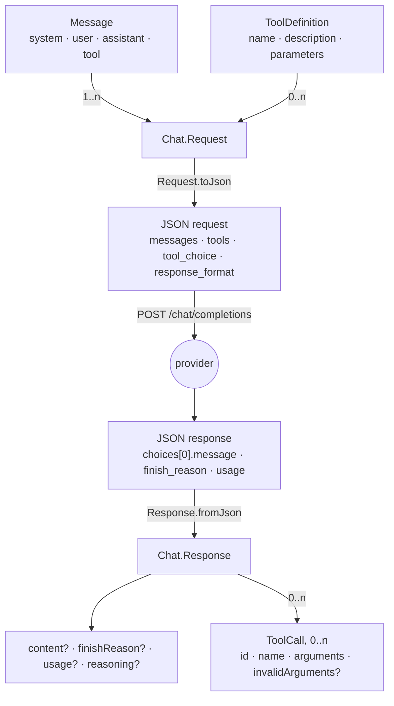
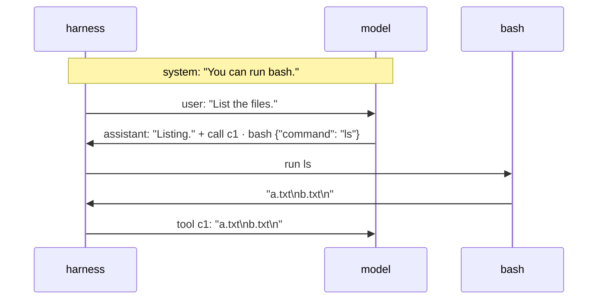
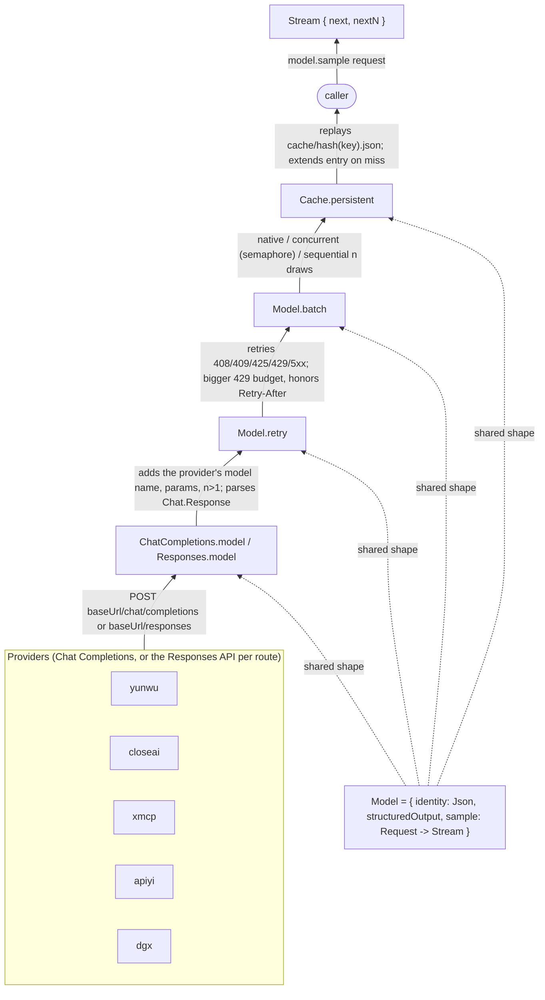
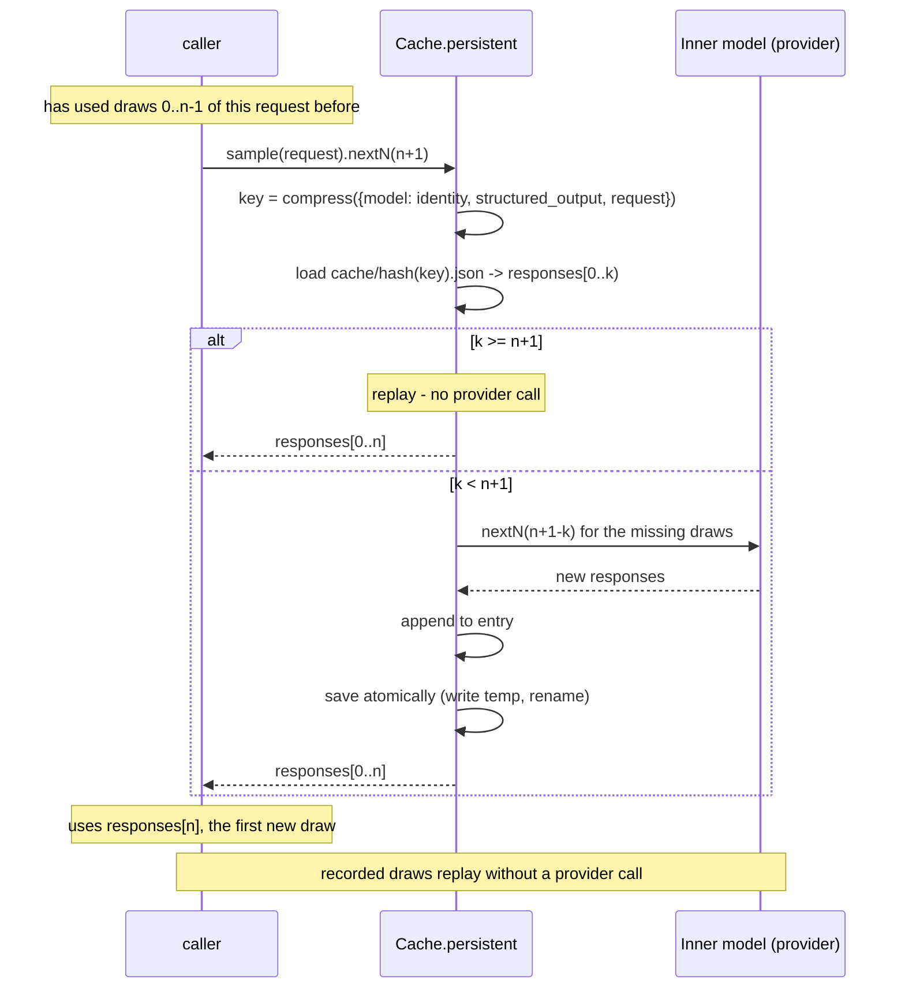

# LLM API

`Alaya.Model` gives every language model the same interface, and layers behaviour on top of it
by wrapping: retry, batching, sampling independence, and a persistent response cache.

## 1. The chat protocol

`Alaya.Chat` is the data of the OpenAI chat-completions protocol. A conversation is a list of
messages with roles; the model answers with a message that may carry tool calls; a tool's result goes back as a message of its own. The rest of the library works with these
typed values; the provider's JSON is produced by `Chat.Request.toJson` and consumed by
`Chat.Response.fromJson`.

*One completion round trip: typed values in Lean, JSON on the wire.*


```mermaid
flowchart TD
  Messages["Message<br/>system · user · assistant · tool"]
  Tools["ToolDefinition<br/>name · description · parameters"]
  Request["Chat.Request"]
  ReqJSON["JSON request<br/>messages · tools · tool_choice · response_format"]
  Provider(("provider"))
  RespJSON["JSON response<br/>choices[0].message · finish_reason · usage"]
  Response["Chat.Response"]
  Fields["content? · finishReason? · usage? · reasoning?"]
  Calls["ToolCall, 0..n<br/>id · name · arguments · invalidArguments?"]

  Messages -- "1..n" --> Request
  Tools -- "0..n" --> Request
  Request -->|"Request.toJson"| ReqJSON
  ReqJSON -->|"POST /chat/completions"| Provider
  Provider --> RespJSON
  RespJSON -->|"Response.fromJson"| Response
  Response --> Fields
  Response -- "0..n" --> Calls
```

### Messages

```lean
inductive Message where
  | system (content : String)
  | user (content : String)
  | assistant (content? : Option String := none) (toolCalls : Array ToolCall := #[])
      (reasoning? : Option String := none) (reasoningItems : Array Lean.Json := #[])
  | tool (callId : String) (content : Lean.Json)
```

A **system** message sets the ground rules for the whole
conversation. A **user** message is what the model is asked: the task at first, and later
anything a person or the harness has to say. An **assistant** message is the model's turn — its
text, the tool calls it decided to make, and the reasoning trace a thinking-mode provider
returns. A **tool** message answers one call, named by its id, with whatever the tool produced.

*The dialogue below, as an exchange.*


```mermaid
sequenceDiagram
    participant H as harness
    participant M as model
    participant T as bash
    Note over H,M: system: "You can run bash."
    H->>M: user: "List the files."
    M->>H: assistant: "Listing." + call c1 · bash {"command": "ls"}
    H->>T: run ls
    T->>H: "a.txt\nb.txt\n"
    H->>M: tool c1: "a.txt\nb.txt\n"
```

```lean
let dialogue : Array Chat.Message := #[
  .system "You can run bash.",
  .user "List the files.",
  .assistant (some "Listing.") #[{ id := "c1", name := "bash", arguments := .mkObj [("command", "ls")] }],
  .tool "c1" (.str "a.txt\nb.txt\n")]
```

### Tools and tool calls

```lean
structure ToolDefinition where
  name : String
  description : String
  parameters : JsonSchema

structure ToolCall where
  id : String
  name : String
  arguments : Lean.Json
  invalidArguments? : Option String := none
```

A tool is declared with a `JsonSchema` for its parameters and offered to the model on every
request. Schemas are always serialized in strict mode — every property required, no unspecified
ones — so a tool's arguments are guaranteed to have exactly the declared keys.

A call's `arguments` come from the provider as a *string* the model wrote, and models do write
strings that are not JSON, most often when a response is cut off by the output-token limit. The
parser does not fail on that: `arguments` is `null` and `invalidArguments?` keeps the raw text.

```lean
def bashTool : Chat.ToolDefinition := {
  name := "bash", description := "Execute a bash command"
  parameters := .object #[("command", .string (description? := some "The bash command to execute"))] }

let request : Chat.Request := { messages := dialogue, tools := #[bashTool] }
```

### Structured output

Normally the model answers in prose. Structured output asks it to answer with a JSON value of a
shape the caller fixes in advance, so the answer can be read by a program instead of parsed out
of text.

The format is defined by a `JsonSchema`: `null`, `boolean`, `integer`,
`number`, and `string`, each with an optional description and an optional list of allowed
values; `array` of one schema; `object` with named properties, all of them required and no
others allowed; and `anyOf` over alternatives (which is also how a nullable property is written,
`anyOf #[schema, .null]`).

How the shape is enforced depends on the provider, and `StructuredOutput` records which way a
given `Model` does it:

- **`native`.** The schema is sent as the request's `response_format`, and the provider
  constrains generation so the reply *is* a value of that shape.
- **`markdownCodeFence`.** For providers without that feature. The schema is appended to the
  last user message as an instruction to reply with matching JSON inside a ` ```json ` fence,
  and the reply is cut out of the fence.

Either way, `Response.structured` parses the content and validates it against the schema, so the
caller sees one behaviour: a `Json` value that is known to have the shape, or an
`Error.structuredOutput` saying where it did not.

```lean
let verdict := JsonSchema.object #[
  ("passed", .boolean),
  ("failing", .array (.string (description? := some "a test id"))),
  ("summary", .string)]

let request : Chat.Request := {
  messages := #[.user "Here is the pytest output. Did the suite pass?\n" ++ pytestOutput]
  responseFormat := .jsonSchema "verdict" verdict }

let response ← (← model.sample request).next
-- response.content? is the model's text, for example:
--   {"passed": false, "failing": ["test_program[errors/compile_bad_escape]"], "summary": "1 of 464 failed"}
-- or, under markdownCodeFence, the same JSON between ```json and ``` in prose

match ← (response.structured verdict).toBaseIO with
| .ok json =>
  -- json is that object, validated: `passed` a Bool, `failing` an array of strings,
  -- `summary` a string, no other keys
  pure json
| .error (.structuredOutput reason) =>
  -- the content was prose, not JSON, or JSON of the wrong shape; `reason` says which and where:
  --   "response content is not valid JSON"
  --   "failing[1]: expected a string"
  --   "missing required property `summary`"
  --   "contains an unspecified property"
  throw <| .structuredOutput reason
| .error other => throw other   -- a transport or protocol failure, as for any sample
```

### Responses

```lean
structure Response where
  content? : Option String := none
  toolCalls : Array ToolCall := #[]
  usage? : Option TokenUsage := none
  finishReason? : Option String := none
  reasoning? : Option String := none
  reasoningItems : Array Lean.Json := #[]
```

`fromJson` reads the first choice. `finishReason?` matters to agents: mini-SWE-agent
distinguishes a response the provider truncated (`length`, or `tool_calls` with no calls) from a
formatting mistake. `usage?` holds whichever token counts the provider reports; every field is
optional because providers differ.

### Requests

```lean
structure Request where
  messages : Array Message
  tools : Array ToolDefinition := #[]
  toolChoice : ToolChoice := .auto
  responseFormat : ResponseFormat := .text
```

`toolChoice` says what the model may do with the tools: `.auto` leaves it free, `.required`
makes it call one, `.function name` makes it call that one, and `.none` forbids calls for this
request. `Request.toJson` is deterministic: keys are emitted in sorted order, so equal requests produce
equal strings, which is what makes the request usable as a cache key (§3). It takes the model's
`StructuredOutput` mode, since that decides whether a schema travels as `response_format` or as
an instruction in the last message.

## 2. The model interface

`Alaya.Model` is the interface for anything that answers a request: a provider, or a provider
with retries, batching, or a cache added around it (§3).

```lean
structure Model where
  identity : Lean.Json                -- what is answering: the model's recorded spec
  structuredOutput : Chat.StructuredOutput := .native
  sample : Chat.Request -> Result Model.Stream

structure Model.Stream where
  next : Result Chat.Response          -- the next draw
  -- (a private field holds a layer's own way to draw several at once, when it has one)

def Model.Stream.nextN : Stream -> Nat -> Result (Array Chat.Response)   -- the next n draws
```

**Stream.** Sampling is random: the same request asked twice gives two different answers. So a
request does not have *an* answer; it has a sequence of draws, and `sample` returns that sequence
as a `Stream`. `next` gives the next draw, `nextN` the next several.

**Drawing several.** `nextN n` could simply call `next` n times, and by default it does. But a
model may have a cheaper way: a provider can be asked for n completions in one request, and the
concurrent batcher (§3) sends n requests at the same time. Such a model puts that way into the
stream's private field, and `nextN` uses it when present.

**Identity.** `identity` is a JSON value that says what is answering: for a provider's model,
its spec (`Models.Spec`) — the model's name, its `params`, and whether its earlier reasoning is
sent back — and never the provider, so the same model's answers are the same draws whoever
served them.

**The cache key.** `Model.cacheKey request` names a draw sequence as a string, so that the cache
(§3) can store and find the draws of a request. It is the identity and the request together,
serialized as one JSON object with sorted keys and no whitespace:

```json
{"model":{"context_tokens":null,"echo_reasoning":"none","name":"gpt-5.6-luna","output_tokens":null,"params":{"temperature":0}},
 "request":{"messages":[{"content":"You can run bash.","role":"system"},{"content":"List the files.","role":"user"}],
            "response_format":{"type":"text"},"tool_choice":"auto","tools":[...]},
 "structured_output":"native"}
```

The request is its Chat Completions form, which has no field for the Responses API's reasoning
items. So when earlier assistant messages carry some, the key adds a `reasoning_items` field of
`[position, items]` pairs: two requests that differ only in them are different requests, and a
request with none keys exactly as it would without the field.


## 3. Layers

A `Model` is built by wrapping. The provider transport is the innermost layer, and each adapter
takes a `Model` and returns one with one more behaviour, so layers compose in any order and are
configured separately. A typical stack is provider → retry → batch → cache.

*The model stack: providers wrapped by retry, batch, and cache adapters, all sharing one interface.*


```mermaid
flowchart BT
    subgraph Providers["Providers (Chat Completions, or the Responses API per route)"]
        direction LR
        yunwu["yunwu"]
        closeai["closeai"]
        xmcp["xmcp"]
        apiyi["apiyi"]
        dgx["dgx"]
    end

    Transport["ChatCompletions.model / Responses.model"]
    Retry["Model.retry"]
    Batch["Model.batch"]
    Cache["Cache.persistent"]
    Caller(["caller"])

    Providers -- "POST baseUrl/chat/completions or baseUrl/responses" --> Transport
    Transport -- "adds the provider's model name, params, n>1; parses Chat.Response" --> Retry
    Retry -- "retries 408/409/425/429/5xx; bigger 429 budget, honors Retry-After" --> Batch
    Batch -- "native / concurrent (semaphore) / sequential n draws" --> Cache
    Cache -- "replays cache/hash(key).json; extends entry on miss" --> Caller

    Iface["Model = { identity: Json, structuredOutput, sample: Request -> Stream }"]
    Iface -.shared shape.-> Transport
    Iface -.shared shape.-> Retry
    Iface -.shared shape.-> Batch
    Iface -.shared shape.-> Cache

    Caller -- "model.sample request" --> Stream["Stream { next, nextN }"]
```

### Models and providers

A model is named independently of who serves it, by its ID as its creator publishes it
(`gpt-oss-120b`, `deepseek-v4.1-flash`), and its defaults are a row of the model table,
`Alaya.Models`: a `Spec` of `params` — request fields sent as they are, such as `temperature`
or `reasoning_effort` — whether its earlier reasoning is sent back, and the context
and output sizes when known. A run's configuration holds the complete spec (`docs/cli.md` §5).

A provider is who serves it, chosen per invocation (`run --provider NAME`). Providers are
data, in `Alaya.Provider`:

| Provider | Default endpoint | Key variable | Endpoint override | Serves |
| --- | --- | --- | --- | --- |
| `yunwu` | `https://yunwu.ai/v1` | `YUNWU_API_KEY` | `YUNWU_BASE_URL` | any model, under its own name |
| `closeai` | `https://api.openai-proxy.org/v1` | `CLOSEAI_API_KEY` | — | any model, under its own name |
| `xmcp` | `https://llm.xmcp.ltd` | `XMCP_API_KEY` | — | any model; `deepseek-v4.1-flash` as `ds/deepseek-v4-flash`, `gpt-5.6-luna` as `closeai/gpt-5.6-luna` |
| `apiyi` | `https://api.apiyi.com/v1` | `APIYI_API_KEY` | `APIYI_BASE_URL` | any model, under its own name; `gpt-6-luna` through the Responses API |
| `fireworks` | `https://api.fireworks.ai/inference/v1` | `FIREWORKS_API_KEY` | `FIREWORKS_BASE_URL` | only `deepseek-v4.1-flash`, as `accounts/fireworks/models/deepseek-v4p1-flash` |
| `dgx` | `http://10.42.0.1:8000/v1` | `DGX_API_KEY`, default `EMPTY` | `DGX_BASE_URL`, or `--url`/`--port` | any model, under its own name |

How a provider serves one model is a **route**: the provider's name for it, the API it speaks
(Chat Completions unless it says the Responses API), and what it declares it can do — whether it
requires, accepts or rejects earlier reasoning sent back as text, and the largest context and
response it takes. `Provider.serve provider spec` finds the route and checks the
spec's requirements against it before any request is sent: a provider that cannot meet them is
refused (`input`, exit 65), so changing providers either sends the model the same requests or
fails loudly. The agent may behave differently with different models, but never with different
providers. A missing key is an environment error, except for `dgx`, where `EMPTY` is the vLLM
convention for a server that needs no credential. `--url` accepts anything from a bare host to a
full URL and fills in `http`, port `8000`, and `/v1`; `--port` wins over a port inside `--url`.

A route speaks one of two transports, which share their HTTP layer (`Provider.Http`).
`Provider.ChatCompletions` serializes the request with
`Request.toJson`, adds the route's model name, the spec's `params` and nothing else (and `n` for
several draws), and POSTs it with `curl` to `<baseUrl>/chat/completions` under a connect timeout
of 30 s and a total timeout of 10 minutes. HTTP failures become `Error.http status body
retryAfterMs?`, with `Retry-After` parsed from the headers; curl failures become
`Error.transport`. Its identity is the spec alone. A response's usage keeps, besides input and
output tokens, the input tokens the provider served from its prompt cache
(`prompt_tokens_details.cached_tokens`, or DeepSeek's `prompt_cache_hit_tokens`) and the
reasoning tokens a model reports spending (`completion_tokens_details.reasoning_tokens`), so the
cache's reuse and the cost of a reasoning level can be measured.

`Provider.Responses` speaks OpenAI's Responses API, `POST <baseUrl>/responses`, from the same
`Chat.Request` to the same `Chat.Response`. The system prompt and user turns become input
messages, tool results `function_call_output` items, and an assistant turn its reasoning items,
its text, and its `function_call` items, in the order the model produced them. Tools are sent in
the flat function format, not strict, as with Chat Completions; structured output is
`text.format`. A spec's `params` keep their Chat Completions names, and the transport renames the
two the Responses API names otherwise, `reasoning_effort` to `reasoning.effort` and
`max_tokens` to `max_output_tokens`, so a spec means the same through either API. Requests are
stateless, `store: false`: the provider keeps nothing, and the log holds the whole conversation.
`status` and `incomplete_details` are read as Chat Completions' finish reasons — `tool_calls`,
`stop`, `length` — which agents read, and usage from `input_tokens`, its `cached_tokens`,
`output_tokens` and its `reasoning_tokens`. The API has no `n`, so draws are separate requests.

```lean
let spec ← Models.resolve "deepseek-v4.1-flash" #[]
let some apiyi := Provider.named? "apiyi" | …
let model ← Provider.serve apiyi spec
```

**Reasoning echo.** A thinking-mode model such as DeepSeek returns, with each assistant message,
a `reasoning_content`: the trace it thought through before answering. The view keeps it, so the
transport sends each recorded trace back with its message, as it was received. With tool calls,
DeepSeek's API also rejects a request in which an earlier assistant message lacks the field, and
a gateway that re-encodes the conversation for another vendor may need it on every reasoned turn
to reconstruct it. So with `echo_reasoning` `text` in the model's spec — as `deepseek-v4.1-flash` has
it — the transport gives every assistant message the field: its own recorded trace, or `""`
where none was recorded, such as another model's turn or a person's, which the provider accepts
as present. Otherwise no field is added; other models reject the unknown field.

An OpenAI reasoning model such as `gpt-6-luna` keeps its reasoning otherwise: the Responses API
returns it as **reasoning items**, encrypted, which must be sent back for the model to continue
its chain of thought across tool calls; Chat Completions has no field for them, so through it
every turn reasons afresh. With `echo_reasoning` `items`, as `gpt-6-luna` has it, the transport
asks for them (`include: ["reasoning.encrypted_content"]`, with `reasoning.summary` `auto` for a
readable summary), the response records them as received, and every later request sends each
turn's items back before its text and calls. The HTML report gives the summary, and of the
encrypted items only how many there are; `show` prints the stored response whole, items
included.

`echo_reasoning` is thus `none`, `text` or `items`, and a route must honour it: `text` needs Chat
Completions, `items` the Responses API, and a route that cannot is refused before any request.
A run that records items can therefore be continued only through a provider that serves the
model through the Responses API.

Recorded reasoning, as text or as items, is never changed or dropped, so a message serializes
the same on every later request and the provider can keep reusing the prefix it has cached. The cost is the earlier
traces in input tokens. This is how the DeepSeek harness handles it too (its
`dsh-llm-deepseek` adapter). Shortening the context, if requests grow too large, must keep the
prefix stable in the same way: dropping old reasoning in large blocks, not a sliding window.

### Retry

`Model.retry config` repeats a failed draw when the failure is transient, with capped exponential
backoff and jitter.

| Failure | Retried? |
| --- | --- |
| HTTP 408, 409, 425, 5xx | yes, up to `maxAttempts` (3) |
| HTTP 429 | yes, on a separate larger budget (8), honouring the server's `Retry-After` |
| transport (timeout, dropped connection) | only with `retryUnknownDelivery`: the provider may have processed the request before the line died |
| structured-output mismatch, malformed response | only with `retryStructuredOutput` / `retryMalformedResponse`: another sample may satisfy the schema, but one the model cannot satisfy fails the same way every time |
| input, environment, busy, provider, cache, storage | never |

```lean
let model ← model.retry { retryUnknownDelivery := true }
```

### Batch

`Model.batch mode` decides how `nextN n` is served when a layer above asks for several draws.

| Mode | Behaviour |
| --- | --- |
| `.native` | pass `n` to the inner model in one call |
| `.sequential` | one draw at a time, ignoring any native implementation below |
| `.concurrent maxInFlight?` | all `n` requests in flight at once on dedicated threads, bounded by a semaphore shared across the model's streams so fan-out cannot rate-limit the provider |

```lean
let model ← model.batch (.concurrent (some 8))
```

### Sampling independence

Two adapters state, in the type, how draws are shared between callers in one process.
`Model.repeatable` memoizes draws per cache key, so two streams over the same request see the
same sequence: the same question asked twice gets the same answers. `Model.independent` shares
one stream per request key, so two callers split one sequence between them and never see the
same draw: fan-out that must not duplicate.

```lean
let shared ← model.independent
```

### Persistent cache

`Cache.persistent config` replays recorded draws from disk and extends the entry on a miss. The
entry for a key lives at `cache/<hash key>.json` (Lean's generic `hash` of the key string) and
holds every draw recorded so far. A stream over a request walks the entry from index 0; `nextN n`
returns cached draws and asks the inner model only for the missing ones, then saves atomically.
In `readOnly` mode a miss is an error, which is how a replay proves it never called a provider.
Concurrent streams in one process serialize extensions of the same entry; a cache directory must
not be written by two processes.

```lean
let model ← Cache.persistent model { directory := "runs/cache" }
```

*A cache lookup by draw index: replay on a hit, a provider call for the missing draws on a miss.*


```mermaid
sequenceDiagram
    participant T as caller
    participant C as Cache.persistent
    participant M as Inner model (provider)

    Note over T: has used draws 0..n-1 of this request before
    T->>C: sample(request).nextN(n+1)
    C->>C: key = compress({model: identity, structured_output, request})
    C->>C: load cache/hash(key).json -> responses[0..k)
    alt k >= n+1
        Note over C: replay - no provider call
        C-->>T: responses[0..n]
    else k < n+1
        C->>M: nextN(n+1-k) for the missing draws
        M-->>C: new responses
        C->>C: append to entry
        C->>C: save atomically (write temp, rename)
        C-->>T: responses[0..n]
    end
    Note over T: uses responses[n], the first new draw
    Note over T,M: recorded draws replay without a provider call
```

The same identity, the same request, and the same index always yield the same response.

## 4. Errors

Every operation runs in `Result α := EIO Error α`. The constructors decide what is retryable, and
each belongs to one `Error.Class` — what a caller does about it — which is how a front end
reports it: the `alaya` command line exits with one status per class
(`docs/cli.md` §4).

| Constructor | Meaning | Class |
| --- | --- | --- |
| `input` | the request names something that is not there, is in the wrong condition, or is malformed: an unknown entry, a reply where no question waits, a setting that names no field, a non-finite temperature | `input` |
| `environment` | the machine lacks something: docker or its daemon, an image, restic, an API key | `environment` |
| `busy` | another process is writing the data directory (`Alaya.Lock`) | `transient` |
| `transport` | the request may or may not have arrived | `transient` |
| `http status body retryAfterMs?` | the provider answered with a failure | `transient` for 408, 409, 425, 429 and 5xx, the statuses `Retry` retries; `model` otherwise |
| `contextExceeded` | the provider refused the request as too long for the model's context: a 400, 413 or 422 whose error says so, in OpenAI's code `context_length_exceeded` or the usual words ("maximum context length", "context window", "prompt is too long"); the driver logs it as the sample's answer, the one failure of a provider it does not stop at, and MiniSwe ends with `ContextExceeded` (`docs/architecture.md` §6) | `model` |
| `provider` | a provider-specific failure that is none of the above | `model` |
| `protocol` | a payload that is not the chat protocol | `model` |
| `structuredOutput` | the reply did not satisfy the requested schema | `model` |
| `cache` | the response cache could not be read or extended | `storage` |
| `storage` | reading or writing the entries, or a workspace snapshot, failed | `storage` |
