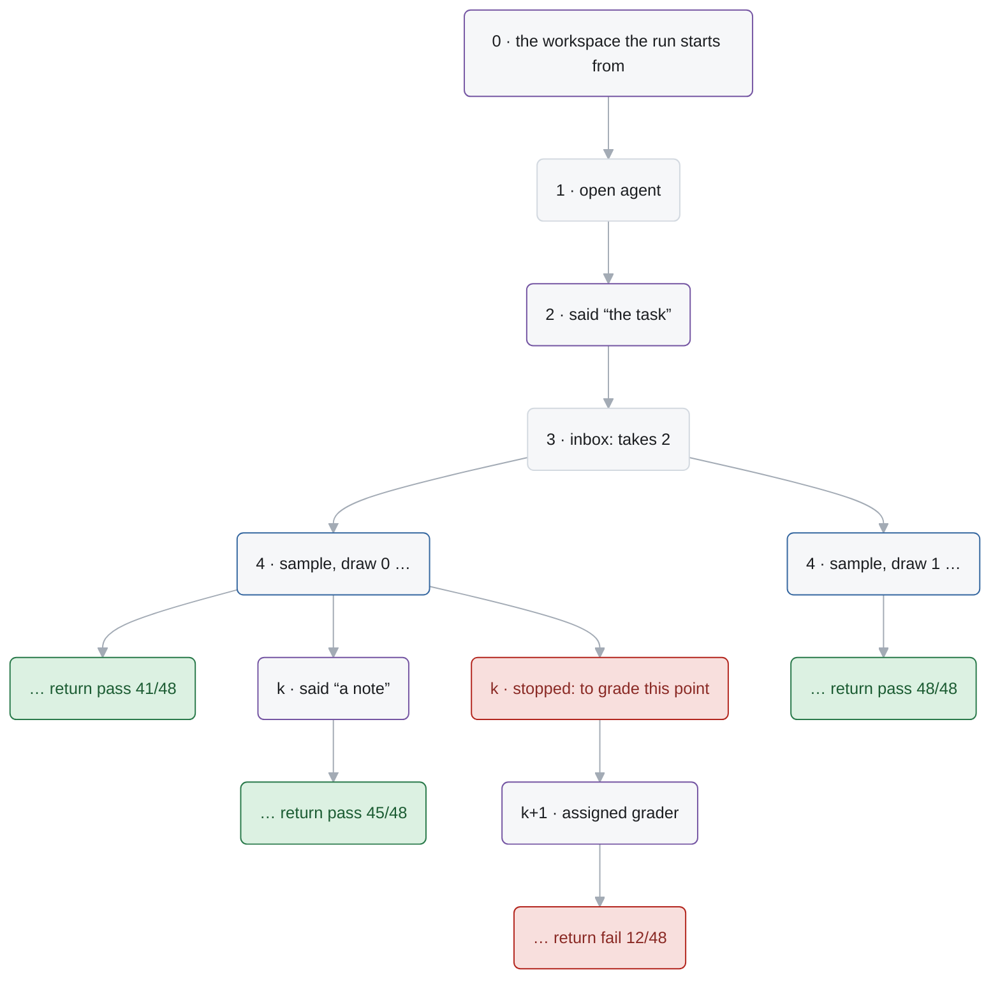

# Log and cache schema

A run of Alaya is a log: a flat, append-only list of events, from the workspace the run starts on
to the end of its agent, and then to the verdict of the grader assigned to it. Logs are kept as a forest of entries, each one event and the entry
before it, so logs that share a prefix share its entries, and a fork is a second continuation of
an entry. This page specifies the entry and the event as stored, how runs grow and fork, how a
point of a run is graded, what is on disk — the entries, the workspace snapshots, the model
cache — and the invariants that hold of it. The programs that write it, and the driver, are
`docs/agent-api.md`; the command line over it is `docs/cli.md`.

## 1. Entries

An entry is one JSON object, compact, in a file of its own:

```json
{"parent": "<64 hex, or null for a root>", "event": {…}, "elapsed_ms": 1840}
```

Its **name** is the SHA-256 of `{"parent": …, "event": …}`, compact with sorted keys: the time it
took is no part of it, so the same event after the same entry is one entry, whenever it happened.
A name therefore stands for the whole log from its root to that entry. `elapsed_ms` is how long
the event took to happen as the driver saw it — an operation's time, or a mark's — except that a
response takes the time its draw took when it was made, which the model cache keeps with it
(§6): a sample costs the same time whether the model answered it now or the cache did. A run's
time at an entry is the sum along its log. A reader refuses an entry whose content does not hash
to its name. The format has no version: a data directory is read by the Alaya that wrote it.

An entry is referred to by its name, or any prefix of it no other name has, and `PREFIX:N` names
the entry at position `N` of that entry's log, from 0, where the root is (`Forest.resolve`):
`4f2c8b:120` is the event at position 120 of the log that ends at `4f2c8b`.

## 2. Events

Every event is an object with its kind under `type`, and a frame, where it has one, as an array of
numbers: `[]` is the run's own frame, `[0]` the agent's, `[0, 2]` the third call the agent made,
`[0, 2, 0]` the first call that call made.

| `type` | Fields | What it is |
| --- | --- | --- |
| `arrived` | `notice` | something from outside, unasked: below |
| `heard` | `frame`, `notices` | a read of the inbox in `frame`, with the positions of the notices it took |
| `answered` | `frame`, `op`, `answer`, `error` | the world's answer to an operation `frame` asked for: `answer`, or `error` when it could not give one |
| `opened` | `frame`, `routine` | a call opens: `routine` is `{name, arguments}`, the routine called and what it was called with, and `frame` the frame it runs in |
| `returned` | `frame`, `value` | the call in `frame` ended with its value |
| `failed` | `frame`, `error` | the call in `frame` ended with its failure |
| `stopped` | `reason` | from outside: every frame of the agent ends |
| `commented` | `frame`, `text` | a comment, for whoever reads the log: replay passes over it. `frame` is the frame of the program that made it, or `null` for a person's |

A **notice** is `{type, …}`:

| `type` | Fields | What it is |
| --- | --- | --- |
| `said` | `message` | a person said something: the task, a message |
| `changed` | `workspace`, `summary` | the workspace is now `workspace`; `summary` says how — the first event of every log is one |
| `replied` | `to`, `reply` | a person answered the question of the call in frame `to` |
| `assigned` | `grader` | a person assigned the run its grader, which grades it as it stands there, its agent over (§4) |

A reply is `{type}` with `yes`, `no`, `none_of_above`, `unavailable`, `{type: "choice", number}`,
or `{type: "text", text}`.

An **operation**, under `op`, is kept by its key:

| `op.type` | Fields | `answer` |
| --- | --- | --- |
| `sample` | `request`: the digest of the request (`Model.requestDigest`) | the response, as the cache stores it (`Alaya.Chat.Stored`) |
| `exec` | `command`, `config`: `{timeout_seconds, env, outputs}` | `{output: {output, exit_code, error}, workspace, file}` |
| `time` | — | `{spent_ms, budget_ms}` |
| `external` | `command`, `image`, `input`, `timeout_seconds` | `{exit_code, stdout, stderr, checkout, elapsed_ms, error}` |

A sample is kept by the digest of its request, not the request: the request is a function of the
log before it, and replay asks for exactly it, so the log does not hold the dialogue again with
every response. The digest is what tells a program that still makes that request from one that
does not.

*The events of a run that is told its task, runs a command, and is graded.*

```json
{"type":"arrived","notice":{"type":"changed","workspace":"3f2a…","summary":"the workspace the run starts from"}}
{"type":"opened","frame":[0],"routine":{"name":"agent","arguments":{"agent":{…},"model":{…},"environment":{…}}}}
{"type":"arrived","notice":{"type":"said","message":"Implement the language in SPEC.md"}}
{"type":"heard","frame":[0],"notices":[2]}
{"type":"heard","frame":[0],"notices":[]}
{"type":"answered","frame":[0],"op":{"type":"sample","request":"9b0c…"},"answer":{"content":null,"tool_calls":[…],…},"error":null}
{"type":"opened","frame":[0,0],"routine":{"name":"bash","arguments":{"command":"make"}}}
{"type":"answered","frame":[0,0],"op":{"type":"exec","command":"make","config":{…}},"answer":{"output":{…},"workspace":"c1d2…","file":null},"error":null}
{"type":"returned","frame":[0,0],"value":{"output":"…","exit_code":0,"error":null,"file":null}}
…
{"type":"returned","frame":[0],"value":{"status":"Submitted","submission":"…"}}
{"type":"arrived","notice":{"type":"assigned","grader":{"name":"grader","command":"sh /grader/grade.sh","image":"…@sha256:…","input":"7e0f…","timeout_seconds":900}}}
{"type":"heard","frame":[],"notices":[212]}
{"type":"answered","frame":[],"op":{"type":"external",…},"answer":{"exit_code":0,"stdout":"1..2\nok 1\nok 2\n",…},"error":null}
{"type":"returned","frame":[],"value":{"status":"pass","passed":2,"total":2,"reason":"","checks":[…],…}}
```

A run is **over** when its agent is — returned, failed, or stopped. It then waits for a grader,
and once one is assigned it runs the grader's program and returns its verdict, both in its own
frame, `[]`: a graded log is complete. A log has one grader; a point is graded again on a fork.

A call is the one thing that opens a frame: the agent, a tool its model called, a step of a
workflow, a sub-agent are each a **routine** of the run, called by name (`docs/agent-api.md`),
and the events between a call's opening and its end, in its frame or one under it, are what the
call did. The grader is no routine, and nothing an agent calls reaches it.

The second event is the opening of the agent's call, whose arguments are the run's
**configuration**: the agent's complete configuration, the model's complete spec, the
**environment** — the pinned image, the workdir, the machine's `uname`. Every later command
builds the run from there (`configOf`). A grader is no part of it: it is named by the notice
that assigns it.

## 3. Growing and forking

**Driving.** `alaya run ENTRY` replays the log that ends at `ENTRY` and goes on from it, an entry
per event. When `ENTRY` has continuations already, the new one is a fork beside them: the driver
repeats any mark or command up to the next sample, and since an entry is its event and its
parent, a mark that the earlier continuation made too is the same entry, so the fork departs
only where its events differ.

**Draws.** Every sample from an entry answers the same request, so the samples of an entry's
continuations are draws 0, 1, 2, … of one sequence, which the model cache keeps. A new sample
takes draw `n`, `n` the continuations of the entry that are responses; a refusal of the request
as too long, the one failure of a sample a log holds, took no draw. So
running a point again is a new draw, and a run that crashed after its model answered takes the
response the cache kept, with the time it took.

**People.** A person appends at any entry: `tell` a `said` notice, `commit` a `changed` notice with
the snapshot of a directory and the lines of what changed, `reply` a `replied` notice — refused
unless the log waits on a question that the reply fits — `stop` a stop, and `grade` an
`assigned` notice that names a grader, after a stop where the agent was still running. A stop,
a message, a change and a reply are refused once the agent is over, when there is nothing to
stop and no one to read them; a grader is taken only then, and only where none is assigned yet.
Appending
at an entry that already goes on is a fork; appending at the end of a log lets the next `run` go
on with it. A notice is taken by the first read of the inbox after it
that is for it: MiniSwe reads its inbox at the start of every round, so what is appended where a
run paused reaches its model in its next request. A reply and a grader are for one reader each,
the call that asked and what follows the agent, and no other read takes them.

**Comments.** A `commented` event says something to whoever reads the log, and changes nothing
else: replay passes over it wherever it stands, so the run of a log with comments is the run of
the log without them. A program writes one with `comment`, for its own debugging: the driver
appends it where it reaches it, at the end of a log, and replay neither needs it nor minds
another in its place, so the comments of an agent can change without its logs becoming no trace
of it. A person writes one with `alaya comment ENTRY TEXT`, at any entry, with nothing checked.
A comment is an entry like any other, so it takes a position, and one appended at an entry that
already goes on is a child beside the continuation: `tree` and the report show such a comment,
when nothing follows it, as an annotation on its entry, not as a branch.

*Entries as a forest: an entry with two continuations is a fork. Here a run is driven again
from the read at 3, which takes a new draw; a person adds a note at a later entry; and that
entry is graded as it stood.*



*The same forks, as `alaya tree` prints them: a new draw, a person's note, and a point graded as
it stood.*

```
$ alaya tree
3f2a9c1b8e7d  root  mini-swe, gpt-6-luna
  06d9ae75ae21..8cb007600701  1-40  sample → bash make test
    07d75e6a71ee..bcef7c505d44  41-212  return pass 41/48  [done: pass 41/48]
    9a11c0de42f7..53be0f1a2c90  41-260  return pass 48/48  [done: pass 48/48]
    d9d628fe75d2..9cea64cdaa71  41-45  return fail 12/48  [stopped: fail 12/48]
```

## 4. Grading

Grading is what a run does once its agent is over, in its own frame, `[]`: it waits for a grader
to be **assigned** — an `assigned` notice, which names it — runs the grader's program on the
workspace, an `external` operation, and returns the verdict, which is the result of the run. A
grader is therefore no part of a run's configuration, and no routine of it: `new` takes none,
and any point of any run is graded by any grader, at any time. A log has one grader, so grading
a point again, with the same grader or a corrected one, is a fork there, beside the first.

`alaya grade ENTRY --grader CMD` grades a point: it stops a fork of the log there, if the agent
is still running, appends the notice that assigns the grader, and drives the run to its verdict.
Where the log at `ENTRY` has a grader already, it does so from the entry before that grader was
assigned. A grader is assigned only where the agent is over, so the agent cannot go on after it,
and never sees what a grader did; the grader runs on the workspace as the log had it there. A
grader that reads only the workspace gives one verdict for a version of it, so the points worth
grading are the entries where the workspace is at a new version: the answers of commands, and
the changes from outside, in `alaya log`.

> A grader runs in a fresh checkout of the workspace at the run's workdir, in its own pinned
> image, with its trusted input read-only at `/grader` and no network. It can change anything in
> the checkout; the result is kept as its answer's checkout. It prints TAP on stdout: a complete
> plan with all results `ok` is a pass, any `not ok` is a fail, and anything incomplete is an
> error.

A grader is `{name, command, image, input, timeout_seconds}`: a shell command run with
`/bin/sh -c`; the image it runs in, resolved to a digest when it is assigned — by default the
run's, and a grader's tools, which the agent should not see, belong in an image of their own,
best built on the agent's (two targets of one Dockerfile); the snapshot of its trusted input,
taken when it is assigned, so it sees exactly what is recorded; and how long it may take. The
notice holds all of that, and the run's operation on it is `external`: the driver restores the workspace the log has reached into a fresh
**checkout**, mounted read-write at the workdir, the input at `/grader`, runs the command as the
user the agent's commands run as, and snapshots the checkout as it left it — its reports
included — which `alaya ls` and `alaya cat` read at that entry. The run's workspace stays where it
was.

### The verdict

A grader reports through [TAP](https://testanything.org/tap-version-14-specification.html) on
stdout: a plan `1..N` and one `ok` or `not ok` line per check (`Alaya.Tap`). Logs go to stderr,
or in `#` comment lines, so they cannot be read as TAP. The status comes from the TAP alone
(`Alaya.Grader`):

- **pass**: the plan is there, as many checks arrived as it announced, and none failed;
- **fail**: the TAP is complete, and a check failed — a failing `TODO` or `SKIP` check does not
  count, and a failing subtest does;
- **error**: anything else — no plan, fewer or more checks than planned, a `Bail out!`, a
  grader that timed out or could not start.

The exit status is recorded but decides nothing, so "the checks ran and some failed" and "the
grader crashed" cannot be confused: a crash leaves the TAP incomplete, which is an error. A
plain test command needs a few lines of wrapper, in which the grader's author, who knows the
tool, says what its exit codes mean:

```sh
echo 1..1
pytest -q; code=$?
case $code in
  0) echo "ok 1 - tests" ;;
  1) echo "not ok 1 - tests" ;;
  *) echo "Bail out! pytest exited $code" ;;
esac
```


A verdict, the value the run returns, is `{status, passed, total, reason, checks, exit_code,
elapsed_ms}`, `checks` one `{ok, name, directive}` per top-level test point; what the program
printed is in the answer of its `external` operation. A grader that cannot be started is an
`error` verdict. The verdict of a log is what its run returns; `run --json` and `grade --json`
give it with how the agent ended.

## 5. On disk

The data directory, `D`, holds everything one set of runs needs. Every command names it with
`--data D`, or reads `ALAYA_DATA`; there is no default, so a command run from the wrong place
cannot quietly begin a new one. `new` creates it, and every other command refuses a path that
holds none.

| Path | Contents |
| --- | --- |
| `D/entries/<name>.<parent>.json` | one file per entry (§1); `<parent>` is the parent's name, or `root`, so one listing gives the shape of the whole forest |
| `D/restic/` | the [restic](https://restic.net) repository holding every workspace snapshot |
| `D/cache/<hash>.json` | model response cache entries (§6) |
| `D/lock`, `D/lock.holder` | the lock a writing command holds, and the pid of the command holding it (`docs/cli.md` §4) |
| `D/tmp/<id>/` | one command's scratch, removed when it ends: `work/`, the work directory, restored whenever the log reaches another version; `outputs/`, the outputs a command may read; `external/`, a grader's checkout and input; `restic/`, where files read out of a snapshot land; `project/`, the image's workdir copied out, when `new` is given no `PROJECT` |

Everything but `tmp/` lasts. An entry is written once, as a finished temporary file renamed into
place, and never changes; `rm` deletes files, and there is nothing else to collect.

### Workspace snapshots

A log names each version of the workspace by an identifier, and nothing else looks inside it. `Alaya.Workspaces` is the snapshot
contract:

```lean
structure Workspaces where
  snapshot : System.FilePath -> Result Snapshot              -- capture a directory as it is now
  materialize : Snapshot -> System.FilePath -> Result Unit   -- make a directory hold exactly a snapshot
  diff : Snapshot -> Snapshot -> Result (Array Change)           -- added, removed, modified paths
  readFiles : Snapshot -> Array String -> Result (Array (Option ByteArray))  -- regular files of a snapshot
  listEntries : Snapshot -> String -> Result (Array Entry)   -- immediate snapshot directory entries
  retainOnly : Array Snapshot -> Result Unit                 -- drop every snapshot not listed
```

| Operation | Used by |
| --- | --- |
| `snapshot` | `new`, after every command, `commit`, a grader's input when it is assigned and its checkout after it ran |
| `materialize` | a command on another version than the work directory holds, a grader's checkout and input, `checkout` |
| `diff` | the notice of a `commit`, `alaya diff`, the HTML report |
| `readFiles` | the HTML report, `cat` and its previews |
| `listEntries` | `ls`, and `cat`'s check of a path, using metadata before reading a file |
| `retainOnly` | `rm`, with the snapshots the remaining entries name |

Restic implements `listEntries` without restoring the workspace. An entry records name,
relative path, kind (directory/file/symlink/other), and optional byte size; the
empty path names the root. `ls` and `cat` verify ancestor directories and never
follow symbolic links.

An identifier is 64 hexadecimal digits and means something only to the store that issued it.
**Equal directories need not get equal identifiers**, and nothing compares them: an entry's name
covers the identifiers its event holds, which makes an entry immutable, not reproducible — a
command run again leaves a new snapshot, so two runs of it are two entries. What the contract does require
(`Test/Workspaces.lean`):

- a snapshot materializes as the directory it was taken of: file contents, executable bits,
  symbolic links, empty directories;
- `materialize` replaces whatever the destination held, read-only directories included;
- an edit is captured even when it keeps a file's size and modification time, as archive
  extraction, `cp -p`, and package managers that normalize timestamps leave it;
- a file name may hold any character, a newline included;
- an added or removed directory is one change, standing for its subtree; a file replaced by a
  directory, or the reverse, is a removal and an addition; a file that was only touched is not a
  change;
- a read is `none` for a directory, an absent path, and a path that leaves the snapshot.

`Workspaces.Restic` keeps the contract with a restic repository (restic 0.17 or later). restic
is a backup program: walking a directory, deciding what changed — by a file's change time and
inode as well as its size and modification time — and writing a snapshot back out are its
business, and a snapshot records what the filesystem holds: permissions, times, owners, hard
links, extended attributes. The identifier is the restic snapshot ID.

| Contract | restic |
| --- | --- |
| `snapshot` | `restic backup . --no-scan --host alaya`, run inside the directory so paths are relative to it; a snapshot that could not read every file is a failure |
| `materialize` | `restic restore ID --target DIR --delete --overwrite always`: in place, comparing content, not times, after the directory is made writable |
| `diff` | `restic diff A B --json` without `--metadata`, folded so that a directory stands for its subtree; for a type change whose new side is a file, one `restic ls` of the old side tells whether a directory was replaced |
| `readFiles` | one `restic restore ID --include …` of just those paths into the command's scratch, read back from there |
| `listEntries` | `restic ls ID --json /PATH`, immediate directory metadata only |
| `retainOnly` | `restic forget` of the rest, then `restic prune` |

A snapshot or a checkout of a directory that overlaps the run's own storage — the repository,
`D/entries`, `D/cache` — is refused before anything is touched: the one would capture the
storage, and the other deletes what the snapshot does not hold, which is the storage. So a
checkout into the data directory, or a new run of a project that contains it, is an error that
says to move one of the two.

Every operation is one `restic` process with `--no-cache --insecure-no-password`: the repository
sits beside the entries, which are not encrypted either. It is restic's own format, so `restic
snapshots`, `restic mount` and the rest work on it directly; a crashed run can leave a stale
lock, which `restic unlock` removes. `rm ENTRY` deletes an entry and everything after it, and keeps only
the snapshots the remaining entries name, since a log can go back to any of them.

A `restic` process spends about 0.8 s deriving the repository key before it does anything,
which is why reads are batched and the report reads several snapshots at once. On a Lean
project with Mathlib — 7.2 GB in 121,433 files, an Apple M5 Pro's internal volume, one run each:

| | |
| --- | ---: |
| first snapshot | 18.5 s |
| snapshot after a command, nothing or one file changed | 5.6 s |
| checkout, into an empty directory or in place | 22–25 s |
| diff of two versions | 1.6 s |
| repository after three snapshots | 2.4 GB |


## 6. The model cache entry

`D/cache/<hash>.json`, where `hash` is Lean's generic hash of the cache key:

```json
{
  "key": "<compress {model: <identity>, structured_output: <mode>, request: <Request.toJson>}>",
  "draws": [
    {"response": {"content": …, "tool_calls": [call…], "reasoning": …, "reasoning_items": […], "finish_reason": …, "usage": {…}},
     "elapsed_ms": 7600},
    …
  ]
}
```

A response is stored as a `sample`'s answer stores it (`Alaya.Chat.Stored`), so a response reads
the same in the cache and in the log. `draws[i]` is draw `i` of that request under that model
identity, and its `elapsed_ms` how long the model took to give it, retries included: what the
entry of a sample that takes the draw has as its time. It is beside the response, not in it,
because a log keeps an event's time outside the event. The stored key is checked against the file name on load, and a corrupt entry reads as
empty and is replaced on the next successful sample. The key contains the full request, so
anything that changes what the model is sent — the view, the tool list, the model identity
including options such as reasoning echo — changes the key. The directory is safe to keep
between runs: an entry is only ever appended to.

## 7. Invariants

- An entry's name is the hash of its parent's name and its event; nothing under a name changes,
  and a log only grows.
- A log's first event is a `changed` notice, the workspace it starts on, and its second the
  opening of the agent's call with the run's configuration.
- Every log the driver writes is a trace of its run's program: replay agrees with it at every
  prefix. A log that is not is refused, never driven on.
- A sample from an entry with `n` sampled continuations is draw `n` of its request; a refusal is
  no draw. A response's entry has the time of its draw, in every log that holds the draw.
- A reply is appended only where its question waits, in the form it asks for; a stop, a message
  and a change only while the agent runs; a grader only once the agent is over, where none is
  assigned yet, and only one that can be read.
- A log has at most one grader. A graded log is complete: it ends with the return of the run's
  own frame, the verdict.
- Comments are no part of a trace: a log with any of its comments taken out, or with others put
  in, is a trace of the same program, with the same run. Only positions count them.
- The version of the workspace a log has reached is the last one a command or a change from
  outside left, and every command runs on it; a grader's checkout is its own, and the run does
  not follow it.
- Every snapshot an entry names is kept while the entry is: a version of the workspace, a
  grader's checkout, and the input of the grader assigned, whether or not it has run.
