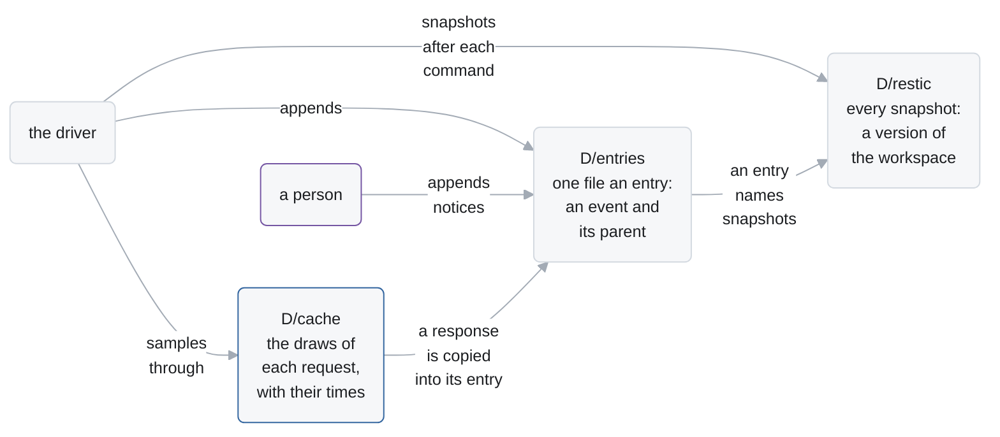
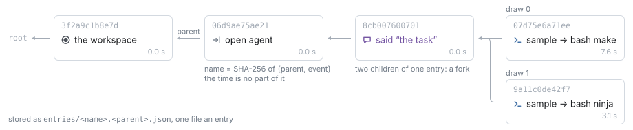
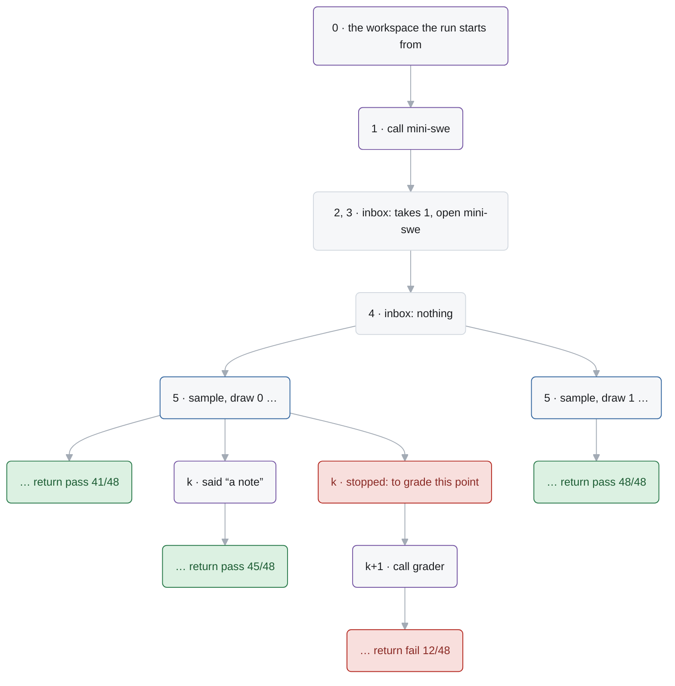
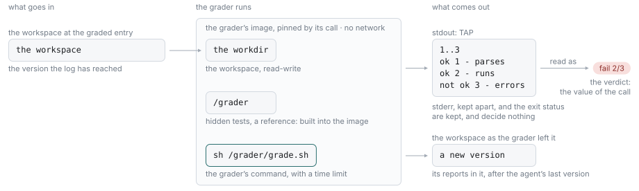
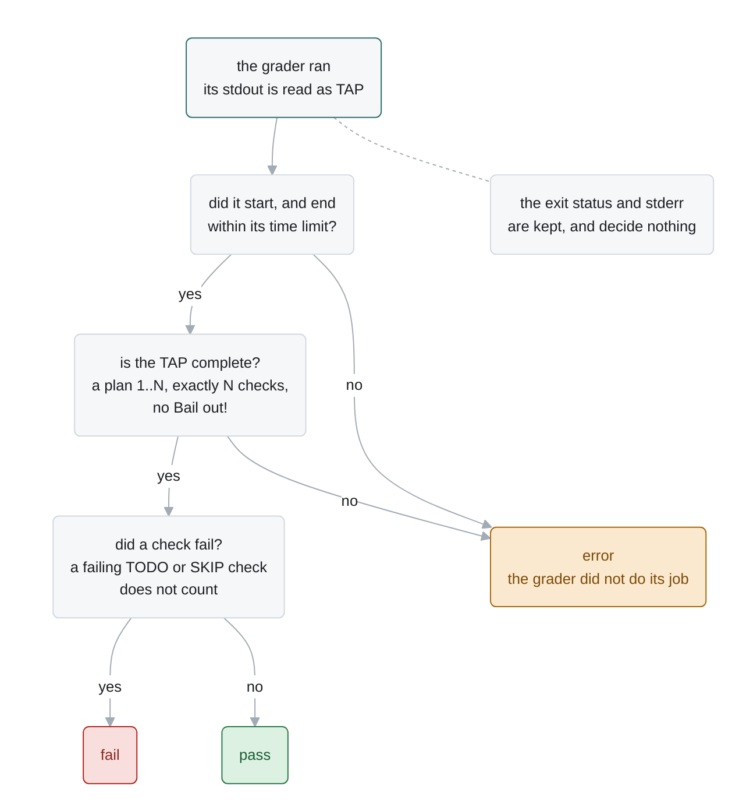

# Log schema

A run of Alaya is a log of events (`docs/agent-api.md` §2). This page is how logs are kept: the
**entry**, the stored form of each event, how logs share entries and **fork**, how a run is
**graded**, and what the data directory holds.



| § | What |
| --- | --- |
| 1 | an **entry**: one event and the entry before it, named by a hash |
| 2 | **events** as JSON |
| 3 | the **forest**: logs that share entries, and forks |
| 4 | **grading**: the grader, its protocol, its verdict |
| 5 | the **data directory**, and workspace snapshots |
| 6 | the **model cache** entry |
| 7 | invariants |

## 1. Entries

An entry is one compact JSON object, in a file of its own:

```json
{"parent": "<the name of the entry before it, or null for a root>", "event": {…}, "elapsed_ms": 1840}
```



- **A log is a path.** An entry holds one event and names the entry before it, so the log of an
  entry is the path to it from its root.
- **The name** of an entry is the SHA-256 of `{"parent": …, "event": …}`, compact with sorted
  keys. So a name stands for a whole log, and the same event after the same entry is the same
  entry, whenever it happens. A reader refuses an entry whose content does not hash to its name.
- **The time**, `elapsed_ms`, is how long the event took the driver, and is no part of the name.
  A response has the time its draw took when it was made (§6). A run's time at an entry is the
  sum along its log.
- **Naming an entry.** A command takes a name, or any prefix of it that no other name has.
  `PREFIX:N` is the entry at position `N` of that entry's log, from 0: `4f2c8b:120`.

The format carries no version: a data directory is read by the Alaya that wrote it.

## 2. Events

What each event means is `docs/agent-api.md` §2 and §3. This is how each is stored: an object
with its kind under `type`, and its frame, where it has one, as an array of steps, outermost
first: each the name of the routine called, with `#N` after it for the call of that name its
caller made after N others (`["mini-swe", "bash#1"]`).

| `type` | Fields |
| --- | --- |
| `arrived` | `notice` |
| `heard` | `frame`, `notices`: the positions of the notices the read took |
| `asked` | `frame`, `question`: `{text, form: {type, options}}`, `type` one of `yes_no`, `single_choice`, `open_ended`, and `options` for a choice |
| `answered` | `frame`, `op`, and `answer` or `error`, the other `null` |
| `opened` | `frame`, `routine`: `{name, arguments}` |
| `returned` | `frame`, `value` |
| `failed` | `frame`, `error` |
| `stopped` | `reason` |
| `commented` | `text` |

| Notice `type` | Fields |
| --- | --- |
| `said` | `message` |
| `changed` | `workspace`: a snapshot; `summary` |
| `replied` | `to`: the frame that asked; `reply`: `{type}` of `yes`, `no`, `none_of_above`, `unavailable`, or `{type: "choice", number}`, `{type: "text", text}` |
| `called` | `call`: `{name, arguments, environment}`, the program the run is to call, its configuration, and where its commands run (§2) |

| `op.type` | Fields of `op` | `answer` |
| --- | --- | --- |
| `sample` | `model`: the model's complete spec; `request`: the digest of the request | the response: `{content, tool_calls, reasoning, reasoning_items, finish_reason, usage}` |
| `exec` | `command`, `config`: `{timeout_seconds, env, outputs, merge}` | `{output: {output, exit_code, error}, workspace, file}`; `output` also has `stderr` when the command kept it apart (`merge` off), and `detail`, what the machine said, when the command could not be run |
| `time` | | `{spent_ms, budget_ms}` |

A sample is kept by the digest of its request, not the request: replay computes the request
again from the log before it, so the log does not hold the conversation once more with every
response.

*The events of a run that calls an agent on its task, runs a command, and calls a grader.*

```json
{"type":"arrived","notice":{"type":"changed","workspace":"3f2a…","summary":"the workspace the run starts from"}}
{"type":"arrived","notice":{"type":"called","call":{"name":"mini-swe","arguments":{"model":{…},"task":"Implement the language in SPEC.md",…},"environment":{"image":"…@sha256:…","workdir":"/workspace"}}}}
{"type":"heard","frame":[],"notices":[1]}
{"type":"opened","frame":["mini-swe"],"routine":{"name":"mini-swe","arguments":{"model":{…},"task":"…",…},"environment":{…}}}
{"type":"answered","frame":["mini-swe"],"op":{"type":"exec","command":"uname -sm","config":{…}},"answer":{"output":{"output":"Linux x86_64\n",…},…},"error":null}
{"type":"heard","frame":["mini-swe"],"notices":[]}
{"type":"answered","frame":["mini-swe"],"op":{"type":"sample","model":{…},"request":"9b0c…"},"answer":{"content":null,"tool_calls":[…],…},"error":null}
{"type":"opened","frame":["mini-swe","bash"],"routine":{"name":"bash","arguments":{"command":"make","executor":{"timeout_seconds":30,…}}}}
{"type":"answered","frame":["mini-swe","bash"],"op":{"type":"exec","command":"make","config":{…}},"answer":{"output":{…},"workspace":"c1d2…","file":null},"error":null}
{"type":"returned","frame":["mini-swe","bash"],"value":{"output":"…","exit_code":0,"error":null,"file":null}}
…
{"type":"returned","frame":["mini-swe"],"value":{"status":"Submitted","submission":"…"}}
{"type":"arrived","notice":{"type":"called","call":{"name":"grader","arguments":{"command":"sh /grader/grade.sh","timeout_seconds":900},"environment":{…}}}}
{"type":"heard","frame":[],"notices":[212]}
{"type":"opened","frame":["grader"],"routine":{"name":"grader","arguments":{…}}}
{"type":"answered","frame":["grader"],"op":{"type":"exec","command":"sh /grader/grade.sh","config":{…,"merge":false}},"answer":{"output":{"output":"1..2\nok 1\nok 2\n","stderr":"",…},…},"error":null}
{"type":"returned","frame":["grader"],"value":{"status":"pass","passed":2,"total":2,"reason":"","checks":[…],"exit_code":0}}
```

A call names a routine, and its arguments are, for a program, its complete **configuration**, an
agent's model and task in it. Every later command builds the program from there. A call may also
name the **environment** its commands run in: the pinned image, and the workdir. A person's call
always does; a call inside one that names none, a sub-agent's or a tool's, runs where its
caller's commands do. The driver reads a frame's environment off the nearest opening on its path
that names one. A tool's opening holds the model's
arguments with what the agent's configuration adds, as how its command runs.

## 3. The forest

Entries that name the same parent are its continuations, so every entry kept forms a forest. A
root is a run; an entry with two continuations is a **fork**; and a log is any path from a root.
Nothing is rewritten: a log only grows, and two logs with the same beginning share its entries.

*A run driven again from the read at 4, which takes a new draw; a person's note at a later
entry; and that entry graded as it stood.*



*The same forest, as `alaya tree` prints it: a stretch of entries with no fork is one line.*

```
$ alaya tree
3f2a9c1b8e7d  root  mini-swe, gpt-6-luna
  06d9ae75ae21..8cb007600701  1-40  sample → bash make test
    07d75e6a71ee..bcef7c505d44  41-212  return pass 41/48  [done: pass 41/48]
    9a11c0de42f7..53be0f1a2c90  41-260  return pass 48/48  [done: pass 48/48]
    d9d628fe75d2..9cea64cdaa71  41-46  return fail 12/48  [done: fail 12/48]
```

Every command that writes appends entries after the one it is given. Appending after an entry
that already goes on is a fork; appending at the end of a log lets the next `resume` go on with it.

| Command | Appends |
| --- | --- |
| `new` | the root |
| `call` | a `called` notice |
| `resume` | an entry for each event of the run, until it stops |
| `tell` | a `said` notice |
| `commit` | a `changed` notice: the snapshot of a directory, and the lines of what changed |
| `reply` | a `replied` notice |
| `stop` | a `stopped` event |
| `comment` | a `commented` event |

`rm ENTRY` deletes an entry and everything after it. What each command takes and refuses is
`docs/cli.md`; the rules themselves are `docs/agent-api.md` §10.

**A fork shares all it can.** Driving again from an entry repeats the marks and commands up to
the next sample. A mark the earlier continuation made too is the same event after the same
entry, so it is the same entry: the fork departs only where its events differ. Which draw the
new sample takes is `docs/agent-api.md` §10.

## 4. Grading

A **grader** is a program a person calls on a log like an agent: `grader`, of the catalog. It
runs one command, in a container of its own image, and returns the **verdict** read off what
the command prints. Any point of any run is graded, by any grader, at any time.

What a call of the grader holds as its configuration:

```json
{"command": "sh /grader/grade.sh", "timeout_seconds": 900}
```

| Field | Holds |
| --- | --- |
| `command` | a shell command, run with `/bin/sh -c` |
| `timeout_seconds` | how long it may take: 900 unless given, 0 for no limit |

### The protocol

1. **A point is chosen.** Where a call still runs there, `alaya stop` ends it first, on a fork if
   the log goes on.
2. **The grader is called.** `alaya call ENTRY grader --image IMAGE --set command=CMD`
   appends the call, its image pinned to a digest. So a log says exactly what graded it.
3. **The command runs** in a new container of the grader's image, on the workspace the log has
   reached, at the call's workdir, with no network unless `resume --network` gives one, and its
   time limit. Its trusted files — hidden tests, a reference — are in its image.
4. **It reports in TAP** on stdout, kept apart from its stderr: a plan `1..N`, then an `ok` or
   `not ok` line for each check.
5. **Alaya reads the verdict** off the TAP, and the call returns it as its value.
6. **The workspace is kept** as the grader left it, reports included: `alaya ls` and `alaya cat`
   read it at the entry of the command's answer. The agent is over, so nothing reads it but a
   person.



### The verdict

Only the TAP decides. The exit status and stderr are recorded, and decide nothing: "the checks
ran and some failed" and "the grader crashed" can exit alike, and only an incomplete TAP tells
them apart.



| Status | When |
| --- | --- |
| `pass` | the plan is there, as many checks arrived as it announced, and none failed |
| `fail` | the TAP is complete, and a check failed; a failing `TODO` or `SKIP` check does not count, a failing subtest does |
| `error` | anything else: no plan, fewer or more checks than planned, a `Bail out!`, a grader that ran out of time or could not start |

The value the grader's call returns:

```json
{"status": "fail", "passed": 2, "total": 3, "reason": "failed: errors",
 "checks": [{"ok": true, "name": "parses", "directive": ""}, …], "exit_code": 1}
```

`checks` has one item for each top-level check. What the command printed, stdout and stderr,
is in the answer of its `exec` before it.

### Writing a grader

- **Print [TAP](https://testanything.org/tap-version-14-specification.html) on stdout, and
  nothing else there.** Logs go to stderr, or into `#` comment lines.
- **Say what an exit code means.** A plain test command needs a few lines of wrapper, in which
  the grader's author, who knows the tool, turns its exit codes into TAP:

  ```sh
  echo 1..1
  pytest -q; code=$?
  case $code in
    0) echo "ok 1 - tests" ;;
    1) echo "not ok 1 - tests" ;;
    *) echo "Bail out! pytest exited $code" ;;
  esac
  ```

- **Keep what the agent must not see out of the workspace.** Hidden tests, reference outputs and
  tools the agent should not have go in the grader's image, best built on the agent's image.
  The call pins the image by digest, so the log names the very files that graded it.
- **Change the workspace freely.** The agent is over: build in it, write reports in it.

### Grading again

Grading a point again, with the same grader or a corrected one, is a fork from the entry before
the first grader was called, and `alaya tree` shows both verdicts; or a second call after the
first's end, in the same log. A grader that reads only the workspace gives one verdict for each
version of it, so the points worth grading are the entries that leave a new version: the
answers of commands, and changes from outside.

## 5. The data directory

Every command names the data directory, `D`, with `--data D`, or reads `ALAYA_DATA`. There is no
default, so a command run from the wrong place cannot quietly begin a new one. `new` creates it.

| Path | Holds |
| --- | --- |
| `D/entries/<name>.<parent>.json` | one file an entry (§1). `<parent>` is the parent's name, or `root`, so one listing gives the shape of the whole forest |
| `D/restic/` | a [restic](https://restic.net) repository with every snapshot |
| `D/cache/<hash>.json` | the model cache (§6) |
| `D/lock`, `D/lock.holder` | the lock a writing command holds, and its pid (`docs/cli.md` §3) |
| `D/tmp/<id>/` | one command's scratch, removed when it ends |

Everything but `tmp/` lasts. An entry is written once, as a finished temporary file renamed into
place, and never changes.

### Workspace snapshots

A log names each version of the workspace by a **snapshot**: an identifier of 64 hexadecimal
digits, which means something only to the store that issued it. `Alaya.Workspaces` is the
contract, and `Workspaces.Restic` keeps it with restic 0.17 or later.

| Operation | Does | Used by | restic |
| --- | --- | --- | --- |
| `snapshot` | captures a directory as it is now | `new`, every command of a call, `commit` | `backup`, run inside the directory |
| `materialize` | makes a directory hold exactly a snapshot | a command on another version than the work directory holds, `checkout` | `restore --delete --overwrite always` |
| `diff` | lists the added, removed and modified paths | `commit`'s notice, `diff`, the report | `diff --json` |
| `readFiles` | reads regular files of a snapshot | the report, `cat` | `restore --include`, into scratch |
| `listEntries` | lists a directory of a snapshot | `ls`, `cat`'s check of a path | `ls --json` |
| `retainOnly` | drops every snapshot not listed | `rm`, with the snapshots the remaining entries name | `forget`, then `prune` |
| `transfer` | copies snapshots into a new store, under names of their own there | `rebase` | `init --from-repo --copy-chunker-params`, then `copy`, matched by each copy's `original` |

What the contract requires (`Test/Workspaces.lean`):

- A snapshot materializes as the directory it was taken of: contents, executable bits, symbolic
  links, empty directories, and file names with any character.
- An edit is captured even when it keeps a file's size and modification time, as archive
  extraction and `cp -p` leave it.
- In a diff, an added or removed directory is one change, standing for its subtree, and a file
  that was only touched is no change.
- Reads never follow symbolic links, and never leave the snapshot.

**Equal directories need not get equal identifiers**, and nothing compares them. So an entry's
name makes it immutable, not reproducible: a command run again leaves a new snapshot, and the
two runs of it are two entries.

A snapshot or a checkout of a directory that overlaps `D` is refused before anything is touched.

## 6. The model cache entry

`D/cache/<hash>.json`, where `<hash>` is the SHA-256 of the cache key (`docs/llm-api.md` §4):

```json
{"key": "<the cache key: the model's identity and the request>",
 "draws": [{"response": {"content": …, "tool_calls": […], "finish_reason": …, "usage": {…}, …},
            "elapsed_ms": 7600}, …]}
```

- `draws[i]` is draw `i` of that request under that model: the response as a log stores it, so
  it reads the same in both.
- `elapsed_ms` is how long the model took to give the draw, retries included. It is what the
  entry of a sample that takes the draw has as its time.
- The stored key is checked against the file's name on load. A corrupt entry reads as empty and
  is replaced on the next sample.
- An entry is only ever appended to, so the directory is safe to keep between runs.
- An entry is never written in place: a save renames a new file over its name. So `rebase`
  gives a new data directory the entries as hard links, and a draw in either directory leaves the
  other as it was.

How the cache is used is `docs/llm-api.md` §5.4.

## 7. Invariants

- **Names.** An entry's name is the hash of its parent's name and its event. Nothing under a
  name changes, and a log only grows.
- **Traces.** Every log the driver writes is a trace of its run's routine: replay agrees with
  it at every prefix. A log that is not is refused, not driven on; `rebase` copies the part
  that is into a new data directory.
- **Draws.** A sample from an entry with `n` sampled continuations is draw `n` of its request.
- **Calls.** A call runs from its opening to its return, failure or stop, and no two run at once;
  a grader's call returns its verdict.
- **Snapshots.** Every snapshot an entry names is kept while the entry is: the versions of the
  workspace.
