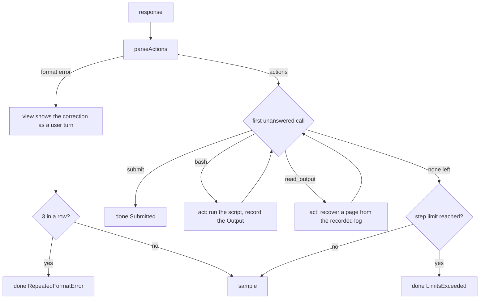

# MiniSwe design

`Alaya.Agent.MiniSwe` is a port of [mini-SWE-agent](https://github.com/SWE-agent/mini-swe-agent)'s
default tool-calling agent as an `Alaya.Agent.Agent`. It keeps what defines that agent — its
prompts, its `bash` command tool, its protocol for reading a response and answering a malformed one,
its limits — and realizes them through the five operations of the agent API
(`docs/agent-api.md`): the tools, the view, `next`, `act`, and an identity. Rendering and
execution are Lean's own rather than imitations of the Python original; the differences that
change behaviour are listed in §8. The full output recovery contract and design are in
[output-recovery.md](output-recovery.md).

## 1. The agent

```lean
def agent (executor : Executor) (config : Config) : Agent := {
  identity := { agent := "mini-swe", step_limit, max_consecutive_format_errors, timeout_seconds }
  tools := #[bashTool, submitTool, OutputRead.tool]
  view
  next := next config
  act := act executor }
```

Two things are fixed when the agent is built. The **executor** is where its commands run — the
host, or a container the trajectory pinned — and the **configuration** holds its limits:

| Field | Default | Meaning |
| --- | --- | --- |
| `task` | — | the task text placed in the opening prompt |
| `stepLimit` | 0 | model calls before the run ends with `LimitsExceeded`; 0 is no limit |
| `maxConsecutiveFormatErrors` | 3 | malformed responses in a row before `RepeatedFormatError`; 0 is no limit |
| `executor` | 30 s, mini's environment overrides | how each command is run (`Executor.Config`) |

The command line names the agent `--agent mini-swe`.

## 2. The opening log

`initialLog config uname` produces the two events a run starts from: the system message, and
the instance message with the task and a line describing the machine — the `uname` of the
executor, so a run pinned to an image is told about the image and not about the host. Both are
mini's texts, rendered from its `mini.yaml`; the only change is the two sentences that named its
submission sentinel, which name the `submit` tool. The opening log is frozen into the root state.

## 3. Tools

**`bash`** takes one string argument, `command`, a shell script. **`submit`** takes a string
`message` and ends the run; the message becomes the run's submission. **`read_output`** takes
`ref`, `offset`, and `limit` to recover a page of a previous command's full recorded output.
Offsets count Unicode scalar values from zero; `limit` is an integer from 1 through 10 000.
It reads the current log and does not run a shell command. All schemas are strict
(every property required, no others). `submit` replaces mini's convention of ending a run when a
command prints a sentinel line, which would require whoever runs the agent to read tool output;
here the end of a run is a tool call, visible in the log's structure.

Recovery is optional and can target just a needed section. The agent need not read to EOF and
can continue with `bash` or `submit` without calling `read_output`, or after a partial read.

## 4. Reading a response: `parseActions`

Every response is read into either a list of **actions** or a **format error**:

| The response… | Result |
| --- | --- |
| has no tool call | format error: "No tool calls found in the response…" |
| has a call whose arguments are not JSON | format error: "Error parsing tool call arguments: …" |
| has a call to an unknown tool | format error: "Unknown tool '…'." |
| has a `bash` call without `command`, or with a non-string one | format error saying which |
| has a `read_output` call with an invalid reference type, offset, or limit | format error saying which |
| otherwise | one `Action.bash id command`, `Action.readOutput id`, or `Action.submit id message` per call, in order |

The first call with a problem decides; the whole turn is a format error. The message the model
will see (`formatErrorMessage`) wraps the problem in mini's guidance on how to call the tool,
ending with how to submit — except when the provider reports that it **cut the response off**
(`finish_reason` is `length`, or `tool_calls` with no calls present): then the message says so
and asks for a shorter response, because the model did nothing wrong that repeating the guidance
would fix.

## 5. The view

`view` maps the log to the dialogue event by event.

- A **message** passes through: the opening prompts, a person's notice.
- A **response** that parsed becomes the assistant message it was, tool calls and reasoning
  included. A response that did **not** parse is not shown at all; in its place the model sees a
  **user** message carrying the format error. This is mini's protocol: the malformed turn is
  dropped from the model's context and replaced by the correction, so the model does not see its
  own broken output and try to continue it. The log still holds the response.
- An **observation** — the `Output` the agent recorded, as JSON — becomes a tool message with
  the JSON rendered as text: `output`, `exit_code` (null when the command did not complete), and
  `error` when there is one. When `output` exceeds `outputLimit` (10 000) Unicode characters, the
  model is shown `output_head` and `output_tail` of 5 000 characters each and `elided_chars`
  instead. It also receives `truncated`, `total_chars`, zero-based half-open
  `displayed_ranges`, a SHA-256 `output_ref`, and concrete `read_output` arguments starting at
  the first omitted character. The record keeps the whole decoded output; the 10 000-character
  limit bounds the preview text, with JSON metadata in addition.
- A **page** returned by `read_output` uses `content`, with `offset`, `end_offset`,
  `total_chars`, `next_offset`, and `eof`. It passes through without being previewed again.
  When more content is needed, `next_offset` selects the following page. Reading all pages can
  reach the end even for a single line longer than the preview limit; it is not a prerequisite
  for continuing the task.

*Two turns of a log and their view: a malformed response is replaced, a long output is cut.*


## 6. Control and action: `next` and `act`

`next config log` decides from the log alone:

1. **After a malformed response.** If the trailing responses are `maxConsecutiveFormatErrors`
   format errors in a row, `done RepeatedFormatError`; otherwise `sample` again — the view
   will show the correction. A person's message between them does not break the run; an
   observation does, since it means a turn ran.
2. **After a response with actions.** The first action whose call no observation has answered
   yet is next. A `submit` there is `done Submitted`, with its message as the submission; a
   `bash` or `read_output` there is `act` on that call. Calls after a `submit` in the same
   response never run.
3. **When every call is answered**, `sample` — unless `stepLimit` is set and the log already
   holds that many responses, in which case `done LimitsExceeded`. The limit is checked before
   the model call, as mini does.

`act executor workspace call` runs the `bash` call's script in the workspace through the
executor and returns the `Output` as JSON. A `read_output` call instead resolves the reference
against `workspace.log`; both run drivers provide the full current log before each act. A
missing reference or an out-of-range offset returns an error observation. The action is never
given a `submit`: `next` ends the run first.

*One response, from the model to the next sample.*



## 7. Running a command

The executor (`Alaya.Executor`) runs a script through `/bin/sh` with stderr merged into stdout at
the file-descriptor level, so the model sees output in the order a terminal would, in the
workspace, with the inherited environment plus the configured overrides, in its own session so a
timeout kills the whole process group. Output is decoded as UTF-8 with invalid bytes replaced.
A command that cannot be run, or that is killed at the timeout, yields an `Output` with no exit
code and an `error` saying why — never an exception, so a run does not die on a failed command.

`Executor.onHost` runs on the machine; `Executor.Docker.executor` starts one container per run
with the workspace bind-mounted and runs each command with `docker exec`. What a container run
changes: only the workspace is snapshotted, so an install into the image's filesystem lasts for
the run and is gone when a branch is resumed later.

## 8. Differences from mini-SWE-agent

- A run ends with the `submit` tool, not a sentinel line in a command's output; the two prompt
  sentences and the last line of the format-error message say so.
- Tool schemas are strict.
- `read_output` recovers full recorded command output from bounded previews; no separate spill
  directory is required. The current log carries the content across forks and container restarts.
- Observations are JSON values rendered by Lean, so non-ASCII text is not escaped and the fields
  are `output`, `exit_code`, and `error`, rather than mini's `returncode` and `exception_info`.
- A non-string `command` is a format error, not run the way Python's `Popen` would happen to run
  a list or a dict.
- A format error names one problem per call, rather than concatenating every problem found.
- Invalid UTF-8 in output is replaced byte by byte, not by CPython's maximal-subpart rule.
- Error texts are plain, not Python's exception messages.
- The environment is a snapshot of the working directory, not a persistent machine.
- No per-model cost accounting, so mini's `cost_limit` is not enforced.

The added tool and changed long-output view intentionally change model-cache keys. Existing
state objects remain readable; the archived replay fixture in `example/ReplayCached.lean`
retains its original tool list and view. No history pruning, conversation summaries, time
feedback, or change to submission and `ask_user` policy is part of output recovery.
The reliability of this recovery contract is tested independently of Vero performance;
benchmark results do not determine whether the model must use the recovery tool.
