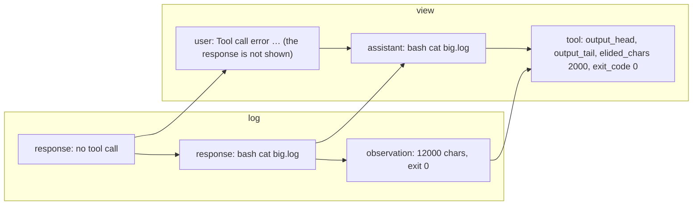
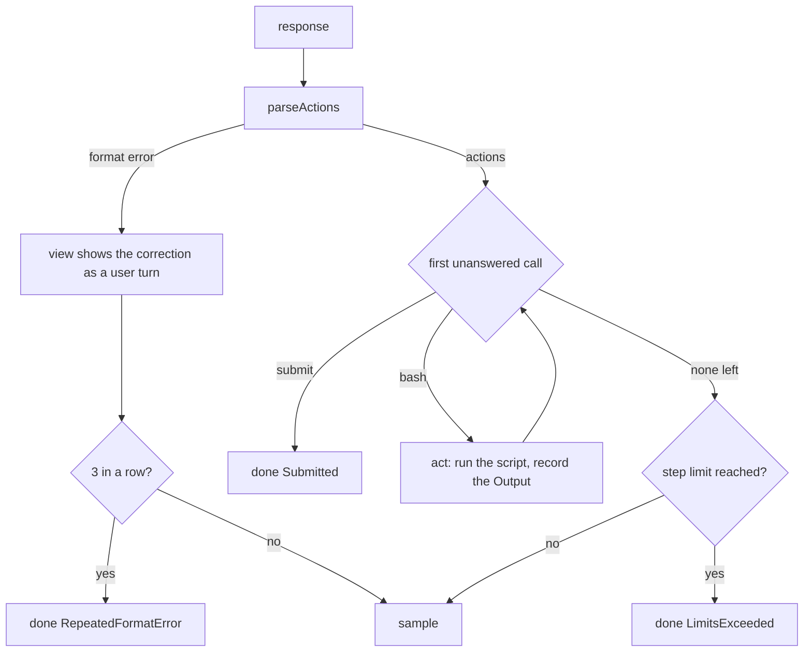

# MiniSwe design

`Alaya.Agent.MiniSwe` is a port of [mini-SWE-agent](https://github.com/SWE-agent/mini-swe-agent)'s
default tool-calling agent as an `Alaya.Agent.Agent`. It keeps what defines that agent — its
prompts, its one `bash` tool, its protocol for reading a response and answering a malformed one,
its limits — and realizes them through the five operations of the agent API
(`docs/agent-api.md`): the tools, the view, `next`, `act`, and an identity. Rendering and
execution are Lean's own rather than imitations of the Python original; the differences that
change behaviour are listed in §7.

## 1. The agent

```lean
def agent (executor : Executor) (config : Config) : Agent := {
  identity := config.toJson                   -- the configuration, as the root records it
  tools := tools config                       -- bash and submit; read_output when configured
  view := view config
  next := next config
  act := act executor }
```

Two things are fixed when the agent is built. The **executor** is where its commands run — the
host, or a container the trajectory pinned — and the **configuration**, a JSON object read by
`Config.fromJson` (`agents/mini-swe-default.json` is its defaults, and the fields are):

| Field | Default | Meaning |
| --- | --- | --- |
| `family` | `mini-swe` | which agent this configures |
| `step_limit` | 0 | model calls before the run ends with `LimitsExceeded`; 0 is no limit |
| `max_consecutive_format_errors` | 3 | malformed responses in a row before `RepeatedFormatError`; 0 is no limit |
| `executor.timeout_seconds`, `executor.env` | 30, mini's overrides | how each command is run (`Executor.Config`) |
| `recover_output` | false | offer `read_output` (§9) |

A field left out is its default; a misspelt one is an error. The task is not configuration: it
is what `root --task` gives, and `initialLog config task uname` places it. The command line
names a configuration file at `root` (`--agent agents/mini-swe-default.json`;
`docs/trajectory-schema.md` §8) and the root records it.

The tools are not this agent's: `Alaya.Agent.Tools` defines each on its own — its schema for the
model, how its arguments are read, and what answers a call — with no knowledge of which agent
offers it. `bash` runs a command in the workspace through the executor and its observation is
the `Output`; `submit` ends a run; `read_output` is answered from the log. MiniSwe composes them:
which are offered, how a malformed call is worded, what the view shows.

## 2. The opening log

`initialLog config task uname` produces the two events a run starts from: the system message, and
the instance message with the task and a line describing the machine — the `uname` of the
executor, so a run pinned to an image is told about the image and not about the host. Both are
mini's texts, rendered from its `mini.yaml`; the only change is the two sentences that named its
submission sentinel, which name the `submit` tool. The opening log is frozen into the root state.

## 3. Tools

**`bash`** takes one string argument, `command`, a shell script. **`submit`** takes a string
`message` and ends the run; the message becomes the run's submission. Both schemas are strict
(every property required, no others). `submit` replaces mini's convention of ending a run when a
command prints a sentinel line, which would require whoever runs the agent to read tool output;
here the end of a run is a tool call, visible in the log's structure.

With `recoverOutput` on, a third tool is offered. **`read_output`** takes `call_id`, the id of an
earlier `bash` call, and `offset` and `limit`, a range of lines counting from 1, and shows those
lines of that call's full output — the view shows a long output cut to its head and tail (§5),
while the log holds all of it. See §9.

## 4. Reading a response: `parseActions`

Every response is read into either a list of **actions** or a **format error**:

| The response… | Result |
| --- | --- |
| has no tool call | format error: "No tool calls found in the response…" |
| has a call whose arguments are not JSON | format error: "Error parsing tool call arguments: …" |
| has a call to an unknown tool | format error: "Unknown tool '…'." |
| has a `bash` call without `command`, or with a non-string one | format error saying which |
| otherwise | one `Action.bash id command` or `Action.submit id message` per call, in order |

The first call with a problem decides; the whole turn is a format error. The message the model
will see (`formatErrorMessage`) wraps the problem in mini's guidance on how to call the tool,
ending with how to submit — except when the provider reports that it **cut the response off**
(`finish_reason` is `length`, or `tool_calls` with no calls present): then the message says so
and asks for a shorter response, because the model did nothing wrong that repeating the guidance
would fix.

## 5. The view

`view` maps the log to the dialogue event by event.

- A **message** passes through: the opening prompts, a person's notice.
- A **response** that parsed becomes the assistant message it was, tool calls and reasoning
  included. A response that did **not** parse is not shown at all; in its place the model sees a
  **user** message carrying the format error. This is mini's protocol: the malformed turn is
  dropped from the model's context and replaced by the correction, so the model does not see its
  own broken output and try to continue it. The log still holds the response.
- An **observation** — the `Output` the agent recorded, as JSON — becomes a tool message with
  the JSON rendered as text: `output`, `exit_code` (null when the command did not complete), and
  `error` when there is one. When `output` is `outputLimit` (10 000) characters or longer, the
  model is shown `output_head` and `output_tail` of 5 000 characters each and `elided_chars`
  instead. The record keeps the whole output.

*Two turns of a log and their view: a malformed response is replaced, a long output is cut.*



## 6. Control and action: `next` and `act`

`next config log` decides from the log alone:

1. **After a malformed response.** If the trailing responses are `maxConsecutiveFormatErrors`
   format errors in a row, `done RepeatedFormatError`; otherwise `sample` again — the view
   will show the correction. A person's message between them does not break the run; an
   observation does, since it means a turn ran.
2. **After a response with actions.** The first action whose call no observation has answered
   yet is next. A `submit` there is `done Submitted`, with its message as the submission; a
   `bash` there is `act` on that call; a `read_output` there is `observe` with the page, computed
   from the log by `Tools.ReadOutput.read` (§9). Calls after a `submit` in the same response never run.
3. **When every call is answered**, `sample` — unless `stepLimit` is set and the log already
   holds that many responses, in which case `done LimitsExceeded`. The limit is checked before
   the model call, as mini does.

`act executor workspace call` runs the `bash` call's script in the workspace through the
executor and returns the `Output` as JSON. It is never given a `submit`: `next` ends the run
first.

*One response, from the model to the next sample.*



## 7. Running a command

The executor (`Alaya.Executor`) runs a script through `/bin/sh` with stderr merged into stdout at
the file-descriptor level, so the model sees output in the order a terminal would, in the
workspace, with the inherited environment plus the configured overrides, in its own session so a
timeout kills the whole process group. Output is decoded as UTF-8 with invalid bytes replaced.
A command that cannot be run, or that is killed at the timeout, yields an `Output` with no exit
code and an `error` saying why — never an exception, so a run does not die on a failed command.

`Executor.onHost` runs on the machine; `Executor.Docker.executor` starts one container per run
with the workspace bind-mounted and runs each command with `docker exec`. What a container run
changes: only the workspace is snapshotted, so an install into the image's filesystem lasts for
the run and is gone when a branch is resumed later.

## 8. Differences from mini-SWE-agent

- A run ends with the `submit` tool, not a sentinel line in a command's output; the two prompt
  sentences and the last line of the format-error message say so.
- Tool schemas are strict.
- Observations are JSON values rendered by Lean, so non-ASCII text is not escaped and the fields
  are `output`, `exit_code`, and `error`, rather than mini's `returncode` and `exception_info`.
- A non-string `command` is a format error, not run the way Python's `Popen` would happen to run
  a list or a dict.
- A format error names one problem per call, rather than concatenating every problem found.
- Invalid UTF-8 in output is replaced byte by byte, not by CPython's maximal-subpart rule.
- Error texts are plain, not Python's exception messages.
- The environment is a snapshot of the working directory, not a persistent machine.
- No per-model cost accounting, so mini's `cost_limit` is not enforced.
- With `recoverOutput` on: the `read_output` tool, two sentences, and a warning (§9).

## 9. Reading a long output back: `read_output`

Off by default, and then nothing above changes. On (`recover_output` in the configuration
file), the agent can see the part of a command's output the
view cut:

- The **warning** on a cut output names the call: `Output too long. read_output shows any lines
  of the whole of it; this call's id is call_…`. The id is also the tool message's
  `tool_call_id`, but a model given only that has been seen to guess.
- **`read_output {call_id, offset, limit}`** is answered by `next` from the log, as
  `Directive.observe`: nothing runs, no snapshot is taken, and the state records the page as an
  ordinary observation with the parent's workspace. The output is the most recent observation
  with that id whose content is a command's `Output`, so an id a provider reuses across turns
  names the latest; a fork reads its ancestors' outputs and nothing else, since it reads its own
  log.
- The **page** is `{"text": "…", "lines": "2500-2502 of 5000"}`: whole lines while they fit in
  `outputLimit` characters, or the first line alone, cut, and said so. A page is not an `Output`
  — its field is `text`, not `output` — so the view shows it as recorded rather than cutting it
  again. An unknown id, an offset past the end, or bad arguments give `{"error": "…"}`, an
  observation like any other; malformed arguments are a format error, as for `bash`.
- The two sentences of mini's texts that require a bash call in every response say a tool call
  instead, since a response may be a `read_output` alone (`withRecovery`). That, and the tool,
  are the whole difference: with the flag off, the prompts, tools and observations are mini's to
  the byte, and the response cache keys do not move.
