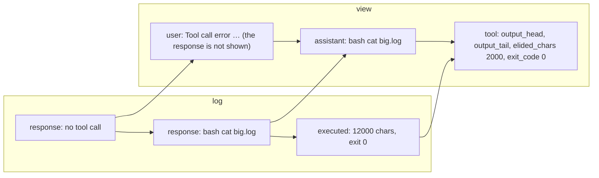
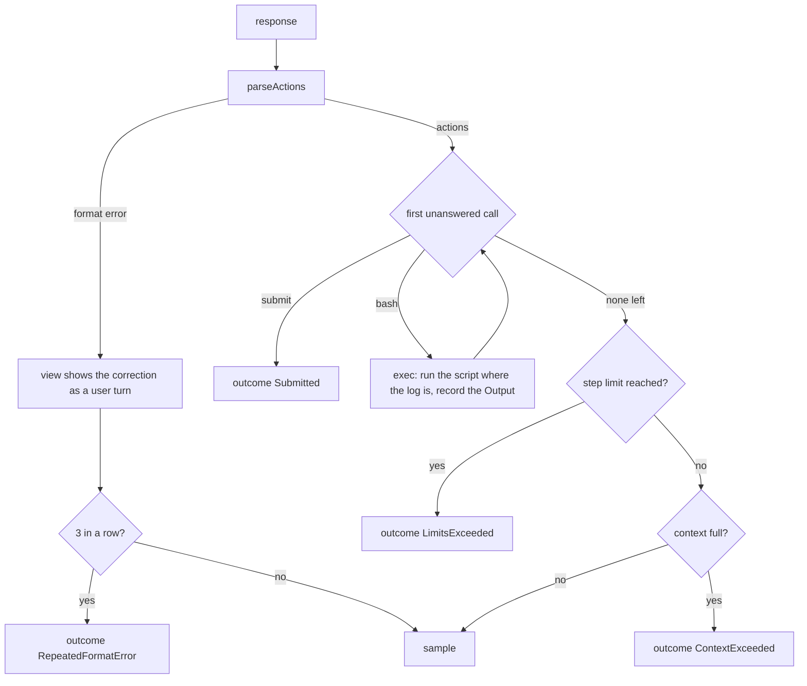

# MiniSwe design

`Alaya.Agent.MiniSwe` is a port of [mini-SWE-agent](https://github.com/SWE-agent/mini-swe-agent)'s
default tool-calling agent as an `Alaya.Agent.Agent`. It keeps what defines that agent — its
prompts, its one `bash` tool, its protocol for reading a response and answering a malformed one,
its limits — and realizes them through the agent API (`docs/agent-api.md`): the tools, the
view, and `next`, pure functions of the log, with the limits added as combinators. It runs
nothing itself: a `bash` call is an effect the driver's handler carries out. Rendering and execution
are Lean's own rather than imitations of the Python original; the differences that change
behaviour are listed in §8.

## 1. The agent

```lean
def agent (config : Config) (model : Models.Spec) : Agent :=
  let base : Agent := {
    config := config.toJson                   -- the configuration, as the root records it
    initialLog := initialLog config
    next := next config }                     -- mini's control flow, without its limits
  ((base.runCommandsWith config.executor).limitContext (contextLimit? config model)).limitResponses config.stepLimit
```

Its model turns are `request config log`: `view config log`, with `tools config` — `bash`,
`submit`, and whatever else `config.tools` names.

Two things are fixed when the agent is built: the run's **model spec**, whose context size bounds
the run (§10), and the **configuration**, a JSON object read by `Config.fromJson`, whose
defaults `alaya config --agent mini-swe` prints:

| Field | Default | Meaning |
| --- | --- | --- |
| `name` | `mini-swe` | which agent this configures |
| `step_limit` | 0 | model calls before the run ends with `LimitsExceeded`; 0 is no limit |
| `max_consecutive_format_errors` | 3 | malformed responses in a row before `RepeatedFormatError`; 0 is no limit |
| `executor.timeout_seconds`, `executor.env` | 30, mini's overrides | how each command is run (`Executor.Config`) |
| `recover_output` | false | name the file holding a cut output's whole (§9) |
| `tools` | `["bash", "submit"]` | the tools offered, in order, by name (`Tools.all`); `bash` and `submit` are required, and `ask_user` and `time_budget` may be added |
| `context_reserve` | 8000 | tokens kept free for the next response, or the model's `output_tokens` when less (§10) |
| `mask_observations` | null | `{keep_turns, block}`: omit old outputs from the view (§10) |

A field left out is its default; a misspelt one is an error. The task is not configuration: it
is what `root --task` gives, and `initialLog config task uname` places it. The command line
names the agent at `root` and overrides fields there (`--agent mini-swe --set agent.step_limit=50`;
`docs/cli.md` §5), and the root records the complete configuration.

The tools are not this agent's. `Alaya.Agent.Tools` defines each as a `Tool`, with no knowledge of
which agent offers it:

```lean
structure Tool where
  definition : Chat.ToolDefinition                       -- its schema for the model
  alone : Bool := false                                  -- must be the only call of its turn
  instruction? : Option String := none                   -- appended to the prompt
  read : Chat.ToolCall -> Except String (CallRef -> Log -> Effect ⊕ Outcome)
                                                         -- what is wrong with a call, or how it is answered
```

`read` gives how a call is answered (`docs/agent-api.md` §3): what to ask for next for it, from
the log — the effect that answers the call, or the outcome that ends the run. A `bash` call is
answered by running its script in the workspace; `submit` ends
the run; `ask_user` asks a person, alone; `time_budget` times the run, then records the seconds
left. MiniSwe holds a list of tools, its **registry**, and owns the rest: which tool a call
names, how a malformed call is worded, what the view shows. A tool never changes the agent's
text, it only adds its instruction after it, so adding a tool — one of `Tools.all`, or any
`Tool` value given in code — changes nothing in MiniSwe.

## 2. The opening log

`initialLog config task uname` produces the two events a run starts from: the system message, and
the instance message with the task and a line describing the machine — the `uname` of the
executor, so a run pinned to an image is told about the image and not about the host. Both are
mini's texts, rendered from its `mini.yaml`, with two changes: the two sentences that named its
submission sentinel name the `submit` tool, and the sentences that require a `bash` call require
a tool call (`toolNeutral`), so that no tool added after them is contradicted — `ask_user` must
be called alone. Each offered tool's instruction is then appended, a blank line before it, in
the order of the tools. The format-error message is built the same way. The opening log is
frozen into the root state.

## 3. Tools

**`bash`** takes one string argument, `command`, a shell script. **`submit`** takes a string
`message` and ends the run; the message becomes the run's submission. Both schemas are strict
(every property required, no others). `submit` replaces mini's convention of ending a run when a
command prints a sentinel line, which would require whoever runs the agent to read tool output;
here the end of a run is a tool call, visible in the log's structure.

With `recoverOutput` on, no tool is added: a long output, which the view cuts to its head and
tail (§5), is in a file the agent reads with `bash`. See §9.

## 4. Reading a response: `parseActions`

Every response is read into either a list of **actions** or a **format error**:

| The response… | Result |
| --- | --- |
| has no tool call | format error: "No tool calls found in the response…" |
| has a call whose arguments are not JSON | format error: "Error parsing tool call arguments: …" |
| has a call to an unknown tool | format error: "Unknown tool '…'." |
| has a `bash` call without `command`, or with a non-string one | format error saying which |
| otherwise | one `Action` per call, in order: which call it is, and how its tool answers it |

The first call with a problem decides; the whole turn is a format error. The message the model
will see (`formatErrorMessage`) wraps the problem in mini's guidance on how to call the tool,
ending with how to submit — except when the provider reports that it **cut the response off**
(`finish_reason` is `length`, or `tool_calls` with no calls present): then the message says so
and asks for a shorter response, because the model did nothing wrong that repeating the guidance
would fix.

## 5. The view

`view` maps the log to the dialogue event by event.

- A **message** passes through: the opening prompts, a person's notice.
- A **response** that parsed becomes the assistant message it was, tool calls and reasoning
  included. A response that did **not** parse is not shown at all; in its place the model sees a
  **user** message carrying the format error. This is mini's protocol: the malformed turn is
  dropped from the model's context and replaced by the correction, so the model does not see its
  own broken output and try to continue it. The log still holds the response.
- A command's run that answers a call (`executed`) becomes a tool message with its `Output` as JSON, rendered as
  text: `output`, `exit_code` (null when the command did not complete), and
  `error` when there is one. When `output` is `outputLimit` (10 000) characters or longer, the
  model is shown `output_head` and `output_tail` of 5 000 characters each and `elided_chars`
  instead. The record keeps the whole output.
- A **recorded** result — a person's answer, a value recorded by `next` — becomes a tool
  message with its JSON as text.
- A workspace **placed** or a **timed** reading of the run is not shown.

*Two turns of a log and their view: a malformed response is replaced, a long output is cut.*


```mermaid
flowchart LR
  subgraph L["log"]
    direction TB
    L1["response: no tool call"]
    L2["response: bash cat big.log"]
    L3["executed: 12000 chars, exit 0"]
    L1 --> L2 --> L3
  end
  subgraph V["view"]
    direction TB
    V1["user: Tool call error … (the response is not shown)"]
    V2["assistant: bash cat big.log"]
    V3["tool: output_head, output_tail, elided_chars 2000, exit_code 0"]
    V1 --> V2 --> V3
  end
  L1 --> V1
  L2 --> V2
  L3 --> V3
```

## 6. Control: `next`

`next config log` decides from the log alone, through its index (`docs/agent-api.md` §1): its
latest turn, and the calls of it nothing has answered.

1. **After a malformed response.** If the latest `maxConsecutiveFormatErrors` turns are all
   format errors, the outcome `RepeatedFormatError`; otherwise `sample` again — the view will show the
   correction. A person's message between them does not break the run; a turn whose calls
   parsed does.
2. **After a response with actions.** The first of its calls nothing has answered yet is next,
   answered under its reference by its tool. A `submit` there is the
   outcome `Submitted`, with its message as the submission; a `bash`
   there is `exec`, of its script, in the workspace. Calls
   after a `submit` in the same response never run. Whatever the tool, what is asked for is its
   `read`'s: a `time_budget` call is `time`, then, once the log holds the timing,
   `record` of the seconds left from it.
3. **When every call is answered**, `sample` of the view, with the tools, for `Purpose.turn`.

Two combinators then turn a `sample` into a stop (`docs/agent-api.md` §4): when `stepLimit` is
set and the log already holds that many responses, the outcome `LimitsExceeded`, checked before the
model call, as mini does; and when the next request would not fit in the model's context,
`ContextExceeded` (§10). The step limit is checked first.

*One response, from the model to the next sample.*


```mermaid
flowchart TD
  R["response"] --> P["parseActions"]
  P -->|"format error"| F["view shows the correction as a user turn"]
  F --> N1{"3 in a row?"}
  N1 -->|yes| D1["outcome RepeatedFormatError"]
  N1 -->|no| S["sample"]
  P -->|"actions"| A{"first unanswered call"}
  A -->|"submit"| D2["outcome Submitted"]
  A -->|"bash"| X["exec: run the script where the log is, record the Output"]
  X --> A
  A -->|"none left"| L{"step limit reached?"}
  L -->|yes| D3["outcome LimitsExceeded"]
  L -->|no| C{"context full?"}
  C -->|yes| D4["outcome ContextExceeded"]
  C -->|no| S
```

## 7. Running a command

Every command runs in a container (`Alaya.Executor.Docker`): one container per run, started
from the trajectory's image at the first command, with the workspace bind-mounted at
`/workspace`, and each command run in it with `docker exec`. Nothing runs on the host. The
command goes through `/bin/sh` with stderr merged into stdout at the file-descriptor level, so
the model sees output in the order a terminal would, with the image's environment plus the
configured overrides. When the image has `timeout(1)`, it kills the command's process group at
the timeout; otherwise the container is removed, and the next command starts a new one. Output
is decoded as UTF-8 with invalid bytes replaced. A command that cannot be run, or that is killed
at the timeout, yields an `Output` with no exit code and an `error` saying why — never an
exception, so a run does not die on a failed command.

Only the workspace is snapshotted, so an install into the image's filesystem lasts for the run
and is gone when a branch is resumed later.

## 8. Differences from mini-SWE-agent

- A run ends with the `submit` tool, not a sentinel line in a command's output; the two prompt
  sentences and the last line of the format-error message say so.
- Tool schemas are strict.
- Observations are JSON values rendered by Lean, so non-ASCII text is not escaped and the fields
  are `output`, `exit_code`, and `error`, rather than mini's `returncode` and `exception_info`.
- A non-string `command` is a format error, not run the way Python's `Popen` would happen to run
  a list or a dict.
- A format error names one problem per call, rather than concatenating every problem found.
- Invalid UTF-8 in output is replaced byte by byte, not by CPython's maximal-subpart rule.
- Error texts are plain, not Python's exception messages.
- The environment is a snapshot of the working directory, not a persistent machine.
- No per-model cost accounting, so mini's `cost_limit` is not enforced.
- A run whose next request would not fit in the model's context ends with `ContextExceeded`,
  rather than with the provider's error (§10).
- With `recoverOutput` on: a cut output's warning names a file (§9).
- With `mask_observations` set: old outputs are omitted from the view (§10).
- Every response must hold a tool call, not a `bash` call: mini's three sentences that say
  `bash` say a tool (§2).
- With `ask_user` among the tools: [yes/no, single-choice, and open-ended questions](ask-user.md), using the existing question/reply states.

## 9. Reading a long output back

Off by default, and then nothing above changes. On (`--set agent.recover_output=true`), the
warning on a cut output names a file holding the whole of it, as the DeepSeek harness does:

```
[output truncated; full output: /alaya/outputs/17-call_abc.txt]
```

and the agent reads it with `bash`. The file is the trajectory's, for any agent
(`docs/agent-api.md` §3): every output of the branch, named by its position in the log, which
never changes on a branch, and by its call id, written into the command's scratch before each
command and mounted read-only at `/alaya/outputs`, outside the workdir. MiniSwe's commands ask
for them only with `recover_output` or masking on; otherwise the directory is empty, and a
command sees what mini's would. A fork or a new container sees its own branch's files; no
snapshot or grader sees them. The prompts and tools are mini's as they are, so only the warning
differs.

## 10. Context management

**A full context ends the run cleanly.** When the model spec gives a `context_tokens`, the agent
ends the run with the outcome `ContextExceeded` instead of sampling a request that would not fit:
when the request's size reaches the context less `context_reserve`, or less the model's
`output_tokens` when that is smaller. The size needs no tokenizer (`Agent.contextTokens`): the
latest response's recorded `usage` says how many tokens the request it answered held and how
many it returned, and what the view has added since is estimated at four characters a token of
its JSON. With no `usage`, or once the view has rewritten what was measured, the whole view is
estimated. A model with no known context size is not checked. Whatever the estimate, a request
the provider refuses as too long ends the run the same way, recorded by the trajectory with the
provider's words (`docs/trajectory-schema.md` §2), so a run never fails on a full context.

**Masking omits old outputs, in blocks.** With `mask_observations` `{keep_turns: K, block: B}`,
the view omits the outputs of the oldest turns: none while the log holds fewer than `K + B`
turns, then those of the first `((t - K) / B) * B` of its `t` turns. The boundary moves `B`
turns at a time, so between its moves the context only grows at its end and the provider's
prompt cache holds. An omitted output keeps its exit code and names the file holding it, which
the agent reads with `bash`:

```json
{"output": "[output omitted; full output: /alaya/outputs/12-call_c7.txt]", "exit_code": 0}
```

Only command outputs are omitted, and only those longer than that notice: messages, responses
and every other tool result stay. Masking depends on turn positions alone, never on the context
size, so a log is shown the same way whatever the model; the files are derived from the log as
in §9, with or without `recover_output`.
