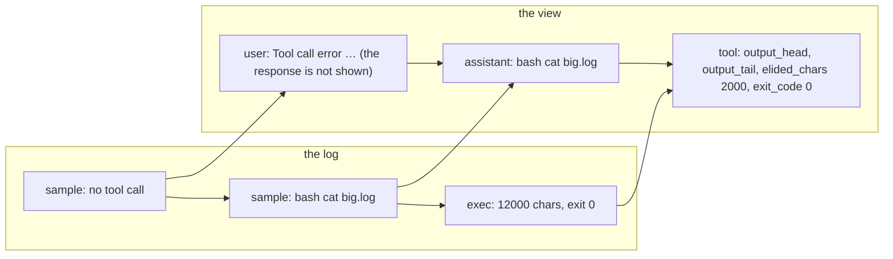
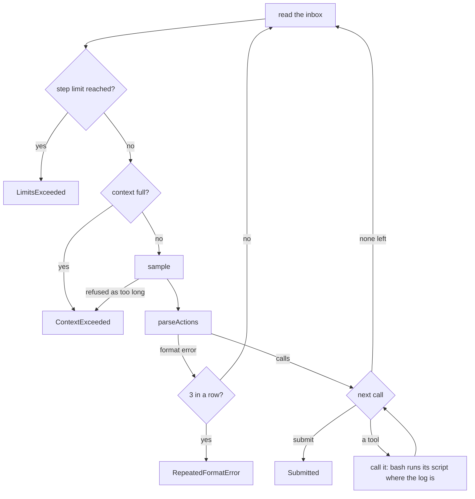

# MiniSwe design

`Alaya.Agents.MiniSwe` is a port of [mini-SWE-agent](https://github.com/SWE-agent/mini-swe-agent)'s
default tool-calling agent as a program (`docs/agent-api.md`). It keeps what defines that agent —
its prompts, its one `bash` tool, its protocol for reading a response and answering a malformed
one, its limits — and realizes them as a loop over the conversation: it samples the model on
mini's view of the conversation, reads the response's tool calls as mini does, and calls each
tool by its name, in a frame of its own. It runs nothing itself: a command is an operation the
driver carries out. Rendering and execution are Lean's own rather than imitations of the Python
original; the differences that change behaviour are listed in §8.

## 1. The agent

```lean
def program (config : Config) (model : Models.Spec) (uname : Uname) : Program Agent Json :=
  converse { config with contextLimit? := contextLimit? config model } (openingMessages config · uname)

def converse (config : Config) (opening : String → Array Chat.Message) : Program Agent Json := do
  let notices ← await fun _ notice => notice matches .said _     -- the task
  iter (round config) { items := (opening task).map .told, … }    -- mini's loop
```

The agent is the program of the run's `agent` tool (`Agents.Catalog`). It waits for its task, the
first thing a person says, and opens the conversation with mini's prompts for it; then it goes
round `round` (§6) until it ends, returning `{status, submission}`: `Submitted`,
`LimitsExceeded`, `ContextExceeded` or `RepeatedFormatError`. `ContextExceeded` has a `reason`
too when it was the provider that refused the request as too long: its own words.

Two things are fixed when the agent is built: the run's **model spec**, whose context size bounds
the run (§10), and the **configuration**, a JSON object read by `Config.fromJson`, whose
defaults `alaya config --agent mini-swe` prints:

| Field | Default | Meaning |
| --- | --- | --- |
| `name` | `mini-swe` | which agent this configures |
| `step_limit` | 0 | model calls before the agent ends with `LimitsExceeded`; 0 is no limit |
| `max_consecutive_format_errors` | 3 | malformed responses in a row before `RepeatedFormatError`; 0 is no limit |
| `executor.timeout_seconds`, `executor.env` | 30, mini's overrides | how each command is run (`Executor.Config`) |
| `recover_output` | false | name the file holding a cut output's whole (§9) |
| `tools` | `["bash", "submit"]` | the tools offered, in order, by name (`Tools.all`); `bash` and `submit` are required, and `ask_user` and `time_budget` may be added |
| `context_reserve` | 8000 | tokens kept free for the next response, or the model's `output_tokens` when less (§10) |
| `mask_observations` | null | `{keep_turns, block}`: omit old outputs from the view (§10) |

A field left out is its default; a misspelt one is an error. The task is not configuration: it
is what `new --task` gives, the notice the agent waits for. The command line names the agent at
`new` and overrides fields there (`--agent mini-swe --set agent.step_limit=50`; `docs/cli.md`
§5), and the opening of the agent's call holds the complete configuration.

The tools are not this agent's. `Alaya.Agents.Tools` defines each as a `Tool` — its schema, whether
it must be called alone, the instruction it adds to the prompt, what is wrong with a call's
arguments, and the program that answers a call (`docs/agent-api.md` §3) — with no knowledge of
which agent offers it. MiniSwe offers the tools its configuration names, and owns the rest: which
tool a call names, how a malformed call is worded, what the view shows. A tool never changes the
agent's text, it only adds its instruction after it.

## 2. The opening

`openingMessages config task uname` is the two messages a conversation starts from: the system
message, and the instance message with the task and a line describing the machine — the `uname`
the run recorded from its image at `new`, so a run pinned to an image is told about the image and
not about the host. Both are mini's texts, rendered from its `mini.yaml`, with two changes: the
two sentences that named its submission sentinel name the `submit` tool, and the sentences that
require a `bash` call require a tool call (`toolNeutral`), so that no tool added after them is
contradicted — `ask_user` must be called alone. Each offered tool's instruction is then appended,
a blank line before it, in the order of the tools. The format-error message is built the same
way. A second notice that arrives with the task is told after the opening, as any later one is.

## 3. Tools

**`bash`** takes one string argument, `command`, a shell script, run with the configuration's
executor settings; its result is the whole output, how it ended, and the file holding it.
**`submit`** takes a string `message` and ends the agent; the message becomes the submission.
Both schemas are strict (every property required, no others). `submit` replaces mini's convention
of ending a run when a command prints a sentinel line, which would require whoever runs the agent
to read tool output; here the end of the agent is a tool call, visible in the log's structure.

With `recoverOutput` on, no tool is added: a long output, which the view cuts to its head and
tail (§5), is in a file the agent reads with `bash`. See §9.

## 4. Reading a response: `parseActions`

Every response is read into either the **calls** to make or a **format error**:

| The response… | Result |
| --- | --- |
| has no tool call | format error: "No tool calls found in the response…" |
| has a call whose arguments are not JSON | format error: "Error parsing tool call arguments: …" |
| has a call to a tool not offered | format error: "Unknown tool '…'." |
| has a call its tool's `check` refuses — a `bash` call without a string `command`, a malformed question | format error saying which |
| has a tool that must be alone beside others | format error: "… must be called alone." |
| otherwise | its calls, in order |

The first call with a problem decides; the whole turn is a format error. The message the model
will see (`formatErrorMessage`) wraps the problem in mini's guidance on how to call the tool,
ending with how to submit — except when the provider reports that it **cut the response off**
(`finish_reason` is `length`, or `tool_calls` with no calls present): then the message says so
and asks for a shorter response, because the model did nothing wrong that repeating the guidance
would fix.

## 5. The view

The state of the loop is the conversation as data, a `History`: what was told — the opening, a
person's message, a change to the workspace — each model turn with each of its calls and what
the call gave, and each malformed response. `view` maps it to the dialogue item by item.

- What was **told** passes through. A person's message or change is wrapped as an
  `<intervention>`, saying it came from a person while the agent was paused.
- A **turn** becomes the assistant message it was, tool calls and reasoning included, and then a
  tool message for each call that ran. A `bash` result is shown as JSON, rendered as text:
  `output`, `exit_code` (null when the command did not complete), and `error` when there is one.
  When `output` is `outputLimit` (10 000) characters or longer, the model is shown
  `output_head` and `output_tail` of 5 000 characters each and `elided_chars` instead. The log
  keeps the whole output. Any other result — a person's answer, the time left, a tool's
  failure as `{"error": …}` — is shown as its JSON.
- A **malformed** response is not shown at all; in its place the model sees a **user** message
  carrying the format error. This is mini's protocol: the malformed turn is dropped from the
  model's context and replaced by the correction, so the model does not see its own broken
  output and try to continue it. The log still holds the response.

*Two turns and their view: a malformed response is replaced, a long output is cut.*


```mermaid
flowchart LR
  subgraph L["the log"]
    direction TB
    L1["sample: no tool call"]
    L2["sample: bash cat big.log"]
    L3["exec: 12000 chars, exit 0"]
    L1 --> L2 --> L3
  end
  subgraph V["the view"]
    direction TB
    V1["user: Tool call error … (the response is not shown)"]
    V2["assistant: bash cat big.log"]
    V3["tool: output_head, output_tail, elided_chars 2000, exit_code 0"]
    V1 --> V2 --> V3
  end
  L1 --> V1
  L2 --> V2
  L3 --> V3
```

## 6. Control: `round`

One round of mini's loop (`DefaultAgent.run`):

1. **Read the inbox.** What a person said or changed since the last round is told, so it reaches
   the model in this round's request. A run paused at a limit stops before this read, so what a
   person appends there is heard at once.
2. **Limits.** When `stepLimit` is set and as many responses were sampled, the agent ends with
   `LimitsExceeded`, checked before the model call, as mini does; when the request would not fit
   in the model's context, `ContextExceeded` (§10).
3. **Sample** the view, with the tools. A provider that refuses the request as too long for the
   model ends the agent with `ContextExceeded` too, its words in `reason` (§10).
4. **A malformed response** is told as its format error; after `maxConsecutiveFormatErrors` of
   them in a row the agent ends with `RepeatedFormatError`. A person's message between them does
   not break the streak; a turn whose calls parsed does.
5. **Otherwise** each call runs in order, by its tool's name. A `submit` ends the agent with its
   message, and calls after it in the same response never run; any other is a call, in a frame of
   its own, and a tool that fails gives the model its error as the call's result.

*One round, from the inbox to the next.*


```mermaid
flowchart TD
  I["read the inbox"] --> L{"step limit reached?"}
  L -->|yes| D3["LimitsExceeded"]
  L -->|no| C{"context full?"}
  C -->|yes| D4["ContextExceeded"]
  C -->|no| S["sample"]
  S -->|"refused as too long"| D4
  S --> P["parseActions"]
  P -->|"format error"| N1{"3 in a row?"}
  N1 -->|yes| D1["RepeatedFormatError"]
  N1 -->|no| I
  P -->|"calls"| A{"next call"}
  A -->|"submit"| D2["Submitted"]
  A -->|"a tool"| X["call it: bash runs its script where the log is"]
  X --> A
  A -->|"none left"| I
```

## 7. Running a command

Every command runs in a container (`Alaya.Executor.Docker`): one container per run, started
from the run's image at the first command, with the workspace bind-mounted at the run's
workdir, `/workspace` unless `new --workdir` says otherwise, and each command run in it with
`docker exec`. Nothing runs on the host. The
command goes through `/bin/sh` with stderr merged into stdout at the file-descriptor level, so
the model sees output in the order a terminal would, with the image's environment plus the
configured overrides. When the image has `timeout(1)`, it kills the command's process group at
the timeout; otherwise the container is removed, and the next command starts a new one. Output
is decoded as UTF-8 with invalid bytes replaced. A command that cannot be run, or that is killed
at the timeout, yields an `Output` with no exit code and an `error` saying why — never an
exception, so a run does not die on a failed command.

Only the workspace is snapshotted, so an install into the image's filesystem lasts for the run
and is gone when a later `run` starts a new container.

## 8. Differences from mini-SWE-agent

- A run ends with the `submit` tool, not a sentinel line in a command's output; the two prompt
  sentences and the last line of the format-error message say so.
- Tool schemas are strict.
- Observations are JSON values rendered by Lean, so non-ASCII text is not escaped and the fields
  are `output`, `exit_code`, and `error`, rather than mini's `returncode` and `exception_info`.
- A non-string `command` is a format error, not run the way Python's `Popen` would happen to run
  a list or a dict.
- A format error names one problem per call, rather than concatenating every problem found.
- Invalid UTF-8 in output is replaced byte by byte, not by CPython's maximal-subpart rule.
- Error texts are plain, not Python's exception messages.
- The environment is a snapshot of the working directory, not a persistent machine.
- No per-model cost accounting, so mini's `cost_limit` is not enforced.
- An agent whose next request would not fit in the model's context ends with `ContextExceeded`,
  rather than sending it (§10).
- With `recoverOutput` on: a cut output's warning names a file (§9).
- With `mask_observations` set: old outputs are omitted from the view (§10).
- Every response must hold a tool call, not a `bash` call: mini's three sentences that say
  `bash` say a tool (§2).
- With `ask_user` among the tools: [yes/no, single-choice, and open-ended questions](ask-user.md), the run waiting for a person's reply.
- What a person says or changes reaches the model at the start of the next round.

## 9. Reading a long output back

Off by default, and then nothing above changes. On (`--set agent.recover_output=true`), the
warning on a cut output names a file holding the whole of it, as the DeepSeek harness does:

```
[output truncated; full output: /alaya/outputs/17.txt]
```

and the agent reads it with `bash`. The file is the driver's, for any agent: a command run with
its outputs kept (`Executor.Config.outputs`) has its whole output written to a file named by the
position of its answer in the log, which never changes on a branch, and the answer names the
file. Before every such command the driver writes the files of every earlier one of the log into
the command's scratch, mounted read-only at `/alaya/outputs`, outside the workdir; for any other
command the directory is empty, and the command sees what mini's would. MiniSwe runs its commands
so only with `recover_output` or masking on. A fork or a new container sees its own log's files;
no snapshot or grader sees them. The prompts and tools are mini's as they are, so only the
warning differs.

## 10. Context management

**A full context ends the agent cleanly.** When the model spec gives a `context_tokens`, the agent
ends with `ContextExceeded` instead of sampling a request that would not fit: when the request's
size reaches the context less `context_reserve`, or less the model's `output_tokens` when that is
smaller. The size needs no tokenizer (`contextTokens`): the latest response that reported its
`usage` says how many tokens the request it answered held and how many it returned, and what the
view has added since is estimated at four characters a token of its JSON. With no `usage`, or
once the view has rewritten what was measured, the whole view is estimated. A model with no known
context size is not checked. Whatever the estimate, a request the provider refuses as too long is
the sample's answer in the log, an error with the provider's words, and the agent ends the same
way: `ContextExceeded`, with `reason` `the provider refused the request: …`.

**Masking omits old outputs, in blocks.** With `mask_observations` `{keep_turns: K, block: B}`,
the view omits the outputs of the oldest turns: none while the conversation holds fewer than
`K + B` turns, then those of the first `((t - K) / B) * B` of its `t` turns. The boundary moves
`B` turns at a time, so between its moves the context only grows at its end and the provider's
prompt cache holds. An omitted output keeps its exit code and names the file holding it, which
the agent reads with `bash`:

```json
{"output": "[output omitted; full output: /alaya/outputs/12.txt]", "exit_code": 0}
```

Only command outputs are omitted, and only those longer than that notice: messages, responses
and every other tool result stay. Masking depends on turn positions alone, never on the context
size, so a conversation is shown the same way whatever the model; the files are the driver's, as
in §9, with or without `recover_output`.
