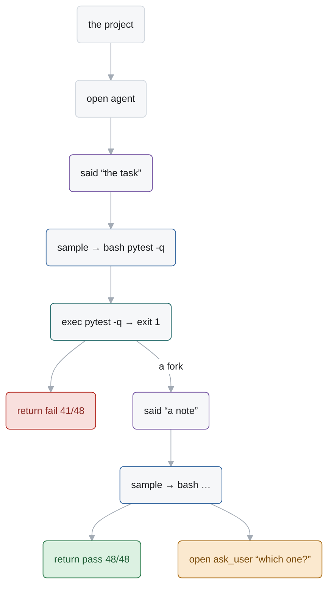

# Style guide

How Alaya looks: the report that `alaya html` writes, set down so that the website and the
diagrams look the same. The report is where the style comes from, and `Alaya/App/Html/page.css` and
`Alaya/App/Html/page.js` hold its values; §1–§7 describe what is there, and §8 and §9 say how a page
of prose and a diagram take it up.

## 1. Character

- **Text first.** A page is a white sheet of text. There are no cards, shadows, gradients or
  pictures; structure comes from alignment, a thin rule, and a faint ground.
- **Dense and even.** Small type, tight rows, every row the same height. A screen holds much,
  and nothing on it is larger than it needs to be.
- **Colour means something.** Text is ink or grey. A colour appears only where it says what a
  thing is (its kind) or how it went (passed, failed, waits), and the same colour always says
  the same thing.
- **Two voices.** What Alaya says is in the system's sans-serif; what a program, a model or a
  machine said — commands, output, files, names of entries — is in monospace.
- **One theme.** Light only.

## 2. Colour

The grounds and the greys:

| Token | Value | Use |
| --- | --- | --- |
| `--ink` | `#1c1e21` | text |
| `--mute` | `#6f7985` | secondary text: labels, captions, counts, a comment |
| `--faint` | `#a3abb5` | what is read last: positions, names of entries, times |
| `--line` | `#e3e6ea` | every border and rule, 1px |
| guide | `#d3d9e0` | a line that must show on a grey ground: indentation guides |
| page | `#ffffff` | the ground of what is read |
| `--side` | `#fafbfc` | the ground of what is navigated: the side panel |
| `--soft` | `#f6f7f9` | the ground of a block: code, output, a callout |
| `--hover` | `#eef1f5` | a row under the pointer |
| `--sel` | `#dfe9f6` | the selected row |

The colours, each with its one meaning:

| Token | Value | Says |
| --- | --- | --- |
| `--blue` | `#3567a0` | the model, and what is new or can be followed: a sample, a link, what a request adds |
| teal | `#2b6f6f` | a command run: `exec` |
| `--violet` | `#7556a3` | from outside the program: a notice (said, changed, replied, called) |
| `--green` | `#2a7a4b` | went well: a return, a pass, an added file or line |
| `--red` | `#b3261e` | went wrong: a failure, a stop, a removed file or line |
| `--amber` | `#a8690f` | waits or needs a person: a question, a pause, a modified file |

A colour on a ground is a tint, with a darker text of the same hue:

| State | Ground | Text |
| --- | --- | --- |
| neutral | `#eceef1` | `#454b53` |
| ok | `#dcf1e2` | `#1c5c33` |
| bad | `#f8dfdd` | `#8a2a25` |
| wait | `#fbe9cf` | `#7a4a08` |
| a line added | `#e7f6ec` | ink |
| a line removed | `#fdecea` | ink |
| an error's block | `#fdf4f3`, border `#eec9c6` | ink |
| found by a search | `#fdf6e0`, ring `#c8a02a` | ink |

## 3. Type

| | Family | Size / line | Weight |
| --- | --- | --- | --- |
| text | `-apple-system, BlinkMacSystemFont, 'Segoe UI', system-ui, sans-serif` | 13px / 1.5 | 400 |
| code and output | `ui-monospace, SFMono-Regular, Menlo, Consolas, monospace` | 12px / 1.45 | 400 |
| a page's title | sans | 16px | 600 |
| a section's title | sans | 13px | 600 |
| a result stated | sans | 14px | 400 |
| small: labels, chips, positions, times | sans | 11px | 400 |
| a role (`ASSISTANT`) | sans, upper case, letter-spacing .04em | 11px | 600 |

Two weights, 400 and 600; no italics. Size and weight change little: a title is known by its
place and its weight, not its size. Numbers are tabular (`font-variant-numeric: tabular-nums`)
wherever they stand in a column. Prose in a block runs to 88 characters at most, at line height
1.55.

## 4. Space and shape

- Borders are 1px of `--line`. A section starts with a rule above it, 26px of space before the
  rule and 14px after.
- Corners: 4px on a row, 5px on a field, 6px on a block, 9px (a pill) on a chip.
- A row is 22px high, with 6px at its sides. A level of nesting is 14px, drawn as a thin
  vertical guide.
- A block has 8px by 11px of padding; a label stands 12px below what is before it and 4px above
  its block. A page has 22px above and 30px at its sides, and is 1000px wide at most.
- No shadows. The one gradient is the fade at the foot of a folded block.

## 5. Parts

| Part | Looks like |
| --- | --- |
| row | one line that never wraps and ends in `…`: a faint position, guides for its depth, an icon, what it says; at its end, faint, what it took, then a chip |
| chip | a pill of 11px text on a tint: how something ended (`fail 362/464`) |
| facts | two columns: a grey name, its value in ink (`time` `7.6 s`) |
| label | a line of small grey text above a block, in lower case, saying what the block is (`calls bash · command`) |
| block | monospace on `--soft`, bordered, 6px corners. Prose in a block is sans on white. An error's block is tinted red |
| callout | `--soft` with a 3px bar at its left, in the colour of the state it tells |
| message | no box: a 2px bar at its left (`--line`, or `--blue` when new), its role above it |
| file changed | a sign (`+` green, `-` red, `~` amber), its path in monospace, a grey count; its diff in a bordered box with tinted lines |
| fold | long content is cut at 17 lines and fades out; a plain blue word opens it |
| link, plain button | `--blue` text, underlined only under the pointer. No filled buttons |
| footer | a rule, then one small grey line |

## 6. Icons

An icon is drawn on a 14×14 grid and shown at 13px: an outline of 1.5 with round caps and joins,
in the colour of its kind (`currentColor`), filled only for a dot. One icon per kind of thing,
and never an icon alone — the word follows it. The paths are `GLYPHS` in `Alaya/App/Html/page.js`.

| Icon | Kind | Colour |
| --- | --- | --- |
| a ringed dot | the root of a run | `#4a4f57` |
| a prompt `>_` | sample | blue |
| a triangle | exec | teal |
| a clock | time | faint |
| an arrow into a bar | a routine opened | mute |
| a turned-back arrow | return | green |
| a cross | fail | red |
| a square | stop | red |
| a speech bubble, a diamond, a reply arrow, a checked sheet | said, changed, replied, called | violet |
| a tray | inbox | faint |
| a question mark | a question to a person | amber |
| a hash `#` | comment | faint |

## 7. Words and numbers

- Lower case for names, labels and what a row says; a capital only on a section's title and at
  the start of a sentence. No full stop after a label or a row.
- A row is the kind, then what: `exec pytest -q → exit 0`, `open bash “ls”`, `inbox: nothing`.
- `→` for what something gave, `·` between facts on one line, `…` where text is cut, `“ ”`
  around what someone said.
- Time: `0.4 s`, `7.6 s`, `2 min 5 s`, `1 h 3 min`. Tokens: `980`, `36.5k`, `1.05M`. A share is a
  whole percent (`82% cached`); a score is `passed/total` (`362/464`).
- An entry is named by the first 12 digits of its hash, in faint monospace.

## 8. The website

A page of the website is the report's right side: white, text, one column. What it adds is only
what reading prose needs.

- Body text is 15px / 1.55 in a column of 88 characters at most; everything else keeps the sizes
  of §3 in proportion (code 14px, small 12.5px).
- Headings are weight 600 and step by little: 22px for the page, 16px for a section under a
  rule, 15px for a subsection. No hero, no large type.
- Navigation is the report's left side: `--side` ground, a `--line` border, rows of 22–26px with
  `--hover` and `--sel`.
- Code is a block of §5. A table has 1px `--line` rules between rows, grey 600 headers, no
  stripes and no outer border.
- A status anywhere — a benchmark's result, a version — is a chip. A figure is a screenshot of
  the report or a diagram of §9, with a small grey caption.
- Colours are the tokens of §2 and nothing else; blue stays the only colour of a link.

## 9. Diagrams

A diagram is drawn as the report would draw it.

- A node is a block: `--soft` ground, a 1px border of the guide grey, 6px corners, ink text of
  13px. A group is `--side` with a `--line` border and a small grey title.
- An edge is 1px of `--faint` with a small arrowhead; its label is 11px, grey, lower case.
- A node that has a kind takes the kind's colour of §2 as its border, and keeps its ground. A
  node that tells a result takes the tint and its text: ok, bad, wait.
- Text in a node follows §7: lower case, the kind first, monospace for code and names of entries.
- A hand-drawn SVG uses the same values and the icons of §6 at 13px, before the node's text.

In Mermaid, start every diagram with the theme line and the classes below, write a node as
`id("text")` for its round corners, and end with the `linkStyle` line for 1px edges. Mermaid
drops a theme value that holds a hyphen or a quote, so the font list here names no
`-apple-system` or `sans-serif`; and it draws an edge's label in ink, at the size of a node's
text.

