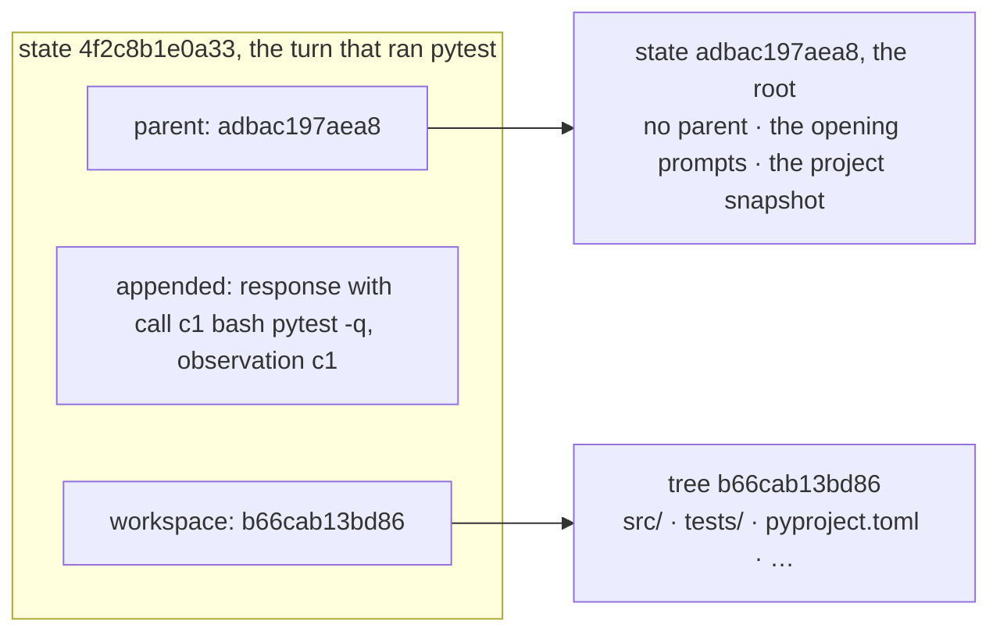
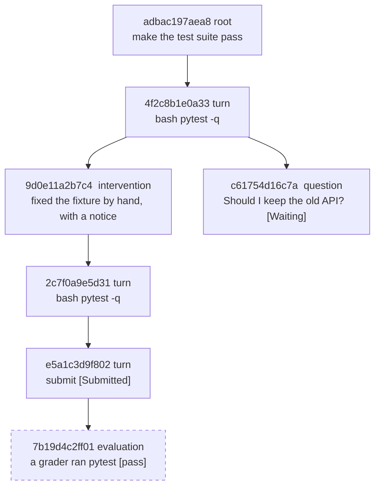
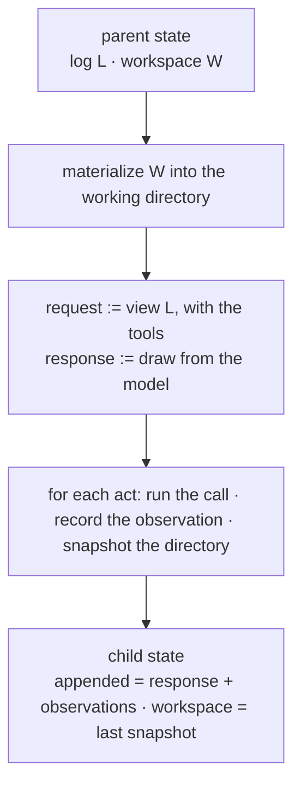
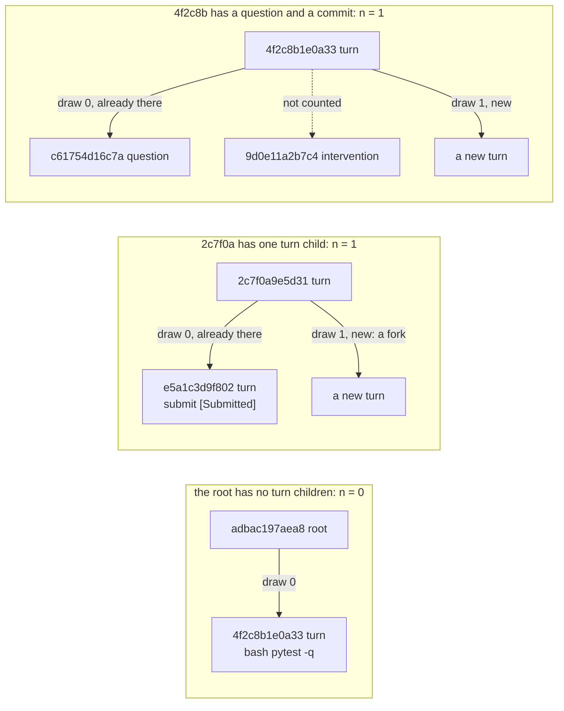
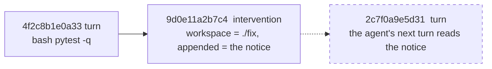
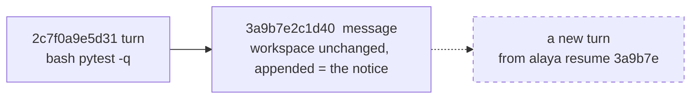
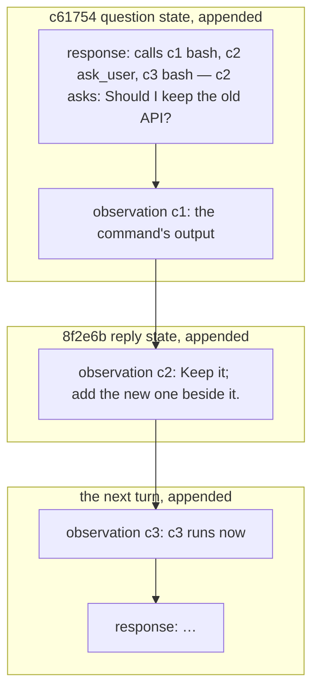
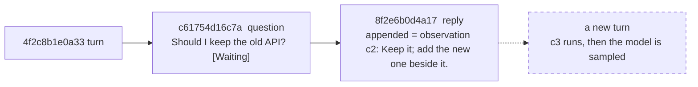
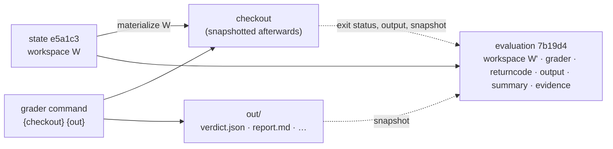
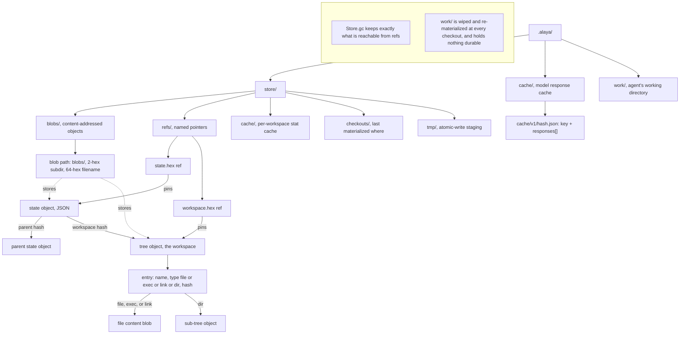

# Trajectory and cache schema

`Alaya.Trajectory` records an agent's run as a tree of immutable states in a content-addressed
store, and `Alaya.Cache` records every model response the run drew. Together they make a run
something you can branch, replay, evaluate, intervene in, and read back.

The trajectory is the same for every agent. Wherever an agent's prompts, tools, or view matter —
creating a root, taking a turn, rendering what the model was sent — the command line names the
agent with `--agent`; `mini-swe` (`docs/miniswe.md`) is the one available today, and the
examples below use it. Everything else — evaluating, intervening, replying, inspecting — is
agent-independent and takes no such flag.

## 1. States

A **state** is a point in a run: the log up to that point, and the workspace at that point. The
workspace is recorded as a **snapshot**: the content of the directory the agent acts in, written
into the content-addressed store as a tree of files and named by its hash.

```sh
# A root: the agent's opening prompts for the task, and a snapshot of ./project.
root=$(alaya root "make the test suite pass" ./project --agent mini-swe --image python:3.12-slim)
echo $root      # adbac197aea8…  a 64-hex hash; any unambiguous prefix names it from here on

alaya show adbac1          # the state: kind, parent, workspace hash, note, image, then its log
```

### The state object

A state is stored as one object with three parts:

- the hash of its **parent** state, or none for a root;
- the events it **appends** to the parent's log;
- the hash of its workspace snapshot, `workspace`.

The object is itself content-addressed: its hash covers those three parts, so a state's hash
names its whole history and its files, and nothing under a hash ever changes. The full log at a
state is the concatenation of `appended` along the path from the root (`logOf`), and the
workspace at a state is its `workspace`. A run is therefore a **tree** of states, and it only grows:
continuing from any state adds a child, and the original branch is untouched.

*A state object, and what its hash covers.*



### Kinds of state

Every state is one of seven kinds. The kind says what created the state and therefore what its
`appended` and `workspace` hold. Four kinds come from the `alaya` commands a person runs (`commit`,
`tell`, `reply`, `eval`); `root` comes from `root`; `turn` and `question` come from the agent,
driven by `resume` or `step`.

| Kind | Created by | `appended` | `workspace` |
| --- | --- | --- | --- |
| `root` | `alaya root` | the agent's opening prompts | the project as given |
| `turn` | one model turn | the response, and the observation of each call it made | the workspace after those calls ran |
| `question` | a model turn whose call asked a person | the response, and the observations of the calls before the ask | the workspace after those calls ran |
| `reply` | `alaya reply` | one observation: the person's answer to the question, verbatim | the parent's |
| `intervention` | `alaya commit` | nothing, or one notice when `--tell` is given | the directory the person edited |
| `message` | `alaya tell` | one notice carrying the person's text | the parent's |
| `evaluation` | `alaya eval` | nothing; the verdict is on the state itself | the checkout after the grader ran |

Two kinds constrain what may follow them. A `question` waits: only `reply` may be its child until
one exists. An `evaluation` is a leaf: it is a verdict on its parent, not a point a run can go on
from.

Besides the three parts, a state carries what the run needs to continue and what a reader wants
to know: the container `image?`, set on the root and inherited; a `note?` of provenance (the model spec for a turn, the task for a root, the note for
an intervention); the `outcome?` when the state ended the run; the `question?` a `question` is
waiting on; the `intervention?` record behind a notice; and the `evaluation?` verdict.

*The run used in the examples of this page, as a tree. Dashed: an evaluation, a leaf.*



```
$ alaya tree
adbac197aea8  root  make the test suite pass
  4f2c8b1e0a33  bash  pytest -q
    9d0e11a2b7c4  commit  fixed the fixture by hand
      2c7f0a9e5d31  bash  pytest -q
        e5a1c3d9f802  submit  done  [Submitted]
          7b19d4c2ff01  eval  [pass]  cp -R ./hidden-tests/. {checkout}/ && cd {checkout} && pytest -q
    c61754d16c7a  ask  Should I keep the old API?  [Waiting]
```

Each line is a state: its hash, its kind (a turn shows its first tool call), and what closed it —
an outcome, or a question still waiting. Indentation shows children; `4f2c8b1e0a33` has two, a
person's commit and a turn that asked a question.

## 2. Turns, draws, and forks

### A turn

A **turn** is what `resume` and `step` add to the tree: one model sample and the tool calls that
follow it, until the agent's `next` wants to sample again, stops, or asks a person. Given a parent
state, the trajectory:

1. materializes the parent's workspace snapshot into the working directory;
2. builds the request — the agent's view of the parent's log, with the agent's tools — and draws
   one response (how it picks *which* draw is the subject of the next part);
3. follows the agent's directives: for each `act`, runs the call in the working directory,
   records the observation, and snapshots the directory;
4. writes one child state: the response and observations as `appended`, the last snapshot as
   `workspace`, and, if the agent stopped, the `outcome?` or `question?`.

*One turn, from a parent state to its child.*



```sh
alaya step 4f2c8b --agent mini-swe --model xmcp:ds/deepseek-v4-flash      # exactly one turn
alaya resume 4f2c8b --agent mini-swe --model xmcp:ds/deepseek-v4-flash    # turns until the run ends or asks
```

`step` prints the new child's hash; `resume` prints one line per new state and ends with
`done: Submitted`, or with the question it stopped at.

### Which draw

A model request does not have one answer; it has a sequence of draws, and the model cache (§7)
stores that sequence per request, indexed from 0. Every turn child of a state was sampled from
the *same* request — the parent's log viewed the same way, with the same tools — so the children
of a state are, in order, draws 0, 1, 2, … of one sequence.

The trajectory therefore never decides "new" or "reuse" itself. It counts the parent's children
of kind `turn` or `question` — call the count `n` — and asks the cache for draws `0` to `n`
(`nextN (n+1)`), then uses draw `n`. The cache does the rest:

- if its entry already holds draw `n`, it returns it without a provider call;
- if not, it asks the provider for the missing draws, appends them to the entry, and returns them.

Children a person makes — `reply`, `message`, `intervention` — and evaluations are not counted:
they asked the model nothing, and counting them would skip a draw the cache holds.

*Which draw a continuation receives, by what the state already has under it.*



```sh
alaya step 2c7f0a --agent mini-swe --model M   # 2c7f0a has one turn child, e5a1c3 (draw 0),
                                               # so this is draw 1: a new sample, a fork
alaya step 2c7f0a --agent mini-swe --model M   # draw 2
alaya tree                                     # 2c7f0a now has three turn children, siblings
```

Replay needs no command of its own. If the second `step` had been interrupted after the model
answered but before the child was written, running it again asks for draw 1 again and receives
the recorded response without a provider call. Likewise `alaya rm HASH` followed by a `resume`
from its parent reproduces the deleted branch draw for draw, as long as `.alaya/cache` is kept.

## 3. People in the tree

A run is not only the agent's. A person can change the workspace, tell the agent something, and
answer a question the agent asks; a supervising program can do the same through the command
line. Each of these is a state like any other — a child with its own `appended` events and
`workspace` — so what a person did is recorded in the same tree, is addressable by hash, and can
be forked like a model turn.

### Changing the workspace: `commit`

`alaya commit HASH DIR [-m NOTE] [--tell TEXT]` snapshots the directory `DIR` and records it as
an `intervention` child of `HASH`. The child's log is the parent's: without `--tell`, nothing is
appended, and the agent learns of the change only by running commands, as it would if the files
had changed under it. `-m NOTE` is provenance for the reader of the tree, not for the model.

With `--tell TEXT`, one event is appended: a user message carrying a **notice**. The notice is
rendered from a record the state also keeps, `intervention? = { message, changed }`, where
`changed` lists the paths that differ between the parent's workspace and `DIR`, one `+ path`,
`- path`, or `M path` line each:

```
<intervention>
A person changed the workspace while you were paused:
  M src/bija/cli.py
  + tests/extra.bj
I fixed the identifier lookup; re-run every sample without set -e.
</intervention>
```

The envelope is fixed so the model can tell a person's notice from the task and from tool
output; the text inside is verbatim.

```sh
alaya checkout 4f2c8b ./fix                  # the state's files, to edit by hand
$EDITOR ./fix/src/app.py
alaya commit 4f2c8b ./fix -m "fixed the fixture" \
  --tell "I fixed the identifier lookup in src/app.py; re-run the suite."
# 9d0e11a2b7c4
alaya resume 9d0e11 --agent mini-swe --model M   # the agent continues, having read the notice
```



### Sending a message: `tell`

`alaya tell HASH TEXT` is the same notice without a workspace change: a `message` child whose
`workspace` is the parent's and whose one appended event is the user message, with the header
"A person sent you a message while you were paused." and no path list.

Both notices are `Event.message`, which every view passes through unchanged, so the model sees
exactly the text above on its next turn. Neither child counts as a draw (§2): the next
continuation from the parent still receives the draw its turn children imply.

```sh
alaya tell 2c7f0a "The failing test is the one to trust; do not edit tests/."
# 3a9b7e2c1d40                                  a message child of 2c7f0a
alaya resume 3a9b7e --agent mini-swe --model M
```



### Being asked: `question` and `reply`

An agent that offers a tool for asking a person returns the `ask callId question` directive when
the model calls it (`docs/agent-api.md` §3). The trajectory then finishes the turn early and
records it as a `question` state:

- `appended` holds the response and the observations of the calls *before* the ask; the calls
  after it never ran;
- `question? = { callId, text }` names the asking call and carries the text for the person;
- `resume`, `step`, `commit`, and `tell` refuse the state until it is answered.

`alaya reply HASH TEXT` records the answer as a `reply` child: the parent's workspace, and one
appended event, `Event.observation callId TEXT`, the answer as the asking call's result,
verbatim. The next turn from the reply child continues with the calls that were still pending,
exactly as if the tool had returned the person's words.

*A question and its reply, as events in the log.*



Answering the same question twice makes two `reply` siblings, which is a fork on the answer.
`alaya waiting` lists every question no child has answered.

```sh
$ alaya resume 4f2c8b --agent mini-swe --model M
c61754d16c7a  ask  "Should I keep the old API?"  [Waiting]
$ echo $?
3
$ alaya waiting
c61754d16c7a  "Should I keep the old API?"
$ alaya reply c61754 "Keep it; add the new one beside it."
8f2e6b0d4a17
$ alaya resume 8f2e6b --agent mini-swe --model M
```



### A program in the person's seat

Everything above is a command, so a program — a supervising agent, say — can play the person's
part by running `alaya` as a subprocess. `resume` and `step` exit with status `0` when the run
ended and `3` when it stopped at a question; with `--json` each state they print is one object
with `state`, `kind`, `outcome`, and `question`, and `waiting --json` prints `{state, question}`
per open question. The loop is: resume; on exit 3 read the question, decide, `reply`; resume
from the reply's hash.

```sh
alaya resume "$hash" --agent mini-swe --model M --json
# {"state":"c61754…","kind":"question","outcome":null,"question":"Should I keep the old API?"}
# exit status 3
reply=$(alaya reply c61754 "Keep it; add the new one beside it.")
alaya resume "$reply" --agent mini-swe --model M --json
```

## 4. Evaluation

An **evaluation** is a verdict on a state, produced by a program of the person's choosing and
recorded as a leaf child. The trajectory does not know what a verdict means for a given task;
it knows how to hand a program the state's files, collect what the program says, and keep it.

### The grader

A grader is a shell command run on the host, in the directory `alaya` was invoked from, so
relative paths in it mean what they mean on the person's command line. Before it runs, the
trajectory materializes the state's workspace into a fresh directory, the **checkout**, and
creates an empty **output directory**; the command receives both, as absolute paths, by
substitution:

| Placeholder | Expands to |
| --- | --- |
| `{checkout}` | the directory holding the state's files |
| `{out}` | an empty directory for anything the grader wants kept |

The grader may do anything to the checkout: copy tests over it, apply a patch, build it, start a
container with it mounted, or rebuild a clean project elsewhere and carry only the agent's edits
across. When it finishes, the checkout is snapshotted as the evaluation's `workspace` and
discarded, so the tree records what the grader did to the files — the tests it copied in, the
artefacts it built — as the change from the graded state to the evaluation. None of it reaches
a state a run continues from: an evaluation is a leaf.

### The verdict

When the grader exits, the trajectory records:

| Field | Meaning |
| --- | --- |
| `grader` | the command as given, placeholders unexpanded |
| `returncode`, `elapsedMs` | the exit status and the wall-clock time |
| `output` | stdout and stderr, merged, truncated to 20 000 characters |
| `evidence?` | a snapshot of `{out}`, when the grader wrote anything there |
| `summary?` | the contents of `{out}/verdict.json`, when the grader wrote one |

A state **passed** when `summary?` has a boolean `passed` field and it is true; otherwise when the
exit status is zero. A grader that only runs a test suite needs no `verdict.json`: the suite's
exit status is the verdict. A grader with more to say writes `verdict.json` and puts its reports
and logs beside it. Two of its fields have a fixed meaning; the rest are the grader's own:

| Field | Meaning |
| --- | --- |
| `passed` | boolean; the verdict |
| `score` | `{"passed": n, "total": m}`: how many of the grader's checks passed, out of how many |

The score is shown wherever the verdict is — `tree`, `show`, the report — as `n/m`, so a partial
result is a number rather than a bare `fail`. `alaya show` prints the whole summary and names the
evidence, and `alaya checkout HASH DIR --evidence` yields the files.

*An evaluation: the grader runs on the host over a checkout; the state records the verdict.*



Re-evaluating a state with the same grader command returns the existing node; `--force` runs it
again and adds a sibling. Different grader commands are different evaluations of the same state.

```sh
# A hidden test suite, copied over the checkout; the suite's exit status is the verdict.
alaya eval e5a1c3 --grader 'cp -R ./hidden-tests/. {checkout}/ && cd {checkout} && pytest -q' --timeout 1800
# 7b19d4c2ff01  pass  (48210 ms)

# A patch of the tests against the original files, then the suite.
alaya eval e5a1c3 --grader 'patch -p1 -d {checkout} < ./tests.diff && cd {checkout} && pytest -q tests/test_foo.py'

# A grading program with its own verdict: it rebuilds a clean project from a source it trusts,
# carries the agent's edits across, and writes verdict.json and a report into {out}.
alaya eval e5a1c3 --grader 'grade-project --candidate {checkout} --source ./benchmark --report-dir {out}'
# 3c9e02a71b5d  fail 1 155/232  (61377 ms)

alaya show 7b19d4                        # verdict, summary, evidence hash, and the grader's output
alaya checkout 7b19d4 ./report --evidence  # the grader's report files
```

## 5. On disk

The data directory (`--data D`, default `.alaya`) holds everything one set of runs needs:

| Path | Contents |
| --- | --- |
| `D/store/blobs/<2 hex>/<64 hex>` | every object, addressed by the SHA-256 of its bytes: state objects, tree objects, file contents, link targets |
| `D/store/refs/state.<hex>` | pins a state object; the set of these *is* the forest |
| `D/store/refs/workspace.<hex>` | pins a tree a state refers to — a workspace, or an evaluation's evidence — so `gc` keeps it |
| `D/store/cache/`, `D/store/checkouts/` | the snapshot stat cache and the record of what was last materialized where; performance only |
| `D/store/tmp/` | staging for atomic writes (write, then rename) |
| `D/cache/v1/<hash>.json` | model response cache entries (§7) |
| `D/work/` | the working directory; wiped and re-materialized at every checkout, holds nothing durable |
| `D/eval/` | a grader's checkout and output directory; emptied before every evaluation |

A workspace is a git-style Merkle tree: a **tree object** is the JSON array of its entries
`{"name", "type": "file"|"exec"|"link"|"dir", "hash"}`, sorted by name so its serialization is
canonical; a file entry's hash addresses the content blob, a directory's the sub-tree. Unchanged
subtrees keep their address across snapshots, so a snapshot costs only the objects along changed
paths and diffing skips identical subtrees. Snapshots are stat-cached, hashed in parallel,
record symlinks and executable bits, and can ignore paths. Materializing is incremental against
the recorded checkout and, by default, re-captures the destination first (`verify`), because the
record goes stale the moment the agent writes; without that, a fork would start from the
abandoned branch's files.

`Store.gc` deletes every blob unreachable from a ref. `rm HASH` deletes a subtree by dropping its
`state.` refs, re-pinning `workspace.` refs from the survivors, and collecting.

MiniSwe's recoverable output references do not introduce another blob kind or another ref.
The complete executor output already resides in the observation inside its state object.
`read_output` searches the reconstructed current log by the output's SHA-256 digest. An
ancestor observation remains available when a branch is forked or resumed, including after
the execution container is recreated. A sibling branch's observations and an evaluation's
private checkout are not part of that log. Keeping only `work/` or a model-cache directory is
not enough to preserve a run; retain the trajectory store. See [output recovery](output-recovery.md).

*What is on disk: the data directory, and how state and tree objects reference each other in the content-addressed store.*



```
$ ls .alaya
cache  store  work
$ ls .alaya/store
blobs  cache  checkouts  refs  tmp
$ ls .alaya/store/refs | head -3
state.adbac197aea8…
state.4f2c8b1e0a33…
workspace.b66cab13bd86…
```

## 6. The state object

A state object is compact JSON. Field order is canonical (sorted keys), so equal states have
equal hashes.

| Field | Type | Meaning |
| --- | --- | --- |
| `v` | 1 | schema version; a reader refuses any other |
| `parent` | hex or null | the parent state |
| `workspace` | hex | the workspace tree |
| `kind` | string | one of the kinds in §1 |
| `appended` | array of events | what this state adds to the parent's log |
| `outcome` | `{status, submission}` or null | when this state ended the run |
| `note` | string or null | provenance |
| `image` | string or null | the pinned container image, inherited |
| `evaluation` | object or null | `{grader, returncode, elapsed_ms, output, evidence, summary}` on an evaluation |
| `intervention` | object or null | `{message, changed: ["M path", "+ path", "- path", …]}` on a state that carried a notice |
| `question` | object or null | `{call_id, text}` on a waiting state |

An **event** is one of:

```json
{"type": "message", "message": {"role": "system"|"user", "content": "…"}}
{"type": "message", "message": {"role": "assistant", "content": …, "reasoning": …, "tool_calls": [call…]}}
{"type": "message", "message": {"role": "tool", "tool_call_id": "…", "content": <json>}}
{"type": "response", "response": {"content", "tool_calls": [call…], "reasoning", "finish_reason", "usage": {"input", "output", "total"}}}
{"type": "observation", "call_id": "…", "content": <json>}
```

where a **call** is `{"id", "name", "arguments": <json>, "invalid_arguments": string|null}` —
`invalid_arguments` keeps the raw text when the provider's arguments were not JSON, so the
dialogue sent back to the model is byte-identical to what it produced. An observation's
`content` is whatever the agent's `act` returned; the trajectory never reads it.

For MiniSwe, an executor observation retains the complete decoded `output` string even when
the view shows a bounded preview. Recovery-page observations instead contain `content`,
`output_ref`, character offsets, and an end-of-output indicator. These are ordinary JSON
observations under the existing version-1 schema; no historical state or cache entry is
migrated or rewritten.

`alaya show HASH` prints a state's fields and its full log in a readable form; with `--view` and an
agent it also prints the dialogue that agent's view makes of the log, which is what the model is
sent from that state:

```sh
alaya show 4f2c8b
alaya show 4f2c8b --view --agent mini-swe
alaya diff adbac1 4f2c8b        # the workspace changes between two states, one path per line
```

## 7. The model cache entry

`D/cache/v1/<hash>.json`, where `hash` is Lean's generic hash of the cache key:

```json
{
  "version": 1,
  "key": "<compress {model: <identity>, structured_output: <mode>, request: <Request.toJson>}>",
  "responses": [
    {"content": …, "tool_calls": [call…], "usage": {…}, "finish_reason": …, "reasoning_content": …},
    …
  ]
}
```

`responses[i]` is draw `i` of that request under that model identity. The stored key is checked
against the file name on load, and a corrupt entry reads as empty and is replaced on the next
successful sample. The key contains the full
request, so anything that changes what the model is sent — the view, the tool list, the model
identity including options such as reasoning echo — changes the key, and a forest recorded under
one will not replay under another.

In particular, adding `read_output` changes the tool list, and recoverable long-output previews
change the view. New requests therefore intentionally use different cache keys. Replaying
the archived demonstration from its cache requires the original two-tool list and view;
a [dedicated runner](https://github.com/msv-lab/alaya/pull/8) is proposed independently. A read-only cache miss
is still an error and never falls through to a provider request.

```
$ ls .alaya/cache/v1 | head -2
1180723829451067366.json
5029385371209364131.json
```

The directory is safe to keep between runs and across trajectories in the same data directory:
an entry is only ever appended to.

## 8. Commands

```
alaya root TASK PROJECT --agent A [--image IMAGE]      create a root from a project directory
alaya root TASK --agent A --image IMAGE --path PATH    …or from a path inside the image
alaya resume HASH --agent A --model P:M                grow one continuation until it ends or asks
alaya step   HASH --agent A --model P:M                advance exactly one turn
alaya eval   HASH --grader CMD [--timeout S] [--force]   run a grader over a checkout; record the verdict
alaya commit HASH DIR [-m NOTE] [--tell TEXT]    record a hand-edited workspace as a child
alaya tell   HASH TEXT                           send the agent a message, as a child
alaya reply  HASH TEXT                           answer the question a state is waiting on
alaya waiting                                    list every unanswered question
alaya checkout HASH DIR [--evidence]             materialize a state's workspace (or an evaluation's evidence) into DIR
alaya tree                                       show the whole forest
alaya show HASH [--view --agent A]               metadata, the log, and optionally the view
alaya diff A B                                   workspace changes between two states
alaya html [FILE] --agent A [--hide DIR]         write the forest as one self-contained page
alaya rm HASH                                    delete a subtree and reclaim blobs
```

Every command takes `--data D` and `--json` where it prints states. `--agent A` names the agent
where its prompts, tools, or view matter; `mini-swe` is the one available. `root` takes `--image`,
`--container-user`, and `--network`; `resume` and `step` take `--model`,
`--temperature`, `--echo-reasoning`, `--network`, and the DGX flags `--url`/`--port`; `eval`
takes `--timeout` (default 900 s) for the grader and `--force`. The image is resolved to a digest at `root`
and recorded; `resume` uses it and refuses an `--image` that resolves to anything else.
A container runs with **no network** unless `--network` names one (`--network bridge` is
Docker's default network): an agent with network access can go looking for its own reference
solution, so an image should carry what a task legitimately needs.

Exit status: 0 when a run ended, 3 when it stopped at a question, 1 on error. Concurrent runs
need separate data directories: the work directory and the cache are not shared safely.

## 9. Invariants

- A state's hash covers its parent, its appended events, and its workspace; nothing under a
  hash ever changes.
- `logOf state` is the concatenation of `appended` from the root; the request the model was
  sent to produce a turn is `agent.view (logOf parent)` with `agent.tools`.
- Continuing from a state with `n` turn-or-question children asks for draw `n`; other children
  never consume a draw.
- A state's workspace is the snapshot taken after its last act; an evaluation's is the checkout
  after the grader ran, and nothing continues from it.
- A waiting state grows only by `reply`.
- The trajectory reads no observation's content and knows no tool's name.
- Before each act, the driver supplies the full current log in `Workspace.log`; the agent
  decides whether and how to use it. Recovery does not make evaluation leaves resumable.
