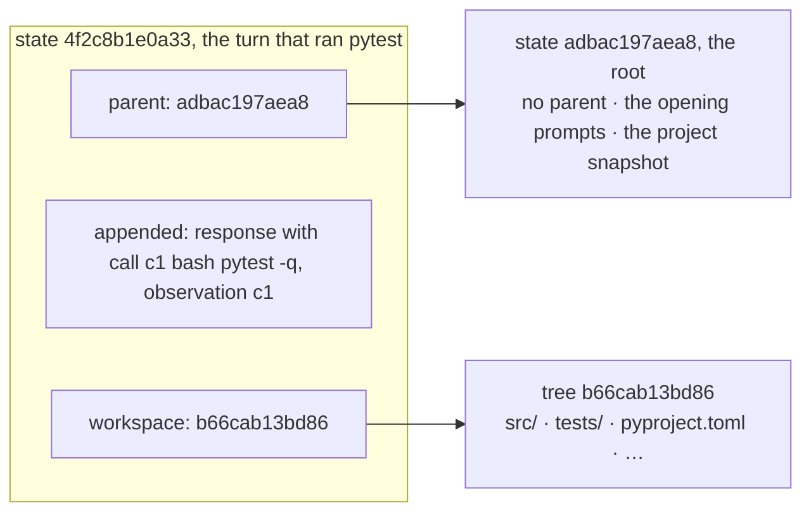
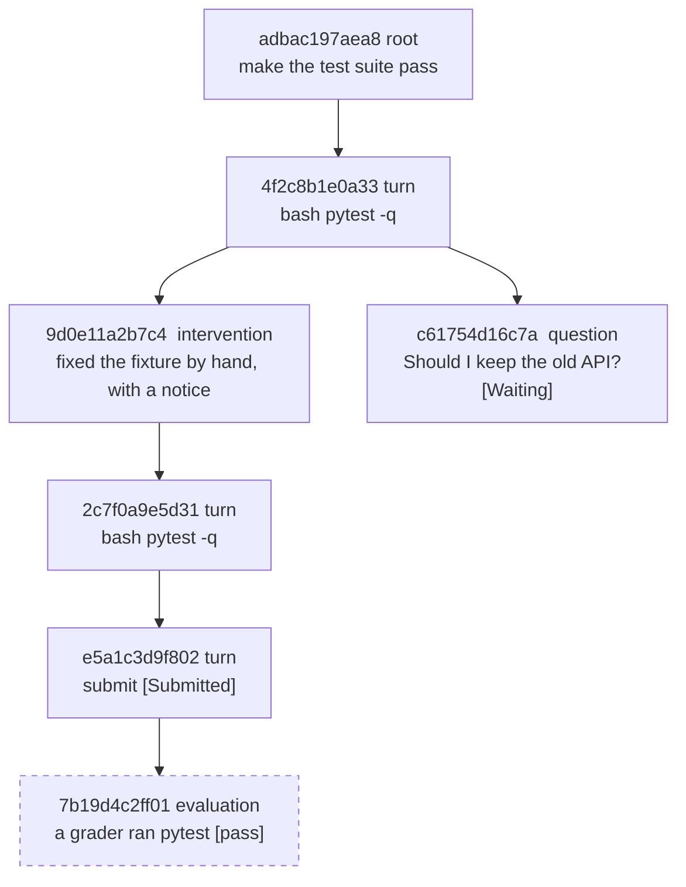
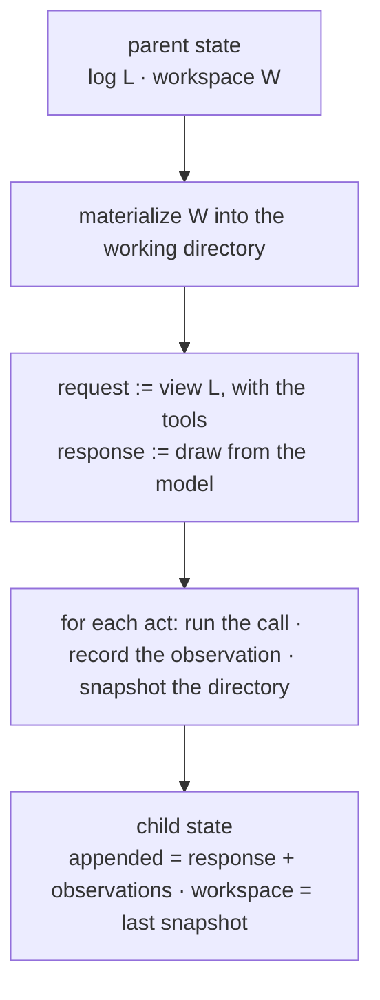
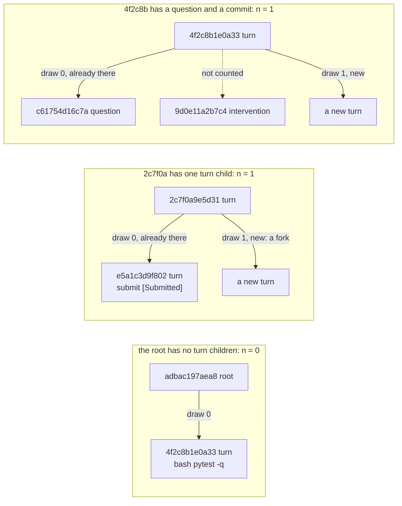
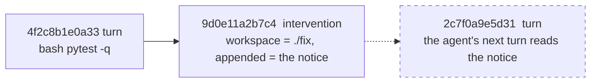
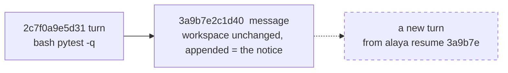
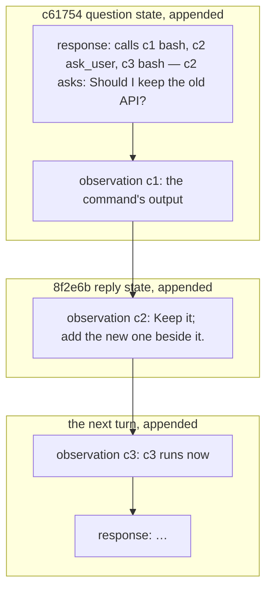
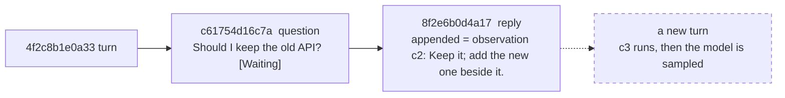
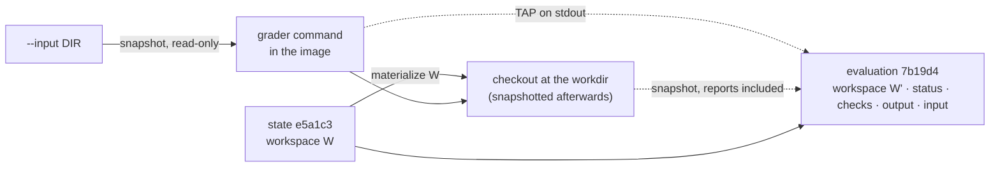

# Trajectory and cache schema

`Alaya.Trajectory` records an agent's run as a tree of immutable states, each named by the hash
of its content, and `Alaya.Cache` records every model response the run drew. Together they make a run
something you can branch, replay, evaluate, intervene in, and read back. The `alaya` command
line that drives it — every command, its options, output and exit status — is `docs/cli.md`.

The trajectory is the same for every agent. Wherever an agent's prompts, tools, or view matter —
creating a root, taking a turn, rendering what the model was sent — the command line names the
agent with `--agent` when the root is created — a JSON configuration file, such as
`agents/mini-swe-default.json` (`docs/miniswe.md`, which the examples below use) or
`agents/mini-vero-default.json` (`docs/minivero.md`) (`docs/cli.md` §5) — and the root records it, so no later
command asks again. Everything else — evaluating, intervening, replying,
inspecting — is agent-independent and takes no such flag.

## 1. States

A **state** is a point in a run: the log up to that point, and the workspace at that point. The
workspace is recorded as a **snapshot**: the content of the directory the agent acts in, kept in
a restic repository and named by its snapshot ID (§5).

```sh
export ALAYA_DATA=$PWD/runs   # the data directory every command below uses (§5)
# A root: the agent's opening prompts for the task, and a snapshot of ./project.
root=$(alaya root --task "make the test suite pass" ./project --agent agents/mini-swe-default.json --image ghcr.io/astral-sh/uv:python3.12-bookworm-slim)
echo $root      # adbac197aea8…  a 64-hex hash; any unambiguous prefix names it from here on

alaya show adbac1          # the state: kind, parent, workspace snapshot, note, image, then its log
```

### The state object

A state is stored as one object with three parts:

- the hash of its **parent** state, or none for a root;
- the events it **appends** to the parent's log;
- the identifier of its workspace snapshot, `workspace`.

The object is itself content-addressed: its hash covers those three parts, so a state's hash
names its whole history and its files, and nothing under a hash ever changes. The full log at a
state is the concatenation of `appended` along the path from the root (`logOf`), and the
workspace at a state is its `workspace`. A run is therefore a **tree** of states, and it only grows:
continuing from any state adds a child, and the original branch is untouched.

*A state object, and what its hash covers.*


```mermaid
flowchart LR
  subgraph S["state 4f2c8b1e0a33, the turn that ran pytest"]
    direction TB
    P["parent: adbac197aea8"]
    A["appended: response with call c1 bash pytest -q, observation c1"]
    E["workspace: b66cab13bd86"]
  end
  Parent["state adbac197aea8, the root<br/>no parent · the opening prompts · the project snapshot"]
  Tree["tree b66cab13bd86<br/>src/ · tests/ · pyproject.toml · …"]
  P --> Parent
  E --> Tree
```

### Kinds of state

Every state is one of five kinds. The kind says what created the state and therefore what its
`appended` and `workspace` hold. `intervention`, `reply` and `evaluation` come from the `alaya`
commands a person runs (`commit` and `tell`, `reply`, `eval`); `root` comes from `root`; `turn`
comes from the agent, driven by `resume`. A kind is never a second name for a field: a turn that
asked a person something is a `turn` with `question?` set, and a message is an `intervention`
with no changes.

| Kind | Created by | `appended` | `workspace` |
| --- | --- | --- | --- |
| `root` | `alaya root` | the agent's opening prompts | the project as given |
| `turn` | one model turn, or a stop after a reply | the response and observations — up to the ask, when a call asked a person; empty for a stop before sampling | the workspace after those calls ran, or the parent's when none ran |
| `reply` | `alaya reply`, with an answer or `--unavailable` | one observation: the person's verbatim answer string, or the explicit unavailable object | the parent's |
| `intervention` | `alaya commit`, or `alaya tell` | one notice: what changed, or the person's message | the directory the person edited, or the parent's |
| `evaluation` | `alaya eval` | nothing; the verdict is on the state itself | the checkout after the grader ran |

Two states constrain what may follow them. A turn with a `question?` waits: only `reply` may be
its child until one exists. An `evaluation` is a leaf: it is a verdict on its parent, not a point a run can go on
from.

After a reply, the agent may already be done, for example when the question consumed its
last allowed model turn. The driver then records a terminal `turn` with empty `appended`,
the parent's workspace and the agent's outcome, without calling the model.

Besides the three parts, a state carries what the run needs to continue and what a reader wants
to know: the container `image` and `workdir`, set on the root and inherited; on the root, the `agent?` configuration the run is continued with (`docs/cli.md` §5); a `note?` of provenance (the model spec for a turn, the task for a root, the note for
an intervention); the `outcome?` when the state ended the run; the `question?` a turn is
waiting on; the `intervention?` record behind a notice; and the `evaluation?` verdict.

*The run used in the examples of this page, as a tree. Dashed: an evaluation, a leaf.*


```mermaid
flowchart TD
  root["adbac197aea8  root<br/>make the test suite pass"]
  t1["4f2c8b1e0a33  turn<br/>bash pytest -q"]
  c["9d0e11a2b7c4  intervention<br/>fixed the fixture by hand, with a notice"]
  t2["2c7f0a9e5d31  turn<br/>bash pytest -q"]
  t3["e5a1c3d9f802  turn<br/>submit  [Submitted]"]
  ev["7b19d4c2ff01  evaluation<br/>a grader ran pytest  [pass]"]
  q["c61754d16c7a  question<br/>Should I keep the old API?  [Waiting]"]

  root --> t1
  t1 --> c --> t2 --> t3 --> ev
  t1 --> q

  classDef evalStyle stroke-dasharray: 5 5
  class ev evalStyle
```

```
$ alaya tree
adbac197aea8  root  make the test suite pass
  4f2c8b1e0a33  bash  pytest -q
    9d0e11a2b7c4  commit  fixed the fixture by hand
      2c7f0a9e5d31  bash  pytest -q
        e5a1c3d9f802  submit  done  [Submitted]
          7b19d4c2ff01  eval  [pass 48/48]  cp -R /grader/tests . && pytest -q -p tap --tap-stream
    c61754d16c7a  ask  Should I keep the old API?  [Waiting]
```

Each line is a state: its hash, its kind (a turn shows its first tool call), and what closed it —
an outcome, or a question still waiting. Indentation shows children; `4f2c8b1e0a33` has two, a
person's commit and a turn that asked a question.

## 2. Turns, draws, and forks

### A turn

A **turn** is what `resume` adds to the tree: one model sample and the tool calls that
follow it, until the agent's `next` wants to sample again, stops, or asks a person. Given a parent
state, the trajectory:

1. materializes the parent's workspace snapshot into the working directory;
2. builds the request — the agent's view of the parent's log, with the agent's tools — and draws
   one response (how it picks *which* draw is the subject of the next part);
3. follows the agent's directives: for each `act`, runs the call in the working directory,
   records the observation, and snapshots the directory;
4. writes one child state: the response and observations as `appended`, the last snapshot as
   `workspace`, and, if the agent stopped, the `outcome?` or `question?`.

*One turn, from a parent state to its child.*


```mermaid
flowchart TD
  P["parent state<br/>log L · workspace W"]
  M["materialize W into the working directory"]
  R["request := view L, with the tools<br/>response := draw from the model"]
  A["for each act: run the call · record the observation · snapshot the directory"]
  C["child state<br/>appended = response + observations · workspace = last snapshot"]
  P --> M --> R --> A --> C
```

```sh
alaya resume 4f2c8b --model xmcp:ds/deepseek-v4-flash --turns 1   # exactly one turn
alaya resume 4f2c8b --model xmcp:ds/deepseek-v4-flash             # turns until the run ends or asks
```

`resume` prints one line per new state and ends with `done: Submitted`, with the question it
stopped at, or, when `--turns N` or `--time-budget S` stopped it first, with how to continue.

### Which draw

A model request does not have one answer; it has a sequence of draws, and the model cache (§7)
stores that sequence per request, indexed from 0. Every sampled child of a state came from
the *same* request — the parent's log viewed the same way, with the same tools — so the children
with a response are, in order, draws 0, 1, 2, … of one sequence.

The trajectory therefore never decides "new" or "reuse" itself. It counts the parent's children
whose `appended` contains a model response — call the count `n` — and asks the cache for draws `0` to `n`
(`nextN (n+1)`), then uses draw `n`. The cache does the rest:

- if its entry already holds draw `n`, it returns it without a provider call;
- if not, it asks the provider for the missing draws, appends them to the entry, and returns them.

Children a person makes — `reply`, `intervention` — and evaluations are not counted:
they asked the model nothing, and counting them would skip a draw the cache holds.
A terminal `turn` recorded after a reply without sampling is likewise not counted.

*Which draw a continuation receives, by what the state already has under it.*


```mermaid
flowchart LR
  subgraph one["the root has no turn children: n = 0"]
    direction TB
    S1["adbac197aea8 root"] -->|"draw 0"| T1["4f2c8b1e0a33 turn<br/>bash pytest -q"]
  end
  subgraph two["2c7f0a has one turn child: n = 1"]
    direction TB
    S2["2c7f0a9e5d31 turn"] -->|"draw 0, already there"| T2a["e5a1c3d9f802 turn<br/>submit  [Submitted]"]
    S2 -->|"draw 1, new: a fork"| T2b["a new turn"]
  end
  subgraph three["4f2c8b has a question and a commit: n = 1"]
    direction TB
    S3["4f2c8b1e0a33 turn"] -->|"draw 0, already there"| T3a["c61754d16c7a question"]
    S3 -.->|"not counted"| C3["9d0e11a2b7c4 intervention"]
    S3 -->|"draw 1, new"| T3b["a new turn"]
  end
```

```sh
alaya resume 2c7f0a --model M --turns 1   # 2c7f0a has one turn child, e5a1c3 (draw 0),
                                          # so this is draw 1: a new sample, a fork
alaya resume 2c7f0a --model M --turns 1   # draw 2
alaya tree                                # 2c7f0a now has three turn children, siblings
```

Replay needs no command of its own. If the second `resume` had been interrupted after the model
answered but before the child was written, running it again asks for draw 1 again and receives
the recorded response without a provider call. Likewise `alaya rm HASH` followed by a `resume`
from its parent reproduces the deleted branch draw for draw, as long as the data directory's
`cache/` is kept.

## 3. People in the tree

A run is not only the agent's. A person can change the workspace, tell the agent something, and
answer a question the agent asks; a supervising program can do the same through the command
line. Each of these is a state like any other — a child with its own `appended` events and
`workspace` — so what a person did is recorded in the same tree, is addressable by hash, and can
be forked like a model turn.

### Changing the workspace: `commit`

`alaya commit HASH DIR [--note NOTE]` snapshots the directory `DIR` and records it as an
`intervention` child of `HASH`. The agent is always told: one event is appended, a user message
carrying a **notice** that lists what changed, so what the agent believes about its files never
disagrees with them. The notice is rendered from a record the state also keeps,
`intervention? = { message, changed }`, where `changed` lists the paths that differ between the
parent's workspace and `DIR`, one `+ path`, `- path`, or `M path` line each, and `message` is
empty:

```
<intervention>
A person changed the workspace while you were paused:
  M src/bija/cli.py
  + tests/extra.bj
</intervention>
```

A directory with no change is refused: a message alone is `tell`'s (below), and so is anything
the person wants to say about the change, told to the new state. `--note NOTE` is provenance for
the reader of the tree, not for the model. The envelope is fixed so the model can tell a
person's notice from the task and from tool output.

```sh
alaya checkout 4f2c8b ./fix                  # the state's files, to edit by hand
$EDITOR ./fix/src/app.py
alaya commit 4f2c8b ./fix --note "fixed the fixture"
# 9d0e11a2b7c4
alaya tell 9d0e11 "I fixed the identifier lookup in src/app.py; re-run the suite."
# 3f81c0d2a9e4
alaya resume 3f81c0 --model M   # the agent continues, having read both notices
```


```mermaid
flowchart LR
  t1["4f2c8b1e0a33  turn<br/>bash pytest -q"] --> c["9d0e11a2b7c4  intervention<br/>workspace = ./fix, appended = the notice"]
  c -.-> t2["2c7f0a9e5d31  turn<br/>the agent's next turn reads the notice"]
  classDef new stroke-dasharray: 5 5
  class t2 new
```

### Sending a message: `tell`

`alaya tell HASH TEXT` is the same notice without a workspace change: an `intervention` child
with no changes, whose `workspace` is the parent's and whose one appended event is the user message, with the header
"A person sent you a message while you were paused." and no path list.

Both notices are `Event.message`, which every view passes through unchanged, so the model sees
exactly the text above on its next turn. Neither child counts as a draw (§2): the next
continuation from the parent still receives the draw its turn children imply.

```sh
alaya tell 2c7f0a "The failing test is the one to trust; do not edit tests/."
# 3a9b7e2c1d40                                  a message child of 2c7f0a
alaya resume 3a9b7e --model M
```


```mermaid
flowchart LR
  t2["2c7f0a9e5d31  turn<br/>bash pytest -q"] --> m["3a9b7e2c1d40  message<br/>workspace unchanged, appended = the notice"]
  m -.-> n["a new turn<br/>from alaya resume 3a9b7e"]
  classDef new stroke-dasharray: 5 5
  class n new
```

### Being asked: `question` and `reply`

An agent that offers a tool for asking a person returns the `ask callId question` directive when
the model calls it (`docs/agent-api.md` §3). The trajectory then finishes the turn early and
records it as a `turn` that waits on a question:

- `appended` holds the response and the observations of the calls *before* the ask; the calls
  after it never ran;
- `question? = { callId, text, questionType, options }` names the asking call and carries
  the prompt and answer controls for the person;
- `resume`, `commit`, and `tell` refuse the state until it is answered.

`alaya reply HASH TEXT` validates the answer against the recorded question type before
writing any state. Yes/no requires `yes` or `no`; single choice requires one integer
from 1 through the number of model-provided candidates, or `none_of_above` for the
system-provided **None of the above** option. The model must not include that reserved
option in its candidates. Open-ended questions require nonblank text.
An invalid reply leaves the question waiting and writes
no child. A valid answer is recorded as a `reply` child: the parent's workspace, and one
appended event, `Event.observation callId TEXT`, the answer as the asking call's result,
verbatim. The next turn from the reply child continues with the calls that were still pending,
exactly as if the tool had returned the person's words.

*A question and its reply, as events in the log.*


```mermaid
flowchart TD
  subgraph Q["c61754 question state, appended"]
    direction TB
    R["response: calls c1 bash, c2 ask_user, c3 bash — c2 asks: Should I keep the old API?"]
    O1["observation c1: the command's output"]
    R --> O1
  end
  subgraph A["8f2e6b reply state, appended"]
    direction TB
    O2["observation c2: Keep it; add the new one beside it."]
  end
  subgraph N["the next turn, appended"]
    direction TB
    O3["observation c3: c3 runs now"]
    R2["response: …"]
    O3 --> R2
  end
  O1 --> O2 --> O3
```

Answering the same question twice makes two `reply` siblings, which is a fork on the answer.
`alaya waiting` lists every question no child has answered.

`alaya reply HASH --unavailable` records `{"status":"unavailable"}` as the observation
of the asking call for any currently supported question type. Normal answers remain JSON strings;
unavailable is neither `no`, `none_of_above`, nor empty text. The reply keeps the question's
workspace and follows the same continuation and budget rules. See
[the answer page and read-only context commands](ask-user.md#answer-in-the-browser)
for branch history and snapshot browsing.

```sh
$ alaya resume 4f2c8b --model M
c61754d16c7a  ask  "Should I keep the old API?"  [Waiting]
$ echo $?
3
$ alaya waiting
c61754d16c7a  "Should I keep the old API?"
$ alaya reply c61754 "Keep it; add the new one beside it."
8f2e6b0d4a17
$ alaya resume 8f2e6b --model M
```


```mermaid
flowchart LR
  t1["4f2c8b1e0a33  turn"] --> q["c61754d16c7a  question<br/>Should I keep the old API?  [Waiting]"]
  q --> r["8f2e6b0d4a17  reply<br/>appended = observation c2: Keep it; add the new one beside it."]
  r -.-> n["a new turn<br/>c3 runs, then the model is sampled"]
  classDef new stroke-dasharray: 5 5
  class n new
```

### A program in the person's seat

Everything above is a command, so a program — a supervising agent, say — can play the person's
part by running `alaya` as a subprocess: `resume` exits with `3` when it stopped at a question,
and `waiting --json` lists the open ones (exit statuses and JSON in `docs/cli.md` §3–§4). The
loop is: resume; on exit 3 read the question, decide, `reply`; resume from the reply's hash.

```sh
alaya resume "$hash" --model M --json
# {"state":"c61754…","kind":"turn","outcome":null,"question":"Should I keep the old API?","question_type":"open_ended","options":[]}
# exit status 3
reply=$(alaya reply c61754 "Keep it; add the new one beside it.")
alaya resume "$reply" --model M --json
```

## 4. Evaluation

An **evaluation** is a verdict on a state, produced by a program of the person's choosing and
recorded as a leaf child. The trajectory does not know what a verdict means for a given task;
it knows how to hand a program the state's files, collect what the program says, and keep it.

> The grader runs in a fresh copy of the state at the trajectory's workdir, in the trajectory's
> image or a grader image, with trusted files read-only at `/grader`. It can change anything;
> the result is kept as the evaluation's workspace. It prints TAP on stdout: a complete plan with
> all results `ok` is a pass, any `not ok` is a fail, and anything incomplete is an error.

### The grader

A grader is a shell command, run with `/bin/sh -c` in a fresh container, without network, as the
user the agent's commands run as. The container is from the trajectory's image, or from
`--grader-image`, which is resolved to a digest and recorded: a grader's tools, which the agent
should not see, belong in an image of their own, best built on the agent's image (two targets of
one Dockerfile), so the grader runs in the agent's environment plus its tools.

Before it runs, the trajectory materializes the state's workspace into a fresh directory, the
**checkout**, mounted read-write at the trajectory's workdir, which is the grader's working
directory — exactly where the agent saw its files. `--input DIR` names the grader's **trusted
input**: its script, hidden tests, a benchmark. It is snapshotted, and the snapshot is mounted
read-only at `/grader`, so the grader sees exactly what is recorded. Nothing else of the host is
visible, and no path is substituted into the command.

The grader may do anything to the checkout: copy tests over it, apply a patch, build it, or
rebuild a clean project elsewhere and carry only the agent's edits across. Its reports belong
in the checkout too, and scratch work in `/tmp`. When it finishes, the checkout is snapshotted as
the evaluation's `workspace` and discarded, so the tree records what the grader did to the
files — the tests it copied in, the reports it wrote — as the change from the graded state to
the evaluation, and `alaya ls` and `alaya cat` read them. None of it reaches a state a run
continues from: an evaluation is a leaf.

### The verdict

A grader reports through [TAP](https://testanything.org/tap-version-14-specification.html) on
stdout: a plan `1..N` and one `ok` or `not ok` line per check (`Alaya.Tap`). Logs go to stderr,
or in `#` comment lines, so they cannot be read as TAP. The status comes from the TAP alone
(`Alaya.Grader`):

- **pass**: the plan is there, as many checks arrived as it announced, and none failed;
- **fail**: the TAP is complete, and a check failed — a failing `TODO` or `SKIP` check does not
  count, and a failing subtest does;
- **error**: anything else — no plan, fewer or more checks than planned, a `Bail out!`, a
  grader that timed out or could not start.

The exit status is recorded but decides nothing, so "the checks ran and some failed" and "the
grader crashed" cannot be confused: a crash leaves the TAP incomplete, which is an error. A
plain test command needs a few lines of wrapper, in which the grader's author, who knows the
tool, says what its exit codes mean:

```sh
echo 1..1
pytest -q; code=$?
case $code in
  0) echo "ok 1 - tests" ;;
  1) echo "not ok 1 - tests" ;;
  *) echo "Bail out! pytest exited $code" ;;
esac
```

The trajectory records:

| Field | Meaning |
| --- | --- |
| `command` | the grader command |
| `graderImage` | the image it ran in, by digest |
| `input` | the snapshot of `--input`, or null |
| `status` | `pass`, `fail` or `error` |
| `checks` | `[{ok, name, directive}]`, one per top-level test point; `ok` is false only for a failure that counts |
| `reason` | why the status is `error`, or which checks made it `fail` |
| `returncode`, `elapsedMs` | the exit status, null when the grader did not finish, and the wall-clock time |
| `output` | `{stdout, stderr}`, each truncated to 20 000 characters |

The score, how many checks passed out of how many, is shown wherever the status is — `tree`,
`show`, the report — as `pass 3/3`, `fail 2/3`, so a partial result is a number rather than a
bare `fail`. `alaya show` lists every check and prints the grader's stdout and stderr.

*An evaluation: the grader runs over a checkout with its trusted input; the state records the verdict.*


```mermaid
flowchart LR
  S["state e5a1c3<br/>workspace W"] -->|"materialize W"| C["checkout at the workdir<br/>(snapshotted afterwards)"]
  I["--input DIR"] -->|"snapshot, read-only"| G
  G["grader command<br/>in the image"] --> C
  G -.->|"TAP on stdout"| E["evaluation 7b19d4<br/>workspace W' · status · checks · output · input"]
  C -.->|"snapshot, reports included"| E
  S --> E
```

Every `eval` runs the grader and adds a new evaluation of the state, even with a grader command
used before; each evaluation records one run. `eval` exits 0 for pass, 1 for fail, 2 for error.
When it records no verdict at all — an unknown state, a grader image or input that could not be
had, a command line that does not parse — it exits with the failure's status (`docs/cli.md` §4), which is
above all three.

```sh
# A hidden test suite, copied over the checkout; pytest-tap prints the TAP.
alaya eval e5a1c3 --input ./hidden --grader 'cp -R /grader/tests . && pytest -q -p tap --tap-stream' --timeout 1800
# 7b19d4c2ff01  pass 48/48  (48210 ms)

# A grading program in an image of its own, with the benchmark it trusts as its input.
alaya eval e5a1c3 --grader-image my-grader:1 --input ./benchmark --grader 'grade-project /grader'
# 3c9e02a71b5d  fail 155/232  (61377 ms)

alaya show 7b19d4                 # the status, every check, and the grader's stdout and stderr
alaya ls 7b19d4 .report           # the reports the grader left in the checkout
```

## 5. On disk

The data directory, `D`, holds everything one set of runs needs. Every command names it with
`--data D`, or reads `ALAYA_DATA`; there is no default, so a command run from the wrong place
cannot quietly begin a new one. `root` creates it, and every other command refuses a path that
holds none.

| Path | Contents |
| --- | --- |
| `D/states/<64 hex>.json` | one file per state object, named by the SHA-256 of its bytes; the set of these files *is* the forest |
| `D/restic/` | the [restic](https://restic.net) repository holding every workspace snapshot |
| `D/cache/<hash>.json` | model response cache entries (§7) |
| `D/lock`, `D/lock.holder` | the lock a writing command holds, and the pid of the command holding it (`docs/cli.md` §4) |
| `D/tmp/<id>/` | one command's scratch, removed when it ends: `work/`, the working directory, re-materialized at every checkout; `eval/`, a grader's checkout; `restic/`, where files read out of a snapshot land |

Everything but `tmp/` lasts. Each command has a scratch directory of its own, and one command at
a time writes (`docs/cli.md` §4).

A state is written once, as a finished temporary file renamed into place, and never changes: its
name is the hash of its bytes, which is also what its children's `parent` holds. `rm` deletes
files; there is nothing else to collect.

### Workspace snapshots

A state names the directory the agent left behind by an identifier, `workspace`, and the
trajectory never looks inside it. `Alaya.Workspaces` is the snapshot
contract:

```lean
structure Workspaces where
  snapshot : System.FilePath -> Result Hash              -- capture a directory as it is now
  materialize : Hash -> System.FilePath -> Result Unit   -- make a directory hold exactly a snapshot
  diff : Hash -> Hash -> Result (Array Change)           -- added, removed, modified paths
  readFiles : Hash -> Array String -> Result (Array (Option ByteArray))  -- regular files of a snapshot
  listEntries : Hash -> String -> Result (Array Entry)   -- immediate snapshot directory entries
  retainOnly : Array Hash -> Result Unit                 -- drop every snapshot not listed
```

| Operation | Used by |
| --- | --- |
| `snapshot` | `root`, every act of a turn, `commit`, `eval` (the grader's input and the graded checkout) |
| `materialize` | the start of `resume`, `eval`, `checkout` |
| `diff` | the notice of a `commit`, `alaya diff`, the HTML report |
| `readFiles` | the HTML report, `cat` and its previews |
| `listEntries` | `ls`, and `cat`'s check of a path, using metadata before reading a file |
| `retainOnly` | `rm`, with the snapshots the surviving states name |

Restic implements `listEntries` without restoring the workspace. An entry records name,
relative path, kind (directory/file/symlink/other), and optional byte size; the
empty path names the root. `ls` and `cat` verify ancestor directories and never
follow symbolic links.

An identifier is 64 hexadecimal digits and means something only to the store that issued it.
**Equal directories need not get equal identifiers**, and nothing compares them: a state's hash
covers its workspace identifier, which makes a state immutable, not reproducible — a run's
observations carry timings and temporary paths, and a repeated turn is a new draw, so two
runs do not meet at the same state hash anyway. What the contract does require
(`Test/Workspaces.lean`):

- a snapshot materializes as the directory it was taken of: file contents, executable bits,
  symbolic links, empty directories;
- `materialize` replaces whatever the destination held, read-only directories included;
- an edit is captured even when it keeps a file's size and modification time, as archive
  extraction, `cp -p`, and package managers that normalize timestamps leave it;
- a file name may hold any character, a newline included;
- an added or removed directory is one change, standing for its subtree; a file replaced by a
  directory, or the reverse, is a removal and an addition; a file that was only touched is not a
  change;
- a read is `none` for a directory, an absent path, and a path that leaves the snapshot.

`Workspaces.Restic` keeps the contract with a restic repository (restic 0.17 or later). restic
is a backup program: walking a directory, deciding what changed — by a file's change time and
inode as well as its size and modification time — and writing a snapshot back out are its
business, and a snapshot records what the filesystem holds: permissions, times, owners, hard
links, extended attributes. The identifier is the restic snapshot ID.

| Contract | restic |
| --- | --- |
| `snapshot` | `restic backup . --no-scan --host alaya`, run inside the directory so paths are relative to it; a snapshot that could not read every file is a failure |
| `materialize` | `restic restore ID --target DIR --delete --overwrite always`: in place, comparing content, not times, after the directory is made writable |
| `diff` | `restic diff A B --json` without `--metadata`, folded so that a directory stands for its subtree; for a type change whose new side is a file, one `restic ls` of the old side tells whether a directory was replaced |
| `readFiles` | one `restic restore ID --include …` of just those paths into the command's scratch, read back from there |
| `listEntries` | `restic ls ID --json /PATH`, immediate directory metadata only |
| `retainOnly` | `restic forget` of the rest, then `restic prune` |

A snapshot or a checkout of a directory that overlaps the run's own storage — the repository,
`D/states`, `D/cache` — is refused before anything is touched: the one would capture the
storage, and the other deletes what the snapshot does not hold, which is the storage. So a
checkout into the data directory, or a root of a project that contains it, is an error that says
to move one of the two.

Every operation is one `restic` process with `--no-cache --insecure-no-password`: the repository
sits beside the states, which are not encrypted either. It is restic's own format, so `restic
snapshots`, `restic mount` and the rest work on it directly; a crashed run can leave a stale
lock, which `restic unlock` removes. `rm HASH` deletes a subtree's state files and keeps only
the snapshots the surviving states name, which also drops those a turn took between its acts.

A `restic` process spends about 0.8 s deriving the repository key before it does anything,
which is why reads are batched and the report renders several states at once. On a Lean
project with Mathlib — 7.2 GB in 121,433 files, an Apple M5 Pro's internal volume, one run each:

| | |
| --- | ---: |
| first snapshot | 18.5 s |
| snapshot after an act, nothing or one file changed | 5.6 s |
| checkout, into an empty directory or in place | 22–25 s |
| diff of two states | 1.6 s |
| repository after three snapshots | 2.4 GB |

*What is on disk: the data directory, and what a state object refers to.*

```
$ ls "$ALAYA_DATA"/cache | head -2
1180723829451067366.json
5029385371209364131.json
```

The directory is safe to keep between runs and across trajectories in the same data directory:
an entry is only ever appended to.

## 6. The state object

A state object is compact JSON. Field order is canonical (sorted keys), so equal states have
equal hashes.
Every field is always written, `null` where it does not apply, and a reader refuses an object
with a field missing or of another type: nothing is read with a default.

| Field | Type | Meaning |
| --- | --- | --- |
| `v` | 1 | schema version; a reader refuses any other |
| `parent` | hex or null | the parent state |
| `workspace` | hex | the workspace: a snapshot ID (§5) |
| `kind` | string | one of the kinds in §1 |
| `appended` | array of events | what this state adds to the parent's log |
| `outcome` | `{status, submission}` or null | when this state ended the run |
| `note` | string or null | provenance |
| `image` | string | the pinned container image, set on the root and inherited |
| `workdir` | string | where the workspace is mounted in the image, set on the root and inherited |
| `elapsed_ms` | integer or null | on a model step (`turn`, `question`), its wall-clock time: from before the model call to after its last act and snapshot; a run's time is the sum from the root |
| `agent` | object or null | on a root, the agent's complete configuration (`docs/cli.md` §5), which every root records; null elsewhere |
| `evaluation` | object or null | `{command, graderImage, input, status, checks, reason, returncode, elapsedMs, output}` on an evaluation (§4) |
| `intervention` | object or null | `{message, changed: ["M path", "+ path", "- path", …]}` on a state that carried a notice |
| `question` | object or null | `{call_id, text, question_type, options}` on a waiting state |

An **event** is one of:

```json
{"type": "message", "message": {"role": "system"|"user", "content": "…"}}
{"type": "message", "message": {"role": "assistant", "content": …, "reasoning": …, "tool_calls": [call…]}}
{"type": "message", "message": {"role": "tool", "tool_call_id": "…", "content": <json>}}
{"type": "response", "response": {"content", "tool_calls": [call…], "reasoning", "finish_reason", "usage": {"input", "output", "total"}}}
{"type": "observation", "call_id": "…", "content": <json>}
```

where a **call** is `{"id", "name", "arguments": <json>, "invalid_arguments": string|null}` —
`invalid_arguments` keeps the raw text when the provider's arguments were not JSON, so the
dialogue sent back to the model is byte-identical to what it produced. An observation's
`content` is whatever the agent's `act` returned; the trajectory never reads it.

`alaya show HASH` prints a state's fields and its full log in a readable form; with `--view` it
also prints the dialogue the run's agent makes of the log, which is what the model is sent from
that state:

```sh
alaya show 4f2c8b
alaya show 4f2c8b --view
alaya diff adbac1 4f2c8b        # the workspace changes between two states, one path per line
```

## 7. The model cache entry

`D/cache/<hash>.json`, where `hash` is Lean's generic hash of the cache key:

```json
{
  "key": "<compress {model: <identity>, structured_output: <mode>, request: <Request.toJson>}>",
  "responses": [
    {"content": …, "tool_calls": [call…], "reasoning": …, "finish_reason": …, "usage": {…}},
    …
  ]
}
```

A response is stored as a state's `response` event stores it (`Alaya.Chat.Stored`), so a
response reads the same in the cache and in the tree.

`responses[i]` is draw `i` of that request under that model identity. The stored key is checked
against the file name on load, and a corrupt entry reads as empty and is replaced on the next
successful sample. The key contains the full
request, so anything that changes what the model is sent — the view, the tool list, the model
identity including options such as reasoning echo — changes the key, and a forest recorded under
one will not replay under another.

```
$ ls "$ALAYA_DATA"/cache | head -2
1180723829451067366.json
5029385371209364131.json
```

The directory is safe to keep between runs and across trajectories in the same data directory:
an entry is only ever appended to.

## 8. Invariants

- A state's hash covers its parent, its appended events, and its workspace; nothing under a
  hash ever changes.
- `logOf state` is the concatenation of `appended` from the root; the request the model was
  sent to produce a turn is `agent.view (logOf parent)` with `agent.tools`.
- Sampling from a state with `n` children containing a model response asks for draw `n`;
  children without a response never consume a draw.
- A state's workspace is the snapshot taken after its last act; an evaluation's is the checkout
  after the grader ran, and nothing continues from it.
- A waiting state grows only by `reply`.
- The trajectory reads no observation's content and knows no tool's name.
- A tool call `next` answers itself (`Directive.record`) is recorded as an observation
  like any other; the state's workspace is its parent's.
